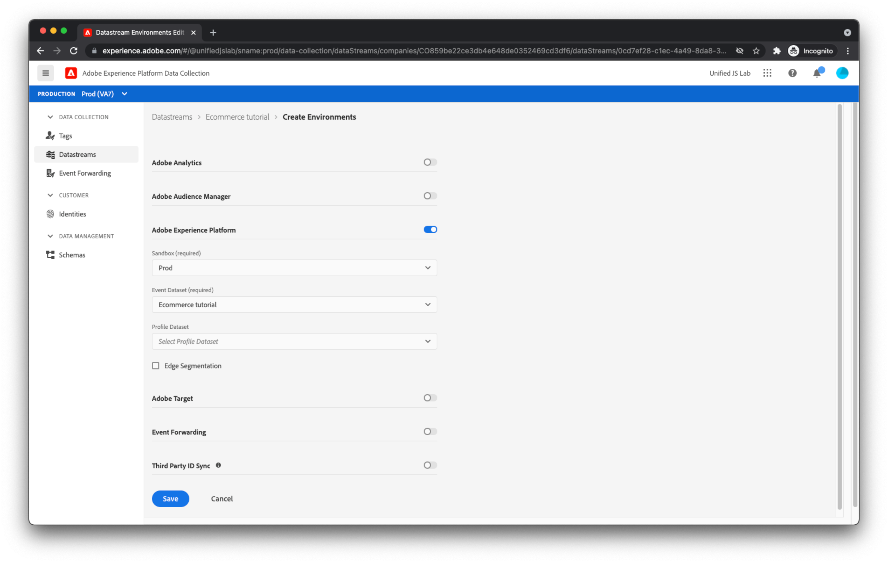

# データストリームの作成

Web サイトから送信したデータは、と呼ばれる一連のAdobeサーバーに届きます。 [Adobe Experience Platform Edge](https://business.adobe.com/products/experience-platform/experience-platform-edge-network.html). このネットワークは、 [以前に作成したAdobe Experience Platformデータセット](create-a-schema.md) Adobe Experience Cloudのその他の製品 これらのAdobe製品は、Web ページにデータを返す場合もあります。 例えば、Edge Network は、Adobe Targetからパーソナライゼーションコンテンツを返す場合があります。

Edge Network がデータをシャトルするAdobe製品を設定するには、データストリームを作成する必要があります。 Edge Network は、Web ページからデータを受け取ると、作成したデータストリームを調べ、その設定を読み取り、適切なAdobe製品にデータを転送します。

データストリームを作成するには、まず [!UICONTROL データストリーム] 中に表示 [!UICONTROL データ収集]. クリック [!UICONTROL データストリームを作成] をクリックします。 データストリームの名前を指定します。

次の画面では、Web サイトから送信するデータをAdobe製品が受け取るように設定できます。 このチュートリアルの目的では、Adobe Experience Platformのみを有効にし、以前に作成したデータセット（デフォルトのデータセット）を選択します [!UICONTROL Prod] サンドボックス ) をクリックし、 [!UICONTROL 保存].

データストリームが作成されました。

## データストリーム環境

通常、会社には、Web サイトの更新に関するプロモーションパスがあります。 会社の担当者（変更に応じて、マーケターまたはエンジニア）は、通常、そのユーザーのみが使用している開発環境で変更をテストします。 変更が快適に行われると、変更はステージング環境に昇格され、さらにテストが実施されます。 最後に、変更はユーザーに表示される実稼動用 Web サイトに公開されます。 データストリームは、このプロモーションパターンをサポートします。

クリックした後 [!UICONTROL 保存]を使用する場合、次の 3 つの datastream 環境が自動的に作成されていることに注意してください。 [!UICONTROL 開発環境], [!UICONTROL ステージング環境]、および [!UICONTROL 実稼動環境].

各データストリーム環境をクリックすると、指定した設定がすべて同じになっていることがわかります。 ただし、これらの環境は個別にカスタマイズできます。

Adobe Experience Platformタグに詳しい方は、開発、ステージング、実稼動環境の概念に既に慣れている可能性があります。 タグ内の環境は、データストリーム内の環境に関連しています。 タグ公開ワークフローを通じて開発、ステージング、実稼動にタグライブラリを移動すると、同様に、使用されるデータストリーム環境が自動的に [!UICONTROL 開発環境]、 [!UICONTROL ステージング環境]、 [!UICONTROL 実稼動環境]. これにより、例えば、変更の開発中に 1 つのデータセットにデータを送信し、変更が実稼動に移行した後に別のデータセットにデータを送信することができます。 これにより、開発プロセス中に生成されるガベージデータが生成されないように、実稼動データを保持できます。 後でタグプロパティで拡張機能を設定する際に、データストリーム環境について説明します。

これで、サーバーは Web ページからデータを受け取るように完全に設定されました。
