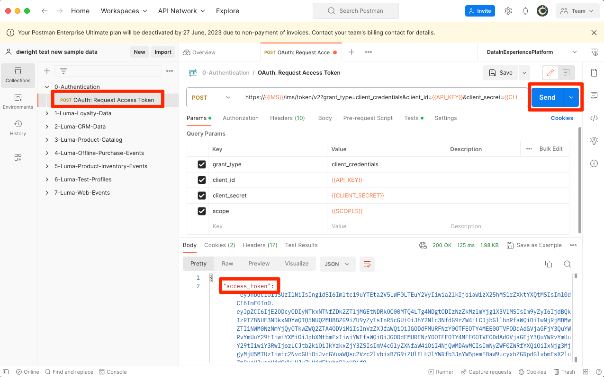

# Adobe Experience Platformへのサンプルデータの読み込み

サンプルデータを使用して Experience Platform サンドボックス環境をセットアップする方法を説明します。Postman Collection を使用すると、フィールドグループ、スキーマ、データセットを作成して、Experience Platform にサンプルデータをインポートできます。

## サンプルデータのユースケース

Experience Platformのビジネスユーザーは、多くの場合、フィールドグループの特定、スキーマの作成、データの準備、データセットの作成、データの取り込みなど、一連の手順を経て、Experience Platformが提供するマーケティング機能を調べる必要があります。 このチュートリアルでは、手順の一部を自動化して、できるだけ早くデータを Platform サンドボックスに取り込めるようにします。

このチュートリアルでは、Luma と呼ばれる架空の小売ブランドに焦点を当てます。 Adobe Experience Platformに投資して、ロイヤルティ、CRM、商品カタログ、オフラインの購入データをリアルタイムの顧客プロファイルに結合し、これらのプロファイルをアクティブ化してマーケティングを次のレベルに引き上げます。 Luma のサンプルデータを生成しました。このチュートリアルの残りの部分では、このデータをExperience Platform用サンドボックス環境の 1 つに読み込みます。

>[!NOTE]
>
>このチュートリアルの最終結果は、[ データアーキテクトおよびデータエンジニア向けAdobe Experience Platformの基本を学ぶ ](https://experienceleague.adobe.com/docs/platform-learn/getting-started-for-data-architects-and-data-engineers/overview.html?lang=ja) チュートリアルと同様のデータを含んだサンドボックスになります。 [Journey Optimizerの課題 ](https://experienceleague.adobe.com/docs/journey-optimizer-learn/challenges/introduction-and-prerequisites.html?lang=ja) をサポートするために 2023 年 4 月に更新されました。 認証方法を OAuth に切り替えるために 2023 年 6 月に更新されました。

## 前提条件

* 認証 API にアクセスし、Experience Platform方法を理解している。 そうでない場合は、この [ チュートリアル ](https://experienceleague.adobe.com/docs/platform-learn/tutorials/platform-api-authentication.html?lang=ja) を確認してください。
* Experience Platform開発用サンドボックスにアクセスできます。
* Experience Platformテナント ID を把握している。 認証済みの [API リクエスト ](https://experienceleague.adobe.com/docs/experience-platform/xdm/api/getting-started.html?lang=en#know-your-tenant_id) を行うことで取得できます
または、Platform アカウントにログインする際に URL から抽出します。 例えば、次の URL では、テナントは「`techmarketingdemos`」 `https://experience.adobe.com/#/@techmarketingdemos/sname:prod/platform/home` です。

## 使用 [!DNL Postman] {#postman}

### 環境変数の設定

手順に従う前に、[Postman](https://www.postman.com/downloads/) アプリケーションをダウンロードしたことを確認します。 それでは、始めましょう。

1. このチュートリアルに必要なすべてのファイルを含んだ [platform-utils-main.zip](../assets/data-generator/platform-utils-main.zip) ファイルをダウンロードします。

   >[!NOTE]
   >
   >[platform-utils-main.zip](../assets/data-generator/platform-utils-main.zip) ファイルに含まれるユーザーデータは架空のもので、デモ目的でのみ使用されます。

1. ダウンロードフォルダーから `platform-utils-main.zip` ファイルをコンピューター上の目的の場所に移動し、解凍します。
1. `luma-data` フォルダーで、すべての `json` ファイルをテキストエディターで開き、`_yourTenantId` のすべてのインスタンスを独自のテナント ID に置き換え、先頭にアンダースコアを付けます。
1. `luma-offline-purchases.json`、`luma-inventory-events.json`、`luma-web-events.json` をテキストエディターで開き、先月のイベントが発生するようにすべてのタイムスタンプを更新します（例えば、`"timestamp":"2022-11` を検索して年と月を置き換える）
1. 展開されたフォルダーの場所に注意してください。後で `FILE_PATH` [!DNL Postman] 環境変数を設定する際に必要になります。

   >[!NOTE]
   > Macのファイルパスを取得するには、`platform-utils-main` フォルダーに移動し、そのフォルダーを右クリックして **情報を取得** オプションを選択します。
   >
   > 

   >[!NOTE]
   > Windows でファイル パスを取得するには、目的のフォルダの場所をクリックして開き、アドレス バーのパスの右側を右クリックします。 アドレスをコピーしてファイルパスを取得します。
   > 
   > 

1. [!DNL Postman] を開き、**ワークスペース** ドロップダウンメニューからワークスペースを作成します。\
   
1. ワークスペースの **名前** とオプションの **概要** を入力し、「**Workspaceを作成**」をクリックします。 新 [!DNL Postman] いワークスペースを作成すると、そのワークスペースに切り替わります。
   
1. 次に、このワークスペースで [!DNL Postman] コレクションを実行するように、いくつかの設定を調整します。 [!DNL Postman] のヘッダーで、歯車アイコンをクリックし、「**設定** を選択して、設定モーダルを開きます。 キーボードショートカット（CMD/CTRL +）を使用してモーダルを開くこともできます。
1. 「`General`」タブで、リクエストタイムアウトをミリ秒単位で更新して、`5000 ms` を有効にし `allow reading file outside this directory` す。
   

   >[!NOTE]
   > 作業ディレクトリ内からファイルを読み込むと、同じファイルが他のデバイスに保存されている場合、デバイス間でスムーズに実行されます。 ただし、作業ディレクトリの外部からファイルを実行する場合は、同じ意図を示す設定をオンにする必要があります。 `FILE_PATH` が [!DNL Postman] の作業ディレクトリパスと同じでない場合は、このオプションを有効にしてください。

1. **設定** パネルを閉じます。
1. **環境** を選択してから、「**読み込み**」を選択します。
   
1. ダウンロードした json 環境ファイル `DataInExperiencePlatform.postman_environment` を読み込みます。
1. Postmanで、右上のドロップダウンで環境を選択し、目のアイコンをクリックして、環境変数を表示します。
   

1. 次の環境変数が入力されていることを確認します。 Experience Platform変数の値の取得方法について詳しくは、[Authentication to Environment APIs](/help/platform/authentication/platform-api-authentication.md) チュートリアルを参照してください。

   * `CLIENT_SECRET`
   * `API_KEY`—Adobe Developer Consoleの `Client ID`
   * `SCOPES`
   * `TECHNICAL_ACCOUNT_ID`
   * `IMS`
   * `IMS_ORG`—Adobe Developer Consoleの `Organization ID`
   * `SANDBOX_NAME`
   * `TENANT_ID` – 必ずアンダースコアを付けてください（例：`_techmarketingdemos`）。
   * `CONTAINER_ID`
   * `platform_end_point`
   * `FILE_PATH` - `platform-utils-main.zip` ファイルを解凍したローカルフォルダーパスを使用します。 フォルダー名（例：`/Users/dwright/Desktop/platform-utils-main`）を含めてください

1. 更新した環境 **保存**

### Postman コレクションのインポート

次に、コレクションをPostmanにインポートする必要があります。

1. **コレクション** を選択してから、読み込みオプションを選択します。

   

1. 次のコレクションを読み込みます。

   * `0-Authentication.postman_collection.json`
   * `1-Luma-Loyalty-Data.postman_collection.json`
   * `2-Luma-CRM-Data.postman_collection.json`
   * `3-Luma-Product-Catalog.postman_collection.json`
   * `4-Luma-Offline-Purchase-Events.postman_collection.json`
   * `5-Luma-Product-Inventory-Events.postman_collection.json`
   * `6-Luma-Test-Profiles.postman_collection.json`
   * `7-Luma-Web-Events.postman_collection.json`

   

### 認証

次に、ユーザートークンを認証および生成する必要があります。 このチュートリアルで使用するトークン生成方法は、実稼動以外での使用にのみ適しています。 ローカル署名は、サードパーティホストからJavaScript ライブラリを読み込み、リモート署名は、秘密鍵をAdobeが所有および運用する web サービスに送信します。 Adobeはこの秘密鍵を保存しませんが、実稼働キーは誰とも共有しないでください。

1. `0-Authentication` コレクションを開き、`OAuth: Request Access Token` リクエストを選択し、「`SEND`」をクリックして認証し、アクセストークンを取得します。

   

1. 環境変数を確認し、`ACCESS_TOKEN` が入力されていることを確認します。

### データのインポート

これで、データを準備して Platform サンドボックスに読み込むことができます。 読み込んだPostman コレクションで重作業がすべて行われます。

1. `1-Luma-Loyalty-Data` コレクションを開き、「概要」タブで **実行** をクリックして、コレクションランナーを起動します。

   

1. コレクションランナーウィンドウで、必ずドロップダウンから環境を選択し、「**遅延**」を `4000ms` に更新して、「**応答を保存**」オプションをオンにし、実行順序が正しいことを確認します。 **Luma ロイヤルティデータを実行** ボタンをクリックします

   

   >[!NOTE]
   >
   >**1-Luma-Loyalty-Data** 顧客のロイヤルティデータのスキーマを作成します。 このスキーマは、XDM Individual Profile クラス、標準フィールドグループ、カスタムフィールドグループおよびデータタイプに基づいています。 コレクションは、スキーマを使用してデータセットを作成し、サンプルの顧客ロイヤルティデータをAdobe Experience Platformにアップロードします。

   >[!NOTE]
   >
   >Postman Collection Runner の実行中にコレクションリクエストが失敗した場合は、実行を停止し、コレクションリクエストを 1 つずつ実行します。

1. 問題がなければ、`Luma-Loyalty-Data` コレクション内のすべてのリクエストが合格します。

   

1. 次に、[Adobe Experience Platform インターフェイスにログインし ](https://platform.adobe.com/) データセットに移動します。
1. `Luma Loyalty Dataset` データセットを開き、データセットアクティビティ ウィンドウで、1,000 件のレコードを取り込んだ正常なバッチ実行を表示できます。 「データセットをプレビュー」オプションをクリックして、取り込んだレコードを確認することもできます。 1,000 個の [!UICONTROL  新しいプロファイルフラグメント ] が作成されたことを確認するには、数分待つ必要がある場合があります。
   
1. 手順 1 ～ 3 を繰り返し、他のコレクションを実行します。
   * `2-Luma-CRM-Data.postman_collection.json` は、顧客の CRM データ用のスキーマと入力されたデータセットを作成します。 このスキーマは、デモグラフィックの詳細、個人の連絡先の詳細、環境設定の詳細、カスタム ID フィールドグループで構成される XDM 個人プロファイル クラスに基づいています。
   * `3-Luma-Product-Catalog.postman_collection.json` は、製品カタログ情報のスキーマと入力されたデータセットを作成します。 このスキーマは、カスタム製品カタログクラスに基づいており、カスタム製品カタログフィールドグループを使用します。
   * `4-Luma-Offline-Purchase-Events.postman_collection.json` は、顧客のオフライン購入イベントデータ用にスキーマと入力されたデータセットを作成します。 スキーマは XDM ExperienceEvent クラスに基づいており、カスタム ID とCommerceの詳細フィールドグループで構成されます。
   * `5-Luma-Product-Inventory-Events.postman_collection.json` は、在庫の出入りする製品に関連するイベントのスキーマと入力されたデータセットを作成します。 このスキーマは、カスタムビジネスイベントクラスとカスタムフィールドグループに基づいています。
   * `6-Luma-Test-Profiles.postman_collection.json` は、Adobe Journey Optimizerで使用するテストプロファイルを含むスキーマと入力されたデータセットを作成します
   * `7-Luma-Web-Events.postman_collection.json` は、単純な履歴 web データを含むスキーマと入力されたデータセットを作成します。

## 検証

サンプルデータは、コレクションを実行すると、複数のシステムからのデータを組み合わせたリアルタイム顧客プロファイルが構築されるように設計されています。 この良い例としては、ロイヤルティ、CRM、オフライン購入の各データセットの最初のレコードがあります。 そのプロファイルを検索して、データが取り込まれたことを確認します。 [Adobe Experience Platform インターフェイス ](https://experience.adobe.com/platform/):

1. **[!UICONTROL プロファイル]**/**[!UICONTROL 参照]** に移動します。
1. **[!UICONTROL ID 名前空間]** として `Luma Loyalty Id` を選択します
1. **[!UICONTROL ID 値]** として `5625458` を検索します
1. `Daniel Wright` プロファイルを開きます。

>[!TIP]
>
>プロファイルが表示されない場合は、「[!UICONTROL  データセット ]」ページをチェックして、すべてのデータセットが正常に作成されてデータを取り込んだことを確認します。 問題がないようであれば、15 分待って、プロファイルがビューアで使用できるかどうかを確認します。  データの取り込みに問題があった場合は、エラーメッセージを確認して問題を見つけます。 また、[!UICONTROL  データセット ] ページでエラー診断を有効にし、json データファイルをドラッグ&amp;ドロップしてデータを再度取り込むこともできます。

「**[!UICONTROL 属性]**」タブと **[!UICONTROL イベント]** タブでデータを参照すると、プロファイルに様々なデータファイルのデータが含まれていることがわかります。

## 次の手順

Adobe Journey Optimizerについて学びたい場合は、このサンドボックスに、[Journey Optimizerの課題に取り組むために必要なすべてが含まれています ](https://experienceleague.adobe.com/docs/journey-optimizer-learn/challenges/introduction-and-prerequisites.html?lang=ja)

結合ポリシー、データガバナンス、クエリサービス、セグメントビルダーについて詳しくは、[ データアーキテクトおよびデータエンジニア向けスタートガイド チュートリアルのレッスン 11](https://experienceleague.adobe.com/docs/platform-learn/getting-started-for-data-architects-and-data-engineers/create-merge-policies.html?lang=en) に進んでください。 この他のチュートリアルの前のレッスンでは、これらのPostman コレクションで入力されたすべてのものを手動で構築しました。すぐに始めましょう。

このサンドボックスにリンクするサンプル Web SDK 実装を作成するには、を参照してください。
[Web SDK を使用したAdobe Experience Cloudの実装チュートリアル ](https://experienceleague.adobe.com/docs/platform-learn/implement-web-sdk/overview.html?lang=ja)。 Web SDK チュートリアルの「初期設定」、「タグ設定」、「Experience Platformの設定」の各レッスンを設定したら、パスワード `test` を使用して、`luma-crm.json` ファイルの最初の 10 個のメールアドレスで Luma web サイトにログインし、プロファイルフラグメントがこのチュートリアルでアップロードしたデータと結合されることを確認します。

サンプルの Mobile SDK 実装を作成して、このサンドボックスにリンクするには、
[ モバイルアプリでのAdobe Experience Cloudの実装のチュートリアル ](https://experienceleague.adobe.com/docs/platform-learn/implement-mobile-sdk/overview.html?lang=ja)。 Web SDK チュートリアルの「初期設定」、「アプリの実装」、「Experience Platform」のレッスンを設定したら、`luma-crm.json` ファイルの最初のメールアドレスを使用して Luma の web サイトにログインし、このチュートリアルでアップロードされたデータとプロファイルフラグメントの結合を確認します。

## サンドボックス環境のリセット {#reset-sandbox}

実稼動以外のサンドボックスをリセットすると、サンドボックスの名前と関連付けられた権限は保持されたまま、そのサンドボックスに関連付けられているすべてのスキーマ（リソース、データセットなど）が削除されます。この「クリーンな」サンドボックスは、引き続き、アクセス権を持つユーザーと同じ名前で使用できます。

サンドボックス環境をリセットするには、[ こちら ](https://experienceleague.adobe.com/docs/experience-platform/sandbox/ui/user-guide.html?lang=en#reset-a-sandbox) の手順に従います。
