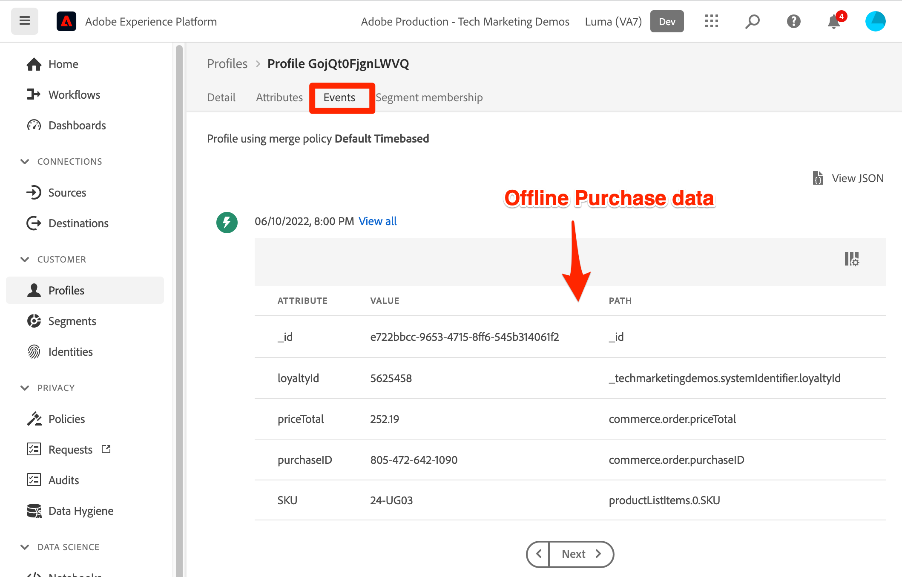

# Adobe Experience Platform へのサンプルデータの読み込み

サンプルデータを使用して Experience Platform サンドボックス環境をセットアップする方法を説明します。Postman Collection を使用すると、フィールドグループ、スキーマ、データセットを作成して、Experience Platform にサンプルデータをインポートできます。

## データの使用例

Experience Platformのビジネスユーザーは、多くの場合、Experience Platformが提供するマーケティング機能を調査する前に、フィールドグループの識別、スキーマの作成、データの準備、データセットの取り込みなど、一連の手順を実行する必要があります。 このチュートリアルでは、データを可能な限り迅速に Platform サンドボックスに取り込めるように、いくつかの手順を自動化します。

このチュートリアルでは、Luma という架空の小売ブランドに焦点を当てています。 Adobe Experience Platformに投資して、ロイヤリティ、CRM、製品カタログ、オフライン購入データをリアルタイムの顧客プロファイルに組み合わせ、これらのプロファイルをアクティブ化して、マーケティングを次のレベルに引き上げます。 Luma のサンプルデータを生成しました。このチュートリアルの残りの部分で、このデータをExperience Platformサンドボックス環境の 1 つに読み込みます。

>[!NOTE]
>
>このチュートリアルの最終結果は、 [データアーキテクトおよびデータエンジニア向けAdobe Experience Platformの概要チュートリアル](https://experienceleague.adobe.com/docs/platform-learn/getting-started-for-data-architects-and-data-engineers/overview.html). 2023 年 4 月に、 [Journey Optimizerの課題](https://experienceleague.adobe.com/docs/journey-optimizer-learn/challenges/introduction-and-prerequisites.html?lang=ja). 認証方法を OAuth に切り替えるように 2023 年 6 月に更新されました。

## 前提条件

* Experience PlatformAPI にアクセスでき、認証方法がわかっている。 そうでない場合は、確認します [チュートリアル](https://experienceleague.adobe.com/docs/platform-learn/tutorials/platform-api-authentication.html?lang=ja).
* Experience Platform開発サンドボックスにアクセスできます。
* ご使用のExperience Platformテナント ID がわかっています。 認証済みの [API リクエスト](https://experienceleague.adobe.com/docs/experience-platform/xdm/api/getting-started.html?lang=en#know-your-tenant_id)
または、Platform アカウントにログインする際に、URL から抽出します。 例えば、次の URL では、テナントは「`techmarketingdemos`&quot; `https://experience.adobe.com/#/@techmarketingdemos/sname:prod/platform/home`.

## 使用 [!DNL Postman] {#postman}

### 環境変数の設定

手順に従う前に、 [Postman](https://www.postman.com/downloads/) アプリケーション。 それでは、始めましょう。

1. をダウンロードします。 [platform-utils-main.zip](../assets/data-generator/platform-utils-main.zip) ファイル。このチュートリアルで必要なすべてのファイルを含みます。

   >[!NOTE]
   >
   >ユーザーデータが [platform-utils-main.zip](../assets/data-generator/platform-utils-main.zip) ファイルは架空のもので、デモ目的でのみ使用します。

1. ダウンロードフォルダーから `platform-utils-main.zip` ファイルをコンピューター上の目的の場所に移動し、解凍します。
1. 内 `luma-data` フォルダーを開き、すべての `json` ファイルを編集し、 `_yourTenantId` 前にアンダースコアが付いた独自のテナント id が付きます。
1. 開く `luma-offline-purchases.json`, `luma-inventory-events.json`、および `luma-web-events.json` テキストエディターで、過去 1 か月のイベントが発生するようにすべてのタイムスタンプを更新します ( 例えば、 `"timestamp":"2022-11` とを置き換えます )
1. 解凍されたフォルダーの場所をメモしておきます。後で `FILE_PATH` [!DNL Postman] 環境変数：

   >[!NOTE]
   > Macでファイルパスを取得するには、 `platform-utils-main` フォルダーを右クリックし、「 」を選択します。 **情報を取得** オプション。
   >
   > 

   >[!NOTE]
   > ウィンドウでファイルパスを取得するには、目的のフォルダの場所をクリックして開き、アドレスバーでパスの右側を右クリックします。 アドレスをコピーして、ファイルパスを取得します。
   > 
   > 

1. 開く [!DNL Postman] をクリックし、 **Workspaces** ドロップダウンメニュー：\
   
1. を入力します。 **名前** およびオプション **概要** （ワークスペースの場合）、 **ワークスペースを作成**. [!DNL Postman] 作成時に新しいワークスペースに切り替わります。
   
1. 次に、設定を調整して、 [!DNL Postman] このワークスペースのコレクション。 のヘッダー [!DNL Postman]、歯車アイコンをクリックし、「 **設定** をクリックして、設定モーダルを開きます。 キーボードショートカット (CMD/CTRL + ,) を使用して、モーダルを開くこともできます。
1. 以下 `General` タブで、リクエストがタイムアウト（ミリ秒）を次に更新する `5000 ms` を有効にします。 `allow reading file outside this directory`
   

   >[!NOTE]
   > 作業ディレクトリ内からファイルが読み込まれると、同じファイルが他のデバイスに格納されている場合、デバイス間でスムーズに実行されます。 ただし、作業ディレクトリの外からファイルを実行する場合は、同じ目的を示す設定をオンにする必要があります。 次に、 `FILE_PATH` が [!DNL Postman]の作業ディレクトリパスを指定する場合は、このオプションを有効にする必要があります。

1. を閉じる **設定** パネル。
1. を選択します。 **環境** 次に、 **インポート**:
   
1. ダウンロードした JSON 環境ファイルをインポートします。 `DataInExperiencePlatform.postman_environment`
1. Postmanで、右上のドロップダウンで環境を選択し、目のアイコンをクリックして環境変数を表示します。
   

1. 次の環境変数が設定されていることを確認します。 環境変数の値を取得する方法については、 [Experience PlatformAPI に対する認証](/help/platform/authentication/platform-api-authentication.md) 手順を説明するチュートリアルです。

   * `CLIENT_SECRET`
   * `API_KEY`—`Client ID` Adobe Developer Console で
   * `SCOPES`
   * `TECHNICAL_ACCOUNT_ID`
   * `IMS`
   * `IMS_ORG`—`Organization ID` Adobe Developer Console で
   * `SANDBOX_NAME`
   * `TENANT_ID` — 例えば、アンダースコアを先頭に付けるようにしてください。 `_techmarketingdemos`
   * `CONTAINER_ID`
   * `platform_end_point`
   * `FILE_PATH`— `platform-utils-main.zip` ファイル。 フォルダー名が含まれていることを確認します（例： ）。 `/Users/dwright/Desktop/platform-utils-main`

1. **保存** 更新された環境

### Postmanコレクションの読み込み

次に、コレクションをPostmanに読み込む必要があります。

1. 選択 **コレクション** 次に、インポートオプションを選択します。

   

1. 次のコレクションを読み込みます。

   * `0-Authentication.postman_collection.json`
   * `1-Luma-Loyalty-Data.postman_collection.json`
   * `2-Luma-CRM-Data.postman_collection.json`
   * `3-Luma-Product-Catalog.postman_collection.json`
   * `4-Luma-Offline-Purchase-Events.postman_collection.json`
   * `5-Luma-Product-Inventory-Events.postman_collection.json`
   * `6-Luma-Test-Profiles.postman_collection.json`
   * `7-Luma-Web-Events.postman_collection.json`

   

### 認証

次に、認証をおこない、ユーザートークンを生成する必要があります。 このチュートリアルで使用するトークン生成方法は、実稼動以外での使用にのみ適していることに注意してください。 ローカル署名は、サードパーティのホストから JavaScript ライブラリを読み込み、リモート署名は秘密鍵をAdobeが所有し、操作する Web サービスに送信します。 Adobeはこの秘密鍵を保存しませんが、実稼働鍵は誰とも共有しないでください。

1. を開きます。 `0-Authentication` コレクション、 `OAuth: Request Access Token` をクリックし、 `SEND` をクリックして、アクセストークンを認証および取得します。

   

1. 環境変数を確認し、 `ACCESS_TOKEN` が設定されました。

### データのインポート

これで、データを準備し、Platform サンドボックスに読み込むことができます。 読み込んだPostmanのコレクションが、すべての重い作業を実行します。

1. を開きます。 `1-Luma-Loyalty-Data` コレクションとクリック **実行** 「概要」タブで、コレクションランナーを起動します。

   

1. コレクションランナーウィンドウで、ドロップダウンから環境を必ず選択し、 **遅延** から `4000ms`、 **応答を保存** 」オプションを選択し、実行順序が正しいことを確認します。 次をクリック： **Luma ロイヤリティデータの実行** ボタン

   

   >[!NOTE]
   >
   >**1-Luma-Loyalty-Data** は顧客の忠誠度データのスキーマを作成します。 スキーマは、XDM Individual Profile クラス、標準フィールドグループ、カスタムフィールドグループおよびデータタイプに基づいています。 このコレクションは、スキーマを使用してデータセットを作成し、顧客の忠誠度のサンプルデータをAdobe Experience Platformにアップロードします。

   >[!NOTE]
   >
   >Postmanコレクションランナーでコレクションリクエストが失敗した場合は、実行を停止し、コレクションリクエストを 1 つずつ実行します。

1. すべてが正常に動作する場合、 `Luma-Loyalty-Data` コレクションが渡されます。

   

1. 次に、にログインします。 [Adobe Experience Platformインターフェイス](https://platform.adobe.com/) データセットに移動します。
1. を開きます。 `Luma Loyalty Dataset` データセットと、データセットアクティビティウィンドウに、1,000 件のレコードを取り込んだ成功したバッチ実行を表示できます。 また、「データセットのプレビュー」オプションをクリックして、取り込まれたレコードを確認することもできます。 1,000 を確認するには、数分待つ必要がある場合があります [!UICONTROL 新しいプロファイルフラグメント] が作成されました。
   
1. 手順 1～3 を繰り返して、他のコレクションを実行します。
   * `2-Luma-CRM-Data.postman_collection.json` は、顧客の CRM データ用にスキーマを作成し、入力されたデータセットを作成します。 このスキーマは、人口統計の詳細、個人の連絡先の詳細、環境設定の詳細、カスタム ID フィールドグループで構成される XDM Individual Profile クラスに基づいています。
   * `3-Luma-Product-Catalog.postman_collection.json` は、製品カタログ情報のスキーマを作成し、入力されたデータセットを作成します。 このスキーマは、カスタムの製品カタログクラスに基づき、カスタムの製品カタログフィールドグループを使用します。
   * `4-Luma-Offline-Purchase-Events.postman_collection.json` は、顧客のオフライン購入イベントデータのスキーマを作成し、入力されたデータセットを作成します。 スキーマは、XDM ExperienceEvent クラスに基づいており、カスタムの ID およびコマースの詳細フィールドグループで構成されます。
   * `5-Luma-Product-Inventory-Events.postman_collection.json` は、在庫切れとなる製品に関連するイベントのスキーマと入力されたデータセットを作成します。 スキーマは、カスタムのビジネスイベントクラスとカスタムフィールドグループに基づいています。
   * `6-Luma-Test-Profiles.postman_collection.json` は、Adobe Journey Optimizerで使用するテストプロファイルを含むスキーマを作成し、入力されたデータセットを作成します
   * `7-Luma-Web-Events.postman_collection.json` はスキーマを作成し、単純な履歴 web データを含んだデータセットを設定します。

## 検証

サンプルデータは、コレクションが実行される際に、複数のシステムのデータを組み合わせたリアルタイム顧客プロファイルを構築するように設計されています。 この好例は、ロイヤルティ、CRM、オフライン購入データセットの最初のレコードです。 そのプロファイルを検索して、データが取り込まれたことを確認します。 内 [Adobe Experience Platformインターフェイス](https://experience.adobe.com/platform/):

1. に移動します。 **[!UICONTROL プロファイル]** > **[!UICONTROL 参照]**
1. 選択 `Luma Loyalty Id` を **[!UICONTROL ID 名前空間]**
1. を検索 `5625458` を **[!UICONTROL ID 値]**
1. を開きます。 `Daniel Wright` profile

>[!TIP]
>
>プロファイルが表示されない場合は、 [!UICONTROL データセット] すべてのデータセットが正常に作成され、取り込まれたことを確認するページ。 問題がない場合は、15 分待ってから、プロファイルがビューアで使用できるかどうかを確認します。  データの取り込みで問題が発生した場合は、エラーメッセージを確認して、問題を見つけてみてください。 また、 [!UICONTROL データセット] json データファイルをドラッグ&amp;ドロップして、データを再取り込みします。

データを参照して **[!UICONTROL 属性]** および **[!UICONTROL イベント]** 「 」タブに移動すると、プロファイルに様々なデータファイルのデータが含まれていることがわかります。

## 次の手順

Adobe Journey Optimizerについて学びたい場合、このサンドボックスには、 [Journey Optimizerの課題](https://experienceleague.adobe.com/docs/journey-optimizer-learn/challenges/introduction-and-prerequisites.html?lang=ja)

結合ポリシー、データガバナンス、クエリサービス、セグメントビルダーについて学習する場合は、次のリンクをクリックしてください： [「データアーキテクトおよびデータエンジニア向けスタートガイド」チュートリアルのレッスン 11](https://experienceleague.adobe.com/docs/platform-learn/getting-started-for-data-architects-and-data-engineers/create-merge-policies.html?lang=en). この他のチュートリアルの前のレッスンでは、Postmanコレクションによって生成されたものすべてを手動で作成し、優れたスタートをお楽しみください。

このサンドボックスにリンクするサンプルの Web SDK 実装を作成する場合は、
[Web SDK を使用したAdobe Experience Cloudの実装のチュートリアル](https://experienceleague.adobe.com/docs/platform-learn/implement-web-sdk/overview.html?lang=ja). Web SDK チュートリアルの「初期設定」、「タグ設定」、「Experience Platformの設定」の各レッスンを設定したら、 `luma-crm.json` パスワードを使用したファイル `test` を使用して、プロファイルフラグメントを、このチュートリアルでアップロードしたデータと結合して表示できます。

このサンドボックスにリンクする Mobile SDK 実装のサンプルを作成する場合は、
[モバイルアプリでのAdobe Experience Cloudの実装のチュートリアル](https://experienceleague.adobe.com/docs/platform-learn/implement-mobile-sdk/overview.html?lang=ja). Web SDK チュートリアルの「初期設定」、「アプリケーションの実装」、「Experience Platform」のレッスンを設定したら、 `luma-crm.json` ファイルを参照して、このチュートリアルでアップロードしたデータとのプロファイルフラグメントの結合を確認します。

## サンドボックス環境をリセット {#reset-sandbox}

実稼動以外のサンドボックスをリセットすると、サンドボックスの名前と関連付けられた権限は保持されたまま、そのサンドボックスに関連付けられているすべてのスキーマ（リソース、データセットなど）が削除されます。この「クリーンな」サンドボックスは、引き続き、アクセス権を持つユーザーと同じ名前で使用できます。

手順に従います。 [ここ](https://experienceleague.adobe.com/docs/experience-platform/sandbox/ui/user-guide.html?lang=en#reset-a-sandbox) ：サンドボックス環境をリセットする場合。
