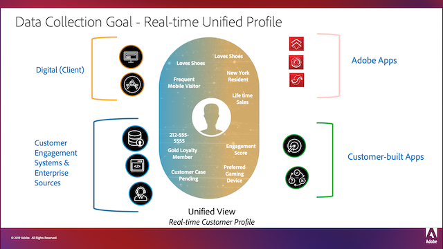
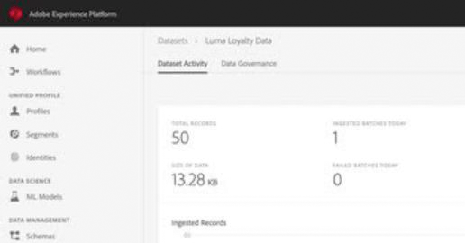
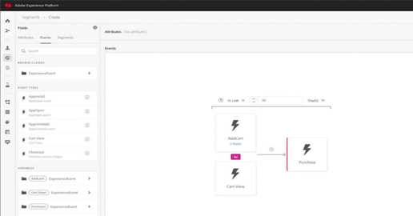

# Adobe Experience Platform のチュートリアル

Adobe Experience Platform は、顧客体験を促進する完全なソリューションを構築し、管理するための、市場で最も強力で柔軟性の高いオープンシステムです。Experience Platformを利用すれば、あらゆるシステムからの顧客データとコンテンツを一元化および標準化し、データサイエンスとマシンラーニング（機械学習）を適用して、パーソナライズされた魅力的なエクスペリエンスの構築と提供を大幅に促進できます。 これらのビデオとチュートリアルを使用して、Experience Platformの多くのコンポーネントを学習します。

## スタッフのおすすめ

<table style="margin-top: 0 !important">
<tr>
  <td>
    
    

      <a href="intro-to-platform/a-customer-experience-powered-by-experience-platform.md">
    <strong>Experience Platformを活用した顧客体験</strong>
    </a>
    

    

    <em>Platformを使用して顧客体験を強化する方法を確認する</em>
    

  </td>
  <td>
    
    

      <a href="https://experienceleague.adobe.com/docs/platform-learn/getting-started-for-data-architects-and-data-engineers/overview.html?lang=ja">
    <strong> データアーキテクトとデータエンジニア向けの入門</strong>
    </a>
    

    

    <em>実践的な演習から始めましょう</em>
    

  </td>
  <td>
    
    

      <a href="sources/overview.md">
    <strong> ソースコネクタについて</strong>
    </a>
    

    

    <em> データを簡単に取り込む</em>
    

  </td>
   <!--
   <td>
    
    

      <a href="data-ingestion/create-datasets-and-ingest-data.md">
    <strong>Create Datasets and Ingest Data</strong>
    </a>
    

    

    <em>Ingest your dataset.</em>
    

  </td>
  <td>
    
    

      <a href="segments/create-segments.md">
    <strong>Create Segments</strong>
    </a>
    

    

    <em>Build segments based on your data.</em>
    

  </td>
  -->
</tr>
</table>

