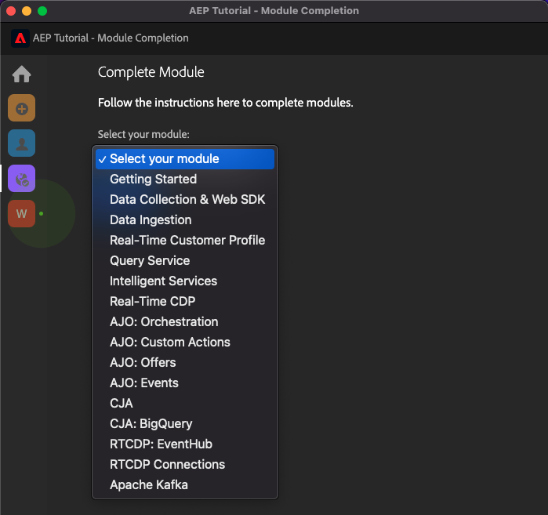
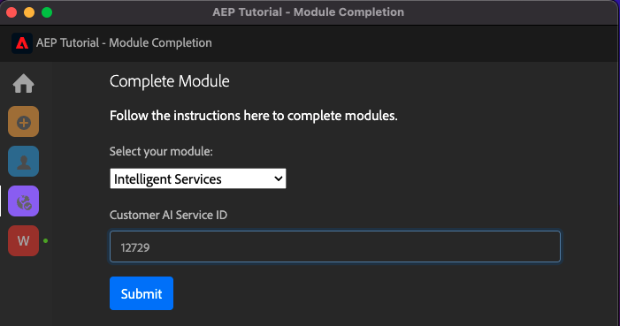
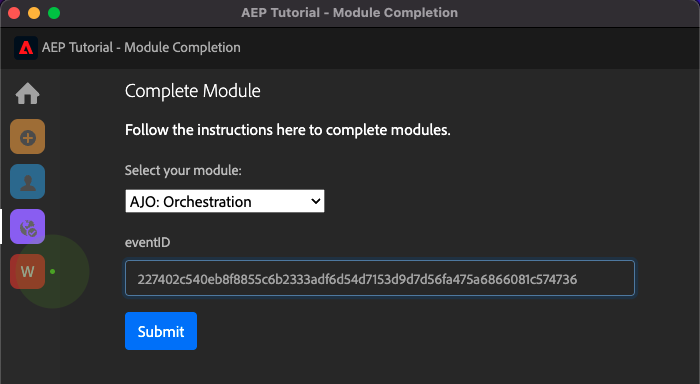

# Adobe Experience Platformの包括的な技術チュートリアル — 完了の測定方法

作成した Chrome 拡張機能を使用して、Adobe Experience Platformの包括的なテクニカルチュートリアルの完了を更新できます。

モジュール 0 の手順に従って、組織の **設定 ID** Chrome 拡張機能にサインアップしていること。 これで、Chrome 拡張機能は次のようになります。 モジュールの完了を送信するには、紫のアイコンをクリックします。

次の内容が表示されます。

ドロップダウンメニューを開くと、完了するモジュールを選択できます。

モジュールを完了するには、完了の証明を提供する必要があります。

以下は、各モジュールに対して期待される完了の証明です。

## はじめに

モジュールの完了の証明が期待されます **はじめに** は、作成した Web 用の Demo System プロジェクトの ID です。

Web 形式の Demo System プロジェクトの ID は、次のようになります。 `--demoProfileLdap-- - OCUC`.

選択 **はじめに** ドロップダウンメニューで、 **Demo System プロジェクトの ID** をクリックし、 **送信**  — ボタン。

## データ収集および Web SDK

モジュールの完了の証明が期待されます **データ収集および Web SDK** は、Web のデータ収集プロパティの名前です。

Web 形式のデータ収集プロパティの名前は次のようになります。 `--demoProfileLdap-- - Demo System (05/02/2022) (enablement) 1644046719474`.

選択 **データ収集および Web SDK** ドロップダウンメニューで、 **Web のデータ収集プロパティ名** をクリックし、 **送信**  — ボタン。

## データ取得

モジュールの完了の証明が期待されます **データ取り込み** は、作成した 2 つのデータセットのデータセット ID です。

データセット ID の形式は次のようになります。 **5f069724723ef41916a8b5d2**.

`--demoProfileLdap-- - Demo System - Event Dataset for Website`

`--demoProfileLdap-- - Demo System - Profile Dataset for Website`

選択 **データ取り込み** ドロップダウンメニューで、 **データセット ID** 入力フィールドの両方のデータセットに対して、 **送信**  — ボタン。

## リアルタイム顧客プロファイル

モジュールの完了の証明が期待されます **リアルタイム顧客プロファイル** が **セグメント ID** UI で作成したセグメントの `--demoProfileLdap-- - Male customers with interest in Montana Wind Jacket`.

セグメント ID の形式は次のようになります。 **8cb7034d-d4ae-4d26-a61f-a76559c12457**.

選択 **リアルタイム顧客プロファイル** ドロップダウンメニューで、 **セグメント ID** をクリックし、 **送信**  — ボタン。

## クエリサービス

モジュールの完了の証明が期待されます **クエリサービス** は、 `--demoProfileLdap--_callcenter_interaction_analysis`  — モジュールの完了後に取得するデータセット。

形式は次のようになります。 **62076f68f14a9d194995d4e2**.

選択 **クエリサービス** ドロップダウンメニューで、 **データセット ID** をクリックし、 **送信**  — ボタン。

## インテリジェントサービス

モジュールの完了の証明が期待されます **インテリジェントサービス** が **製品購入傾向顧客 AI サービス**.

形式は次のようになります。 **12729** サービスを開いたときに URL から取得できます。

選択 **インテリジェントサービス** ドロップダウンメニューで、 **顧客 AI サービス ID** をクリックし、 **送信**  — ボタン。

## Real-Time CDP

モジュールの完了の証明が期待されます **Real-Time CDP** は、 **Adobe Target Activity**.

形式は次のようになります。 **111804**.

選択 **Real-Time CDP** ドロップダウンメニューで、 **Adobe Target Activity ID** をクリックし、 **送信**  — ボタン。

## AJO:Orchestration

モジュールの完了の証明が期待されます **AJO:Orchestration** は、 `--demoProfileLdap--AccountCreationEvent`.

形式は次のようになります。 **227402c540eb8f8855c6b2333adf6d54d7153d9d7d56fa475a6866081c574736**.

選択 **AJO:Orchestration** ドロップダウンメニューで、入力フィールドに「**eventID**」と入力し、 **送信**  — ボタン。

## AJO:カスタムアクション

モジュールの完了の証明が期待されます **AJO:カスタムアクション** はイベントの eventID です `--demoProfileLdap--GeofenceEntry`.

形式は次のようになります。 **fa42ab7982ba55f039eacec24c1e32e5c51b310c67f0fa559ab49b89b63f4934**.

選択 **AJO:カスタムアクション** ドロップダウンメニューで、 **eventID** をクリックし、 **送信**  — ボタン。

## AJO:オファー

モジュールの完了の証明が期待されます **AJO:オファー** は、 **オファーの決定** 作成した

次の **オファーの決定 ID**&#x200B;は次のようになります。 **xcore:offer-activity:1122fcc4603ea499**、ここでは次のようになります。

選択 **AJO:オファー** ドロップダウンメニューで、 **オファーの決定 ID** をクリックし、 **送信**  — ボタン。

## AJO:イベント

モジュールの完了の証明が期待されます **AJO:イベント** は、 `--demoProfileLdap--StoreEntryEvent`.

形式は次のようになります。 **e3a8f0bdc0b609667cd96a72a6b1e5aafa0ddaf6ccf121c574e6a2030860a633**.

選択 **AJO:イベント** ドロップダウンメニューで、 **eventID** をクリックし、 **送信**  — ボタン。

## CJA

モジュールの完了の証明が期待されます **CJA** はプロジェクトの ID です `--demoProfileLdap-- - Omnichannel Analysis`.

形式は次のようになります。 **6217344f6249ac70c726db60**&#x200B;の場合、プロジェクトを開くと URL に表示されます。

選択 **CJA** ドロップダウンメニューで、 **プロジェクト ID** をクリックし、 **送信**  — ボタン。

## CJA:BigQuery

モジュールの完了の証明が期待されます **CJA:BigQuery** は、 **BigQuery**-connection.

次の **BigQuery 接続 ID**&#x200B;は次のようになります。 **85a2394d-8b94-410c-a239-4d8b94b10c38**、ここでは次のようになります。

選択 **CJA:BigQuery** ドロップダウンメニューで、 **BigQuery 接続 ID** をクリックし、 **送信**  — ボタン。

## RTCDP:EventHub

モジュールの完了の証明が期待されます **RTCDP:EventHub** は、 **Microsoft Azure Event Hub** Adobe Experience Platformの宛先。

次の **Microsoft Azure イベントハブの宛先 ID**&#x200B;は次のようになります。 **fa3f7ce5-86fd-4096-bf7c-e586fdc096ba**、ここでは次のようになります。

選択 **RTCDP:EventHub** ドロップダウンメニューで、 **Microsoft Azure イベントハブの宛先 ID** をクリックし、 **送信**  — ボタン。

## RTCDP 接続

モジュールの完了の証明が期待されます **RTCDP 接続** は **イベント転送プロパティ ID**.

次の **イベント転送プロパティ ID**&#x200B;は次のようになります。 **PR40f44184c888472e9c19d8d602aab0de**、ここでは次のようになります。

選択 **RTCDP 接続** ドロップダウンメニューで、 **イベント転送プロパティ ID** をクリックし、 **送信**  — ボタン。

## Apache Kafka

モジュールの完了の証明が期待されます **Apache Kafka** は、ソースコネクタの ID です `--demoProfileLdap-- - Kafka`.

ID は次のようになります **f843d50a-ee30-4ca8-a766-0e4f3d29a2f7**&#x200B;次の場所にあります。

選択 **Apache Kafka** ドロップダウンメニューで、 **フロー ID** をクリックし、 **送信**  — ボタン。

[すべてのモジュールに戻る](./overview.md)
