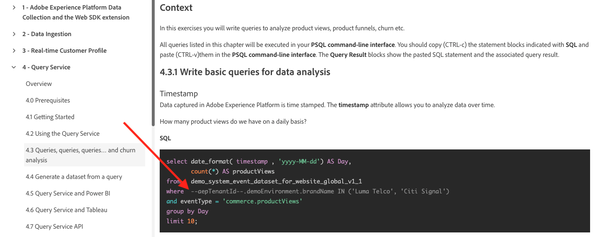
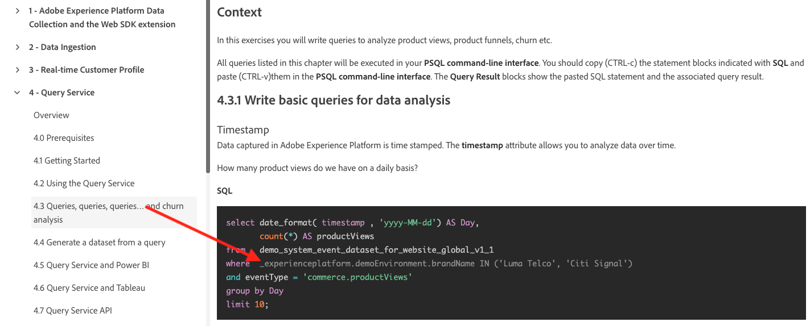
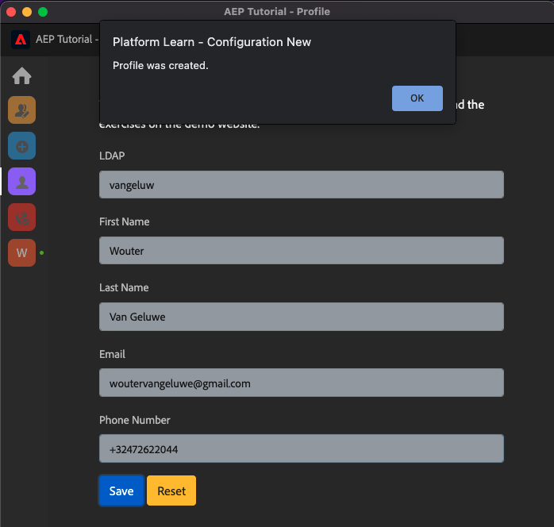

# 0.1 Chrome 拡張機能のインストール (Experience Leagueドキュメント )

## 0.1.1 なぜ Chrome 拡張機能を作成したのですか？

任意のAdobe Experience Platformインスタンスを使用して誰でも簡単に再利用できるように、ドキュメントは汎用的に作成されました。
ドキュメントを再利用可能にすることで、 **環境変数** がドキュメントに導入されました。つまり、以下が表示されます。 **キー** 」を参照してください。 すべてのキーは特定の環境の特定の変数です。Chrome 拡張機能によって変数が変更されるので、チュートリアルページからコードとテキストを簡単にコピーし、チュートリアルの一部として使用する様々なユーザーインターフェイスに貼り付けます。

このような値の例を以下に示します。 現在、これらの値はまだ使用できませんが、Chrome 拡張機能をインストールしてアクティブ化するとすぐに、これらの変数が「通常」のテキストに変わり、コピーして再利用できます。

| 名前 | キー |
|:-------------:| :---------------:|
| AEP IMS Org ID | `--aepImsOrgId--` |
| AEP テナント ID | `--aepTenantId--` |
| DCS インレット ID | `--dcsInletId--` |
| デモプロファイル LDAP | `--demoProfileLdap--` |

例として、以下のスクリーンショットには、 `--aepTenantId--`.

拡張機能がインストールされると、インスタンス固有の値を反映するように、同じテキストが自動的に変更されます。

拡張機能を使用すると、次のことも可能になります。

- チュートリアルにサインアップ
- 各モジュールの完了を送信して、進行状況をトラッキングします ( [完了の測定方法](../../completion.md)

## 0.1.2 Chrome 拡張機能のインストール

その Chrome 拡張機能をインストールするには、Chrome ブラウザーを開いて、次の場所に移動します。 [https://chrome.google.com/webstore/detail/platform-learn-configurat/hhnbkfgioecmhimdhooigajdajplinfi/related?hl=en&amp;authuser=0](https://chrome.google.com/webstore/detail/platform-learn-configurat/hhnbkfgioecmhimdhooigajdajplinfi/related?hl=en&amp;authuser=0). これが見えます

クリック **Chrome に追加**.

これが見えます クリック **拡張機能を追加**.

その後、拡張機能がインストールされ、同様の通知が表示されます。

内 **拡張機能** メニューで、 **パズルピース** アイコンとピン **Platform 学習 — 設定** 拡張機能メニューの拡張機能。

## 0.1.2 Chrome 拡張機能の設定

に移動します。 [https://experienceleague.adobe.com/docs/platform-learn/comprehensive-technical-tutorial-v22/overview.html?lang=en](https://experienceleague.adobe.com/docs/platform-learn/comprehensive-technical-tutorial-v22/overview.html?lang=en) 次に、拡張機能アイコンをクリックして開きます。

その後、このポップアップが表示されます。 次をクリック： **+** アイコン

Adobe Experience Platform環境用に作成した名前と設定 ID を入力します。 「**新規作成**」をクリックします。

>[!IMPORTANT]
>
>従業員の場合：使用する設定 ID は、内部の Github リポジトリ (https://git.corp.adobe.com/vangeluw/platformenablement) で確認できます。
>
>Adobeソリューションパートナーの方は、ソリューションパートナーの方にお問い合わせいただくか、電子メールでお問い合わせください **spphelp@adobe.com**.

拡張機能の左側のメニューに、自分のイニシャルを持つアイコンが表示されます。 クリックします。 次に、 **環境変数** および特定のAdobe Experience Platformインスタンス値 クリック **設定をアクティベート**.

設定をアクティブ化すると、イニシャルの横に緑色の点が表示されます。 これは、設定 ID がアクティブになったことを意味します。 また、追加のメニューオプションがいくつか表示されます。

次の 2 つのオプションが追加されました。

- 既存の設定を使用してイネーブルメントの既存のユーザーの場合は、に移動します。 **0.1.3 既存のユーザ — ログイン**
- このチュートリアルを初めて開始する、まったく新しいユーザーの場合は、に移動します。 **0.1.4 登録** およびスキップ **0.1.3 既存のユーザ — ログイン**

## 0.1.3 既存のユーザ — ログイン

>[!IMPORTANT]
>
>演習 **0.1.3 既存のユーザ — ログイン** は、このチュートリアルに既にサインアップしている既存のユーザーの場合にのみ機能します。

この Chrome 拡張機能を初めて設定する既存のユーザーの場合は、左側のメニューにある紫のアイコンをクリックします。 これが見えます

必要に応じて値を入力します。

>[!IMPORTANT]
>
>この **LDAP** は最も重要なフィールドです。チュートリアルに初めてサインアップしたときと同じ LDAP を使用する必要があります。 これにより、進行状況が正常に読み込まれます。 LDAP の内容が不明な場合は、電子メールアドレスを確認してください。 LDAP として電子メールアドレスの@-symbolの前のテキストを使用します。 メールアドレスが **vangeluw@adobe.com**&#x200B;に設定する場合、ここに入力する LDAP は次のようになります。 **バンジェルー**) をクリックします。

「**OK**」をクリックします。

30 秒から 1 分後に画面が変わり、元の画面に戻ります。 **ホーム**&#x200B;を使用する場合、次の内容が表示されます。

これで、Chrome 拡張機能が設定され、すべて正常に動作しているかどうかを確認できます。

## 0.1.4 新規ユーザー — 登録

>[!IMPORTANT]
>
>演習 **0.1.4 新規ユーザー — 登録** は、このチュートリアルを初めて開始する新規ユーザーを対象としています。

このチュートリアルに初めて新規登録するユーザーの場合は、メニューの黄色いアイコンをクリックします。 これが見えます

必要に応じてフィールドに入力します。 「**保存**」をクリックします。

>[!IMPORTANT]
>
>この **LDAP** は最も重要なフィールドです。 LDAP の内容が不明な場合は、電子メールアドレスを確認してください。 LDAP として電子メールアドレスの@-symbolの前のテキストを使用します。 メールアドレスが **vangeluw@adobe.com**&#x200B;に設定する場合、ここに入力する LDAP は次のようになります。 **バンジェルー**) をクリックします。

30 秒から 1 分後に画面が変わり、元の画面に戻ります。 **ホーム**&#x200B;を使用する場合、次の内容が表示されます。

これで、Chrome 拡張機能が設定され、すべて正常に動作しているかどうかを確認できます。

## 0.1.5 チュートリアルコンテンツの検証

テストとして、に移動します。 [このページ](https://experienceleague.adobe.com/docs/platform-learn/comprehensive-technical-tutorial-v22/module4/ex3.html?lang=ja).

これで、 **環境変数** は、chrome 拡張機能の設定 ID に基づいて、true 値に置き換えられています。

これで、次のようなビューになり、環境変数が `--aepTenantId--` は、実際のテナント ID に置き換えられています ( この場合は **_experienceplatform**.

次のステップ： [0.2 次のデモシステムを使用して、Adobe Experience Platform Data Collection クライアントプロパティを設定します。](./ex2.md)

[モジュール 0 に戻る](./getting-started.md)

[すべてのモジュールに戻る](./../../overview.md)
