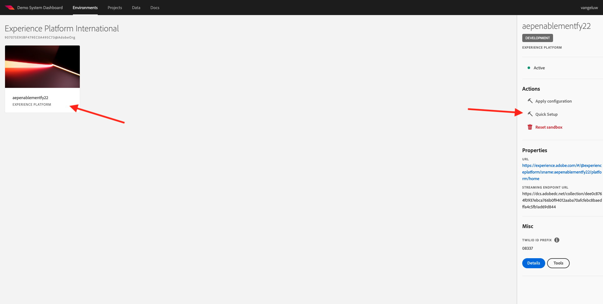

# 0.2 次のデモシステムを使用して、Adobe Experience Platform Data Collection クライアントプロパティを設定します。

Adobe Experience Platformの包括的なテクニカルチュートリアルに新規登録すると、次の設定にアクセスして実行できるよう、Demo System へのアクセス権を提供する自動プロセスが用意されています。

Demo System にアクセスしたら、次の手順に進みます。

に移動します。 [https://dashboard.adobedemo.com/](https://dashboard.adobedemo.com/). サンドボックスを選択し、 **クイックセットアップ**.

次の内容が表示されます。

の下 **一般** - **環境**&#x200B;で、Adobe Experience Platformインスタンスとサンドボックスを選択します ( この場合は：

- **Experience Platform国際**
- **aepenablementfy22**
- 設定：選択してください **Global v2.0**

次に、プリセットを選択します。 **イネーブルメントユーザー** をクリックし、 **開始**.

ポップアップに、データ収集プロパティの名前を入力します。 次の命名規則を使用してください： **デモシステム (DD/MM/YYYY)**. FYI:LDAP が自動的に追加されます。自分で追加する必要はありません。

「**開始**」をクリックします。

このポップアップが表示され、Web サイトやモバイルアプリプロジェクト、およびデータ収集プロパティの作成中の進行状況を示します。

クイックセットアッププロセスが完了したら、次の手順を実行します。

- 1 Web Retail プロジェクト。Luma デモブランドを持つデモ Web サイトを使用できます。
- 1 Mobile Retail プロジェクト。Luma デモモバイルアプリと Luma デモブランドを使用できます。
- 1 CX App Retail プロジェクト：コールセンターと顧客のアプリを Luma デモブランドと共に使用できる
- 1 Web のデータ収集プロパティ（Web サイトからデータを収集するために使用）
- 1 モバイル用のデータ収集プロパティ。モバイルアプリからデータを収集するために使用します。

次の手順で必要になるので、この画面は開いたままにしておきます。

次のステップ： [0.3 データストリームの作成](./ex3.md)

[モジュール 0 に戻る](./getting-started.md)

[すべてのモジュールに戻る](./../../overview.md)
