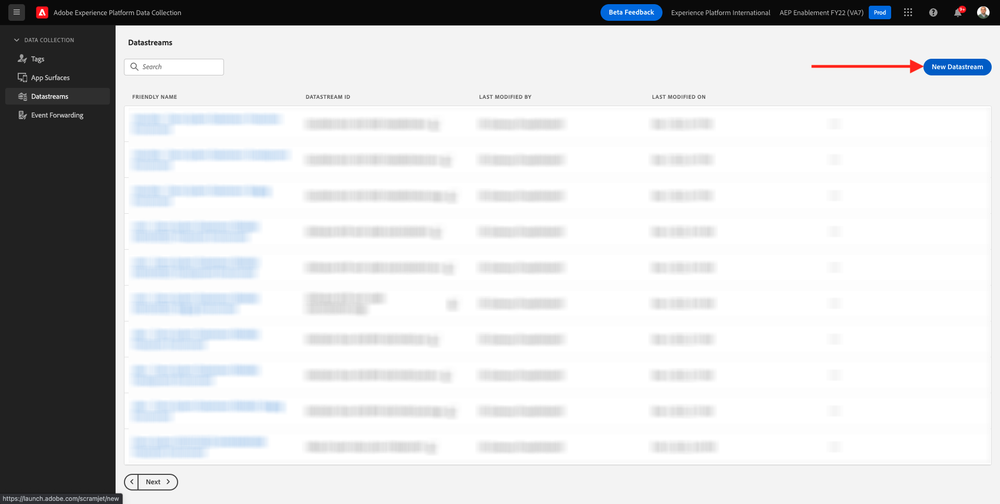
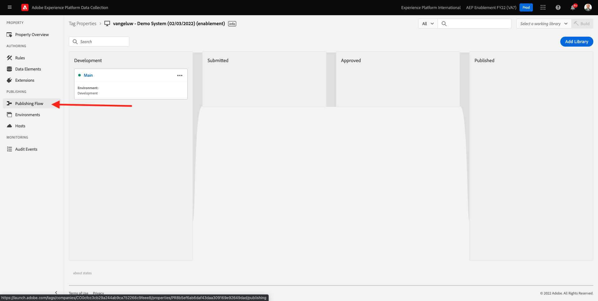

# 0.3 データストリームの作成

に移動します。 [https://experience.adobe.com/#/data-collection/](https://experience.adobe.com/#/data-collection/). 前の演習の後、次の 2 つのデータ収集プロパティを使用します。1 つは web 用、もう 1 つはモバイル用です。

これらのプロパティは、ほぼすぐに使用できますが、これらのプロパティを使用してデータの収集を開始する前に、データストリームを設定する必要があります。 データストリームとは何か、および演習 1.2 でのデータストリームとは何かの概念に関する詳細情報を得ることができます。

現時点では、次の手順に従ってください。

## 0.3.1 Web 用データストリームの作成

クリック **[!UICONTROL データストリーム]** または **[!UICONTROL データストリーム（ベータ版）]**.

画面の右上隅で、サンドボックス名を選択します。この名前は、 `--aepSandboxId--`.

クリック **[!UICONTROL 新規データストリーム]**.

の **[!UICONTROL わかりやすい名前]**&#x200B;を入力し、オプションの説明には、と入力します。 `--demoProfileLdap-- - Demo System Datastream`. 「イベントスキーマ」で、「 」を選択します。 **デモシステム — Web サイトのイベントスキーマ (Global v1.1)**. 「**保存**」をクリックします。

これが見えます クリック **サービスを追加**.

サービスを選択 **[!UICONTROL Adobe Experience Platform]**：追加のフィールドを公開します。 これが見えます

イベントデータセットで、 **デモシステム — Web サイトのイベントデータセット (Global v1.1)** プロファイルデータセットで、 **デモシステム — Web サイトのプロファイルデータセット (Global v1.1)**. 「**保存**」をクリックします。

これが見えます

今のところはそうだ。 In [モジュール 1](./../module1/data-ingestion-launch-web-sdk.md) Web SDK の詳細と、そのすべての機能の設定方法について説明します。

左側のメニューで、 **[!UICONTROL タグ]**.

検索結果をフィルタリングして、2 つのデータ収集プロパティを確認します。 プロパティを開く **Web** クリックして

これが見えます クリック **拡張機能**.

Adobe Experience Platform Web SDK 拡張機能で、 **設定**.

これが見えます の場合 **データストリーム**&#x200B;現在、1 に設定されているダミーの値が表示されます。 次に、 **リストから選択** ラジオボタンを使用します。 ドロップダウンリストで、前に作成したデータストリームを選択します。

必ず **Datastream**. ヒント：ドロップダウンの結果を簡単にフィルタリングするには、 `--demoProfileLdap--`.

下にスクロールして、 **データ収集**. 次のチェックボックスを必ずオンにしてください： **クリックデータ収集を有効にする** が有効になっていません。 「**保存**」をクリックして変更を保存します。

に移動します。 **公開フロー**.

次をクリック： **...** 対象 **メイン**&#x200B;を選択し、「 **編集**.

クリック **変更されたリソースをすべて追加** 次に、 **開発用に保存およびビルド**.

変更は公開され、数分後に準備が整います。

## 0.3.2 モバイル用データストリームの作成

に移動します。 [https://experience.adobe.com/#/data-collection/](https://experience.adobe.com/#/data-collection/).

クリック **[!UICONTROL データストリーム]** または **[!UICONTROL データストリーム（ベータ版）]**.

画面の右上隅で、サンドボックス名を選択します。この名前は、 `--aepSandboxId--`.

クリック **[!UICONTROL 新規データストリーム]**.

の **[!UICONTROL わかりやすい名前]**&#x200B;を入力し、オプションの説明には、と入力します。 `--demoProfileLdap-- - Demo System Datastream (Mobile)`. 「イベントスキーマ」で、「 」を選択します。 **デモシステム — モバイルアプリ用のイベントスキーマ (Global v1.1)**. 「**保存**」をクリックします。

「**[!UICONTROL 保存]**」をクリックします。

これが見えます クリック **サービスを追加**.

サービスを選択 **[!UICONTROL Adobe Experience Platform]**：追加のフィールドを公開します。 これが見えます

イベントデータセットで、 **デモシステム — モバイルアプリ用のイベントデータセット (Global v1.1)** プロファイルデータセットで、 **デモシステム — モバイルアプリ用のプロファイルデータセット (Global v1.1)**. 「**保存**」をクリックします。

これが見えます

これで、Mobile のAdobe Experience Platform Data Collection Client プロパティで Datastream を使用する準備が整いました。

に移動します。 **タグ** 検索結果をフィルタリングして、2 つのデータ収集プロパティを表示します。 プロパティを開く **モバイル** クリックして

これが見えます クリック **拡張機能**.

の **Adobe Experience Platform Edge Network** 拡張機能、「 **設定**.

これが見えます 次に、先ほど設定した正しいサンドボックスとデータストリームを選択する必要があります。 使用するサンドボックスはです `--aepSandboxId--` データストリームは `--demoProfileLdap-- - Demo System Datastream (Mobile)`.

の **Edge Network ドメイン**、デフォルトのドメイン ( **edge.adobedc.net**.

「**保存**」をクリックして変更を保存します。

に移動します。 **公開フロー**.

次をクリック： **...** 次の **メイン**&#x200B;を選択し、「 **編集**.

クリック **変更されたリソースをすべて追加**&#x200B;を選択し、「 **開発用に保存およびビルド**.

変更は公開され、数分後に準備が整います。

次のステップ： [0.4 Web サイトの使用](./ex4.md)

[モジュール 0 に戻る](./getting-started.md)

[すべてのモジュールに戻る](./../../overview.md)