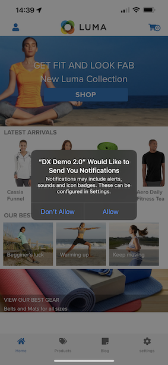
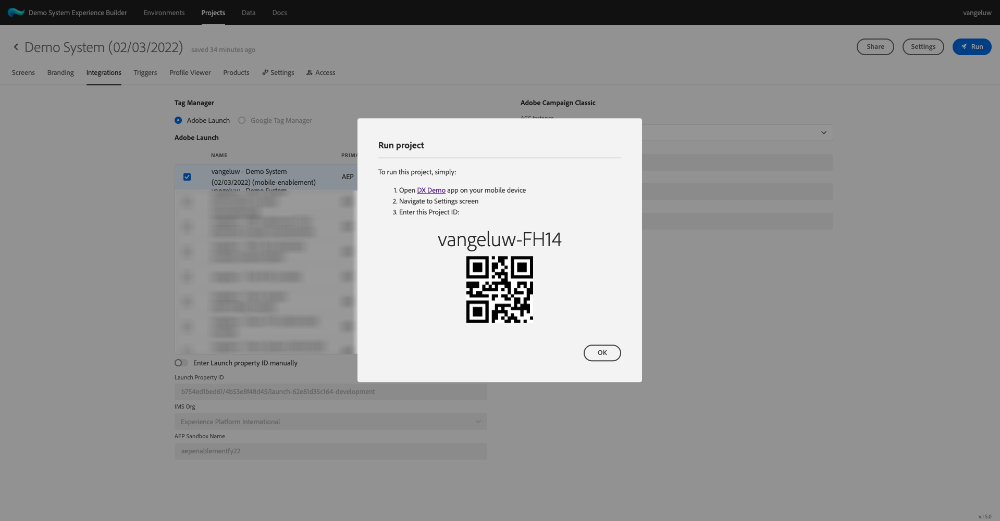
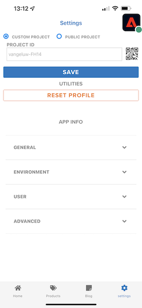

# 0.5 モバイルアプリを使用する

## 0.5.1 アプリのダウンロード

に移動します。 [https://bit.ly/dx-demo-app](https://bit.ly/dx-demo-app) を使用します。 これが見えます

以下を使用： **カメラ** アプリをスマートフォンにインストールして、デバイスの OS にモバイルアプリをインストールします。 この有効化を行うには、 **バージョン 2.x** (Adobe Experience Platform Mobile SDK を使用 )

>[!NOTE]
>
>iOSデバイスに初めてアプリをインストールした後、アプリを開こうとすると、次のようなエラーメッセージが表示される場合があります。 **信頼できないエンタープライズ開発者**. この問題を修正するには、 **設定/一般/デバイス管理/Adobe Systems Inc.** をクリックし、 **Adobe Systems**.

アプリがインストールされると、デバイスのホーム画面に表示されます。 アイコンをクリックしてアプリを開きます。

アプリを初めて使用する場合は、Adobe IDを使用してログインする必要があります。 ログインプロセスを完了します。

ログインすると、通知を送信する権限をリクエストする通知が表示されます。 チュートリアルの一環として通知を送信するので、 **許可**.

その後、アプリのホームページが表示されます。 に移動します。 **設定**.

設定には、現在、 **公開プロジェクト** がアプリに読み込まれます。 クリック **カスタムプロジェクト**.

これで、カスタムプロジェクトを読み込むことができます。 QR コードをクリックして、プロジェクトを簡単に読み込みます。

練習 0.1 の後、次の結果が得られました。 クリックして **モバイル小売プロジェクト** それはあなたのために作られた。

誤ってブラウザーウィンドウを閉じた場合や、将来のデモまたはイネーブルメントセッションで使用する場合は、Web サイトプロジェクトにアクセスするには、 [https://builder.adobedemo.com/projects](https://builder.adobedemo.com/projects). Adobe IDでログインすると、次の内容が表示されます。 モバイルアプリプロジェクトをクリックして開きます。

これが見えます クリック **統合**.

演習 0.1 で作成したモバイル用のデータ収集プロパティを選択する必要があります。次に、 **実行**.

QR コードが入ったポップアップが表示されます。 この QR コードをモバイルアプリ内からスキャンします。

その後、アプリにプロジェクト ID が表示され、次に「 **保存**.

次に戻ります。 **ホーム** 」と入力します。 これで、アプリを使用する準備が整いました。

モジュール 0 が完了しました。

[モジュール 0 に戻る](./getting-started.md)

[すべてのモジュールに戻る](./../../overview.md)
