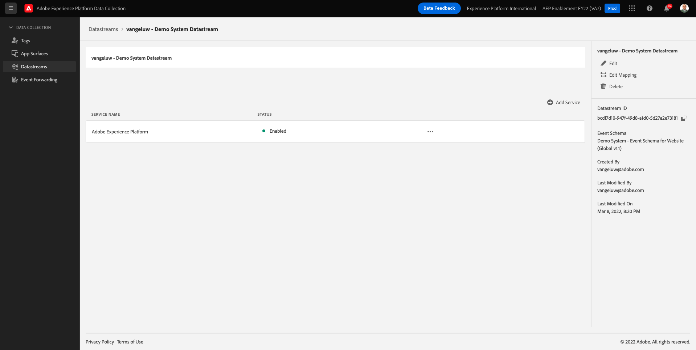

# 1.2 Edge Network、Datastreams および Server Side のデータ収集

## コンテキスト

この演習では、 **Datastream**. A **Datastream** は、Web SDK によって収集されたデータの送信先をAdobe Edgeサーバーに伝えます。 例えば、データをAdobe Experience Platformに送信しますか？ Adobe Analytics? Adobe Audience Manager? Adobe Target?

データストリームは、常にAdobe Experience Platformデータ収集ユーザーインターフェイスで管理され、Web SDK を使用したAdobe Experience Platformデータ収集にとって重要です。 Adobeタグ管理ソリューション以外で Web SDK を実装する場合でも、Adobe Experience Platformデータ収集ユーザーインターフェイスで Datastream を作成する必要があります。

次の演習では、ブラウザーに Web SDK を実装します。 その後、収集されるデータがどのように表示されるかがより明確になります。 現時点では、データストリームの転送先を示すだけです。

## データストリームの作成

In [演習 0.2](./../module0/ex2.md) 既に Datastream を作成していますが、Datastream の背景と理由については説明していません。

Datastream は、Web SDK によって収集されたデータの送信先をAdobe Edgeサーバーに通知します。 例えば、データをAdobe Experience Platformに送信しますか？ Adobe Analytics? Adobe Audience Manager? Adobe Target? データストリームは、Adobe Experience Platform Data Collection ユーザーインターフェイスで管理され、Adobe Experience Platform Data Collection を介して Web SDK を実装しているかどうかに関係なく、Web SDK を使用した Platform データ収集にとって重要です。

次に、 **[!UICONTROL Datastream]**:

に移動します。 [https://experience.adobe.com/launch/](https://experience.adobe.com/launch/).

クリック **[!UICONTROL データストリーム]** または **[!UICONTROL データストリーム（ベータ版）]** をクリックします。

データストリームを検索します。このデータストリームの名前はです。 `--demoProfileLdap-- - Demo System Datastream`.

データストリームの詳細が表示されます。

クリック **...** 次の **Adobe Experience Platform** をクリックし、 **編集**.

これが見えます 現時点では、Adobe Experience Platformのみを有効にしています。 設定は次のようになります。 ( 環境とAdobe Experience Platformインスタンスに応じて、サンドボックス名が異なる場合があります )

以下のフィールドは、次のように解釈する必要があります。

このデータストリームの場合…

- 収集されたすべてのデータは、 `--aepSandboxId--` Adobe Experience Platformのサンドボックス
- デフォルトでは、すべてのエクスペリエンスイベントデータがデータセットに収集されます **デモシステム — Web サイトのイベントデータセット (Global v1.1)**
- すべてのプロファイルデータは、デフォルトでデータセットに収集されます **デモシステム — Web サイトのプロファイルデータセット (Global v1.1)** （現在、Web SDK でネイティブにプロファイルデータを取り込むことは、Web SDK ではサポートされておらず、後の段階で使用できるようになります）
- を使用する場合、 **offer decisioning** このデータストリーム用のアプリケーションサービスの場合は、「Offer decisioning」チェックボックスをオンにする必要があります。 ( これは [モジュール 9](./../module9/offer-decisioning.md))
- を使用する場合、 **エッジセグメント化**&#x200B;の場合は、「Edge Segmentation」チェックボックスをオンにする必要があります。
- を使用する場合、 **パーソナライズ機能の宛先**&#x200B;の場合は、「パーソナライゼーションの宛先」チェックボックスをオンにする必要があります。

現時点では、Datastream に対して他の設定は必要ありません。

次のステップ： [1.3 Adobe Experience Platformデータ収集の概要](./ex3.md)

[モジュール 1 に戻る](./data-ingestion-launch-web-sdk.md)

[すべてのモジュールに戻る](./../../overview.md)
