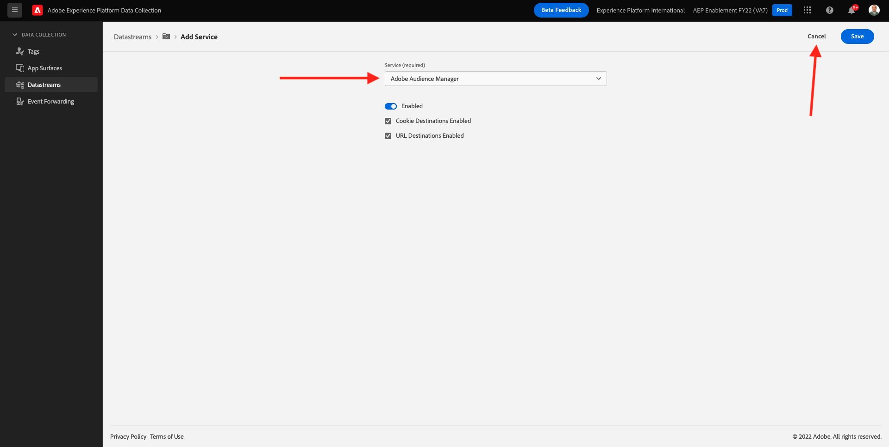

# 1.5 - Adobe AnalyticsとAdobe Audience Managerの実装

## コンテキスト

これで、XDM データがプラットフォームに送信されることがわかります。 XDM の詳細を見る [モジュール 2](./../module2/data-ingestion.md)に加えて、独自のスキーマを構築してカスタム変数を追跡する方法についても説明します。 ここでは、データを Analytics とAudience Managerに転送するように Datastream を設定した場合の動作を見てみましょう。

## 1.5.1 Analytics での変数のマッピング

ザAdobe Experience Platform [!DNL Web SDK] は、特定の値を自動的にマッピングし、Web SDK を介した Analytics の新しい実装をできるだけ早くおこないます。 自動的にマッピングされた変数が表示されます [ここ](https://experienceleague.adobe.com/docs/experience-platform/edge/data-collection/adobe-analytics/automatically-mapped-vars.html#data-collection).

自動的にマッピングされない XDM データの場合 [!DNL Adobe Analytics]を使用する場合、 [コンテキストデータ](https://experienceleague.adobe.com/docs/analytics/implementation/vars/page-vars/contextdata.html?lang=ja) を [スキーマ](https://experienceleague.adobe.com/docs/experience-platform/xdm/schema/composition.html?lang=ja). その後、にマッピングできます。 [!DNL Analytics] using [処理ルール](https://experienceleague.adobe.com/docs/analytics/admin/admin-tools/processing-rules/processing-rules-configuration/t-processing-rules.html?lang=ja) 体に入れる [!DNL Analytics] 変数。 コンテキストデータと処理ルールは、以前 Analytics で作業したことのあるユーザーにとってなじみのある概念ですが、新しい概念の場合は、現時点で詳細を気にする必要はありません。

デフォルトのアクションと製品リストのセットを使用して、AEP でデータを送信または取得することもできます [!DNL Web SDK]. これをおこなうには、「[製品](https://experienceleague.adobe.com/docs/experience-platform/edge/data-collection/collect-commerce-data.html?lang=en#data-collection)」を参照してください。

### コンテキストデータ

使用者 [!DNL Analytics], XDM データはドット表記を使用してフラット化され、として使用できます `contextData`. 次の値のペアのリストは、`context data` の例を示しています。

```javascript
{
    "bh": "900",
    "bw": "1680",
    "c": "24",
    "c.a.d.key.[0]": "value1",
    "c.a.d.key.[1]": "value2",
    "c.a.d.object.key1": "value1",
    "c.a.d.object.key2.[0]": "value2",
    "c.a.x.environment.browserdetails.javascriptenabled": "true",
    "c.a.x.environment.type": "browser",
    "cust_hit_time_gmt": "1579781427",
    "g": "http://example.com/home",
    "gn": "home",
    "j": "1.8.5",
    "k": "Y",
    "s": "1680x1050",
    "tnta": "218287:1:0|0,218287:1:0|2,218287:1:0|1,218287:1:0|32767,218287:1:01,218287:1:0|0,218287:1:0|1,218287:1:0|0,218287:1:0|1",
    "user_agent": "Mozilla/5.0 AppleWebKit/537.36 Safari/537.36",
    "v": "Y"
}
```

### 処理ルール

エッジネットワークによって収集されたすべてのデータへは、[処理ルール](https://experienceleague.adobe.com/docs/analytics/admin/admin-tools/processing-rules/processing-rules-configuration/t-processing-rules.html)を介してアクセスできます。In [!DNL Analytics]を使用すると、処理ルールを使用してコンテキストデータを [!DNL Analytics] 変数。

## 1.5.2Experience PlatformEdge ネットワーク上のAudience Manager

サーバー側転送は、Audience Managerの新しい概念ではなく、以前と同じプロセスです。 また、ID を同期することもできます。

## 1.5.3 データストリームをレビューしてAdobe Analyticsにデータを送信する

Web SDK で収集されたデータをAdobe AnalyticsおよびAdobe Audience Managerに送信する場合は、次の手順に従います。

に移動します。 [https://experience.adobe.com/launch/](https://experience.adobe.com/launch/) そして、 **データストリーム**.

画面の右上隅で、サンドボックス名を選択します。この名前は、 `--aepSandboxId--`. 特定のデータストリームを開きます。このデータストリームの名前は、 `--demoProfileLdap-- - Demo System Datastream`.


これが見えます Adobe Analyticsを有効にするには、 **+サービスを追加**.


これが見えます サービスを選択 **Adobe Analytics**&#x200B;を追加した後、Adobe Analyticsでデータの送信先となるレポートスイートを追加する必要があります。 このチュートリアルでは、これは範囲外です。 クリック **キャンセル**.


## 1.5.4 データストリームをレビューしてAdobe Audience Managerにデータを送信する

これが見えます Adobe Audience Managerを有効にするには、 **+サービスを追加**.


これが見えます サービスを選択 **Adobe Audience Manager** その後、Adobe Audience Manager cookie の宛先や URL の宛先を有効または無効にすることができます。 このチュートリアルでは、この設定は範囲外です。 クリック **キャンセル**.



次の手順： [1.6 Adobe Targetの実装](./ex6.md)

[モジュール 1 に戻る](./data-ingestion-launch-web-sdk.md)

[すべてのモジュールに戻る](./../../overview.md)
