# 10.1トリガーベースのジャーニーの設定 — 注文の確認

に移動してAdobe Journey Optimizerにログインします。 [Adobe Experience Cloud](https://experience.adobe.com). クリック **Journey Optimizer**.


リダイレクト先： **ホーム**  Journey Optimizerで表示 まず、正しいサンドボックスを使用していることを確認します。 使用するサンドボックスは、と呼ばれます。 `--aepSandboxId--`. サンドボックス間を切り替えるには、 **実稼動 (VA7)** リストからサンドボックスを選択します。 この例では、サンドボックスの名前はです。 **AEP 有効化 FY22**. その後、 **ホーム** サンドボックスの表示 `--aepSandboxId--`.


## 10.1.1 イベントの作成

メニューで、に移動します。 **設定** をクリックし、 **管理** under **イベント**.


の **イベント** 画面には、次のようなビューが表示されます。 クリック **イベントを作成**.


空のイベント設定が表示されます。

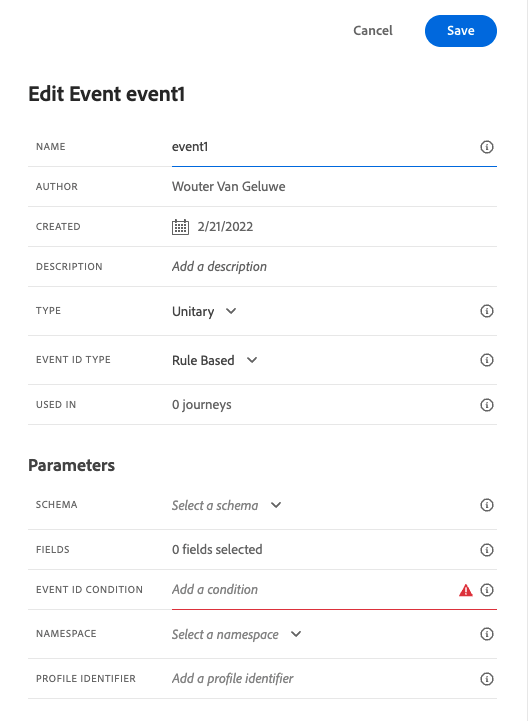

まず、イベントに次のような名前を付けます。 `--demoProfileLdap--PurchaseEvent`をクリックし、次のような説明を追加します。 `Purchase Event`.


次は **イベントタイプ** 選択。 選択 **単一**.


次は **イベント ID タイプ** 選択。 選択 **生成されたシステム**


次に、「スキーマ」を選択します。 この演習では、スキーマが準備されました。 スキーマを使用してください `Demo System - Event Schema for Website (Global v1.1) v.1`.


スキーマを選択すると、 **ペイロード** 」セクションに入力します。 次をクリック： **編集/鉛筆** アイコンをクリックして、このイベントにフィールドを追加します。


その後、このポップアップが表示されます。 次に、このイベントがトリガーされたときに追加のデータにアクセスするには、追加のチェックボックスをオンにする必要があります。


まず、行のチェックボックスをオンにします。 `--aepTenantId--`.


次に、下にスクロールして、行のチェックボックスをオンにします。 `productListItems`.


次に、下にスクロールして、行のチェックボックスをオンにします。 `commerce`.


次に、「 **Ok**.

その後、イベントに追加のフィールドが追加されていることがわかります。 「**保存**」をクリックします。


新しいイベントが共有され、使用可能なイベントのリストにイベントが表示されます。

イベントを再度クリックすると、 **イベントを編集** 画面を再度表示します。
次の項目にカーソルを合わせます。 **ペイロード** フィールドに再度挿入し、3 つのアイコンを再度表示します。 をクリックします。 **ペイロードを表示** アイコン


これで、期待されるペイロードの例が表示されます。 イベントには一意のオーケストレーション eventID があり、見つかるまでペイロード内を下にスクロールすると見つかります `_experience.campaign.orchestration.eventID`.


次の手順で作成するジャーニーをトリガーにするには、イベント ID をAdobe Journey Optimizerに送信する必要があります。 次の手順の 1 つで必要になるので、この eventID を書き留めます。
`"eventID": "ef6dd943c94fe1b4763c098ccd1772344662f2a9f614513106cb5ada8be36857"`

クリック **Ok**&#x200B;に続いて **キャンセル**.

これでイベントが設定され、使用できる状態になりました。

## 10.1.2 ジャーニーの作成

メニューで、に移動します。 **ジャーニー** をクリックし、 **作成ジャーニー**.


これが見えます ジャーニーに名前を付けます。 `--demoProfileLdap-- - Order Confirmation journey`.を使用します。「**OK**」をクリックします。


まず、イベントをジャーニーの出発点として追加する必要があります。 イベントの検索 `--demoProfileLdap--PurchaseEvent` をクリックし、キャンバスにドラッグ&amp;ドロップします。 「**OK**」をクリックします。


次の、以下 **アクション**、 **電子メール** 「 」アクションをクリックし、キャンバスに追加します。


を **カテゴリ** から **マーケティング** をクリックし、電子メールを送信できる電子メールサーフェスを選択します。 この場合、選択する E メールサーフェスは次のようになります。 **電子メール**. 次のチェックボックスをオンにします。 **メールのクリック数** および **メール開封数** 両方とも有効です。

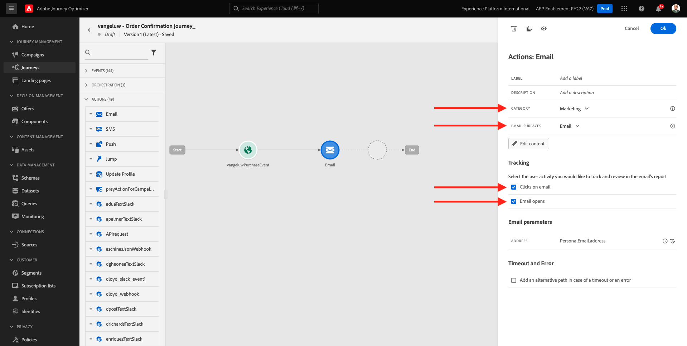

次の手順では、メッセージを作成します。 それには、「 **コンテンツを編集**.


これが見えます 次をクリック： **件名** テキストフィールド。


テキスト領域で、 **ご注文ありがとうございました**


件名はまだ行われていません。 次に、フィールドのパーソナライゼーショントークンを取り込む必要があります **名** それは以下の下に保存されています `profile.person.name.firstName`. 左側のメニューで、下にスクロールして、 **人物** > **氏名** >  **名** フィールドに入力し、 **+** アイコンをクリックして、パーソナライゼーショントークンを件名行に追加します。 「**保存**」をクリックします。


その後、戻ってきます。 クリック **メールデザイナー** 電子メールのコンテンツを作成します。


次の画面で、 **ゼロからデザイン**.


左側のメニューには、E メールの構造（行と列）を定義するために使用できる構造コンポーネントが表示されます。

1 回に 8 回ドラッグ&amp;ドロップ **1:1 列** キャンバス上に、次の情報が表示されます。


に移動します。 **コンテンツコンポーネント**.


ドラッグ&amp;ドロップ **画像** コンポーネントを最初の行に配置します。 「**参照**」をクリックします。

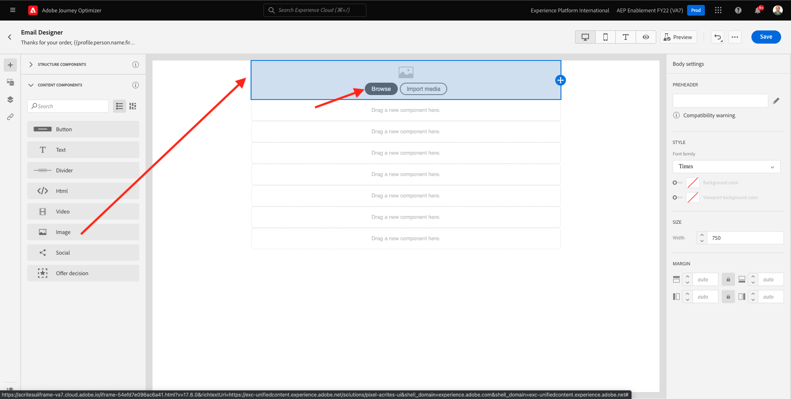

フォルダーに移動します。 **enablement-assets**、ファイルを選択します。 **luma-logo.png** をクリックし、 **選択**.


今、ここに戻っている。 画像をクリックして選択し、 **サイズ** スライダーを使用して、ロゴイメージを少し小さくします。

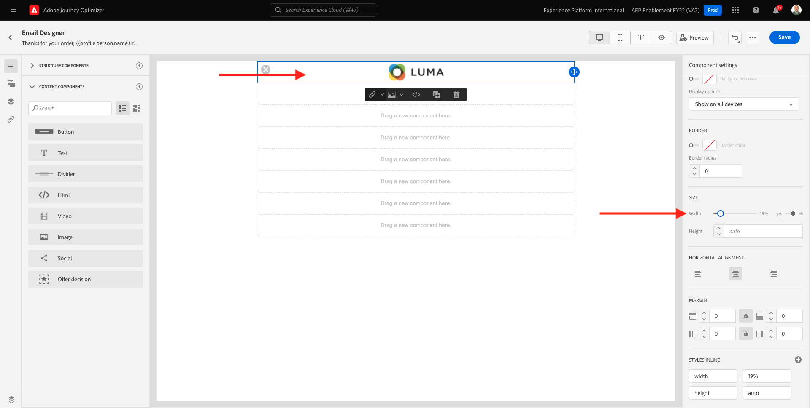

に移動します。 **コンテンツコンポーネント** をクリックし、 **画像** 2 行目のコンポーネント を選択します。 **画像コンポーネント** ただし、[ 参照 ] をクリックしないでください。


この画像 URL を「 」フィールドに貼り付けます **ソース**: `https://parsefiles.back4app.com/hgJBdVOS2eff03JCn6qXXOxT5jJFzialLAHJixD9/29043bedcde632a9cbe8a02a164189c9_preparing.png`. この画像は、Adobe外でホストされます。


スコープを別のフィールドに変更すると、イメージがレンダリングされ、次のように表示されます。


次へ、に移動します。 **コンテンツコンポーネント** をクリックし、 **テキスト** 3 行目のコンポーネント。


そのコンポーネント内のデフォルトのテキストを選択します **ここにテキストを入力してください。** 次のテキストに置き換えます。

```javascript
You’re one step closer!

Hi 

We've received your order details!

We will also send you a separate email containing your VAT Invoice.

We'll be back in touch with you as soon as we've finished packing your package. Please read carefully the Order Information detailed below.
```


テキストの横にカーソルを置きます。 **こんにちは** をクリックし、 **パーソナライゼーションを追加**.


次に移動： **人物** > **氏名** > **名** フィールドに入力し、 **+** アイコンをクリックして、パーソナライゼーショントークンを件名行に追加します。 「**保存**」をクリックします。


次の内容が表示されます。


次へ、に移動します。 **コンテンツコンポーネント** をクリックし、 **テキスト** 4 行目のコンポーネント。


そのコンポーネント内のデフォルトのテキストを選択します **ここにテキストを入力してください。** 次のテキストに置き換えます。

`Order Information`

フォントサイズをに変更します。 **26px** テキストをこのセルの中央に配置します。 その後、次の情報が表示されます。


次へ、に移動します。 **コンテンツコンポーネント** をクリックし、 **HTML** 5 行目のコンポーネント。 HTMLコンポーネントをクリックし、 **ソースコードを表示**.


内 **編集HTML** ポップアップ、このHTMLを貼り付け：

```<table><tbody><tr><td><b>Items purchased</b></td><td></td><td><b>Quantity</b></td><td><b>Subtotal</b></td></tr><tr><td colspan="4" width="500"><hr></td></tr></tbody></table>```

「**保存**」をクリックします。


その後、これを取得します。 クリック **保存** をクリックして、進行状況を保存します。

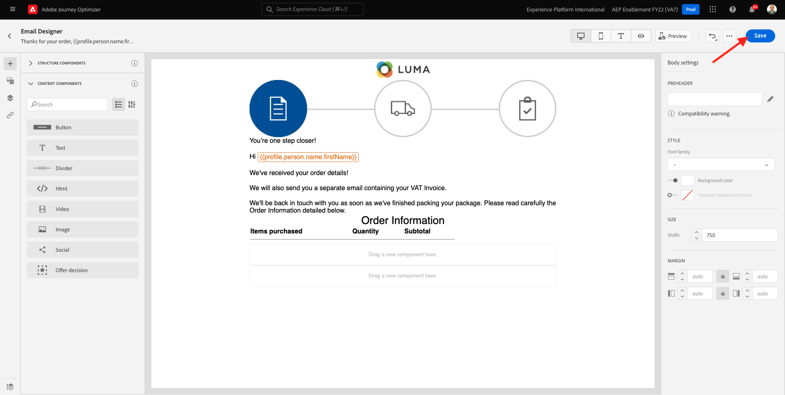

に移動します。 **コンテンツコンポーネント** をクリックし、 **HTML** 6 行目のコンポーネント。 HTMLコンポーネントをクリックし、 **ソースコードを表示**.


内 **編集HTML** ポップアップ、このHTMLを貼り付け：

```{{#each xxx as |item|}}<table width="500"><tbody><tr><td></td><td><table><tbody><tr><td><b>{{item.name}}</b><br>{{item.--aepTenantId--.core.subCategory}}<br><b>{{item.priceTotal}}</b><br>&nbsp;<br>Article no: {{item.SKU}}</td></tr></tbody></table></td><td>{{item.quantity}}</td><td><b>{{item.priceTotal}}</b></td></tr></tbody></table>{{/each}}```

その後、次の情報が表示されます。


次は、 **xxx** ジャーニーをトリガーするイベントの一部である productListItems オブジェクトへの参照によって。


最初に、を削除します。 **xxx** をHTMLコードで最初にクリックします。


左側のメニューで、 **コンテキスト属性**. このコンテキストは、ジャーニーからメッセージに渡されます。


これが見えます の横の矢印をクリックします。 **Journey Orchestration** より深く掘り下げる


の横の矢印をクリックします。 **イベント** より深く掘り下げる


の横の矢印をクリックします。 `--demoProfileLdap--PurchaseEvent` より深く掘り下げる


の横の矢印をクリックします。 **productListItems** より深く掘り下げる


次をクリック： **+** 隣のアイコン **名前** をクリックしてキャンバスに追加します。 その後、これを取得します。 次に、「 」を選択する必要があります。  **.name** 次のスクリーンショットに示すように、を削除します。 **.name**.

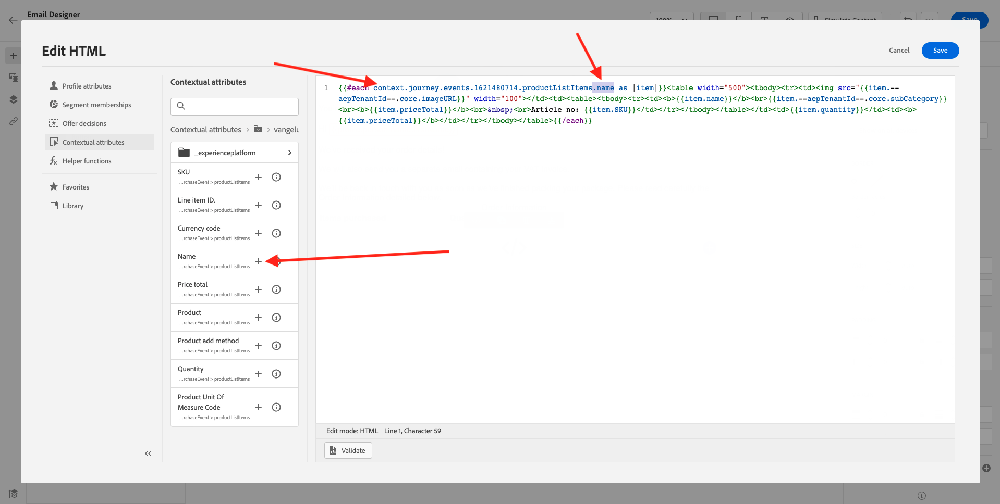

その後、これを取得します。 「**保存**」をクリックします。


これで、E メールデザイナーに戻ります。 クリック **保存** をクリックして、進行状況を保存します。


次へ、に移動します。 **コンテンツコンポーネント** をクリックし、 **HTML** コンポーネントを 7 行目に追加します。 HTMLコンポーネントをクリックし、 **ソースコードを表示**.


内 **編集HTML** ポップアップ、このHTMLを貼り付け：

```<table><tbody><tr><td><b>Subtotal</b><br>Delivery charge (included)</td><td align="right"><b>xxx</b><br><b>5</b></td></tr><tr><td colspan="2" width="500"><hr></td></tr><tr><td><b>Total including VAT</b></td><td align="right"><b>xxx</b></td></tr></tbody></table>```

次の 2 つの参照があります： **xxx** を設定します。 次に、各 **xxx** ジャーニーをトリガーするイベントの一部である productListItems オブジェクトへの参照によって。


最初の **xxx** をHTMLコードに追加します。


左側のメニューで、 **コンテキスト属性**.


の横の矢印をクリックします。 **Journey Orchestration** より深く掘り下げる


の横の矢印をクリックします。 **イベント** より深く掘り下げる


の横の矢印をクリックします。 `--demoProfileLdap--PurchaseEvent` より深く掘り下げる


の横の矢印をクリックします。 **コマース** より深く掘り下げる


の横の矢印をクリックします。 **注文** より深く掘り下げる


次をクリック： **+** 隣のアイコン **価格合計** をクリックしてキャンバスに追加します。


その後、これを取得します。 2 番目の **xxx** をHTMLコードに追加します。


次をクリック： **+** 隣のアイコン **価格合計** を再びクリックして、キャンバスに追加します。


また、「 **通貨** 内から **注文** オブジェクトをキャンバス上に配置します。
完了したら、「 **保存** 変更を保存します。


その後、E メールデザイナーに戻ります。 クリック **保存** 再び


次をクリックして、メッセージダッシュボードに戻ります。 **矢印** 左上隅の件名行テキストの横に表示されます。

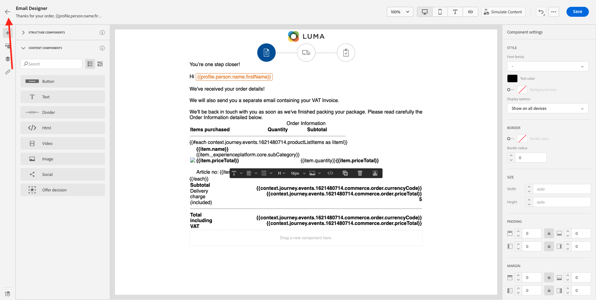

左上隅の矢印をクリックして、ジャーニーに戻ります。


クリック **Ok** ：電子メールアクションを閉じます。


クリック **公開** ジャーニーを公開するには：

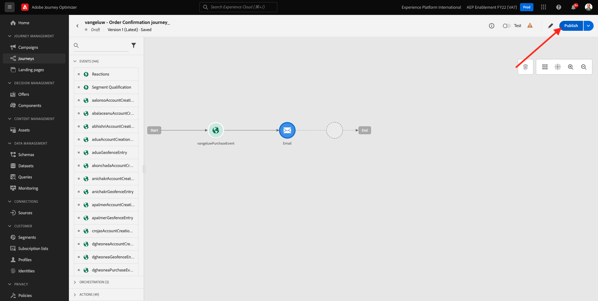

クリック **公開** 再び


ジャーニーが公開されました。


## 10.1.5 Adobe Experience Platform Data Collection Client プロパティの更新

に移動します。 [Adobe Experience Platform Data Collection](https://experience.adobe.com/launch/) を選択し、 **タグ**.

これは、以前に表示したAdobe Experience Platformデータ収集プロパティページです。


モジュール 0 では、Demo System によって次の 2 つのクライアントプロパティが作成されました。1 つは web サイト用、もう 1 つはモバイルアプリ用です。 次を検索して検索 `--demoProfileLdap--` 内 **[!UICONTROL 検索]** ボックス クリックして **Web** プロパティ。


に移動します。 **データ要素**. データ要素を検索して開きます。 **XDM — 購入**.

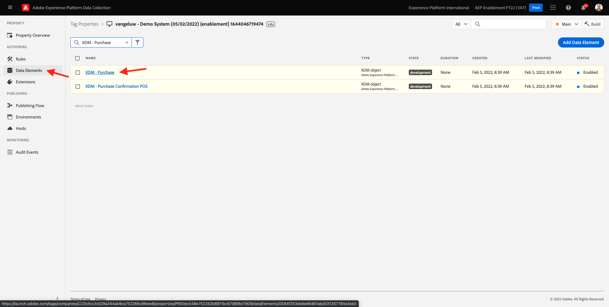

これが見えます フィールドに移動します。 **_experience.campaign.orchestration.eventID** イベント ID をここに入力します。 ここで入力する eventID は、演習 10.1.2 の一部として作成した eventID です。「 **保存** または **ライブラリに保存**.


変更をクライアントプロパティに保存し、開発ライブラリを更新して変更を公開します。

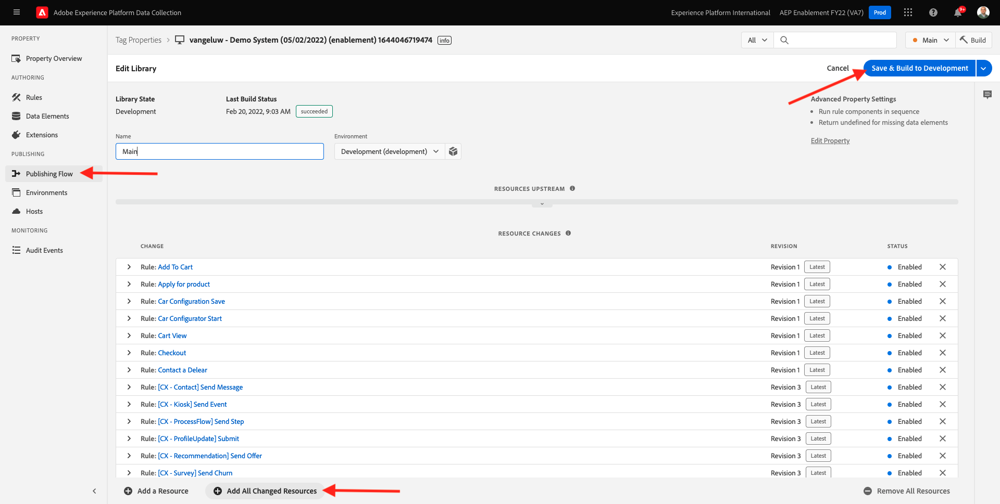

これで変更がデプロイされ、テストできます。

## 10.1.6 デモ Web サイトを使用して注文確認 E メールをテストします。

デモ Web サイトで製品を購入して、更新されたジャーニーをテストしましょう。

に移動します。 [https://builder.adobedemo.com/projects](https://builder.adobedemo.com/projects). Adobe IDでログインすると、次の内容が表示されます。 Web サイトプロジェクトをクリックして開きます。


の **スクリーン** ページ、クリック **実行**.


次に、デモ Web サイトが開いているのがわかります。 URL を選択して、クリップボードにコピーします。


新しい匿名ブラウザーウィンドウを開きます。


前の手順でコピーしたデモ Web サイトの URL を貼り付けます。 その後、Adobe IDを使用してログインするように求められます。


アカウントのタイプを選択し、ログインプロセスを完了します。


Web サイトが匿名ブラウザーウィンドウに読み込まれます。 デモ Web サイトの URL を読み込むには、新しい匿名ブラウザーウィンドウを使用する必要があります。


画面の左上隅にあるAdobeロゴアイコンをクリックして、プロファイルビューアを開きます。


プロファイルビューアパネルと、リアルタイム顧客プロファイルを **Experience CloudID** を、現在不明なこの顧客の主な識別子として使用する。


登録/ログインページに移動します。 クリック **アカウントの作成**.


詳細を入力し、 **登録** その後、前のページにリダイレクトされます。


製品を買い物かごに追加し、 **買い物かご** ページ。 クリック **チェックアウトに進みます。**.

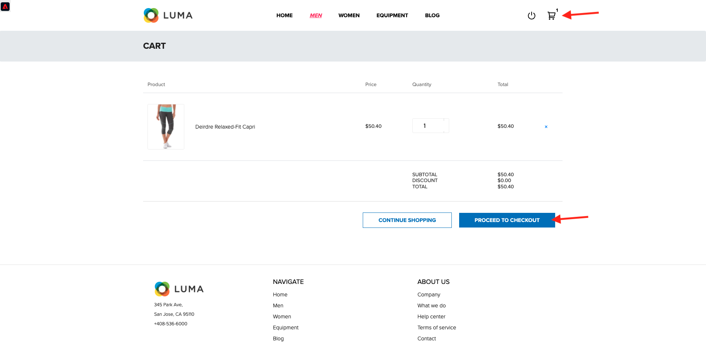

次に、チェックアウトページのフィールドを確認し、「 **チェックアウト**.


その後、数秒以内に注文確認メールが届きます。


この練習は終わりました。

次のステップ： [10.2 バッチベースのニュースレタージャーニーの設定](./ex2.md)

[モジュール 10 に戻る](./journeyoptimizer.md)

[すべてのモジュールに戻る](../../overview.md)
