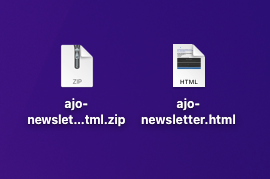

# 10.2 バッチベースのニュースレタージャーニーの設定

に移動してAdobe Journey Optimizerにログインします。 [Adobe Experience Cloud](https://experience.adobe.com). クリック **Journey Optimizer**.

リダイレクト先： **ホーム**  Journey Optimizerで表示 まず、正しいサンドボックスを使用していることを確認します。 使用するサンドボックスは、と呼ばれます。 `--aepSandboxId--`. サンドボックス間を切り替えるには、 **実稼動 (VA7)** リストからサンドボックスを選択します。 この例では、サンドボックスの名前はです。 **AEP 有効化 FY22**. その後、 **ホーム** サンドボックスの表示 `--aepSandboxId--`.

## 10.2.1 ニュースレターのジャーニーの作成

次に、バッチベースのジャーニーを作成します。 1 人の特定の顧客のジャーニーをトリガーするために、受信するエクスペリエンスイベントやセグメントの入口や出口に依存する前の演習のイベントベースのジャーニーとは異なり、バッチベースのジャーニーは、ニュースレター、1 回限りのコンテンツでセグメント全体をターゲット化します。

メニューで、に移動します。 **ジャーニー** をクリックし、 **作成ジャーニー**.

右側に、ジャーニーの名前と説明を指定する必要があるフォームが表示されます。 次の値を入力します。

- **名前**: `--demoProfileLdap-- - Newsletter Journey`. 例： **vangeluw — ニュースレタージャーニー**.
- **説明**:月刊ニュースレター

「**OK**」をクリックします。

の下 **Orchestration**、ドラッグ&amp;ドロップ **セグメントを読み取り** をキャンバスに貼り付けます。 つまり、公開されると、ジャーニーはセグメントオーディエンス全体を取得して開始され、その後、ジャーニーとメッセージのターゲットオーディエンスになります。 クリック **セグメントを選択**.

内 **セグメントを選択** ポップアップ、ldap を検索し、 [モジュール 6 — リアルタイム CDP — セグメントを構築し、アクションを実行する](../module6/real-time-cdp-build-a-segment-take-action.md) 名前付き `--demoProfileLdap-- - Interest in PROTEUS FITNESS JACKSHIRT`. 例：vangeluw — プロテウスフィットネスジャックシャツに興味。 「**保存**」をクリックします。

「**OK**」をクリックします。

左側のメニューで、 **アクション** 「 」セクションにドラッグ&amp;ドロップします **電子メール** アクションをキャンバスに移動します。

を **カテゴリ** から **マーケティング** をクリックし、電子メールを送信できる電子メールサーフェスを選択します。 この場合、選択する E メールサーフェスは次のようになります。 **電子メール**. 次のチェックボックスをオンにします。 **メールのクリック数** および **メール開封数** 両方とも有効です。

次の手順では、メッセージを作成します。 それには、「 **コンテンツを編集**.

これが見えます 次をクリック： **件名** テキストフィールド。

件名行に対して次のテキストを入力します。 `Luma Newsletter - your monthly update has arrived.`. 「**保存**」をクリックします。

その後、戻ってきます。 クリック **メールデザイナー** :e メールコンテンツの作成を開始します。

これが見えます クリック **インポートHTML**.

ポップアップ画面で、E メールのHTMLファイルをドラッグ&amp;ドロップする必要があります。 テンプレートは次の場所にあります。HTML [ここ](../../assets/html/ajo-newsletter.html.zip). HTMLテンプレートを含む zip ファイルをローカルマシンにダウンロードし、デスクトップに解凍します。

ファイルをドラッグ&amp;ドロップします **ajo-newsletter.html** をクリックして、Journey Optimizerにアップロードします。 「**Import**」をクリックします。

この E メールコンテンツは、予想されるパーソナライゼーション、画像、テキストがすべて揃っているので、準備が整っています。 オファープレースホルダーのみが空のままです。

次のようなエラーメッセージが表示される場合があります。 **アセットを取得しようとした際にエラーが発生しました**. これは E メール内の画像にリンクされます。

このエラーが発生した場合は、画像を選択し、 **画像を編集** 」ボタンをクリックします。

クリック **Assets Essentials** をクリックして、AEM Assets Essentials ライブラリに戻ります。

その後、このポップアップが表示されます。 フォルダーに移動します。 **enablement-assets** 画像を選択します。 **luma-newsletterContent.png**. 「**選択**」をクリックします。

これで、基本的なニュースレター電子メールの準備が整いました。 「**保存**」をクリックします。

次をクリックして、メッセージダッシュボードに戻ります。 **矢印** 左上隅の件名行テキストの横に表示されます。

左上隅の矢印をクリックして、ジャーニーに戻ります。

クリック **Ok** ：電子メールアクションを閉じます。

これで、ニュースレターのジャーニーを公開する準備が整いました。 その前に、 **スケジュール** セクションを開き、このジャーニーを 1 回限りのキャンペーンから繰り返しキャンペーンに切り替えることができます。 次をクリック： **スケジュール** 」ボタンをクリックします。

これが見えます 選択 **1 回**.

次の 1 時間以内の日時を選択して、ジャーニーをテストできます。 「**OK**」をクリックします。

>[!NOTE]
>
>メッセージの送信日時は 1 時間以上にする必要があります。

「**公開**」をクリックします。

クリック **公開** 再び

これで、基本的なニュースレターのジャーニーが公開されました。 ニュースレターの電子メールメッセージは、スケジュールで定義したとおりに送信され、最後の電子メールが送信されるとすぐにジャーニーが停止します。

この練習は終わりました。

次のステップ： [10.3 電子メールメッセージへのパーソナライゼーションの適用](./ex3.md)

[モジュール 10 に戻る](./journeyoptimizer.md)

[すべてのモジュールに戻る](../../overview.md)
