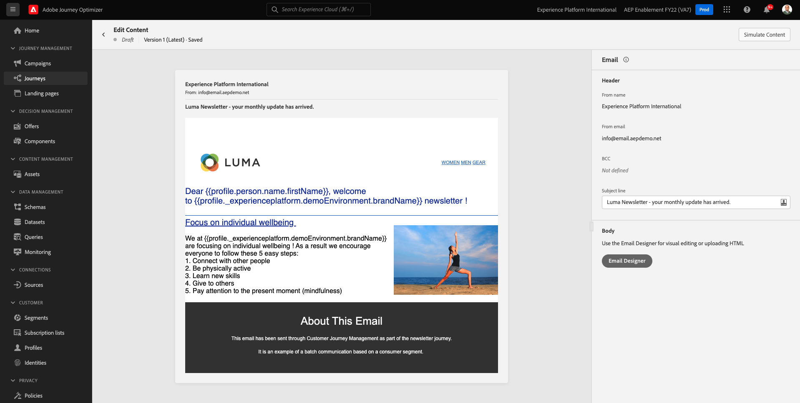
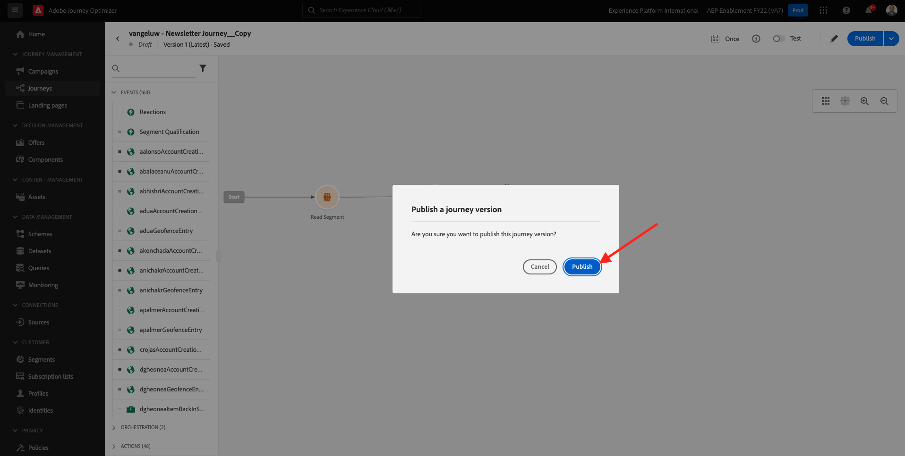

# 10.3 電子メールメッセージへのパーソナライゼーションの適用

に移動してAdobe Experience Cloudにログインします。 [Adobe Experience Cloud](https://experience.adobe.com). クリック **Adobe Journey Optimizer**.

リダイレクト先： **ホーム** Journey Optimizerで表示 続行する前に、 **サンドボックス**. 選択するサンドボックスの名前はです ``--aepTenantId--``. これを行うには、 **[!UICONTROL 実稼動版]** 画面の上の青い線で表示されます。

## 10.3.1 セグメントベースのパーソナライゼーション

この演習では、セグメントのメンバーシップに基づいてパーソナライズされたテキストを使用して、ニュースレターの E メールメッセージを改善します。

に移動します。 **ジャーニー**. 前の演習で作成したニュースレターのジャーニーを見つけます。 `--demoProfileLdap-- - Newsletter` を検索します。ジャーニーをクリックして開きます。

これが見えます 「**複製**」をクリックします。

「**複製**」をクリックします。

を選択します。 **電子メール** 「 」アクションとクリック **コンテンツを編集**.

クリック **メールデザイナー**.

これが見えます

開く **コンテンツコンポーネント** をクリックし、 **テキスト** 現在のニュースレターコンテンツの下のコンポーネント。

デフォルトのテキスト全体を選択して削除します。 次に、 **パーソナライゼーションを追加** 」ボタンをクリックします。

次の内容が表示されます。

左側のメニューで、 **セグメントメンバーシップ**.

>[!NOTE]
>
>このリストにセグメントが見つからない場合は、少し下にスクロールして、セグメント ID を手動で取得する方法に関する手順を見つけます。

セグメントを選択 `Luma - Women's Category Interest` をクリックし、 **+** アイコンは次のようになります。

次に、最初の行をそのまま残し、次のコードで行 2 と 3 を置き換えます。

``
Psssst... a private sale in the women category will launch soon, we will keep you posted

Thanks for taking the time to read our newsletter. Here is a 10% promo code to use on the website: READER10

``

その後、次の情報が表示されます。

クリック **検証** をクリックして、コードが正しいことを確認します。 「**保存**」をクリックします。

これで、このメッセージを保存するには、 **保存** 」ボタンを使用します。 次に、「 **コンテンツをシミュレート**.

このチュートリアルの一部として作成したプロファイルの 1 つを選択し、「 **プレビュー**. 設定の結果が表示されます。

これが見えます 次に、「 **閉じる**.

次をクリックして、メッセージダッシュボードに戻ります。 **矢印** 左上隅の件名行テキストの横に表示されます。

左上隅の矢印をクリックして、ジャーニーに戻ります。

クリック **Ok** ：電子メールアクションを閉じます。

を **スケジュール** から **1 回** をクリックし、 **日時**. 「**OK**」をクリックします。

>[!NOTE]
>
>メッセージの送信日時は 1 時間以上にする必要があります。

をクリックします。 **公開** ボタンをクリックします。

ポップアップウィンドウで、 **公開** 再び

これで、基本的なニュースレターのジャーニーが公開されました。 ニュースレターの電子メールメッセージは、スケジュールに基づいて送信され、最後の電子メールが送信されるとすぐにジャーニーが停止します。

この練習は終わりました。

次のステップ： [10.4 iOSのプッシュ通知のセットアップと使用](./ex4.md)

[モジュール 10 に戻る](./journeyoptimizer.md)

[すべてのモジュールに戻る](../../overview.md)
