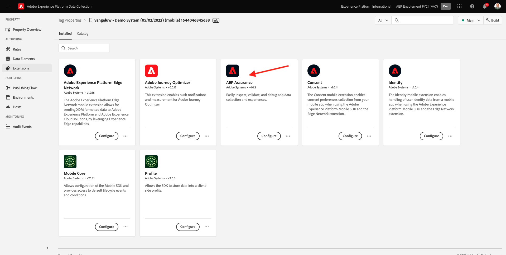
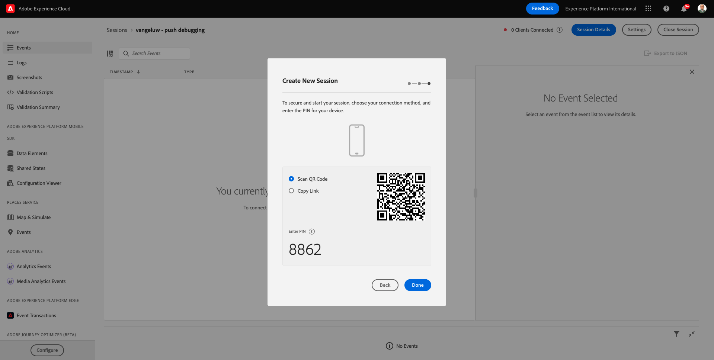
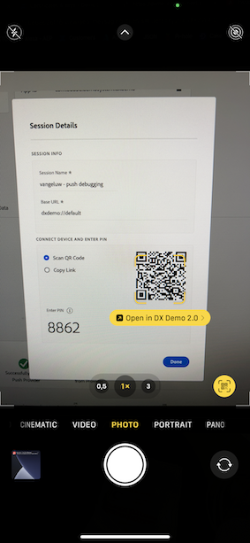
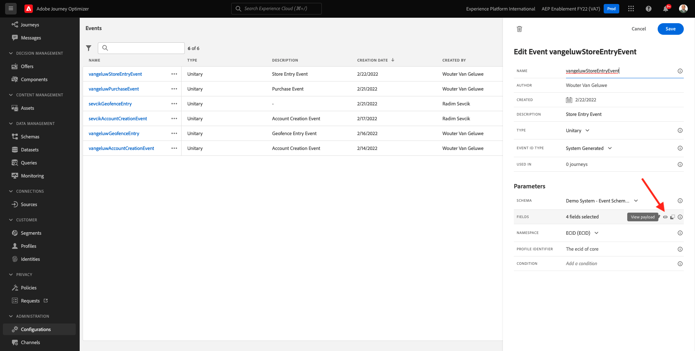
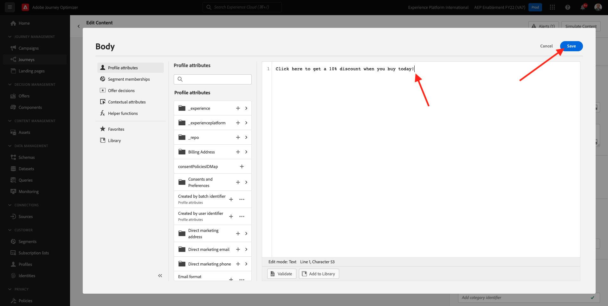
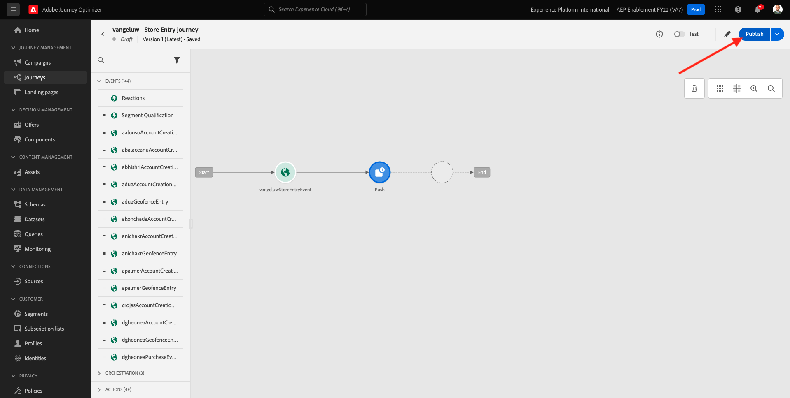
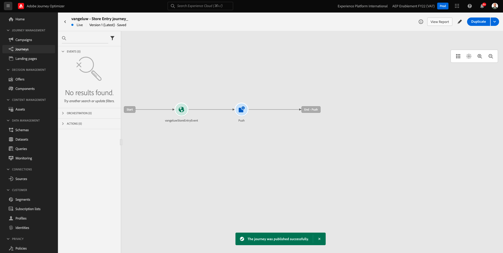

# 10.4 iOSのプッシュ通知のセットアップと使用

Adobe Journey Optimizerでプッシュ通知を使用する場合、確認および理解するための設定が多数あります。

以下に、確認するすべての設定を示します。

- Adobe Experience Platformのデータセットとスキーマ
- モバイル用データストリーム
- モバイルのデータ収集プロパティ
- プッシュ証明書のアプリ表面
- AEP アシュランスを使用したプッシュ設定のテスト

一つ一つ見てみましょう

に移動してAdobe Journey Optimizerにログインします。 [Adobe Experience Cloud](https://experience.adobe.com). クリック **Journey Optimizer**.

リダイレクト先： **ホーム**  Journey Optimizerで表示 まず、正しいサンドボックスを使用していることを確認します。 使用するサンドボックスは、と呼ばれます。 `--aepSandboxId--`. サンドボックス間を切り替えるには、 **実稼動 (VA7)** リストからサンドボックスを選択します。 この例では、サンドボックスの名前はです。 **AEP 有効化 FY22**. その後、 **ホーム** サンドボックスの表示 `--aepSandboxId--`.

## 10.4.1 プッシュデータセット

Adobe Journey Optimizerでは、データセットを使用して、モバイルデバイスからのプッシュトークンや、プッシュメッセージとのやり取り（以下など）を保存します。Adobe Journey Optimizerのデータセットで送信されたメッセージ、開かれたメッセージなど )。

これらのデータセットは、 **[!UICONTROL データセット]** をクリックします。 システムデータセットを表示するには、フィルターアイコンをクリックします。

オプションを有効にする **システムデータセットを表示** およびを検索します。 **AJO**. 次に、プッシュ通知に使用されるデータセットが表示されます。

## 10.4.2 モバイル用データストリーム

に移動します。 [https://experience.adobe.com/#/data-collection/](https://experience.adobe.com/#/data-collection/).

左側のメニューで、に移動します。 **[!UICONTROL Datastream]** およびで作成したデータストリームを検索します。 [演習 0.2](./../module0/ex2.md)（という名前） `--demoProfileLdap-- - Demo System Datastream (Mobile)`. クリックして開きます。

クリック **編集** の **Adobe Experience Platform** サービス。

次に、定義されたデータストリーム設定と、データセットイベントとプロファイル属性の保存先が表示されます。

変更は不要で、Mobile のデータ収集クライアントプロパティでデータストリームを使用する準備が整いました。

## 10.4.3 モバイルのデータ収集プロパティの確認

に移動します。 [https://experience.adobe.com/#/data-collection/](https://experience.adobe.com/#/data-collection/). の一部として [演習 0.1](./../module0/ex1.md)、2 つのデータ収集プロパティが作成されました。
これらのデータ収集クライアントプロパティは、以前のモジュールの一部として既に使用されています。

をクリックして、モバイル用のデータ収集プロパティを開きます。

データ収集プロパティで、に移動します。 **拡張機能**. その後、モバイルアプリに必要な様々な拡張機能が表示されます。 クリックして拡張機能を開きます。 **Adobe Experience Platform Edge Network**.

次に、モバイル用のデータストリームがここにリンクされていることがわかります。 次に、「 **キャンセル** をクリックして、拡張機能の概要に戻ります。

その後、戻ってきます。 の拡張機能が表示されます。 **AEP アシュランス**. AEP Assurance は、モバイルアプリでデータを収集したりエクスペリエンスを提供したりする方法を調査、配達確認、シミュレーションおよび検証するのに役立ちます。 AEP Assurance とプロジェクトグリフォンについて詳しくは、こちらを参照してください。 [https://aep-sdks.gitbook.io/docs/beta/project-griffon](https://aep-sdks.gitbook.io/docs/beta/project-griffon).

次に、「 **設定** 拡張機能を開くには、以下を実行します。 **Adobe Journey Optimizer**.

プッシュイベントを追跡するデータセットがリンクされていることがわかります。

データ収集プロパティを変更する必要はありません。

## 10.4.4 アプリケーションサーフェスの設定の確認

に移動します。 [https://experience.adobe.com/#/data-collection/](https://experience.adobe.com/#/data-collection/). 左側のメニューで、に移動します。 **アプリのサーフェス** を開くと、 **DX デモアプリ APNS**.

その後、iOSと Android 用に設定されたアプリサーフェスが表示されます。

## 10.4.5 AEP Assurance を使用したプッシュ通知設定のテスト

アプリがインストールされると、デバイスのホーム画面に表示されます。 アイコンをクリックしてアプリを開きます。

アプリを初めて使用する場合は、Adobe IDを使用してログインする必要があります。 ログインプロセスを完了します。

ログインすると、通知を送信する権限をリクエストする通知が表示されます。 チュートリアルの一環として通知を送信するので、 **許可**.

その後、アプリのホームページが表示されます。 に移動します。 **設定**.

設定には、現在、 **公開プロジェクト** がアプリに読み込まれます。 クリック **カスタムプロジェクト**.

これで、カスタムプロジェクトを読み込むことができます。 QR コードをクリックして、プロジェクトを簡単に読み込みます。

練習 0.1 の後、次の結果が得られました。 クリックして **モバイル小売プロジェクト** それはあなたのために作られた。

誤ってブラウザーウィンドウを閉じた場合や、将来のデモまたはイネーブルメントセッションで使用する場合は、Web サイトプロジェクトにアクセスするには、 [https://builder.adobedemo.com/projects](https://builder.adobedemo.com/projects). Adobe IDでログインすると、次の内容が表示されます。 モバイルアプリプロジェクトをクリックして開きます。

これが見えます クリック **統合**.

演習 0.1 で作成したモバイル用のデータ収集プロパティを選択する必要があります。次に、 **実行**.

QR コードが入ったポップアップが表示されます。 この QR コードをモバイルアプリ内からスキャンします。

その後、アプリにプロジェクト ID が表示され、次に「 **保存**.

次に戻ります。 **ホーム** 」と入力します。 これで、アプリを使用する準備が整いました。

次に、QR コードをスキャンして、モバイルデバイスを AEP Assurance セッションに接続する必要があります。

AEP Assurance セッションを開始するには、次に移動します。 [https://experience.adobe.com/#/@experienceplatform/griffon](https://experience.adobe.com/#/@experienceplatform/griffon). クリック **セッションを作成**.

「**開始**」をクリックします。

値を入力します。

- セッション名：use `--demoProfileLdap-- - push debugging` ldap を ldap に置き換えます。
- ベース URL :use **dxdemo://default**

「**次へ**」をクリックします。

次に、画面に QR コードが表示されます。このコードは、iOSデバイスでスキャンする必要があります。

モバイルデバイスで、カメラアプリを開き、AEP Assurance で表示される QR コードをスキャンします。

PIN コードを入力するよう求めるポップアップ画面が表示されます。 AEP Assurance 画面から PIN コードをコピーし、 **接続**.

これが見えます

AEP Assurance では、デバイスが AEP Assurance セッションに対して設定されていることがわかります。

に移動します。 **プッシュデバッグ**. こんな感じがします

説明：

- 最初の列は **クライアント**&#x200B;には、iOSデバイスで使用可能な ID が表示されます。 ECID とプッシュトークンが表示されます。
- 2 番目の列にはが表示されます。 **プロファイル** 情報と、プッシュトークンが存在するプラットフォーム（APNS または APNSSandbox）に関する追加情報。 この **Inspect Profile** ボタンがクリックされたら、Adobe Experience Platformに移動し、完全なリアルタイム顧客プロファイルが表示されます。
- 3 番目の列には、 **アプリ設定**（これは運動の一環として設定された） **10.5.4 Launch でのアプリ設定の作成**

プッシュ設定をテストするには、 **プッシュ通知を送信** 」ボタンをクリックします。

次を確認する必要があります。 **DX デモ** アプリは、 **プッシュ通知を送信** 」ボタンをクリックします。 アプリが開いている場合、プッシュ通知がバックグラウンドで受信され、表示されない可能性があります。

その後、このようなプッシュ通知がモバイルデバイスに表示されます。

プッシュ通知を受け取った場合は、設定が正しく機能していることを意味します。

## 10.4.6 新しいイベントの作成

メニューで、に移動します。 **ジャーニー管理** をクリックし、 **管理** under **イベント**.

の **イベント** 画面には、次のようなビューが表示されます。 クリック **イベントを作成**.

空のイベント設定が表示されます。

まず、イベントに次のような名前を付けます。 `--demoProfileLdap--StoreEntryEvent` に設定し、説明を `Store Entry Event`.

次は **イベントタイプ** 選択。 選択 **単一**.

次は **イベント ID タイプ** 選択。 選択 **生成されたシステム**

次に、「スキーマ」を選択します。 この演習では、スキーマが準備されました。 スキーマを使用してください `Demo System - Event Schema for Mobile App (Global v1.1) v.1`.

スキーマを選択すると、 **ペイロード** 」セクションに入力します。 これでイベントの設定が完了しました。

次に、これが表示されます。 「**保存**」をクリックします。

これで、イベントが設定され、保存されました。 イベントを再度クリックすると、 **イベントを編集** 画面を再度表示します。

次の項目にカーソルを合わせます。 **ペイロード** フィールドに入力し、 **ペイロードを表示** アイコン

これで、期待されるペイロードの例が表示されます。

イベントには一意のオーケストレーション eventID があり、見つかるまでペイロード内を下にスクロールすると見つかります `_experience.campaign.orchestration.eventID`.

次の手順で作成するジャーニーをトリガー化するには、イベント ID をAdobe Experience Platformに送信する必要があります。 次の手順で必要になるように、この eventID を書き留めます。
`"eventID": "e3a8f0bdc0b609667cd96a72a6b1e5aafa0ddaf6ccf121c574e6a2030860a633"`

クリック **Ok**&#x200B;に続いて **キャンセル**.

## 10.4.7 ジャーニーの作成

メニューで、に移動します。 **ジャーニー** をクリックし、 **作成ジャーニー**.

これが見えます ジャーニーに名前を付けます。 `--demoProfileLdap-- - Store Entry journey`.を使用します。「**OK**」をクリックします。

まず、イベントをジャーニーの出発点として追加する必要があります。 イベントの検索 `--demoProfileLdap--StoreEntryEvent` をクリックし、キャンバスにドラッグ&amp;ドロップします。 「**OK**」をクリックします。

次の、以下 **アクション**、 **プッシュ** アクション。
次をドラッグ&amp;ドロップ： **プッシュ** アクションをキャンバスに移動します。

を **カテゴリ** から **マーケティング** プッシュ通知を送信できるプッシュサーフェスを選択します。 この場合、選択する E メールサーフェスは次のようになります。 **Push-iOS-Android**.

次の手順では、メッセージを作成します。 それには、「 **コンテンツを編集**.

これが見えます 次をクリック： **パーソナライズ** アイコン **タイトル** フィールドに入力します。

これが見えます 任意のプロファイル属性をリアルタイム顧客プロファイルから直接選択できるようになりました。

フィールドを検索 **名**」、「 **+** フィールドの横のアイコン **名**. 次に、名のパーソナライゼーショントークンが追加されています。 **{{profile.person.name.firstName}}**.

次に、テキストを追加します。 **私たちの店へようこそ！** 後ろ **{{profile.person.name.firstName}}**.

「**保存**」をクリックします。

これです。 次をクリック： **パーソナライズ** アイコン **本文** フィールドに入力します。

このテキストを入力 **今日購入すると 10%の割引を受けるには、ここをクリックしてください。** をクリックし、 **保存**.

その後、これを取得します。 左上隅の矢印をクリックして、ジャーニーに戻ります。

クリック **OK** をクリックして、プッシュアクションを閉じます。

「**公開**」をクリックします。

クリック **公開** 再び

ジャーニーが公開されました。

## 10.4.8 ジャーニーとプッシュメッセージのテスト

DX Demo 2.0 モバイルアプリケーションで、 **設定** 画面 次をクリック： **ストアエントリ** 」ボタンをクリックします。

>[!NOTE]
>
>この **ストアエントリ** ボタンは現在実装中です。 まだアプリ内に見つかりません。

次をクリックした直後に必ずアプリを閉じてください： **ストアエントリ** アイコンを使用します。それ以外の場合は、プッシュメッセージは表示されません。

数秒後に、メッセージが表示されます。

この練習は終わりました。

次のステップ： [10.5 ビジネスイベントのジャーニーの作成](./ex5.md)

[モジュール 10 に戻る](./journeyoptimizer.md)

[すべてのモジュールに戻る](../../overview.md)
