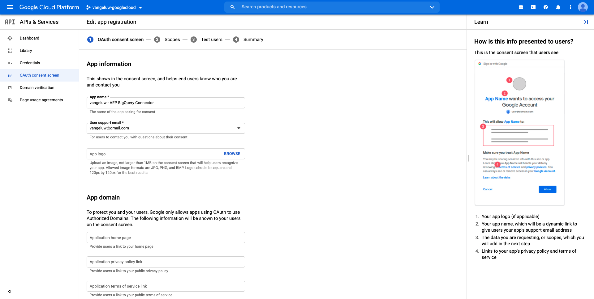
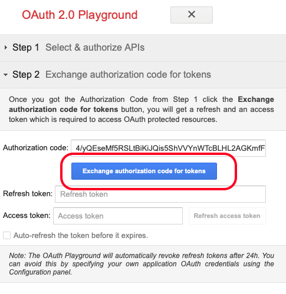

# 12.3 GCP と BigQuery のAdobe Experience Platformへの接続

## 目標

- Google Cloud Platform 内での API とサービスの詳細
- Google API のテストに関する OAuth Playground について
- Adobe Experience Platformでの最初の BigQuery 接続の作成

## コンテキスト

Adobe Experience Platformは、 **ソース** これは、BigQuery データセットをAdobe Experience Platformに取り込むのに役立ちます。 この Data Connector は、Google BigQuery API に基づいています。 したがって、Adobe Experience Platformから API 呼び出しを受け取るには、Google Cloud Platform と BigQuery 環境を適切に準備することが重要です。

Adobe Experience Platformで BigQuery Source Connector を設定するには、次の 4 つの値が必要です。

- プロジェクト
- clientId
- clientSecret
- refreshToken

今のところ、最初のののみが **プロジェクト ID**. この **プロジェクト ID** 値は、演習 12.1 で BigQuery プロジェクトを作成したときにGoogleによって生成されたランダムな ID です。

プロジェクト ID を別のテキストファイルにコピーしてください。

| 認証情報 | 命名 | 例 |
| ----------------- |-------------| -------------|
| プロジェクト ID | random | composed-task-306413 |

プロジェクト ID は、 **プロジェクト名** 上部のメニューバーで、次の操作をおこないます。

右側にプロジェクト ID が表示されます。

この演習では、その他の 3 つの必須フィールドの取得方法を学びます。

- clientId
- clientSecret
- refreshToken

## 12.3.1 Google Cloud API およびサービス

開始するには、Google Cloud Platform のホームページに戻ってください。 これをおこなうには、画面の左上隅にあるロゴをクリックします。

ホームページに移動したら、左のメニューに移動し、「 」をクリックします。 **API とサービス**&#x200B;をクリックし、 **ダッシュボード**.

これで、 **API とサービス** homepage.

このページでは、様々なGoogle API 接続の使用状況を確認できます。 Adobe Experience Platformが BigQuery から読み取れるように API 接続を設定するには、次の手順に従う必要があります。

- まず、OAuth 同意画面を作成して、今後の認証を有効にする必要があります。 Googleのセキュリティ上の理由から、プログラムによるアクセスが許可される前に、人間が最初の認証を行う必要もあります。
- 次に、API 認証と BigQuery コネクタへのアクセスに使用する API 資格情報（clientId と clientSecret）が必要です。

## 12.3.2 OAuth 同意画面

まず、OAuth 同意画面を作成します。 左側のメニュー ( **API とサービス** homepage, click **OAuth 同意画面**.

次の内容が表示されます。

ユーザータイプを選択します。 **外部**. 次に、「 **作成**.

その後、 **OAuth 同意画面の設定** ウィンドウ

ここでおこなうべきことは、 **アプリ名** フィールドを選択し、 **ユーザーサポート用電子メール**. アプリケーション名には、次の命名規則を使用します。

| 命名 | 例 |
| ----------------- |-------------| 
| `--demoProfileLdap-- - AEP BigQuery Connector` | vangeluw - AEP BigQuery コネクタ |

次に、が表示されるまで下にスクロールします。 **開発者の連絡先情報** 電子メールアドレスを入力します。

クリック **保存して続行**.

これが見えます クリック **保存して続行**.

これが見えます クリック **保存して続行**.

これが見えます クリック **ダッシュボードに戻る**.

これが見えます クリック **アプリを公開**.

クリック **確認**.

これが見えます

次の手順で、API の設定を完了し、API 資格情報を取得します。

## 12.3.3 Google API 資格情報：クライアント秘密鍵とクライアント ID

左側のメニューで、 **資格情報**. 次の内容が表示されます。

次をクリック： **+資格情報を作成** 」ボタンをクリックします。

3 つのオプションが表示されます。 次をクリック： **OAuth クライアント ID**:

次の画面で、「 」を選択します。 **Web アプリケーション**.

いくつかの新しいフィールドがポップアップ表示されます。 次に、 **名前** 」と入力し、 **承認済みのリダイレクト URI**.

次の命名規則に従います。

| フィールド | 値 | 例 |
| ----------------- |-------------| -------------| 
| 名前 | ldap - AEP BigQuery コネクタ | vangeluw - Platform BigQuery コネクタ |
| 承認済みのリダイレクト URI | https://developers.google.com/oauthplayground | https://developers.google.com/oauthplayground |

この **承認済みのリダイレクト URI** フィールドは非常に重要なフィールドです。後で RefreshToken を取得する必要があるので、Adobe Experience Platformで BigQuery Source Connector の設定を完了する必要があります。

続行する前に、 **入力** ボタンをクリックして、 **承認済みのリダイレクト URI** フィールドに入力します。 もし、 **入力** 」ボタンをクリックすると、後の段階で問題が発生します。 **OAuth 2.0 Playground**.

次に、「 **作成**:

これで、クライアント ID とクライアント秘密鍵が表示されます。

これら 2 つのフィールドをコピーして、デスクトップ上のテキストファイルに貼り付けてください。 これらの資格情報は後からいつでもアクセスできますが、BigQuery プロジェクト ID の横のテキストファイルに保存すると簡単になります。

Adobe Experience Platformでの BigQuery Source コネクタの設定のまとめとして、次の値が既に使用可能になりました。

| BigQuery コネクタ資格情報 | 値 |
| ----------------- |-------------| 
| プロジェクト ID | 独自のプロジェクト ID( 例：:composed-task-306413) |
| clientid | yourclientid |
| cientsecret | yourclientsecret |

まだ、 **refreshToken**. セキュリティ上の理由から、 refreshToken は要件です。 API の世界では、トークンは通常 24 時間ごとに期限切れになります。 この場合、 **refreshToken** は、セキュリティトークンを 24 時間ごとに更新し、ソースコネクタ設定がGoogle Cloud Platform と BigQuery に接続し続けるのに必要です。

## 12.3.4 BigQuery API と refreshToken

refreshToken を取得してGoogle Cloud Platform API にアクセスするには、様々な方法があります。 これらのオプションの 1 つは、例えばPostmanの使用です。
しかし、Googleは、API( **OAuth 2.0 Playground**.

アクセスするには **OAuth 2.0 Playground**&#x200B;に移動します。 [https://developers.google.com/oauthplayground](https://developers.google.com/oauthplayground).

次に、 **OAuth 2.0 Playground** homepage.

をクリックします。 **ギア** 画面の右上にあるアイコン

設定が、上の画像に表示される設定と同じであることを確認します。

設定を 100%確認してください。

完了したら、「 」チェックボックスをオンにします。 **独自の OAuth 資格情報を使用する**

2 つのフィールドが表示され、その値が示されます。

次の表に示すフィールドに入力してください。

| Playground API 設定 | Google API 資格情報 |
| ----------------- |-------------| 
| OAuth クライアント ID | 独自のクライアント ID（デスクトップ上のテキストファイル内） |
| OAuth クライアント秘密鍵 | 独自のクライアント秘密鍵（デスクトップ上のテキストファイル内） |

を **クライアント ID** および **クライアント秘密鍵** デスクトップで作成したテキストファイルから。

資格情報を入力したら、 **閉じる**

左側のメニューには、使用可能なGoogle API がすべて表示されます。 を検索 **BigQuery API v2**.

次に、次の画像に示すように、範囲を選択します。

これらを選択すると、青いボタンが表示され、 **API を認証**. クリックします。

GCP および BigQuery の設定に使用したGoogleアカウントを選択します。

大きな警告が表示される場合があります。 **このアプリは検証されていません**. これは、お使いの Platform BigQuery コネクタがまだ正式にレビューされていないので、Googleは、それが本物のアプリかどうかを知らないので発生します。 この通知は無視する必要があります。

クリック **詳細**.

次に、 **ldap に移動 — AEP BigQuery コネクタ（安全でない）**.

作成した OAuth 同意画面にリダイレクトされます。

2 要素認証 (2FA) を使用する場合は、送信する検証コードを入力します。

Googleが 8 人の違う人を見せる **権限** プロンプト クリック **許可** 8 件の許可を要求するすべてに対して （これは、API がプログラム的なリクエストを許可する前に、実際の人間が 1 回実行し、確認する必要がある手順です）

また **8 つの異なるポップアップ・ウィンドウ** が表示されない場合は、 **許可** 全ての者にとって

8 回の権限リクエストの後、この概要が表示されます。 クリック **許可** をクリックしてプロセスを終了します。

最後の **許可** — クリックすると、OAuth 2.0 プレイグラウンドに戻り、次の情報が表示されます。

クリック **トークンの Exchange 認証コード**.

数秒後、 **手順 2 — トークンの認証コードを交換する** ビューが自動的に閉じ、 **手順 3 - API へのリクエストを設定する**.

次の場所に戻る必要があります： **ステップ 2 トークンの認証コードの交換**&#x200B;をクリックし、 **ステップ 2 トークンの認証コードの交換** 再び視覚化する **更新トークン**.

これで、 **更新トークン**.

を **更新トークン** そのファイルを、他の BigQuery Source Connector の資格情報と共にデスクトップ上のテキストファイルに貼り付けます。

| BigQuery ソースコネクタ資格情報 | 値 |
| ----------------- |-------------| 
| プロジェクト ID | 独自のランダムなプロジェクト ID( 例：:apt-summer-273608) |
| clientid | yourclientid |
| cientsecret | yourclientsecret |
| refreshtoken | yourrefreshtoken |

次に、Adobe Experience Platformでソースコネクタをセットアップします。

## 演習 12.3.5 — 独自の BigQuery テーブルを使用して Platform を接続する

次の URL に移動して、Adobe Experience Platformにログインします。 [https://experience.adobe.com/platform](https://experience.adobe.com/platform).

ログイン後、Adobe Experience Platformのホームページに移動します。

続行する前に、 **サンドボックス**. 選択するサンドボックスの名前はです ``--aepSandboxId--``. これを行うには、 **[!UICONTROL 実稼動版]** 画面の上の青い線で表示されます。 適切なサンドボックスを選択すると、画面が変更され、専用のサンドボックスに移動します。

左のメニューで、「ソース」に移動します。 次に、 **ソース** homepage. 内 **ソース** メニュー、クリック **データベース**. 次をクリック： **Google BigQuery** カード。 次に、「 **設定** または **+設定**.

次に、新しい接続を作成する必要があります。

クリック **新しいアカウント**. 次に、GCP および BigQuery での設定に基づいて、以下のすべてのフィールドに入力する必要があります。

まず、接続に名前を付けます。

次の命名規則を使用してください：

| BigQuery コネクタ資格情報 | 値 | 例 |
| ----------------- |-------------| -------------| 
| アカウント名 | `--demoProfileLdap-- - BigQuery Connection` | vangeluw - BigQuery 接続 |
| 説明 | `--demoProfileLdap-- - BigQuery Connection` | vangeluw - BigQuery 接続 |

次のような情報が表示されます。

次に、GCP および BigQuery API に入力します。 **アカウント認証** — デスクトップ上のテキストファイルに保存した詳細：

| BigQuery コネクタ資格情報 | 値 |
| ----------------- |-------------| 
| プロジェクト ID | 独自のランダムなプロジェクト ID( 例：:apt-summer-273608) |
| clientId | ... |
| clientSecret | ... |
| refreshToken | ... |

お使いの **アカウント認証**-details は次のようになります。

これらのフィールドに入力した後、 **ソースに接続**.

次に、 **アカウント認証** の詳細が正しく入力されたので、接続が正しく動作していることを視覚的に確認するには、 **接続済み** 確認。

接続が作成されたので、次をクリックしてください： **次へ**:

これで、演習 12.2 で作成した BigQuery データセットが表示されます。

よくやった！ 次の演習では、そのテーブルからデータを読み込み、Adobe Experience Platformのスキーマとデータセットに対してマッピングします。

次のステップ： [12.4 BigQuery からAdobe Experience Platformへのデータの読み込み](./ex4.md)

[モジュール 12 に戻る](./customer-journey-analytics-bigquery-gcp.md)

[すべてのモジュールに戻る](./../../overview.md)
