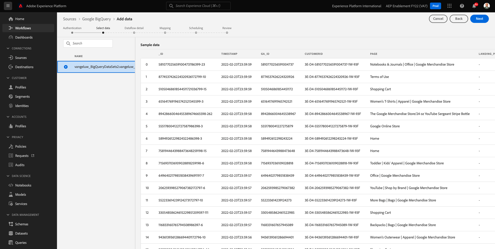
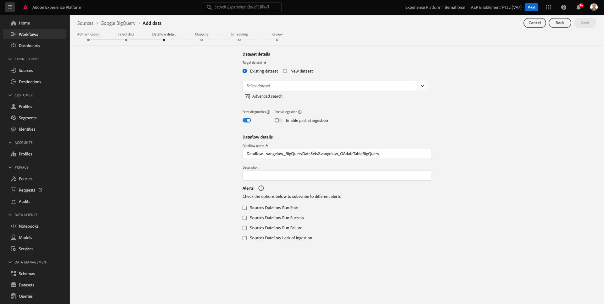
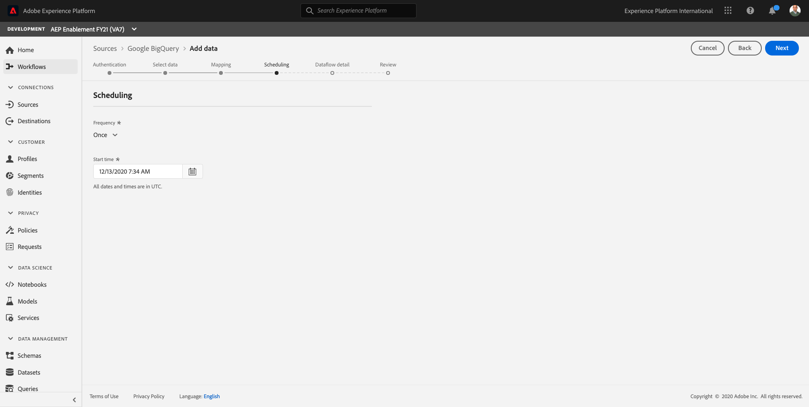
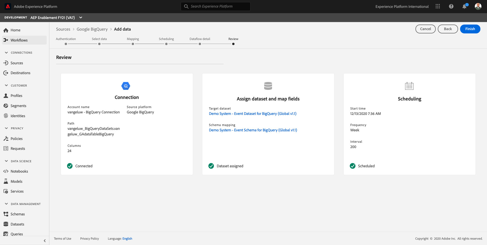

# 12.4 BigQuery からAdobe Experience Platformへのデータの読み込み

## 目標

- BigQuery データの XDM スキーマへのマッピング
- BigQuery データをAdobe Experience Platformに読み込む
- BigQuery ソースコネクタ UI の理解

## 事前準備

演習 12.3 の後、Adobe Experience Platformでこのページを開く必要があります。

**開いている場合は、演習 12.4.1 を続行します。**

**開いていない場合は、に移動します。 [Adobe Experience Platform](https://experience.adobe.com/platform/home).**

左のメニューで、「ソース」に移動します。 次に、 **ソース** homepage. 内 **ソース** メニュー、クリック **データベース**.

を選択します。 **Google BigQuery** ソースコネクタを開き、 **+設定**.

Google BigQuery アカウント選択画面が表示されます。

アカウントを選択し、 **次へ**.

次に、 **データを追加** 表示

## 12.4.1 BigQuery テーブルの選択

内 **データを追加** BigQuery データセットを表示して選択します。

これで、BigQuery でのデータデータのサンプルデータのGoogle Analyticsプレビューを確認できます。

「**次へ**」をクリックします。

## 12.4.2 XDM マッピング

次の内容が表示されます。

次に、新しいデータセットを作成するか、既存のデータセットを選択して、Google Analyticsデータを読み込む必要があります。 この演習では、データセットとスキーマが既に作成されています。 新しいスキーマやデータセットを作成する必要はありません。

選択 **既存のデータセット**. ドロップダウンメニューを開き、データセットを選択します。 次の名前のデータセットを検索します。 `Demo System - Event Dataset for BigQuery (Global v1.1)` をクリックし、選択します。 「**次へ**」をクリックします。

下にスクロールします。 次に、 **ソースフィールド** Google Analytics/BigQuery から XDM へ **ターゲットフィールド**、フィールドごと。

この演習では、次のマッピングテーブルを使用します。

| ソースフィールド | ターゲットフィールド |
| ----------------- |-------------| 
| **_id** | _id |
| **_id** | チャネル._id |
| timeStamp | timestamp |
| GA_ID | ``--aepTenantId--``.identification.core.gaid |
| customerID | ``--aepTenantId--``.identification.core.loyaltyId |
| ページ | web.webPageDetails.name |
| デバイス | device.type |
| ブラウザー | environment.browserDetails.vendor |
| MarketingChannel | marketing.trackingCode |
| TrafficSource | channel.typeAtSource |
| TrafficMedium | channel.mediaType |
| TransactionID | commerce.order.payments.transactionID |
| Ecommerce_Action_Type | eventType |
| Pageviews | web.webPageDetails.pageViews.value |
| Unique_Purchases | commerce.purchases.value |
| Product_Detail_Views | commerce.productViews.value |
| Adds_To_Cart | commerce.productListAdds.value |
| Product_Remove_From_Cart | commerce.productListRemovals.value |
| Product_Checkouts | commerce.checkouts.value |

上記のマッピングをコピーしてAdobe Experience Platform UI に貼り付けた後、入力ミスや先頭/末尾のスペースが原因でエラーが発生しないかどうかを確認してください。

これで、 **マッピング** このように

ソースフィールド **GA_ID** および **customerID** は、この XDM スキーマの識別子にマッピングされます。 これにより、Google Analyticsデータ（Web/アプリの動作データ）を Loyalty や Call Center-data などの他のデータセットと強化できます。

「**次へ**」をクリックします。

## 12.4.3 接続とデータ取得スケジュール

これで、 **スケジュール** タブ：

内 **スケジュール** 」タブを使用すると、この **マッピング** とデータ。

更新されないGoogle BigQuery でデモデータを使用しているので、この演習でスケジュールを設定する必要はありません。 何かを選択する必要があり、無駄なデータ取り込みプロセスが多くなりすぎないようにするには、次のように頻度を設定する必要があります。

- 頻度： **週**
- 間隔： **200**

**重要**:必ずをアクティベートしてください **バックフィル** スイッチ

最後に、 **デルタ** フィールドに入力します。

この **デルタ** フィールドを使用して、接続をスケジュールし、BigQuery データセットに入る新しい行のみをアップロードします。 デルタフィールドは、通常、常にタイムスタンプ列です。 したがって、将来のスケジュールされたデータ取り込みでは、新しい、より新しいタイムスタンプを持つ行のみが取り込まれます。

選択 **timeStamp** を差分フィールドとして使用します。

これです。

「**次へ**」をクリックします。

## 12.4.4 接続の確認と開始

内 **データセットフローの詳細** 表示 接続に名前を付ける必要があります。この名前は、後で接続を見つけるのに役立ちます。

次の命名規則を使用してください：

| フィールド | 命名 | 例 |
| ----------------- |-------------| -------------|
| データセットフロー名 | DataFlow - ldap - BigQuery Website Interaction | DataFlow - vangeluw - BigQuery Web サイトのインタラクション |
| 説明 | DataFlow - ldap - BigQuery Website Interaction | DataFlow - vangeluw - BigQuery Web サイトのインタラクション |

「**次へ**」をクリックします。

これで、接続の詳細な概要が表示されます。 続行する前に、すべてが正しいことを確認してください。その後、XDM マッピングなど、一部の設定を変更することはできなくなります。

「**完了**」をクリックします。

接続の設定には時間がかかる場合があるので、次のように表示されても心配しないでください。

接続が作成されると、次のように表示されます。

これで、次の演習を続行する準備が整いました。この演習では、Customer Journey Analyticsを使用して、Google Analyticsデータ上に強力なビジュアライゼーションを作成します。

次のステップ： [12.5Customer Journey Analyticsを使用したGoogle Analyticsデータの分析](./ex5.md)

[モジュール 12 に戻る](./customer-journey-analytics-bigquery-gcp.md)

[すべてのモジュールに戻る](./../../overview.md)
