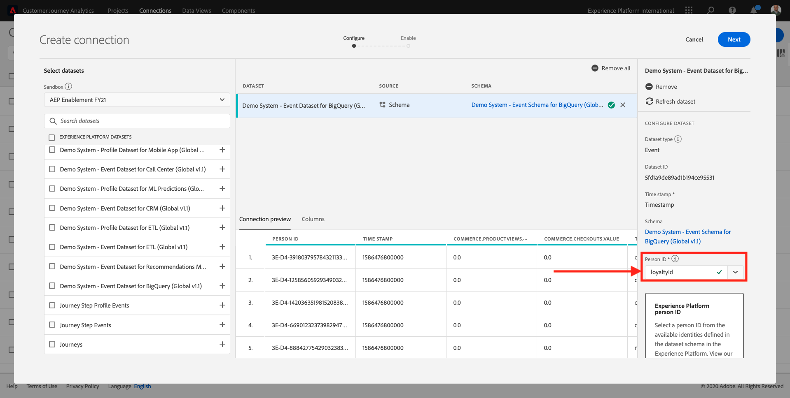
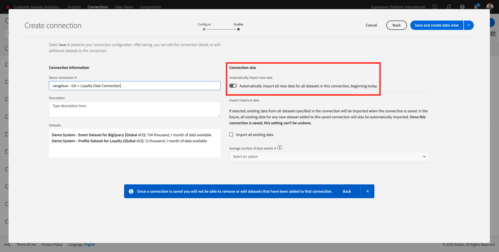
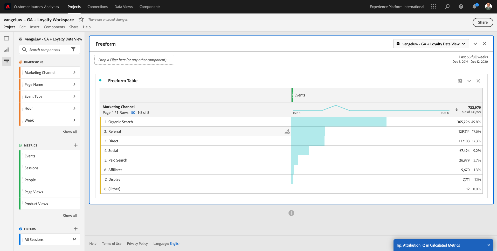
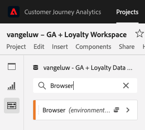
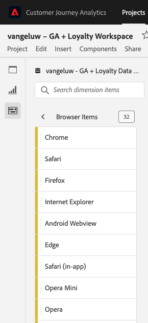
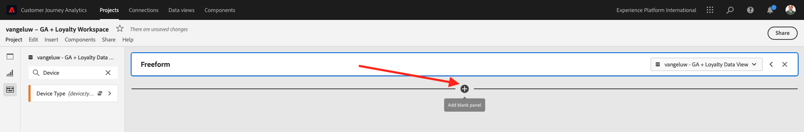

# 12.5Customer Journey Analyticsを使用したGoogle Analyticsデータの分析

## 目標

- アドビの BigQuery データセットをCustomer Journey Analytics(CJA) に接続
- ロイヤルティデータでGoogle Analyticsに接続して結合します。
- CJA UI の理解

## 12.5.1 接続の作成

に移動します。 [analytics.adobe.com](https://analytics.adobe.com) をクリックして、Customer Journey Analyticsにアクセスします。

Customer Journey Analyticsのホームページで、に移動します。 **接続**.

CJA と Platform の間でおこなわれた様々な接続を、以下に示します。 これらの接続の目標は、Adobe Analyticsのレポートスイートと同じです。 しかし、データの収集は全く異なります。 すべてのデータはAdobe Experience Platformデータセットから取得されます。

**新しい接続を作成**&#x200B;をクリックします。

次に、 **接続を作成** UI

まず、使用する正しいサンドボックスを選択する必要があります。 サンドボックスメニューで、サンドボックスを選択します。これは、 `--aepSandboxId--`. この例では、使用するサンドボックスはです。 **AEP 有効化 FY21**.

サンドボックスを選択すると、使用可能なデータセットが更新されます。

左側のメニューには、使用可能なすべてのAdobe Experience Platformデータセットが表示されます。 データセットを検索します。 `Demo System - Event Dataset for BigQuery (Global v1.1)`. クリック **+** をクリックして、この接続にデータセットを追加します。

追加すると、接続内にデータセットが表示されます。

次に、 **人物 ID**. 次の項目を確認してください： **loyaltyId** がユーザー ID として選択されます。

これで、Google AnalyticsWeb サイトインタラクションデータを別のAdobe Experience Platformデータセットとエンリッチメントできるようになります。

データセットを検索します。 `Demo System - Profile Dataset for Loyalty (Global v1.1)` データセットを作成し、この接続に追加します。

次の内容が表示されます。

両方のデータセットを結合するには、 **人物 ID** 同じタイプの ID を含む データセット `Demo System - Profile Dataset for Loyalty (Global v1.1)` は **loyaltyId** とユーザー ID（と同じタイプの ID を含む） `Demo System - Event Dataset for BigQuery (Global v1.1)`( **loyaltyId** を設定します。

「**次へ**」をクリックします。

次の内容が表示されます。

ここで、接続に名前を付ける必要があります。

次の命名規則を使用してください： `ldap - GA + Loyalty Data Connection`.

例：`vangeluw - GA + Loyalty Data Connection`

終了する前に、も有効化してください **今日から、この接続のすべてのデータセットに関するすべての新しいデータを自動的にインポートします。** 下の画像のように。

これにより、60 分ごとにAdobe Experience Platformから CJA へのデータフローが開始されますが、大量のデータがある場合は、最大 24 時間かかる場合があります。

また、履歴データをバックフィルする必要があるので、 **既存のすべてのデータをインポート** を選択し、 **100 万未満** under **毎日のイベントの平均数**.

を作成した後、 **接続** CJA でデータが使用可能になるまでに数時間かかる場合があります。

クリック **保存** 次の演習に進みます。

使用可能な接続のリストに接続が表示されます。

## 12.5.2 データビューの作成

接続が完了すると、ビジュアライゼーションに影響を与える操作を進めることができます。 Adobe Analyticsと CJA の違いは、CJA がビジュアライゼーションの前にデータを消去して準備するために、データビューが必要であるという点です。

データビューは、Adobe Analyticsの仮想レポートスイートの概念に似ています。仮想レポートスイートでは、コンテキストに応じた訪問の定義、フィルタリングおよびコンポーネントの呼び出し方法も定義します。

接続ごとに少なくとも 1 つのデータビューが必要です。 ただし、一部の使用例では、同じ接続に対して複数のデータビューを持つことが最適です。この場合、異なるチームに異なるインサイトを提供することを目的としています。

会社をデータ主導型にしたい場合は、各チームでのデータの表示方法を調整する必要があります。 以下にいくつかの例を示します。

- UX デザインチームの UX 指標のみ
- デジタル分析チームが 1 言語のみを話せるように、Google Analyticsの KPI と指標にはCustomer Journey Analyticsと同じ名前を使用します。
- 1 つの市場のみ、1 つのブランドのデータ、またはモバイルデバイスのみを表示するようにフィルターされたデータビュー。

の **接続** 画面で、作成した接続の前にあるチェックボックスをオンにします。

今すぐクリック **データビューを作成**.

リダイレクト先： **データビューを作成** ワークフロー。

これで、データビューの基本的な定義を設定できます。 タイムゾーン、セッションタイムアウト、データビューのフィルタリングなどがあります (Adobe Analyticsの仮想レポートスイートに似たセグメント化の部分 )。

この **接続** 前の練習で作成した内容は既に選択されています。 接続にという名前が付けられています `ldap - GA + Loyalty Data Connection`.

次に、次の命名規則に従って、データビューに名前を付けます。 `ldap - GA + Loyalty Data View`.

説明に同じ値を入力： `ldap - GA + Loyalty Data View`.

分析やビジュアライゼーションをおこなう前に、すべてのフィールド、ディメンション、指標およびそのアトリビューション設定を含むデータビューを作成する必要があります。

| フィールド | 命名規則 | 例 |
| ----------------- |-------------|-------------|  
| 名前接続 | ldap - GA + Loyalty Data View | vangeluw - GA + Loyalty データビュー |
| 説明 | ldap - GA + Loyalty Data View | vangeluw - GA + Loyalty データビュー |

クリック **保存して続行**.

これで、コンポーネントをデータビューに追加できます。 ご覧のように、一部の指標およびディメンションは自動的に追加されます。

データビューに次のコンポーネントを追加します。

| コンポーネント名 | コンポーネントの種類 | コンポーネントのパス |
| -----------------|-----------------|-----------------|
| レベル | ディメンション | _experienceplatform.loyaltyDetails.level |
| ポイント | 指標 | _experienceplatform.loyaltyDetails.points |
| commerce.checkouts.value | 指標 | commerce.checkouts.value |
| commerce.productListRemovals.value | 指標 | commerce.productListRemovals.value |
| commerce.productListAdds | 指標 | commerce.productListAdds |
| commerce.productViews.value | 指標 | commerce.productViews.value |
| commerce.purchases.value | 指標 | commerce.purchases.value |
| web.webPageDetails.pageViews | 指標 | web.webPageDetails.pageViews |
| トランザクション ID | ディメンション | commerce.order.payments.transactionID |
| channel.mediaType | ディメンション | channel.mediaType |
| channel.typeAtSource | ディメンション | channel.typeAtSource |
| トラッキングコード | ディメンション | marketing.trackingCode |
| ガイド | ディメンション | _experienceplatform.identification.core.gaid |
| web.webPageDetails.name | ディメンション | web.webPageDetails.name |
| イベントタイプ | ディメンション | eventType |
| ベンダー | ディメンション | environment.browserDetails.vendor |
| 識別子 | ディメンション | _id |
| タイムスタンプ | ディメンション | timestamp |
| タイプ | ディメンション | device.type |
| loyaltyId | ディメンション | _experienceplatform.identification.core.loyaltyId |

その後、次の情報が表示されます。

次に、上記の指標およびディメンションのわかりやすい名前を変更して、分析の構築時に簡単に使用できるようにする必要があります。 それには、指標またはディメンションを選択し、 **名前** フィールドの値を指定します。

| コンポーネントの元の名前 | 表示名 |
| -----------------|-----------------|
| レベル | ロイヤルティレベル |
| ポイント | ロイヤルティポイント |
| commerce.checkouts.value | チェックアウト |
| commerce.productListRemovals.value | 買い物かごからの削除 |
| commerce.productListAdds | 買い物かごへの追加 |
| commerce.productViews.value | 製品表示 |
| commerce.purchases.value | 購入 |
| web.webPageDetails.pageViews | ページビュー数 |
| channel.mediaType | トラフィックメディア |
| channel.typeAtSource | Traffic Source |
| トラッキングコード | マーケティングチャネル |
| ガイド | Google AnalyticsID |
| 名前 | ページタイトル |
| ベンダー | ブラウザー |
| タイプ | Device Type |
| loyaltyId | ロイヤルティ ID |

その後、次のような情報が表示されます。

次に、一部のコンポーネントについて、 **属性設定**.

を変更してください **属性設定** 以下のコンポーネントの場合：

| コンポーネント |
| -----------------|
| トラフィックソース |
| マーケティングチャネル |
| ブラウザー |
| トラフィックメディア |
| デバイスタイプ |
| Google AnalyticsID |
| ロイヤルティ ID |
| ロイヤルティレベル |
| ロイヤルティポイント |

それには、コンポーネントを選択し、 **カスタムアトリビューションモデルを使用** そして、 **モデル** から **ラストタッチ**、および **有効期限** から **担当者（レポートウィンドウ）**. 上記のすべてのコンポーネントに対して、この手順を繰り返します。

上記のすべてのコンポーネントのアトリビューション設定を変更した後は、次のビューが必要です。

これで、データビューが設定されました。 「**保存**」をクリックします。

これで、Adobe Analytics Analysis Workspace内でGoogle Analyticsデータを分析する準備が整いました。 次の演習に進みましょう。

## 12.5.3 プロジェクトの作成

Customer Journey Analyticsで、に移動します。 **プロジェクト**.

次の内容が表示されます。

「 **新規プロジェクトを作成**.

空のプロジェクトが作成されました：

まず、プロジェクトを保存し、名前を付けます。 次のコマンドを使用して保存できます。

| OS | ショートカット |
| ----------------- |-------------| 
| Windows | Ctrl + S |
| Mac | Command + S |

次のポップアップが表示されます。

次の命名規則を使用してください：

| 名前 | 説明 |
| ----------------- |-------------| 
| ldap - GA + Loyalty Workspace | ldap - GA + Loyalty Workspace |

次に、「 **プロジェクトを保存**.

次に、画面の右上隅で正しいデータビューを選択するようにします。 これは、前の練習で作成したデータビューで、命名規則を使用しています `ldap - GA + Loyalty Data View`. この例では、選択するデータビューはです。 `ldap - GA + Loyalty Data View`.

### 12.5.3.1 フリーフォームテーブル

フリーフォームテーブルは、多かれ少なかれ、Excel 内のピボットテーブルとして機能します。 左側のバーから何かを選択し、フリーフォームにドラッグ&amp;ドロップすると、テーブルレポートが表示されます。

フリーフォームテーブルは、ほぼ無限です。 何でも（ほとんど）できます。これにより、Google Analyticsと比べて非常に大きな価値が得られます（このツールにはいくつかの分析制限があるので）。 これは、Google Analyticsデータを別の分析ツールに読み込む理由の 1 つです。

SQL、BigQuery を使用する必要がある 2 つの例と、Google AnalyticsUI またはGoogle Data Studio 内では実行できない簡単な質問に答えるための時間を見てみましょう。

- マーケティングチャネル別に分割された Safari ブラウザーからチェックアウトに到達する人は何人ですか？ チェックアウト指標が Safari ブラウザーでフィルタリングされていることを確認してください。 変数 Browser = Safari をチェックアウト列の上にドラッグ&amp;ドロップしました。

- アナリストは、ソーシャルマーケティングチャネルのコンバージョンが低いことを確認できます。 デフォルトでラストタッチ属性を使用していますが、ファーストタッチについてはどうなりますか。 指標の上にマウスポインターを置くと、指標の設定が表示されます。 必要なアトリビューションモデルを選択できます。 スタンドアロンアクティビティとして GA（Data Studio ではなく）でアトリビューションを実行できますが、同じテーブル内でアトリビューション分析に関連しない他の指標やディメンションを持つことはできません。

CJA でのAnalysis Workspaceを使用して、この質問やその他の質問に答えてみましょう。

まず、適切な日付範囲 (**最近の 53 週間**) をクリックします。

次に、 **適用** 」をクリックして日付範囲を適用します。 次の演習では、この手順を忘れないでください。

>[!NOTE]
>
>作成したばかりの **データ接続** および **データビュー** 2 ～ 3 時間待つ必要がある場合があります。 CJA は、大量のデータレコードがある場合に、履歴データをバックフィルするのに少し時間が必要です。

一部のディメンションと指標をドラッグ&amp;ドロップしてマーケティングチャネルを分析しましょう。 最初にディメンションを使用 **マーケティングチャネル** をクリックし、「 **フリーフォームテーブル**. ( クリック： **すべて表示** 指標がすぐに指標メニューに表示されない場合に備えて )

次の内容が表示されます。

次に、フリーフォームテーブルに指標を追加する必要があります。 次の指標を追加する必要があります。 **人**, **セッション**, **製品表示**, **チェックアウト**, **購入**, **コンバージョン率** （計算指標）。

その前に、計算指標を作成する必要があります **コンバージョン率**. それには、 **+** 指標の横のアイコン：

計算指標の名前として、 **コンバージョン率**. 次に、指標 **購入** および **セッション** をキャンバスに貼り付けます。 設定 **形式** から **割合** および **小数点以下の桁数** から **2**. 最後に、「 **保存**.

次に、 **フリーフォームテーブル**&#x200B;をクリックし、1 つずつ、 **フリーフォームテーブル**. 次の例を参照してください。

最終的には、次のようなテーブルが作成されます。

前述のように、 **フリーフォームテーブル** 深い潜水分析を行うのに必要な自由を与えてください。 例えば、他の任意のDimensionを選択して、テーブル内の特定の指標を分類できます。

例えば、ディメンションに移動して検索し、 **ブラウザー** 変数を使用します。

次に、このDimensionで使用可能な値の概要が表示されます。

Dimension **Safari** をクリックし、指標の上にドラッグ&amp;ドロップします。例： **チェックアウト**. 次の内容が表示されます。

これを行うと、次のような潜在的な質問に答えただけです。Safari を使用し、マーケティングチャネルで分割してチェックアウトページに到達した人は何人ですか？

次に、属性に関する質問に答えましょう。

次を検索： **購入** 指標を含める必要があります。

指標および **設定** アイコンが表示されます。 クリックします。

コンテキストメニューが表示されます。 チェックボックスをオンにします。 **デフォルト以外のアトリビューションモデル**.

ポップアップには、アトリビューションモデルやルックバックウィンドウ（SQL で達成するには非常に複雑）を簡単に変更できます。

選択 **ファーストタッチ** をアトリビューションモデルとして使用する。

選択 **人物** ルックバックウィンドウ用。

今すぐクリック **適用**.

これで、その指標のアトリビューションモデルがファーストタッチになったことを確認できます。

変数、セグメント、ディメンションまたは日付範囲のタイプに制限を設けずに、必要な分類をいくつでもおこなうことができます。

さらに特別な点は、Adobe Experience Platformのデータセットを結合して、Google Analyticsのデジタル行動データを強化する機能です。 例えば、オフライン、コールセンター、ロイヤリティ、CRM データなどです。

この機能を紹介するために、オフラインデータとオンラインデータを組み合わせた最初の分類を設定しましょう。 寸法を選択 **ロイヤルティレベル** を任意の **マーケティングチャネル**&#x200B;例： **オーガニック検索**:

次に、どちらを分析しましょう **デバイスタイプ** は、 **オーガニック検索** と **ロイヤルティレベル** は **ブロンズ**. Dimension **デバイスタイプ** をドラッグ&amp;ドロップします。 **ブロンズ**. 次の内容が表示されます。

最初の分類では、「ロイヤルティレベル」が使用されています。 このディメンションは、BigQuery コネクタに使用したものとは異なるデータセットと異なるスキーマから取得されます。 ユーザー ID **loyaltyID** ( デモシステム — BigQuery (Global v1.1) のイベントスキーマ ) および **loyaltyID** ( デモシステム — ロイヤルティ（グローバル v1.1）のプロファイルスキーマ ) が互いに一致している。 そのため、エクスペリエンスイベントをGoogle Analyticsのプロファイルデータとロイヤルティスキーマのプロファイルデータを組み合わせることができます。

行をセグメントまたは特定の日付範囲で分割し続ける（特定の TV キャンペーンを反映する）ことで、Customer Journey Analyticsに質問し、外出先で回答を得ることができます。

SQL とサードパーティのビジュアライゼーションツールで同じ結果を達成することは、非常に困難です。 特に、質問をし、答えを即座に得ようとする場合には特に便利です。 Customer Journey Analyticsにはこのような課題がなく、データアナリストはデータを柔軟かつリアルタイムでクエリできます。

## 12.5.3.2 ファネル分析またはフォールアウト分析

ファネルは、カスタマージャーニーの主なステップを理解するための優れたメカニズムです。 これらの手順は、（例えば、コールセンターからの）オフラインインタラクションからも引き起こすことができ、同じファネルでのデジタルタッチポイントと組み合わせることができます。

Customer Journey Analyticsを使えば、その他多くのことが可能です。 モジュール 13 を覚えているなら、右クリックして次のような操作を行うことができます。

- フォールアウトステップの後にユーザーがどこに移動しているかを分析
- ファネルの任意のポイントからセグメントを作成する
- 折れ線グラフビジュアライゼーションの任意の段階でのトレンドの表示

次の操作もおこなえます。今月の顧客ジャーニーファネルと前月の顧客情報はどのように比較されますか。 モバイルとデスクトップの違いは？

次に、2 つのパネルを作成します。

- ファネル分析（1 月）
- ファネル分析（2 月）

異なる期間（1 月と 2 月）にわたるファネルを、デバイスタイプ別に分割して比較していることがわかります。

このタイプの分析は、Google AnalyticsUI 内では不可能か、非常に限られています。 したがって、CJA は再び、Google Analyticsが取得したデータに多くの価値を加えます。

最初のフォールアウトビジュアライゼーションを作成するには： 新しいパネルから開始するには、現在のパネルを閉じてください。

パネルの右側を見て矢印をクリックし、パネルを閉じます。

次に、「 **+** をクリックして、新しいパネルを作成します。

次に、 **フォールアウト** ビジュアライゼーション。

アナリストとして、次のように、メインの e コマースファネルで何がおこなわれているかを把握したい場合を考えてみましょう。「ホーム」>「内部検索」>「製品の詳細」>「チェックアウト」>「購入」

まず、ファネルに新しい手順を追加します。 それには、 **ページ名** ディメンション。

訪問された使用可能なすべてのページが表示されます。

ドラッグ&amp;ドロップ **ホーム** を最初のステップに追加します。

2 つ目の手順として、 **検索結果を保存**

次に、いくつかの e コマースアクションを追加する必要があります。 Dimensionで、Dimension **イベントタイプ** ディメンション。 をクリックして、ディメンションを開きます。

選択 **Product_Detail_Views** をクリックし、次の手順にドラッグ&amp;ドロップします。

選択 **Product_Checkouts** をクリックし、次の手順にドラッグ&amp;ドロップします。

フォールアウトビジュアライゼーションのサイズを変更します。

これで、フォールアウトビジュアライゼーションの準備が整いました。

インサイトの分析とドキュメント化を開始するには、次の操作を行うのに適しています。 **テキスト** ビジュアライゼーション。 を追加するには、以下を実行します。 **テキスト** ビジュアライゼーション、 **グラフ** アイコンをクリックし、使用可能なすべてのビジュアライゼーションを表示します。 次に、 **テキスト** ビジュアライゼーションをキャンバス上に配置します。 下の画像のように表示されるように、サイズを変更して移動します。

また、ダッシュボードに合わせてサイズを変更します。

フォールアウトビジュアライゼーションでは、分類も可能です。 以下を使用： **デバイスタイプ** ディメンションを開き、値の一部を 1 つずつビジュアライゼーションにドラッグ&amp;ドロップします。

最終的には、より高度なビジュアライゼーションが使用されます。

Customer Journey Analyticsを使えば、その他多くのことが可能です。 フォールアウト内の任意の場所を右クリックすると、次の操作を実行できます。

- ユーザーがフォールアウトステップからどこに移動しているかを分析
- ファネルの任意のポイントからセグメントを作成する
- 折れ線グラフのビジュアライゼーションでの任意のステップのトレンドの表示
- 視覚的にファネルを様々な期間と比較します。

例えば、フォールアウトの任意のステップで右クリックして、これらの分析オプションの一部を表示します。

## 12.5.3.3 フロー分析およびビジュアライゼーション

Google Analyticsを使用して高度なフロー分析を行う場合は、SQL を使用してデータを抽出し、ビジュアライゼーションパーツにサードパーティのソリューションを使用する必要があります。 Customer Journey Analyticsがそれを手伝う。

この手順では、次の質問に答えるためのフロー分析を設定します。特定のランディングページの前の主な貢献チャネル  2 回のドラッグ&amp;ドロップと 1 回のクリックで、アナリストは、マーケティングチャネルの最後の 2 回のタッチで、ランディングページに向かうユーザーの流れを見つけることができます。

その他の質問Customer Journey Analyticsは、次の回答に役立ちます。

- 特定のランディングページの前のチャネルの主な組み合わせは何ですか？
- Product_Checkout に到達したユーザーは、なぜセッションを終了するのですか。 前の手順はどこですか？

空白のパネルを再度開いて、これらの質問に回答しましょう。 現在のパネルを閉じて、 **+**.

次に、 **フロー** ビジュアライゼーション。

次に、マルチパスマーケティングチャネルのフロー分析を設定します。 次をドラッグ&amp;ドロップ： **マーケティングチャネル** 次元を **入口Dimension** 領域

これで、最初のエントリパスが表示されるようになりました。

最初のパスをクリックして、そのパスをドリルダウンします。

これで、次のパス（マーケティングチャネル）が表示されます。

3 つ目のドリルダウンを行います。 新しいパス内の最初のオプションをクリックします。 **参照元**.

次のようなビジュアライゼーションが表示されます。

事を複雑にしよう。 2 つのマーケティングパスの後にあったランディングページを分析する場合を考えてみましょう。 これをおこなうには、セカンダリディメンションを使用して最後のパスを変更します。 次を検索： **ページ名** 次のようにディメンションをドラッグ&amp;ドロップします。

次の内容が表示されます。

別の流れ分析をしましょう。 今回は、特定の出口点の後に何が起きたかを分析します。 その他の Analytics ソリューションでは、SQL/ETL を使用するほか、同じことを実現するためにサードパーティのビジュアライゼーションツールを使用する必要があります。

新しい **フロービジュアライゼーション** をパネルに追加します。

その後、次の情報が表示されます。

検索Dimension **イベントタイプ** をクリックし、次の場所にドラッグ&amp;ドロップします。 **出口ディメンション** 領域

次に、どちらが **イベントタイプ** — パスにより顧客は出口に向かいました。

チェックアウトアクションからの出口の前に何が起きたかを調べましょう。 をクリックします。 **Product_Checkouts** パス：

新しいアクションパスは、洞察力のない一部のデータと共に表示されます。

さらに分析しましょう！ Dimension **ページ名** をクリックし、新しく生成されたパスにドラッグ&amp;ドロップします。

これで、数分で高度なフロー分析が完了しました。 様々なパスをクリックして、出口から前の手順への接続を確認できます。

ファネルを分析し、デジタルだけでなくオフラインのタッチポイントをまたいで顧客の行動のパスを調べるための強力なキットが追加されました。

忘れずに変更を保存してください。

## 12.5.4 プロジェクトの共有

>[!IMPORTANT]
>
>以下のコンテンツは FYI として意図されています — あなたが実行します **NOT** プロジェクトを他の誰かと共有する必要があります。

FYI — このプロジェクトを同僚と共有して、共同作業をしたり、ビジネスの質問を分析したりできます。

次のステップ： [概要とメリット](./summary.md)

[モジュール 12 に戻る](./customer-journey-analytics-bigquery-gcp.md)

[すべてのモジュールに戻る](./../../overview.md)
