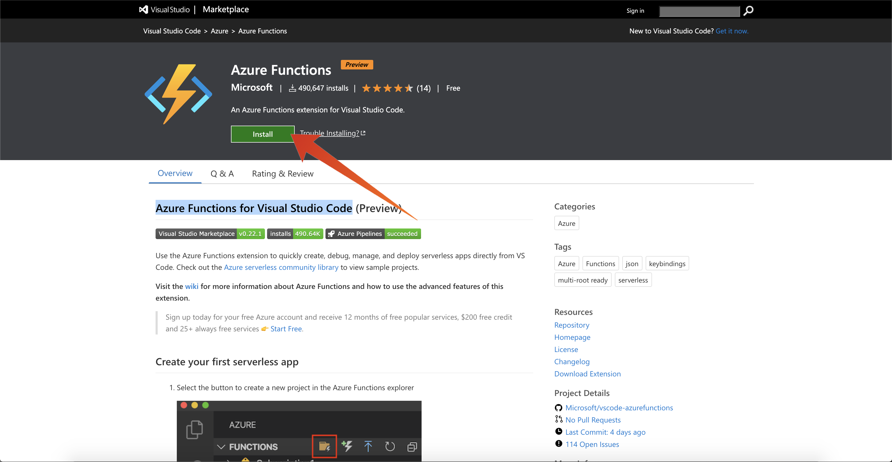

# 13.0 環境の設定

## 13.0.1 Azure サブスクリプションの作成

>[!NOTE]
>
>既に Azure サブスクリプションをお持ちの場合は、この手順をスキップできます。 その場合は、演習 13.0.2 を続行してください。

に移動します。 [https://portal.azure.com](https://portal.azure.com) Azure アカウントでログインします。 お持ちでない場合は、個人のメールアドレスを使用して Azure アカウントを作成してください。


ログインに成功すると、次の画面が表示されます。


左側のメニューをクリックし、を選択します。 **すべてのリソース**&#x200B;購読していない場合は、Azure サブスクリプション画面が表示されます。 その場合は、 **Azure 無料体験版から始める**.


Azure サブスクリプションフォームに入力し、有効化する携帯電話とクレジットカードを入力します（30 日間無料利用枠があり、アップグレードしない限り料金は発生しません）。


購読プロセスが完了したら、次の手順に従います。


## 13.0.2 Visual Code Studio のインストール

Microsoft Visual Code Studio を使用して Azure プロジェクトを管理します。 を使用してダウンロードできます。 [このリンク](https://code.visualstudio.com/download). 同じ Web サイト上の特定の OS のインストール手順に従います。

## 13.0.3 ビジュアルコード拡張機能のインストール

Visual Studio Code 用の Azure Functions のインストール先 [https://marketplace.visualstudio.com/items?itemName=ms-azuretools.vscode-azurefunctions](https://marketplace.visualstudio.com/items?itemName=ms-azuretools.vscode-azurefunctions). 「インストール」ボタンをクリックします。



Visual Studio Code 用の Azure アカウントとサインインを次の場所からインストールします。 [https://marketplace.visualstudio.com/items?itemName=ms-vscode.azure-account](https://marketplace.visualstudio.com/items?itemName=ms-vscode.azure-account). 「インストール」ボタンをクリックします。


## 13.0.4 node.js のインストール

>[!NOTE]
>
>node.js が既にインストールされている場合は、この手順をスキップできます。 その場合は、演習 13.0.5 を続行してください。

### macOS

必ず [Homebrew](https://brew.sh/) が最初にインストールされました。 手順に従います。 [ここ](https://brew.sh/).


Homebrew をインストールしたら、次のコマンドを実行します。

```javascript
brew install node
```

### Windows

をダウンロードします。 [Windows インストーラ](https://nodejs.org/en/#home-downloadhead) 直接 [nodejs.org](https://nodejs.org/ja/) web サイト。

## 13.0.5 node.js バージョンの検証

このモジュールでは、node.js バージョン 12 をインストールする必要があります。 その他のバージョンの node.js の場合、演習 13.5 で問題が発生する可能性があります。

続行する前に、今すぐ node.js のバージョンを確認してください。

次のコマンドを実行して、node.js のバージョンを確認します。

```javascript
node -v
```

バージョンが 12 を下回っているか、それを超えている場合は、アップグレードまたはダウングレードする必要があります。

### macOSの node.js バージョンのアップグレード/ダウングレード

パッケージがあることを確認します。 **n** インストール済み

パッケージをインストールするには **n**、次のコマンドを実行します。

```javascript
sudo npm install -g n
```

バージョンがバージョン 12 より前の場合は、次のコマンドを実行してアップグレードまたはダウングレードします。

```javascript
sudo n 12.6.0
```

### Windows での node.js バージョンのアップグレード/ダウングレード

Windows/Campaign コントロールパネル/プログラムの追加と削除から node.js をアンインストールします。

から必要なバージョンをインストールする [nodejs.org](https://nodejs.org/en/) web サイト。

## 13.0.6 NPM パッケージをインストールします。リクエスト

パッケージをインストールする必要があります **リクエスト** を node.js 設定の一部として使用します。

パッケージをインストールするには **リクエスト**、次のコマンドを実行します。

```javascript
npm install request
```


次のステップ： [13.1 Microsoft Azure EventHub 環境の設定](./ex1.md)

[モジュール 13 に戻る](./segment-activation-microsoft-azure-eventhub.md)

[すべてのモジュールに戻る](./../../overview.md)
