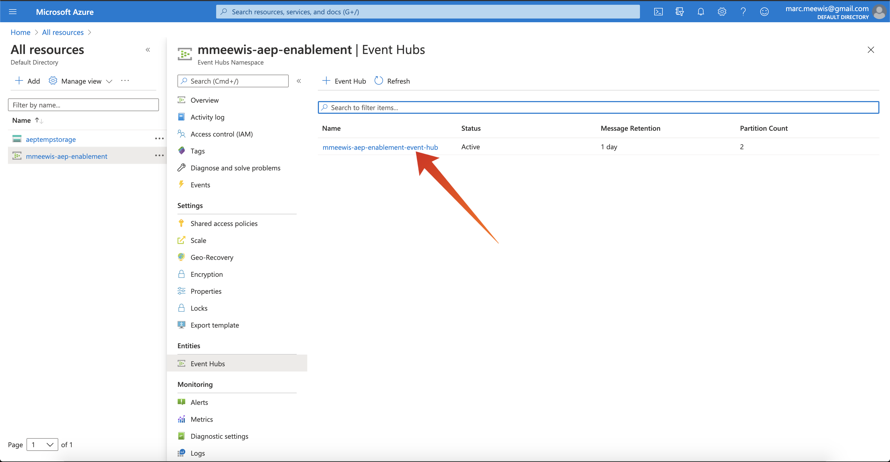

# 13.2 Adobe Experience Platformでの Azure イベントハブの宛先の設定

## 13.2.1 必要な Azure 接続パラメーターの特定

Adobe Experience Platformでイベントハブの宛先を定義するには、以下が必要です。

- Event Hubs 名前空間
- イベントハブ
- Azure SAS キー名
- Azure SAS キー

Event Hub と EventHub の名前空間は、前の演習で定義しました。 [演習 1 - Azure でのイベントハブのセットアップ](./ex1.md)

### イベントハブの名前空間

Azure Portal で上記の情報を参照するには、に移動します。 [https://portal.azure.com/#home](https://portal.azure.com/#home). 正しい Azure アカウントを使用していることを確認してください。

選択 **すべてのリソース** Azure ポータル内：

### イベントハブ

リソースタイプを持つリソースを検索 **イベントハブの名前空間**&#x200B;前の練習で使用した命名規則に従うと、Event Hubs 名前空間が `--demoProfileLdap---aep-enablement`. 次の演習では、メモしておく必要があります。

Event Hubs の名前空間名をクリックして詳細を確認します。

選択 **イベントハブ** Event Hubs 名前空間で定義されたイベントハブのリストを取得するには、前の練習で使用した命名規則に従うと、Event Hub に次の名前を付けます。 `--demoProfileLdap---aep-enablement-event-hub`. 次の演習では、メモしておく必要があります。

### SAS キー名

選択 **共有アクセスポリシー** の **イベントハブの名前空間**

共有アクセスポリシーのリストが表示されます。 お探しの SAS キーは次のとおりです。 **RootManageSharedAccessKey**. SAS キー名です。 書き留めて。

### SAS キー値

をクリックします。 **RootManageSharedAccessKey** をクリックして、SAS キー値を取得します。 次に、 **クリップボードにコピー** アイコンをクリックしてコピー **プライマリキー**:

### 宛先の値の概要

この時点で、Adobe Experience Platform Real-time CDP で Azure Event Hub の宛先を定義するために必要なすべての値を特定しておく必要があります。

| 宛先属性名 | 宛先属性値 | 値の例 |
|---|---|---|
| sasKeyName | SAS キー名 | RootManageSharedAccessKey |
| sasKey | SAS キー値 | srREx9ShJG1Rv7f/... |
| namespace | イベントハブの名前空間 | `--demoProfileLdap---aep-enablement` |
| eventHubName | イベントハブ | `--demoProfileLdap---aep-enablement-event-hub` |

## 13.2.2 Adobe Experience Platformでの Azure イベントハブの宛先の作成

次の URL に移動して、Adobe Experience Platformにログインします。 [https://experience.adobe.com/platform](https://experience.adobe.com/platform).

ログイン後、Adobe Experience Platformのホームページに移動します。

続行する前に、 **サンドボックス**. 選択するサンドボックスの名前はです ``--aepSandboxId--``. これを行うには、 **[!UICONTROL 実稼動版]** 画面の上の青い線で表示されます。 適切なサンドボックスを選択すると、画面が変更され、専用のサンドボックスに移動します。

に移動します。 **宛先**&#x200B;を選択し、 **カタログ**.

選択 **クラウドストレージ** そして、 **Azure イベントハブ** をクリックし、 **設定** または **設定**:

前の演習で収集した宛先値を入力します。 次に、「 **宛先に接続**.

資格情報が正しい場合は、次の確認メッセージが表示されます。 **接続済み**.

次に、名前と説明をの形式で入力する必要があります `--demoProfileLdap---aep-enablement`. 次を入力します。 **eventHubName** （前の演習を参照）次のようになります。 `--demoProfileLdap---aep-enablement-event-hub`) をクリックし、 **次へ**.

クリック **保存して終了**.

これで宛先が作成され、Adobe Experience Platformで使用できるようになりました。

次のステップ： [13.3 セグメントの作成](./ex3.md)

[モジュール 13 に戻る](./segment-activation-microsoft-azure-eventhub.md)

[すべてのモジュールに戻る](./../../overview.md)
