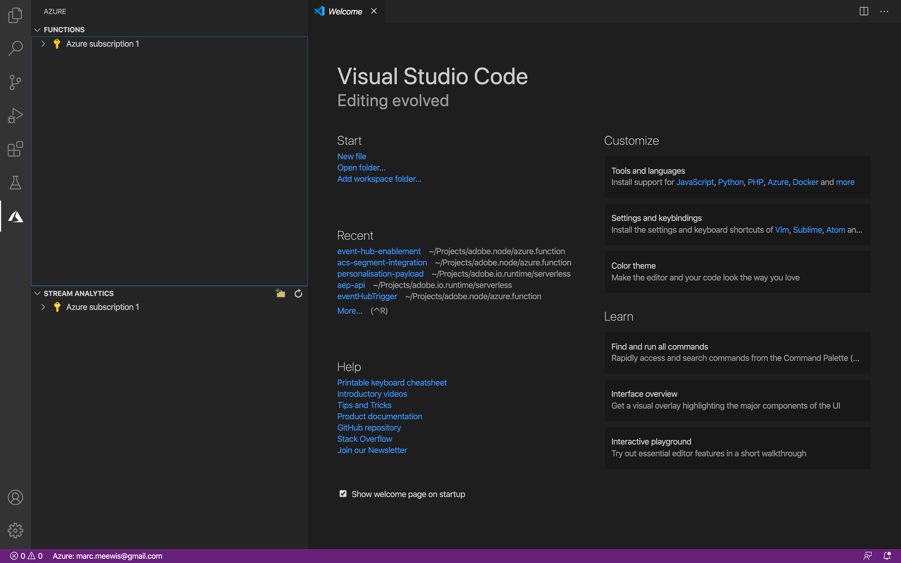

# 13.5 Microsoft Azure プロジェクトの作成

## 13.5.1 Azure Event Hub 関数の理解

Azure 関数を使用すると、小さなコード ( **関数**) アプリケーションインフラストラクチャを気にする必要はありません。 Azure 機能を使用すると、クラウドインフラストラクチャは、アプリケーションを大規模に実行し続けるために必要な最新のサーバをすべて提供します。

関数は **トリガー** 特定のタイプのイベントに基づいて サポートされるトリガーには、データの変更への応答、メッセージ（Event Hubs など）への応答、スケジュールに従った実行、HTTP リクエストの結果などがあります。

Azure Functions は、インフラストラクチャを明示的にプロビジョニングまたは管理する必要なく、イベントトリガーコードを実行できる、サーバーレスのコンピューティングサービスです。

Azure Event Hubs は、サーバレスアーキテクチャ用の Azure Functions と統合されています。

## 13.5.2 Visual Studio コードを開き、Azure にログオンする

Visual Studio Code を使用すると、簡単に…

- Azure 機能を定義し、イベントハブにバインドする
- ローカルでテスト
- Azure にデプロイ
- リモートログ機能の実行

### Visual Studio コードを開く

Visual Studio コードを開くには、次のように入力します。 **視覚** オペレーティングシステムの検索（OSX での Spotlight 検索、Windows のタスクバーでの検索）。 見つからない場合は、 [演習 0 — 前提条件](./ex0.md).


### Azure にログオン

登録に使用した Azure アカウントでログオンするとき [演習 0 — 前提条件](./ex0.md)Visual Studio Code を使用すると、すべての Event Hub リソースを検索してバインドできます。

次をクリック： **Azure** Visual Studio Code のアイコン このオプションがない場合は、必要な拡張機能のインストールで問題が発生している可能性があります。

次の選択 **Azure にサインイン**:


ログインするには、ブラウザーにリダイレクトされます。 登録に使用した Azure アカウントを必ず選択してください。


ブラウザーに次の画面が表示された場合、Visual Code Studio を使用してログインします。


Visual Code Studio に戻ります (Azure サブスクリプションの名前が表示されます。例： **Azure サブスクリプション 1**):



## 13.5.3 Azure プロジェクトの作成

上にマウスポインターを置くと **Azure サブスクリプション 1**&#x200B;を選択すると、セクションの上にメニューが表示されます。 **新規プロジェクトを作成…**:


任意のローカルフォルダーを選択してプロジェクトを保存し、「 」をクリックします。 **選択**:


プロジェクト作成ウィザードに入ります。 選択 **JavaScript** をプロジェクトの言語として使用します。


選択 **Azure イベントハブトリガー** をプロジェクトの最初の関数テンプレートとして使用します。


関数の名前を入力します。次の形式を使用します `--demoProfileLdap---aep-event-hub-trigger` を押し、Enter キーを押します。


選択 **新しいローカルアプリ設定を作成**:


イベントハブの名前空間を選択すると、定義したイベントハブが **演習 2**. この例では、Event Hub 名前空間は **vangeluw-aep-enablement**:


イベントハブを選択すると、定義したイベントハブが **演習 2**. 私の場合は **vangeluw-aep-enablement-event-hub**:


選択 **RootManageSharedAccessKey** を Event Hub ポリシーとして設定する場合：


入力して使用 **デフォルト ($D)**:


選択 **ワークスペースに追加** プロジェクトを開く方法：


プロジェクトを作成したら、 **index.js** ファイルをエディターで開くには、次の手順を実行します。


Adobe Experience Platformがイベントハブに送信するペイロードには、セグメント ID が含まれます。

```json
[{
"segmentMembership": {
"ups": {
"ca114007-4122-4ef6-a730-4d98e56dce45": {
"lastQualificationTime": "2020-08-31T10:59:43Z",
"status": "realized"
},
"be2df7e3-a6e3-4eb4-ab12-943a4be90837": {
"lastQualificationTime": "2020-08-31T10:59:56Z",
"status": "realized"
},
"39f0feef-a8f2-48c6-8ebe-3293bc49aaef": {
"lastQualificationTime": "2020-08-31T10:59:56Z",
"status": "realized"
}
}
},
"identityMap": {
"ecid": [{
"id": "08130494355355215032117568021714632048"
}]
}
}]
```

Visual Studio Code の index.js 内のコードを以下のコードに置き換えます。 このコードは、リアルタイム CDP がセグメント認定を Event Hub の宛先に送信するたびに実行されます。 この例では、コードは受け取ったペイロードを表示し、強化することに過ぎません。 しかし、リアルタイムでセグメント認定を処理するあらゆる機能を想像できます。

```javascript
// Marc Meewis - Solution Consultant Adobe - 2020
// Adobe Experience Platform Enablement - Module 13

// Main function
// -------------
// This azure function is fired for each segment activated to the Adobe Exeperience Platform Real-time CDP Azure 
// Eventhub destination
// This function enriched the received segment payload with the name fo the segment. 
// You can replace this function with any logic that is require to process and deliver
// Adobe Experience Platform segments in real-time to any application or platform that 
// would need to act upon an AEP segment qualiification.
// 

module.exports = async function (context, eventHubMessages) {

    return new Promise (function (resolve, reject) {

        context.log('Message : ' + JSON.stringify(eventHubMessages, null, 2));

        resolve();

    });    

};
```

結果は次のようになります。


## 13.5.4 Azure プロジェクトの実行

これでプロジェクトを実行する時間です。 この段階では、プロジェクトを Azure にデプロイしません。 デバッグモードでローカルで実行します。 実行アイコンを選択し、緑の矢印をクリックします。


デバッグモードでプロジェクトを初めて実行する場合は、Azure ストレージアカウントを接続する必要があります。次に、 **ストレージアカウントを選択**.


ストレージアカウントのリストから、の一部として作成したアカウントを選択します。 [13.1.4 Azure ストレージアカウントのセットアップ](./ex1.md). ストレージアカウントの名前はです `--demoProfileLdap--aepstorage`例： **mmewisaepstorage**.


これで、プロジェクトが起動し、実行中で、イベントハブのイベントのリストが表示されます。 次の演習では、これらのセグメントの対象として認定される Luma デモ Web サイトでの動作を示します。 その結果、Event Hub ペイロード関数の端末にセグメント認定トリガーを受け取ります。


## 13.5.5 Azure プロジェクトの停止

プロジェクトを停止するには、 **ターミナル** タブをクリックし、ターミナルウィンドウでをクリックして、 **CMD-C** OSX または **CTRL-C** Windows の場合：


次のステップ： [13.6 エンドツーエンドのシナリオ](./ex6.md)

[モジュール 13 に戻る](./segment-activation-microsoft-azure-eventhub.md)

[すべてのモジュールに戻る](./../../overview.md)
