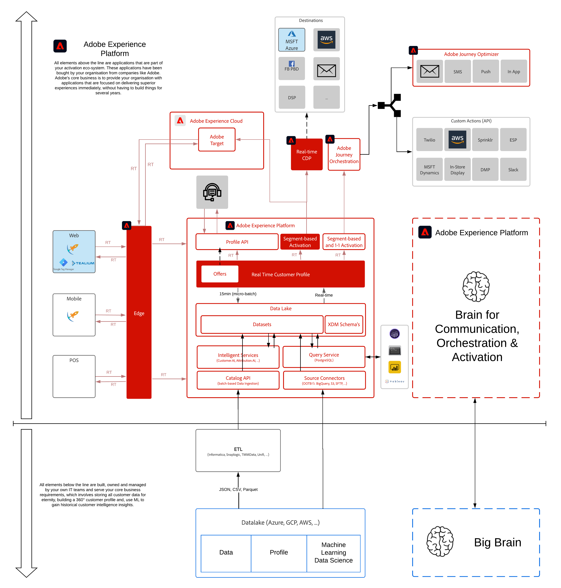

# 13.Real-Time CDP:Microsoft Azure Event Hub に対するセグメントのアクティベーション

**作成者： [マルク・メウィス](https://www.linkedin.com/in/marcmeewis/), [ウーターヴァンゲルウ](https://www.linkedin.com/in/woutervangeluwe/)**

このモジュールでは、Adobe Experience Platform Real-time CDP のリアルタイムの宛先としてMicrosoft Azure EventHub の宛先を設定します。 また、Adobe Experience Platformが Azure EventHub の宛先にセグメントペイロードを配信するたびにリアルタイムでトリガーされる Azure 関数を設定し、デプロイします。 トリガーに使用する Azure 機能は、Adobe Experience Platform Real-time CDP のアクティベーション機能のメカニズムを示します。

また、このモジュールの一部として、リアルタイム CDP がトリガーに対して、指定した宛先にペイロードを実際に配信する方法についても理解できます。 また、セグメント認定のステータスと、それとアクティベーションとの関連についても説明します。

Adobe Experience Platform Real-time CDP は、ストリーミングクラウドストレージの宛先へのデータのアクティベーションをサポートし、オーディエンスのデータとイベントを JSON 形式でこれらの宛先にリアルタイムで書き出すことができます。 その後、宛先でこれらのイベントに加えて、ビジネスロジックを説明できます

Microsoft Azure Event Hubs は、シンプルで信頼性が高く拡張性の高い、完全に管理されたリアルタイムデータ取り込みサービスです。 任意のソースから何百万ものイベントを 1 秒あたりにストリーミングして、動的なデータパイプラインを構築し、ビジネス上の課題に即座に対応します。

## 学習内容

- Microsoft Azure Event Hubs の概要
- Microsoft Azure Event Hub への RTCDP の宛先の設定
- リアルタイム CDP がアクティブ化されるタイミングと、アクティベーションペイロードがどのように表示されるかを理解します。
- Visual Studio コードをセットアップして、Azure プロジェクトを開発、テスト、デプロイします
- RTCDP によってリアルタイムで配信されるセグメント認定を使用する Azure 関数を作成し、デプロイする

## 前提条件

- アクセス先 [Adobe Experience Platform](https://experience.adobe.com/platform)
- AEP デモ Web サイト環境に関する知識
- Adobe Experience Platform

>[!IMPORTANT]
>
>このチュートリアルは、特定のワークショップ形式を容易にするために作成されました。 アクセスできない特定のシステムおよびアカウントを使用します。 アクセスがなくても、この非常に詳細な内容を読むことで、多くを学ぶことができると思います。 ワークショップの参加者で、アクセス資格情報が必要な場合は、Adobe担当者に連絡し、必要な情報を伝えてもらってください。

## アーキテクチャの概要

以下のアーキテクチャを見てみましょう。このモジュールで説明および使用するコンポーネントが強調表示されます。

## 使用するサンドボックス

このモジュールでは、次のサンドボックスを使用してください。 `--module18sandbox--`.

>[!NOTE]
>
>忘れずに、で参照されているように、Chrome 拡張機能をインストール、設定および使用してください。 [0.1 -Experience Leagueドキュメント用の Chrome 拡張機能のインストール](../module0/ex1.md)

## 演習

[13.0 環境の設定](./ex0.md)

この演習では、Microsoft Azure 環境をセットアップします。

[13.1 Microsoft Azure EventHub 環境の設定](./ex1.md)

この演習では、Microsoft Azure EventHub 環境をセットアップします。

[13.2 Adobe Experience Platformでの Azure イベントハブの宛先の設定](./ex2.md)

この演習では、前の演習で設定した EventHub にセグメントをリアルタイムで配信するリアルタイム CDP の宛先接続を設定します。

[13.3 セグメントの作成](./ex3.md)

この演習では、Adobe Experience Platformでストリーミングセグメントを作成します

[13.4 セグメントのアクティブ化](./ex4.md)

この演習では、リアルタイム CDP EventHub の宛先へのストリーミングセグメントをアクティブ化します。

[13.5 Microsoft Azure プロジェクトの作成](./ex5.md)

この演習では、Adobe Experience Platform が対応する Azure Event Hub の宛先へのセグメント認定をアクティブ化したときに、リアルタイムでトリガーされる Azure 関数を作成します。

[13.6 エンドツーエンドのシナリオ](./ex6.md)

この時点で、すべてが設定されています。 AEP デモ Web サイトを参照して、Microsoft Azure EventHubトリガー機能に配信されるセグメント認定を取得できるようになりました。

[概要とメリット](./summary.md)

このモジュールの概要とメリットの概要。

>[!NOTE]
>
>Adobe Experience Platformについて知っておくべきすべてのことを学ぶために時間を費やしてくれてありがとう。 ご質問がある場合は、今後のコンテンツに関する提案がある一般的なフィードバックを共有したい場合は、Wouter Van Geluwe に直接お問い合わせください。 **vangeluw@adobe.com**.

[すべてのモジュールに戻る](../../overview.md)
