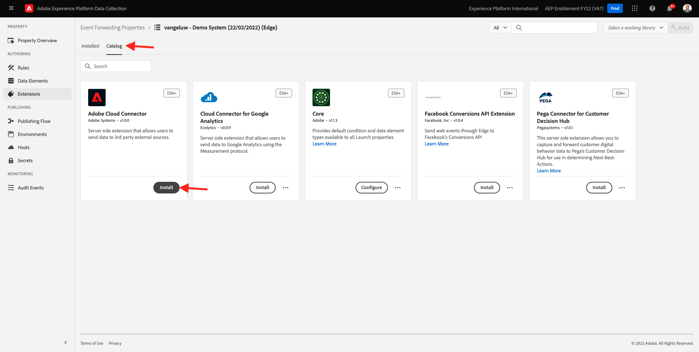
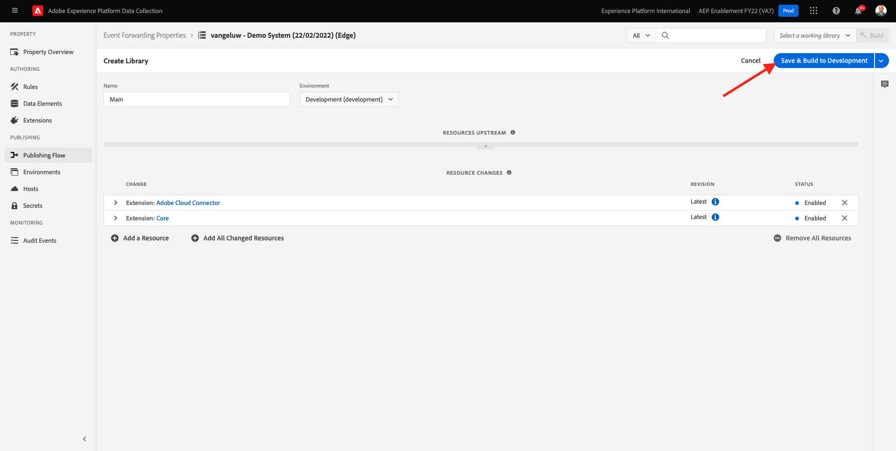

# 14.1 Adobe Experience Platform Data Collection Event Forwarding プロパティの作成

>[!NOTE]
>
>Adobe Experience Platform Edge モバイル拡張機能は、現在ベータ版です。 この拡張機能の使用は招待によるものです。 詳細については、担当のAdobeカスタマーサクセスマネージャーにお問い合わせください。また、このチュートリアルの資料にもアクセスできます。

## 14.1.1 Adobe Experience Platform Data Collection Event Forwarding プロパティとは何ですか。

通常、Adobe Experience Platformのデータ収集を使用してデータを収集する場合、 **クライアント側**. この **クライアント側** は、Web サイトやモバイルアプリケーションなどの環境です。 モジュール 0 とモジュール 1 では、Adobe Experience Platform Data Collection Client プロパティの設定について詳しく説明し、顧客が Web サイトやモバイルアプリケーションを操作する際にデータを収集できるように、Web サイトやモバイルアプリケーションにAdobe Experience Platform Data Collection Client プロパティを実装しました。

そのインタラクションデータがAdobe Experience Platform Data Collection Client プロパティで収集されると、Web サイトまたはモバイルアプリによってAdobeの Edge にリクエストが送信されます。 Edge は、Adobeのデータ収集環境で、クリックストリームデータをAdobeエコシステムに送り込むためのエントリポイントです。 その後、Edge から収集されたデータが、Adobe Experience Platform、Adobe Analytics、Adobe Audience Manager、Adobe Targetなどのアプリケーションに送信されます。

Adobe Experience Platformデータ収集イベント転送プロパティが追加され、Edge 上の受信データをリッスンするAdobe Experience Platformデータ収集プロパティを設定できるようになりました。 Edge 上で実行されているAdobe Experience Platform Data Collection Event Forwarding プロパティで受信データが確認されると、そのデータを使用して別の場所に転送できます。 また、他の場所には、Adobe以外の外部 Webhook を使用することもできます。これにより、そのデータを、例えば、選択したデータレイク、判定アプリケーション、Webhook を開く機能を持つその他のアプリケーションに送信できます。

Adobe Experience Platform Data Collection Event Forwarding プロパティの設定は、Client プロパティに馴染みのあるもので、Adobe Experience Platform Data Collection Client プロパティと同様に、以前のようにデータ要素やルールを設定できます。 ただし、使用事例によって、データへのアクセス方法と使用方法が若干異なります。

まず、Adobe Experience Platform Data Collection Event Forwarding プロパティを作成します。

## 14.1.2 Adobe Experience Platform Data Collection Event Forwarding プロパティの作成

に移動します。 [https://experience.adobe.com/#/data-collection/](https://experience.adobe.com/#/data-collection/). 左側のメニューで、 **イベント転送**. その後、使用可能なすべてのAdobe Experience Platformデータ収集イベント転送プロパティの概要が表示されます。 次をクリック： **新しいプロパティ** 」ボタンをクリックします。

次に、Adobe Experience Platformデータ収集イベント転送プロパティの名前を入力する必要があります。 命名規則として、 `--demoProfileLdap-- - Demo System (DD/MM/YYYY) (Edge)`. 例えば、この例では、名前はです。 **vangeluw — デモシステム (22/02/2022) (Edge)**. 「**保存**」をクリックします。

その後、Adobe Experience Platformデータ収集イベント転送プロパティのリストに戻ります。 作成したプロパティをクリックして開きます。

## 14.1.2 Cloud ConnectorAdobe機能の設定

左側のメニューで、に移動します。 **拡張機能**. これで、 **コア** 拡張機能は既に設定されています。

に移動します。 **カタログ**. 次の項目が表示されます。 **Adobeクラウドコネクタ** 拡張子。 「**インストール**」をクリックして、インストールします。

その後、拡張機能が追加されます。 この手順では、実行する設定はありません。 インストールされた拡張機能の概要に戻ります。

## 14.1.3 Adobe Experience Platformデータ収集イベント転送プロパティのデプロイ

左側のメニューで、に移動します。 **公開フロー**. クリック **ライブラリを追加**.

名前を入力 **メイン**、環境を選択します。 **開発（開発）** をクリックし、 **+変更されたすべてのリソースを追加**.

これが見えます 「**保存して開発用にビルド**」をクリックします。

その後、ライブラリが構築されます。これには 1 ～ 2 分かかる場合があります。

最後に、ライブラリが構築され、準備が整います。

次のステップ： [14.2 データストリームを更新して、データ収集イベント転送プロパティでデータを使用できるようにします。](./ex2.md)

[モジュール 14 に戻る](./aep-data-collection-ssf.md)

[すべてのモジュールに戻る](./../../overview.md)
