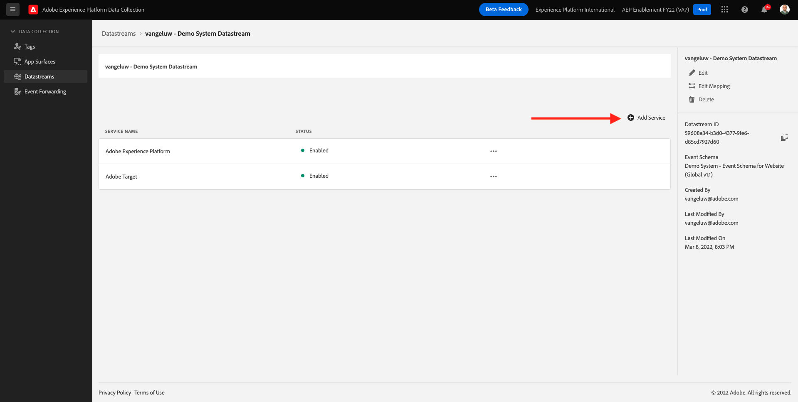

# 14.2 データストリームを更新して、Adobe Experience Platform Data Collection Server プロパティでデータを利用できるようにします

## 14.2.1 データストリームの更新

In [演習 0.2](./../../modules/module0/ex2.md)独自に作成した **[!UICONTROL Datastream]**. その後、名前を使用しました `--demoProfileLdap-- - Demo System Datastream`.

この演習では、を設定する必要があります **[!UICONTROL Datastream]** お客様の **[!DNL Data Collection Server property]**.

それには、に移動します。 [https://experience.adobe.com/#/data-collection/](https://experience.adobe.com/#/data-collection/). これが見えます 左側のメニューで、 **[!UICONTROL データストリーム]**.

画面の右上隅で、サンドボックス名を選択します。この名前は、 `--aepSandboxId--`.

を検索します。 **[!UICONTROL Datastream]**（という名前） `--demoProfileLdap-- - Demo System Datastream`. クリック **[!UICONTROL Datastream]** をクリックして開きます。

これが見えます クリック **[!UICONTROL +サービスを追加]**.

サービスを選択 **イベント転送**. これにより、追加の設定が 2 つ表示されます。 前の演習で作成し、という名前を付けたイベント転送プロパティを選択します。 `--demoProfileLdap-- - Demo System (DD/MM/YYYY) (Edge)`. 次に、 **開発** under **環境**. 「**保存**」をクリックします。

これで、データストリームが更新され、使用できる状態になりました。

これで、データストリームを **[!DNL Event Forwarding property]**.

次のステップ： [14.3 カスタム Webhook の作成と設定](./ex3.md)

[モジュール 14 に戻る](./aep-data-collection-ssf.md)

[すべてのモジュールに戻る](./../../overview.md)
