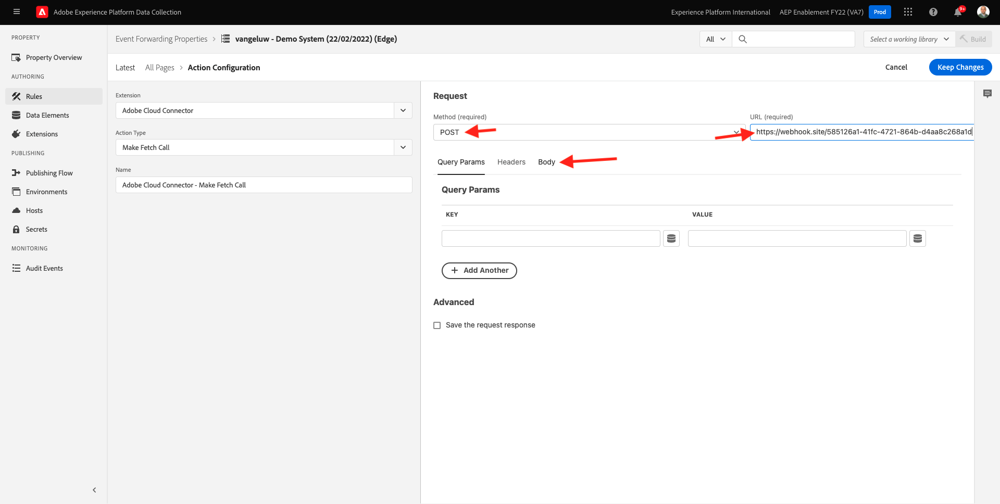
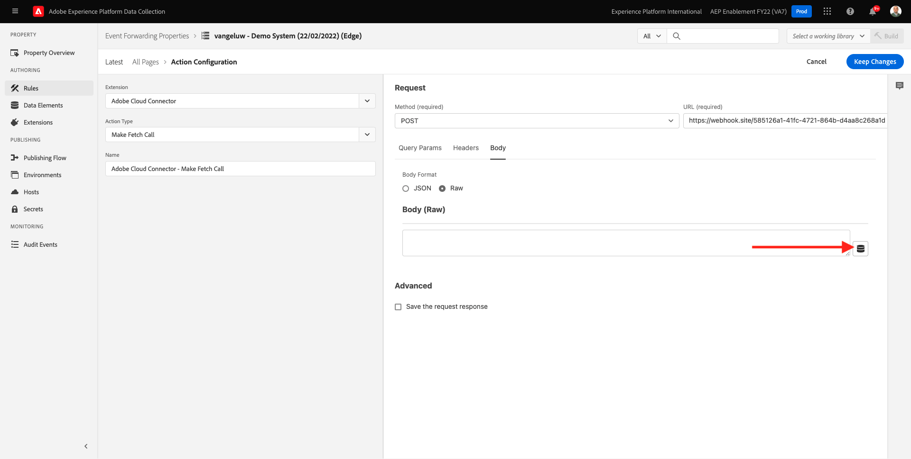

# 14.3 カスタム Webhook の作成と設定

## 14.3.1 カスタム Webhook の作成

に移動します。 [https://webhook.site/](https://webhook.site/). 次のように表示されます。

固有の URL が表示されます。次のようになります。 `https://webhook.site/585126a1-41fc-4721-864b-d4aa8c268a1d`.

この Web サイトがこの Webhook を作成しました。この Webhook を **[!DNL Event Forwarding property]** をクリックして、イベントの転送のテストを開始します。

## 14.3.2 イベント転送プロパティの更新：データ要素の作成

に移動します。 [https://experience.adobe.com/#/data-collection/](https://experience.adobe.com/#/data-collection/) そして、 **イベント転送**. イベント転送プロパティを検索し、クリックして開きます。

左側のメニューで、に移動します。 **データ要素**. 「**新規データ要素を作成**」をクリックします。

次に、設定する新しいデータ要素が表示されます。

次の項目を選択します。

- を **名前**&#x200B;を入力して、 **XDM イベント**.
- を **拡張**&#x200B;を選択します。 **コア**.
- を **データ要素タイプ**&#x200B;を選択します。 **パス**.
- を **パス**&#x200B;を入力して、 **arc.event.xdm**. このパスを入力すると、 **XDM** セクションを追加します。

これをお持ちです。 「**保存**」をクリックします。

>[!NOTE]
>
>上記のパスでは、 **arc**. **arc** は、Adobeリソースコンテキストの略で、 **arc** は、常に、Server Side コンテキストで使用可能な、最も高い可用性を持つオブジェクトを表します。 それに富や変化を加えてもいい **arc** オブジェクトを作成する必要があります。Adobe Experience Platform Data Collection Server の関数を使用します。
>
>上記のパスでは、 **イベント**. **イベント** は一意のイベントを表し、Adobe Experience Platform Data Collection Server は常にすべてのイベントを個別に評価します。 場合によっては、 **イベント** Web SDK Client Side から送信されるペイロードの中で、Adobe Experience Platform Data Collection Server では、すべてのイベントが個別に評価されます。

## 14.3.3 Adobe Experience Platform Data Collection Server プロパティの更新：ルールの作成

左側のメニューで、に移動します。 **ルール**. 「**新規ルールを作成**」をクリックします。

次に、設定する新しいルールが表示されます。 次を入力します。 **名前**: **すべてのページ**. この演習では、条件を設定する必要はありません。 代わりに、アクションを設定します。 次をクリック： **+追加** 下のボタン **アクション**.

これが見えます 次の項目を選択します。

- を選択します。 **拡張**: **Adobeクラウドコネクタ**.
- を選択します。 **アクションタイプ**: **取得呼び出しを実行**.

それならこうなる **名前**: **Adobeクラウドコネクタ — 取得呼び出しをおこなう**. 次が表示されます。

次に、以下を設定します。

- リクエストメソッドをGETからに変更 **POST**
- 前の手順の 1 つで作成したカスタム Webhook の URL を [https://webhook.site/](https://webhook.site/) web サイトは次のようになります。 `https://webhook.site/585126a1-41fc-4721-864b-d4aa8c268a1d`

これを使用します。 次へ、に移動します。 **本文**.

これが見えます 以下に示すように、データ要素アイコンをクリックします。

ポップアップで、データ要素を選択します。 **XDM イベント** 前の手順で作成した 「**選択**」をクリックします。

これが見えます 「**変更を保存**」をクリックします。

これが見えます 「**保存**」をクリックします。

これで、イベント転送プロパティの最初のルールが設定されました。 に移動します。 **公開フロー** 変更を公開します。
開発ライブラリを開く **メイン** クリックして **編集** 示されているように

次をクリック： **変更されたリソースをすべて追加** 」ボタンをクリックします。このボタンをクリックすると、ルールとデータ要素がこのライブラリに表示されます。 次に、「 **開発用に保存およびビルド**. 変更はデプロイ中です。

数分後に、デプロイメントが完了し、テストの準備が整ったことがわかります。

## 14.3.4 設定のテスト

に移動します。 [https://builder.adobedemo.com/projects](https://builder.adobedemo.com/projects). Adobe IDでログインすると、次の内容が表示されます。 Web サイトプロジェクトをクリックして開きます。

これで、以下のフローに従って Web サイトにアクセスできます。 クリック **統合**.

の **統合** このページでは、演習 0.1 で作成したデータ収集プロパティを選択する必要があります。

次に、デモ Web サイトが開いているのがわかります。 URL を選択して、クリップボードにコピーします。

新しい匿名ブラウザーウィンドウを開きます。

前の手順でコピーしたデモ Web サイトの URL を貼り付けます。 その後、Adobe IDを使用してログインするように求められます。

アカウントのタイプを選択し、ログインプロセスを完了します。

Web サイトが匿名ブラウザーウィンドウに読み込まれます。 デモ Web サイトの URL を読み込むには、新しい匿名ブラウザーウィンドウを使用する必要があります。

ブラウザーの開発者ビューを開くと、次に示すようにネットワークリクエストを調査できます。 フィルターを使用する場合 **相互作用**&#x200B;を使用すると、Adobe Experience Platform Data Collection Client からAdobe Edgeに送信されたネットワークリクエストが表示されます。

生のペイロードを選択した場合は、に移動します。 [https://jsonformatter.org/json-pretty-print](https://jsonformatter.org/json-pretty-print) ペイロードを貼り付けます。 クリック **プリティにする**. 次に、JSON ペイロード、 **イベント** オブジェクトと **xdm** オブジェクト。 前の手順の 1 つで、データ要素を定義した場合、参照を使用していました。 **arc.event.xdm**&#x200B;を返します。これは、 **xdm** オブジェクトを選択します。

Web サイトにビューを切り替えます [https://webhook.site/](https://webhook.site/) 前の手順の 1 つで使用した これで、このビューと似たビューが作成され、ネットワークリクエストが左側のメニューに表示されます。 次の項目が表示されます： **xdm** 上記のネットワークリクエストから除外されたペイロード。

ペイロードで少し下にスクロールして、ページ名を見つけます ( この場合は **バンゲルー —OCUC** （デモ Web サイトのプロジェクト名）

Web サイト内を移動すると、このカスタム Webhook でリアルタイムに追加のネットワークリクエストが使用できるようになります。

外部のカスタム Webhook への Web SDK/XDM ペイロードのサーバー側転送を設定しました。 次の演習では、同様の方法を設定し、同じデータをGoogleおよびAWS環境に送信します。

次のステップ： [14.4 Googleクラウド機能の作成と設定](./ex4.md)

[モジュール 14 に戻る](./aep-data-collection-ssf.md)

[すべてのモジュールに戻る](./../../overview.md)
