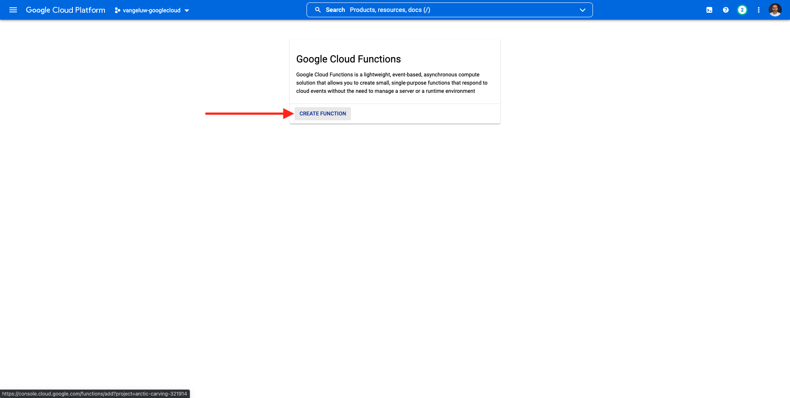
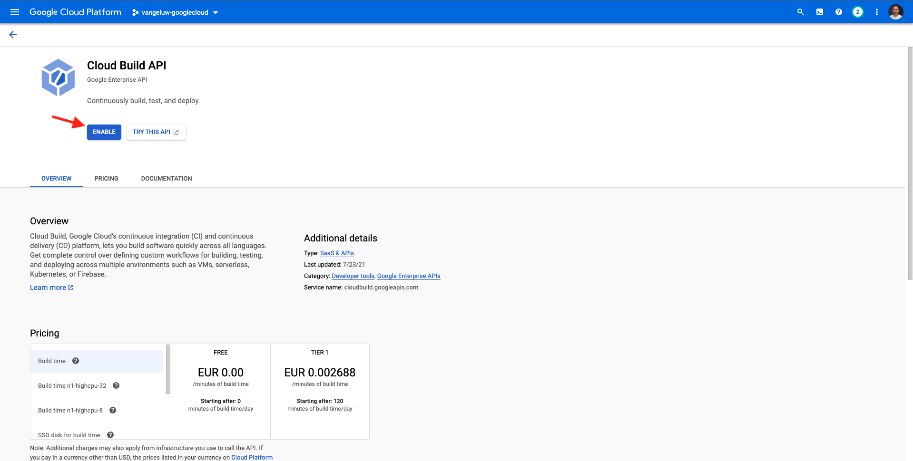
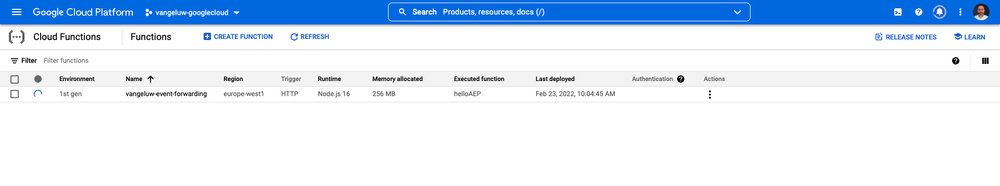
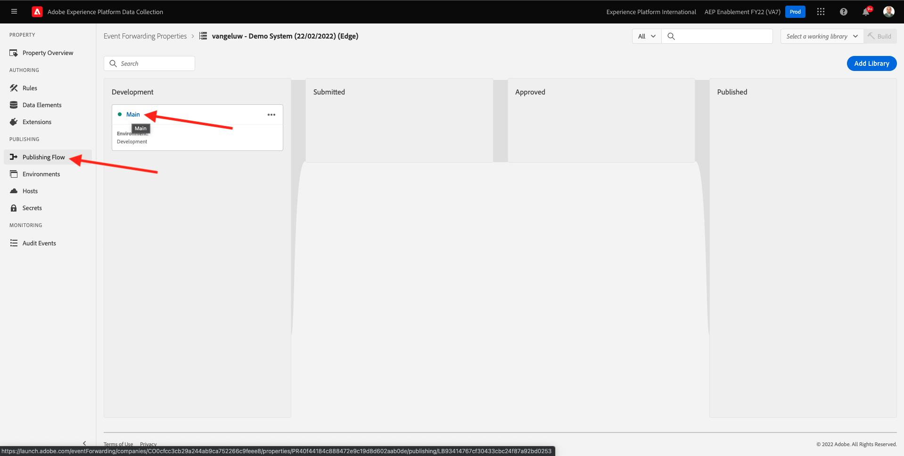
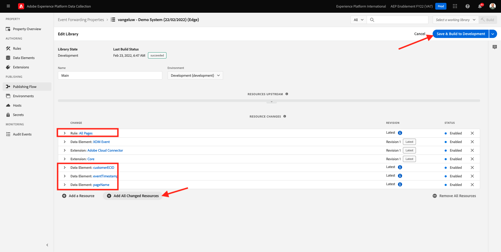
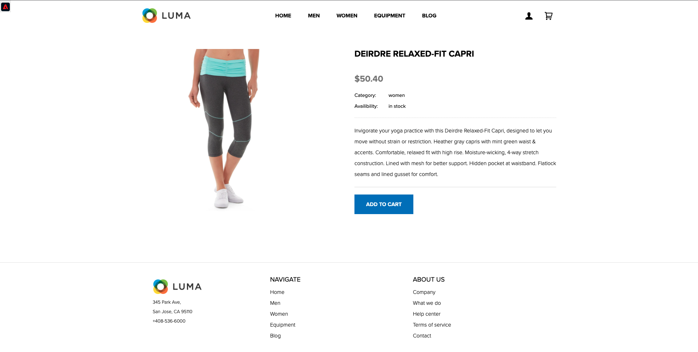

# 14.4 Googleクラウド機能の作成と設定

## 14.4.1 Googleクラウド機能の作成

に移動します。 [https://console.cloud.google.com/](https://console.cloud.google.com/). に移動します。 **クラウド機能**.


これが見えます クリック **関数を作成**.



これが見えます


次の選択を行います。

- **関数名**: `--demoProfileLdap---event-forwarding`
- **地域**:任意の地域を選択
- **トリガータイプ**:選択 **HTTP**
- **認証**:選択 **未認証の呼び出しを許可**

これを使用します。 「**保存**」をクリックします。


クリック **次へ**.


次の内容が表示されます。


次の選択を行います。

- **ランタイム**:選択 **Node.js 16** （またはより新しい）
- **入口**:入力 **helloAEP**

クリック **API を有効にする** 有効にする **クラウドビルド API**. 新しいウィンドウが開きます。 新しいウィンドウで、 **有効にする** 再び


これが見えます クリック **有効にする**.



1 回 **クラウドビルド API** が有効になっている場合は、次の情報が表示されます。


に戻ります。 **クラウド機能**.
Cloud Function Inline Editor で、次のコードが存在することを確認します。

```javascript
/**
 * Responds to any HTTP request.
 *
 * @param {!express:Request} req HTTP request context.
 * @param {!express:Response} res HTTP response context.
 */
exports.helloAEP = (req, res) => {
  let message = req.query.message || req.body.message || 'Hello World!';
  res.status(200).send(message);
};
```

次に、「 **デプロイ**.


これが見えます これで、クラウド関数が作成されます。 これには数分かかる場合があります。



関数を作成して実行すると、次のように表示されます。 関数の名前をクリックして開きます。


これが見えます に移動します。 **トリガー**. 次に、 **トリガーURL** これは、Launch Server Side でエンドポイントを定義する際に使用するものです。


次のようなトリガーURL をコピーします。 **https://europe-west1-dazzling-pillar-273812.cloudfunctions.net/vangeluw-event-forwarding**.

次の手順では、Adobe Experience Platform Data Collection Server を設定して、 **ページビュー数** をGoogle Cloud 関数に追加します。 完全なペイロードをそのまま転送するのではなく、次のようなもののみを送信します。 **ECID**, **timestamp** および **ページ名** をGoogle Cloud 関数に追加します。

上記の変数を除外するために解析する必要があるペイロードの例を次に示します。

```json
{
  "events": [
    {
      "xdm": {
        "eventType": "web.webpagedetails.pageViews",
        "web": {
          "webPageDetails": {
            "URL": "https://builder.adobedemo.com/run/vangeluw-OCUC",
            "name": "vangeluw-OCUC",
            "viewName": "vangeluw-OCUC",
            "pageViews": {
              "value": 1
            }
          },
          "webReferrer": {
            "URL": "https://builder.adobedemo.com/run/vangeluw-OCUC/equipment"
          }
        },
        "device": {
          "screenHeight": 1080,
          "screenWidth": 1920,
          "screenOrientation": "landscape"
        },
        "environment": {
          "type": "browser",
          "browserDetails": {
            "viewportWidth": 1920,
            "viewportHeight": 451
          }
        },
        "placeContext": {
          "localTime": "2022-02-23T06:51:07.140+01:00",
          "localTimezoneOffset": -60
        },
        "timestamp": "2022-02-23T05:51:07.140Z",
        "implementationDetails": {
          "name": "https://ns.adobe.com/experience/alloy/reactor",
          "version": "2.8.0+2.9.0",
          "environment": "browser"
        },
        "_experienceplatform": {
          "identification": {
            "core": {
              "ecid": "08346969856929444850590365495949561249"
            }
          },
          "demoEnvironment": {
            "brandName": "vangeluw-OCUC"
          },
          "interactionDetails": {
            "core": {
              "channel": "web"
            }
          }
        }
      },
      "query": {
        "personalization": {
          "schemas": [
            "https://ns.adobe.com/personalization/html-content-item",
            "https://ns.adobe.com/personalization/json-content-item",
            "https://ns.adobe.com/personalization/redirect-item",
            "https://ns.adobe.com/personalization/dom-action"
          ],
          "decisionScopes": [
            "eyJ4ZG06YWN0aXZpdHlJZCI6Inhjb3JlOm9mZmVyLWFjdGl2aXR5OjE0YzA1MjM4MmUxYjY1MDUiLCJ4ZG06cGxhY2VtZW50SWQiOiJ4Y29yZTpvZmZlci1wbGFjZW1lbnQ6MTRiZjA5ZGM0MTkwZWJiYSJ9",
            "__view__"
          ]
        }
      }
    }
  ],
  "query": {
    "identity": {
      "fetch": [
        "ECID"
      ]
    }
  },
  "meta": {
    "state": {
      "domain": "adobedemo.com",
      "cookiesEnabled": true,
      "entries": [
        {
          "key": "kndctr_907075E95BF479EC0A495C73_AdobeOrg_identity",
          "value": "CiYwODM0Njk2OTg1NjkyOTQ0NDg1MDU5MDM2NTQ5NTk0OTU2MTI0OVIPCPn66KfyLxgBKgRJUkwx8AH5-uin8i8="
        },
        {
          "key": "kndctr_907075E95BF479EC0A495C73_AdobeOrg_consent_check",
          "value": "1"
        },
        {
          "key": "kndctr_907075E95BF479EC0A495C73_AdobeOrg_consent",
          "value": "general=in"
        }
      ]
    }
  }
}
```

次に、解析する必要のある情報が含まれるフィールドを示します。

- ECID: **events.xdm._experienceplatform.identification.core.ecid**
- timestamp: **timestamp**
- ページ名： **events.xdm.web.webPageDetails.name**

次に、Adobe Experience Platformデータ収集サーバーに移動して、それを可能にするようにデータ要素を設定します。

## 14.4.2 イベント転送プロパティの更新：データ要素

に移動します。 [https://experience.adobe.com/#/data-collection/](https://experience.adobe.com/#/data-collection/) そして、 **イベント転送**. イベント転送プロパティを検索し、クリックして開きます。


左側のメニューで、に移動します。 **データ要素**. クリック **データ要素を追加**.


次に、設定する新しいデータ要素が表示されます。


次の項目を選択します。

- を **名前**&#x200B;を入力して、 **customerECID**.
- を **拡張**&#x200B;を選択します。 **コア**.
- を **データ要素タイプ**&#x200B;を選択します。 **パス**.
- を **パス**&#x200B;を入力して、 `arc.event.xdm.--aepTenantId--.identification.core.ecid`. このパスを入力すると、フィールドがフィルターで除外されます **ecid** web サイトまたはモバイルアプリによってAdobe Edgeに送信されるイベントペイロードから。

>[!NOTE]
>
>上記と下のパスで、 **arc**. **arc** は、Adobeリソースコンテキストの略で、 **arc** は、常に、Server Side コンテキストで使用可能な、最も高い可用性を持つオブジェクトを表します。 それに富や変化を加えてもいい **arc** オブジェクトを作成する必要があります。Adobe Experience Platform Data Collection Server の関数を使用します。
>
>上記と下のパスで、 **イベント**. **イベント** は一意のイベントを表し、Adobe Experience Platform Data Collection Server は常にすべてのイベントを個別に評価します。 場合によっては、 **イベント** Web SDK Client Side から送信されるペイロードの中で、Adobe Experience Platform Data Collection Server では、すべてのイベントが個別に評価されます。

これをお持ちです。 「**保存**」をクリックします。


クリック **データ要素を追加**.


次に、設定する新しいデータ要素が表示されます。


次の項目を選択します。

- を **名前**&#x200B;を入力して、 **eventTimestamp**.
- を **拡張**&#x200B;を選択します。 **コア**.
- を **データ要素タイプ**&#x200B;を選択します。 **パス**.
- を **パス**&#x200B;を入力して、 **arc.event.xdm.timestamp**. このパスを入力すると、フィールドがフィルターで除外されます **timestamp** web サイトまたはモバイルアプリによってAdobe Edgeに送信されるイベントペイロードから。

これをお持ちです。 「**保存**」をクリックします。


クリック **データ要素を追加**.


次に、設定する新しいデータ要素が表示されます。


次の項目を選択します。

- を **名前**&#x200B;を入力して、 **pageName**.
- を **拡張**&#x200B;を選択します。 **コア**.
- を **データ要素タイプ**&#x200B;を選択します。 **パス**.
- を **パス**&#x200B;を入力して、 **arc.event.xdm.web.webPageDetails.name**. このパスを入力すると、フィールドがフィルターで除外されます **名前** web サイトまたはモバイルアプリによってAdobe Edgeに送信されるイベントペイロードから。

これをお持ちです。 「**保存**」をクリックします。


これで、次のデータ要素が作成されました。


## 14.4.3 イベント転送プロパティの更新：ルールの更新

左側のメニューで、に移動します。 **ルール**. 前の演習では、ルールを作成しました **すべてのページ**. そのルールをクリックして開きます。


これは君がやる。 次をクリック： **+** 下のアイコン **アクション** をクリックして新しいアクションを追加します。


これが見えます


次の項目を選択します。

- を選択します。 **拡張**: **Adobeクラウドコネクタ**.
- を選択します。 **アクションタイプ**: **取得呼び出しを実行**.

それならこうなる **名前**: **Adobeクラウドコネクタ — 取得呼び出しをおこなう**. 次が表示されます。


次に、以下を設定します。

- 要求プロトコルをGETからに変更 **POST**
- 前の手順の 1 つで作成したGoogle Cloud Function の URL を入力します。次に例を示します。 **https://europe-west1-dazzling-pillar-273812.cloudfunctions.net/vangeluw-event-forwarding**

これを使用します。 次へ、に移動します。 **本文**.


これが見えます のラジオボタンをクリックします。 **JSON**.


の設定 **本文** 次のように指定します。

| キー | 値 |
|--- |--- |
| customerECID | {{customerECID}} |
| pageName | {{pageName}} |
| eventTimestamp | {{eventTimestamp}} |

これが見えます 「**変更を保存**」をクリックします。


これが見えます 「**保存**」をクリックします。


Adobe Experience Platform Data Collection Server プロパティの既存のルールを更新しました。 に移動します。 **公開フロー** 変更を公開します。 開発ライブラリを開く **メイン** クリックして **編集** 示されているように



次をクリック： **変更されたリソースをすべて追加** 」ボタンをクリックします。このボタンをクリックすると、ルールとデータ要素がこのライブラリに表示されます。 次に、「 **開発用に保存およびビルド**. 変更はデプロイ中です。



数分後に、デプロイメントが完了し、テストの準備が整ったことがわかります。


## 14.3.4 設定のテスト

に移動します。 [https://builder.adobedemo.com/projects](https://builder.adobedemo.com/projects). Adobe IDでログインすると、次の内容が表示されます。 Web サイトプロジェクトをクリックして開きます。


これで、以下のフローに従って Web サイトにアクセスできます。 クリック **統合**.


の **統合** このページでは、演習 0.1 で作成したデータ収集プロパティを選択する必要があります。


次に、デモ Web サイトが開いているのがわかります。 URL を選択して、クリップボードにコピーします。


新しい匿名ブラウザーウィンドウを開きます。


前の手順でコピーしたデモ Web サイトの URL を貼り付けます。 その後、Adobe IDを使用してログインするように求められます。


アカウントのタイプを選択し、ログインプロセスを完了します。


Web サイトが匿名ブラウザーウィンドウに読み込まれます。 デモ Web サイトの URL を読み込むには、新しい匿名ブラウザーウィンドウを使用する必要があります。


ブラウザーの開発者ビューを開くと、次に示すようにネットワークリクエストを調査できます。 フィルターを使用する場合 **相互作用**&#x200B;を使用すると、Adobe Experience Platform Data Collection Client からAdobe Edgeに送信されたネットワークリクエストが表示されます。


ビューをGoogle Cloud 機能に切り替えて、に移動します。 **ログ**. これで、このビューと似たビューが作成され、多数のログエントリが表示されます。 見るたびに **関数の実行を開始しました**&#x200B;の場合、着信トラフィックがGoogle Cloud 関数で受信されたことを意味します。


受信データを処理するように関数を少し更新し、Adobe Experience Platform Data Collection Server から受け取った情報を表示します。 に移動します。 **ソース** をクリックし、 **編集**.


次の画面で、 **次へ**.


次のようにコードを更新します。

```javascript
/**
 * Responds to any HTTP request.
 *
 * @param {!express:Request} req HTTP request context.
 * @param {!express:Response} res HTTP response context.
 */
exports.helloAEP = (req, res) => {
  console.log('>>>>> Function has started. The following information was received from Event Forwarding:');
  console.log(req.body);

  let message = req.query.message || req.body.message || 'Hello World!';
  res.status(200).send(message);
};
```

その後、これを取得します。 クリック **デプロイ**.


数分後に、関数が再びデプロイされます。 関数名をクリックして開きます。


デモ Web サイトで、例えば、 **ディアドレリラックスフィットカプリ**.



ビューをGoogle Cloud 機能に切り替えて、に移動します。 **ログ**. これで、このビューと似たビューが作成され、多数のログエントリが表示されます。

デモ Web サイトの各ページビューで、Google Cloud Function のログに新しいログエントリがポップアップ表示され、受け取った情報が表示されます。


これで、Adobe Experience Platform Data Collection によって収集されたデータをリアルタイムでGoogle Cloud Function エンドポイントに送信できるようになりました。 その後、そのデータは、ストレージとレポート用の BigQuery や機械学習の使用例など、任意のGoogle Cloud Platform アプリケーションで使用できます。

次のステップ： [14.5 AWSエコシステムに向けてイベントを進める](./ex5.md)

[モジュール 14 に戻る](./aep-data-collection-ssf.md)

[すべてのモジュールに戻る](./../../overview.md)
