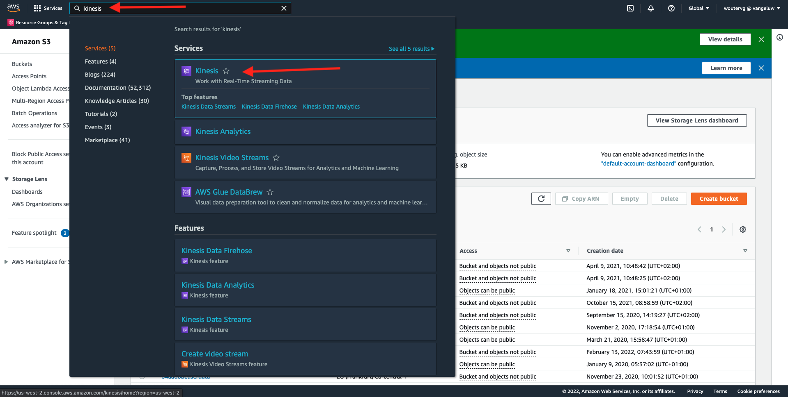
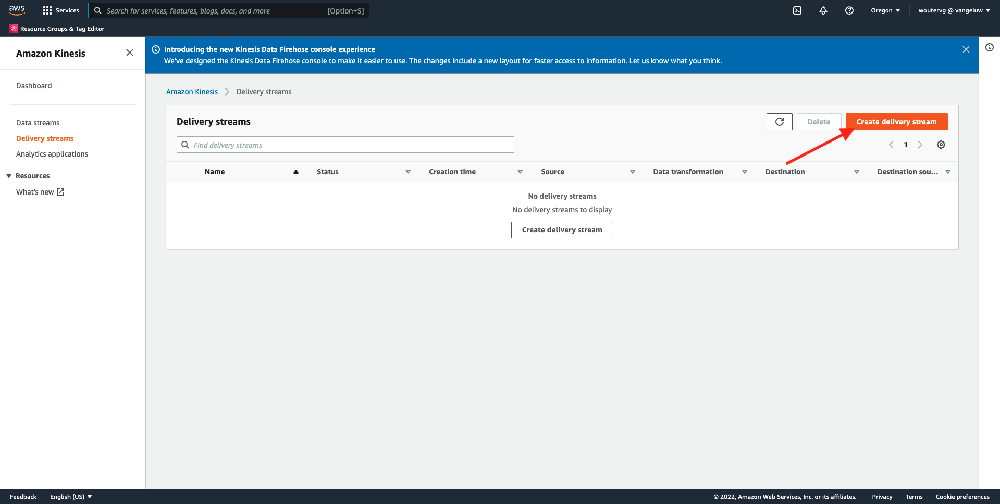
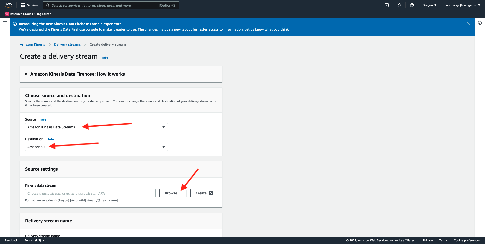
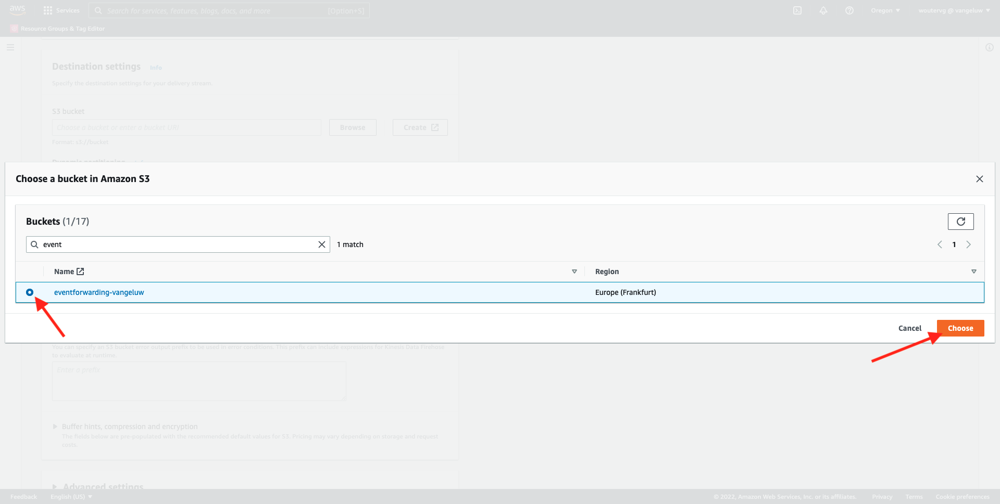
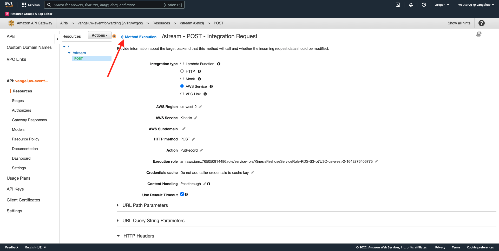

# 14.5 AWSエコシステムに向けてイベントを進める

>[!IMPORTANT]
>
>この演習の完了はオプションで、AWS Kinesisの使用にはコストがかかります。 AWSは、多くのサービスのテストと設定をおこなえる無料利用枠アカウントを提供していますが、AWS Kinesisは、その無料利用枠アカウントには含まれていません。 この演習を実装してテストするには、AWS Kinesisを使用する費用が必要になります。

## 知っておくと良い

Adobe Experience Platformは、宛先として様々なAmazonサービスをサポートしています。
Kinesisと S3 は [プロファイルの書き出し先](https://experienceleague.adobe.com/docs/experience-platform/destinations/destination-types.html?lang=en) とは、Adobe Experience PlatformのReal-Time CDPの一部として使用できます。
価値の高いセグメントイベントや関連するプロファイル属性を、選択したシステムに簡単にフィードできます。

このメモでは、独自のAmazon Kinesisストリームを設定して、Adobe Experience Platform Edge エコシステムからのイベントデータを、Amazon S3 などのクラウドストレージの宛先にストリーミングする方法を学びます。 これは、Web およびモバイルプロパティからエクスペリエンスイベントを収集し、データレイクにプッシュして分析や運用のレポートを作成する場合に役立ちます。 Datalake は、通常、毎日大きなファイルの読み込みでバッチ方式でデータを取り込みます。イベント転送と組み合わせて使用できるパブリック http エンドポイントを公開しません。

上記の使用例をサポートする場合、ファイルに書き込む前に、ストリーミングデータをバッファーするか、キューに配置する必要があることを意味します。 複数のプロセスをまたいで書き込みアクセスを行う場合、ファイルを開かないように注意する必要があります。 このタスクを専用システムに委任することは、優れたレベルのサービスを確保しながら、うまくスケールするのに最適です。Kinesisが救助に来る場所です。

Amazon Kinesis Data Streams では、データストリームの取り込みと保存に重点を置いています。 Kinesis Data Firehose は、S3 バケットなど、一部の宛先へのデータストリームの配信に重点を置いています。

この練習の一環として、あなたは…

- Kinesisデータストリームの基本設定の実行
- Firehose 配信ストリームを作成し、S3 バケットを宛先として使用する
- イベントデータを受け取るために、 Amazon API ゲートウェイを rest api エンドポイントとして設定します
- Adobeの Edge からKinesisストリームに生のイベントデータを転送する

## 14.5.1 AWS S3 バケットの設定

に移動します。 [https://console.aws.amazon.com](https://console.aws.amazon.com) 前に作成したAmazonアカウントでログインします。


ログイン後、 **AWS Management Console**.


内 **サービスを検索** メニュー、検索 **s3**. 最初の検索結果をクリックします。 **S3 — クラウド内のスケーラブルストレージ**.


次に、 **Amazon S3** homepage. クリック **バケットを作成**.


内 **バケットを作成** 画面では、次の 2 つを設定する必要があります。

- 名前：名前を使用 `eventforwarding---demoProfileLdap--`. 例えば、この演習では、バケット名はです。 **aepmodulertcdpvangeluw**
- 地域：地域を使用 **EU （フランクフルト） eu-central-1**


その他のデフォルト設定は、そのままにします。 下にスクロールして、 **バケットを作成**.


バケットが作成され、Amazon S3 のホームページにリダイレクトされます。


## 14.5.2 AWS Kinesisデータストリームの設定

内 **サービスを検索** メニュー、検索 **kinesis**. 最初の検索結果をクリックします。 **Kinesis — リアルタイムストリーミングデータの操作**.



選択 **Kinesis Data Streams**. クリック **データストリームを作成**.


の **データストリーム名**，使用 `--demoProfileLdap---datastream`.


他の設定を変更する必要はありません。 下にスクロールして、 **データストリームを作成**.


これが見えます データストリームが正常に作成されたら、次の演習に進みます。


## 14.5.3 AWS Firehose 配信ストリームの設定

内 **サービスを検索** メニュー、検索 **kinesis**. クリック **Kinesis Data Firehose**.


クリック **配信ストリームを作成**.



の場合 **ソース**&#x200B;を選択します。 **Amazon Kinesis Data Streams**. の場合 **宛先**&#x200B;を選択します。 **Amazon S3**. クリック **参照** をクリックして、データストリームを選択します。



データストリームを選択します。 クリック **選択**.


これが見えます を記憶する **配信ストリーム名** 後で必要になるので


下にスクロールして、 **宛先の設定**. クリック **参照** をクリックして S3 バケットを選択します。


S3 バケットを選択し、 **選択**.



次に、このようなものが見えます。 次の設定を更新します。

- 動的パーティション分割：に設定 **有効**
- 複数レコードの集約解除：に設定 **無効**
- 改行区切り：に設定 **有効**
- JSON のインライン解析：に設定 **有効**


下にスクロールすると、これが表示されます。 次の設定を更新します。

- 動的パーティションキー
   - キー名： **dynamicPartitioningKey**
   - JQ 式： **.dynamicPartitioningKey**
- S3 バケットのプレフィックス：次のコードを追加します。

```bash
!{partitionKeyFromQuery:dynamicPartitioningKey}/!{timestamp:yyyy}/!{timestamp:MM}/!{timestamp:dd}/!{timestamp:HH}/}
```

- S3 バケットエラー出力プレフィックス：に設定 **エラー**


最後に、もう少し下にスクロールして、 **配信ストリームを作成**


数分後に、配信ストリームが作成され、 **アクティブ**.


## 14.5.4 AWS IAM ロールの設定

内 **サービスを検索** メニュー、検索 **iam**. クリック **API ゲートウェイ**.


クリック **役割**.


を検索します。 **KinesisFirehose** 役割。 クリックして開きます。


権限ポリシー名をクリックして開きます。


表示される新しい画面で、「 **ポリシーを編集**.


の下 **Kinesis** - **アクション**&#x200B;で、 **書き込み** 権限 **PutRecord** が有効になっている。 クリック **レビューポリシー**.


「**変更を保存**」をクリックします。


その後、戻ってきます。 クリック **役割**.


を検索します。 **KinesisFirehose** 役割。 クリックして開きます。


に移動します。 **信頼関係** をクリックし、 **信頼ポリシーを編集**.


既存のコードを置き換えるには、次のコードを貼り付けて現在の信頼ポリシーを上書きします。

```json
{
	"Version": "2012-10-17",
	"Statement": [
		{
			"Effect": "Allow",
			"Principal": {
				"Service": [
                    "firehose.amazonaws.com",
                    "kinesis.amazonaws.com",
                    "apigateway.amazonaws.com"
                ]
			},
			"Action": "sts:AssumeRole"
		}
	]
}
```

クリック **ポリシーを更新**


これが見えます 次の項目を指定する必要があります： **ARN** 次の手順でのこの役割用。


## 14.5.5 AWS API ゲートウェイの設定

Amazon API Gateway は、REST、HTTP、WebSocket API をあらゆる規模で作成、公開、管理、監視およびセキュリティ保護するAWSサービスです。 API 開発者は、AWSやその他の Web サービスにアクセスする API と、AWS Cloud に保存されたデータを作成できます。

HTTPS エンドポイントを通じてKinesisデータストリームをインターネットに公開し、イベント転送などのAdobe サービスが直接利用できるようになりました。

内 **サービスを検索** メニュー、検索 **api ゲートウェイ**. クリック **API ゲートウェイ**.


次に、このようなものが見えます。 クリック **API を作成**.


クリック **ビルド** の **REST API** カード。


これが見えます 次のような設定を入力します。

- プロトコルを選択します。選択 **REST**
- 新しい API を作成：選択 **新しい API**
- 設定:
   - API 名：use `--demoProfileLdap---eventforwarding`
   - エンドポイントの種類：選択 **地域**

クリック **API を作成**.


これが見えます クリック **アクション** 次に、 **リソースを作成**.


これが見えます 設定 **リソース名** から **ストリーム**. クリック **リソースを作成**.


これが見えます クリック **アクション** 次に、 **メソッドを作成**.


ドロップダウンで、 **POST** をクリックし、 **v** 」ボタンをクリックします。


これが見えます 次のような設定を入力します。

- 統合のタイプ： **AWS Service**
- AWS地域：Kinesis Data Stream で使用される地域を選択します。この例では、次のようにします。 **us-west-2**
- AWSサービス：選択 **Kinesis**
- AWSサブドメイン：空にする
- HTTP メソッド：選択 **POST**
- アクションタイプ：選択 **アクション名を使用**
- アクション：入力 **PutRecord**
- 実行ロール：貼り付け **ARN** Kinesis Data Firehose で使用される実行ロールの割り当て（前の演習で説明）
- コンテンツ処理：選択 **パススルー**
- デフォルトのタイムアウトを使用：チェックボックスを有効にする

「**保存**」をクリックします。


これが見えます クリック **統合リクエスト**.


クリック **HTTP ヘッダー**.


少し下にスクロールして、 **ヘッダーを追加**.


設定 **名前** から **Content-Type**，設定 **マッピング元** から `'application/x-amz-json-1.1'`. 次をクリック： **v** アイコンをクリックして変更を保存します。


これが見えます の場合 **リクエスト本文のパススルー**&#x200B;を選択します。 **テンプレートが定義されていない場合（推奨）**. 次に、「 **マッピングテンプレートを追加**.


の下 **Content-Type**&#x200B;を入力して、 **application/json**. 次をクリック： **v** アイコンをクリックして変更を保存します。


下にスクロールして、コードエディターウィンドウを見つけます。 以下のコードをそこに貼り付けます。

```json
{
  "StreamName": "$input.path('StreamName')",
  "Data": "$util.base64Encode($input.json('$.Data'))",
  "PartitionKey": "$input.path('$.PartitionKey')"
}
```

「**保存**」をクリックします。


次に、上にスクロールして、 **&lt; — メソッドの実行** 戻る



クリック **テスト**.


下にスクロールし、次の下にこのコードを貼り付けます。 **リクエスト本文**. クリック **テスト**.

```json
{
  "Data": {
    "message": "Hello World",
    "dynamicPartitioningKey": "v2"
  },
  "PartitionKey": "1",
  "StreamName": "--demoProfileLdap---datastream"
}
```


同様の結果が表示されます。


これが見えます クリック **アクション** 次に、 **デプロイ API**.


の場合 **デプロイメントステージ**&#x200B;を選択します。 **新規ステージ**. 形式 **ステージ名**&#x200B;を入力して、 **prod**. クリック **デプロイ**.


これが見えます 「**変更を保存**」をクリックします。FYI:画像内の URL は、データの送信先 URL です ( この例では：https://vv1i5vwg2k.execute-api.us-west-2.amazonaws.com/prod) です。


以下の cURL リクエストを使用して設定をテストできます。必要なのは、以下の URL を自分の URL に置き換えるだけです。 `https://vv1i5vwg2k.execute-api.us-west-2.amazonaws.com/prod` この例では、を追加します。 `/stream` を返します。

```json
curl --location --request POST 'https://vv1i5vwg2k.execute-api.us-west-2.amazonaws.com/prod/stream' \
--header 'Content-Type: application/json' \
--data-raw '{
    "Data": {
        "userid": "--demoProfileLdap--@adobe.com",
        "firstName":"--demoProfileLdap--",
        "offerName":"10% off on outdoor gears",
        "offerCode": "10OFF-SPRING",
        "dynamicPartitioningKey": "campaign"
    },
    "PartitionKey": "1",
    "StreamName": "--demoProfileLdap---datastream"
}'
```

上記の更新したコードをターミナルウィンドウに貼り付け、Enter キーを押します。 次に、上記のテスト時に表示される応答と同様の応答が表示されます。


## 14.5.6 イベント転送プロパティの更新

AWS API Gateway を通じて、AWS Kinesisデータストリームに対してをアクティブ化できるようになり、生のエクスペリエンスイベントをAWSエコシステムに送信できるようになりました。 Real-Time CDP接続とイベント転送を使用すると、新しく作成したAWS API Gateway エンドポイントへのイベント転送を簡単に有効にできます。

### 14.5.6.1 イベント転送プロパティの更新：データ要素の作成

に移動します。 [https://experience.adobe.com/#/data-collection/](https://experience.adobe.com/#/data-collection/) そして、 **イベント転送**. イベント転送プロパティを検索し、クリックして開きます。


左側のメニューで、に移動します。 **データ要素**. クリック **データ要素を追加**.


次に、設定する新しいデータ要素が表示されます。


次の項目を選択します。

- を **名前**&#x200B;を入力して、 **awsDataObject**.
- を **拡張**&#x200B;を選択します。 **コア**.
- を **データ要素タイプ**&#x200B;を選択します。 **カスタムコード**.

これをお持ちです。 クリック **&lt;/> エディタを開く**.


エディターで、次のコードを 3 行目に貼り付けます。 「**保存**」をクリックします。

```javascript
const newObj = {...arc.event.xdm, dynamicPartitioningKey: "event_forwarding"}
return JSON.stringify(newObj);
```


>[!NOTE]
>
>上記のパスでは、 **arc**. **arc** は、Adobeリソースコンテキストの略で、 **arc** は、常に、Server Side コンテキストで使用可能な、最も高い可用性を持つオブジェクトを表します。 それに富や変化を加えてもいい **arc** オブジェクトを作成する必要があります。Adobe Experience Platform Data Collection Server の関数を使用します。
>
>上記のパスでは、 **イベント**. **イベント** は一意のイベントを表し、Adobe Experience Platform Data Collection Server は常にすべてのイベントを個別に評価します。 場合によっては、 **イベント** Web SDK Client Side から送信されるペイロードですが、Adobe Experience Platform Data Collection イベント転送では、すべてのイベントが個別に評価されます。

その後、戻ってきます。 クリック **保存** または **ライブラリに保存**.


### 14.5.6.2 Adobe Experience Platform Data Collection Server プロパティの更新：ルールを更新

左側のメニューで、に移動します。 **ルール**. クリックしてルールを開きます **すべてのページ** 前の演習の 1 つで作成した


これが見えます 次をクリック： **+** アイコンをクリックして新しいアクションを追加します。


これが見えます 次の項目を選択します。

- を選択します。 **拡張**: **Adobeクラウドコネクタ**.
- を選択します。 **アクションタイプ**: **取得呼び出しを実行**.

それならこうなる **名前**: **Adobeクラウドコネクタ — 取得呼び出しをおこなう**. 次が表示されます。


次に、以下を設定します。

- リクエストメソッドをGETからに変更 **POST**
- 前の手順の 1 つで作成したAWS API Gateway エンドポイントの URL を入力します。次に例を示します。 `https://vv1i5vwg2k.execute-api.us-west-2.amazonaws.com/prod/stream`

これを使用します。 次へ、に移動します。 **ヘッダー**.


headers の下に、キーを持つ新しいヘッダーを追加します。 **Content-Type** および値 **application/json**. 次へ、に移動します。 **本文**.


これが見えます 次のコードを、フィールドに貼り付けます。 **本文（生）**. 「**変更を保存**」をクリックします。

```json
{
    "Data":{{awsDataObject}},
    "PartitionKey": "1",
    "StreamName": "--demoProfileLdap---datastream"
}
```


その後、ここに戻ってくる。 クリック **保存** または **ライブラリに保存**.


これで、イベント転送プロパティの最初のルールが設定されました。 に移動します。 **公開フロー** 変更を公開します。
「 」をクリックして開発ライブラリを開きます。 **メイン**.


次をクリック： **変更されたリソースをすべて追加** ボタンをクリックすると、ルールとデータ要素の変更がこのライブラリに表示されます。 次に、「 **開発用に保存およびビルド**. 変更はデプロイ中です。


数分後に、デプロイメントが完了し、テストの準備が整ったことがわかります。


## 14.5.7 設定のテスト

に移動します。 [https://builder.adobedemo.com/projects](https://builder.adobedemo.com/projects). Adobe IDでログインすると、次の内容が表示されます。 Web サイトプロジェクトをクリックして開きます。


これで、以下のフローに従って Web サイトにアクセスできます。 クリック **統合**.


の **統合** このページでは、演習 0.1 で作成したデータ収集プロパティを選択する必要があります。


次に、デモ Web サイトが開いているのがわかります。 URL を選択して、クリップボードにコピーします。


新しい匿名ブラウザーウィンドウを開きます。


前の手順でコピーしたデモ Web サイトの URL を貼り付けます。 その後、Adobe IDを使用してログインするように求められます。


アカウントのタイプを選択し、ログインプロセスを完了します。


Web サイトが匿名ブラウザーウィンドウに読み込まれます。 デモ Web サイトの URL を読み込むには、新しい匿名ブラウザーウィンドウを使用する必要があります。


ブラウザーの開発者ビューを開くと、次に示すようにネットワークリクエストを調査できます。 フィルターを使用する場合 **相互作用**&#x200B;を使用すると、Adobe Experience Platform Data Collection Client からAdobe Edgeに送信されたネットワークリクエストが表示されます。


生のペイロードを選択した場合は、に移動します。 [https://jsonformatter.org/json-pretty-print](https://jsonformatter.org/json-pretty-print) ペイロードを貼り付けます。 クリック **プリティにする**. 次に、JSON ペイロード、 **イベント** オブジェクトと **xdm** オブジェクト。 前の手順の 1 つで、データ要素を定義した場合、参照を使用していました。 **arc.event.xdm**&#x200B;を返します。これは、 **xdm** オブジェクトを選択します。


ビューをに切り替えます。 **AWS**. データストリームを開き、 **監視** 「 」タブに移動すると、着信トラフィックが表示されます。


配信ストリームを開き、 **監視** 「 」タブに移動すると、着信トラフィックも表示されます。


最後に、S3 バケットを確認すると、データ取り込みの結果としてファイルが作成されているのがわかります。


このようなファイルをダウンロードし、テキストエディターを使用して開くと、転送されたイベントの XDM ペイロードが含まれていることがわかります。


次のステップ： [概要とメリット](./summary.md)

[モジュール 14 に戻る](./aep-data-collection-ssf.md)

[すべてのモジュールに戻る](./../../overview.md)
