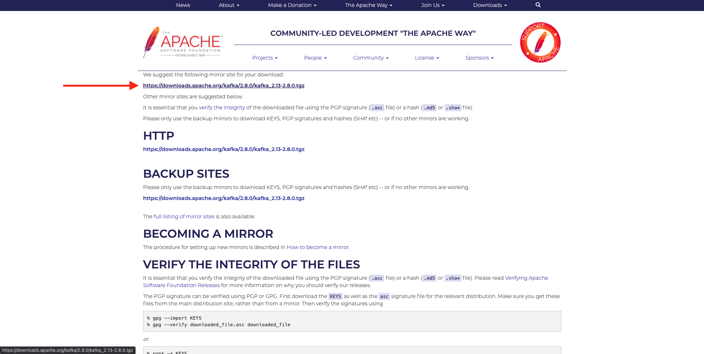
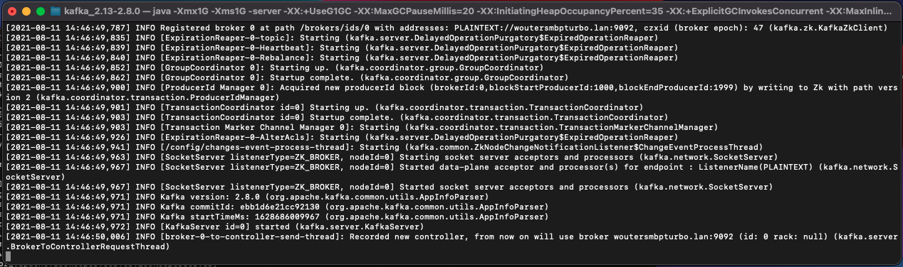
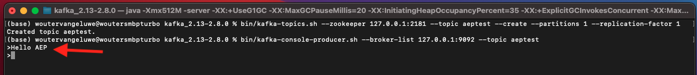

# 15.2 Kafka クラスターのインストールと設定

## 15.2.1 Apache Kafka のダウンロード

に移動します。 [https://kafka.apache.org/downloads](https://kafka.apache.org/downloads) およびは、最新リリースバージョンをダウンロードします。 最新のバイナリリリースを選択します（この場合は） **Scala 2.13**.

ミラーサイトに移動します。 推奨リンクをクリックして Kafka をダウンロードします。

デスクトップ上に、 **Kafka_AEP** ダウンロードしたファイルをそのディレクトリに配置します。

を開きます。 **ターミナル** ウィンドウを開くには、フォルダーを右クリックし、 **新しいターミナル（フォルダー）**.

ターミナルウィンドウで次のコマンドを実行して、ダウンロードしたファイルを解凍します。

`tar -xvf kafka_2.13-3.1.0.tgz`

>[!NOTE]
>
>上記のコマンドが、ダウンロードしたファイルのバージョンと一致することを確認してください。 バージョンがより新しい場合は、上記のコマンドを更新して、そのバージョンに合わせる必要があります。

次の内容が表示されます。

そのファイルを解凍すると、次のようなディレクトリが作成されます。

そのディレクトリには、次のサブディレクトリが表示されます。

ターミナルウィンドウに戻ります。 以下のコマンドを入力します。

`cd kafka_2.13-3.1.0`

>[!NOTE]
>
>上記のコマンドが、ダウンロードしたファイルのバージョンと一致することを確認してください。 バージョンがより新しい場合は、上記のコマンドを更新して、そのバージョンに合わせる必要があります。

次に、コマンドを入力します。 `bin/kafka-topics.sh`.

次に、この応答が表示されます。 つまり、Kafka が正しくインストールされ、Java が正常に動作しています。 ( 注意：この機能を使用するには、Java 8 JDK または Java 11 JDK がインストールされている必要があります。 コマンドを使用して、インストールした Java のバージョンを確認できます `java -version`.)

## 15.2.2 Kafka の起動

Kafka を起動するには、Kafka Zookeeper と Kafka をこの順序で起動する必要があります。

を開きます。 **ターミナル** ウィンドウを開くには、フォルダーを右クリックします **kafka_2.13-3.1.0** をクリックし、 **新しいターミナル（フォルダー）**.

次のコマンドを入力します。

`bin/zookeeper-server-start.sh config/zookeeper.properties`

次の内容が表示されます。

この演習を行う間は、このウィンドウを開いたままにしてください。

別の、新しいを開く **ターミナル** ウィンドウを開くには、フォルダーを右クリックします **kafka_2.13-3.1.0** をクリックし、 **新しいターミナル（フォルダー）**.

次のコマンドを入力します。

`bin/kafka-server-start.sh config/server.properties`

次の内容が表示されます。

この演習を行う間は、このウィンドウを開いたままにしてください。

## 15.2.3 Kafka トピックの作成

を開きます。 **ターミナル** ウィンドウを開くには、フォルダーを右クリックします **kafka_2.13-3.1.0** をクリックし、 **新しいターミナル（フォルダー）**.

このコマンドを入力して、名前を持つ新しい Kafka トピックを作成します **aeptest**. このトピックは、この演習でのテストに使用します。

`bin/kafka-topics.sh --create --topic aeptest --bootstrap-server localhost:9092`

次に、同様の確認が表示されます。

このコマンドを入力して、名前を持つ新しい Kafka トピックを作成します **aep**. このトピックは、次の演習で設定するAdobe Experience Platform Sink Connector で使用します。

`bin/kafka-topics.sh --create --topic aep --bootstrap-server localhost:9092`

次に、同様の確認が表示されます。

## 15.2.4 イベントの生成

最初の Kafka トピックを作成したターミナルウィンドウに戻り、次のコマンドを入力します。

`bin/kafka-console-producer.sh --broker-list 127.0.0.1:9092 --topic aeptest`

これが見えます 新しい行の後に「Enter」ボタンを押すと、新しいメッセージがトピックに送信されます **aeptest**.

入力 `Hello AEP` を押し、Enter キーを押します。 最初のイベントが、ローカルの Kafka インスタンスに、トピックに送信されました。 **aeptest**.

入力 `Hello AEP again.` を押し、Enter キーを押します。

入力 `AEP Data Collection is the best.` を押し、Enter キーを押します。

3 つのイベントをトピックに作成しました **aeptest**. これらのイベントは、そのデータを必要とする可能性のあるアプリケーションで使用できるようになりました。

キーボードで、 `Control` および `C` プロデューサーを閉じるのと同時に

## 15.2.4 イベントの消費

イベントの作成に使用したのと同じターミナルウィンドウで、次のコマンドを入力します。

`bin/kafka-console-consumer.sh --bootstrap-server 127.0.0.1:9092 --topic aeptest --from-beginning`

その後、前の演習で作成したトピックに関するすべてのメッセージが表示されます **aeptest**&#x200B;を設定すると、消費者に表示されます。 Apache Kafka の仕組みは次のとおりです。プロデューサーがイベントをパイプラインに作成し、コンシューマーがこれらのイベントを使用します。

キーボードで、 `Control` および `C` プロデューサーを閉じるのと同時に

この練習では、すべての基本事項を実行して、ローカル Kafka クラスターを設定し、Kafka トピックを作成し、イベントを生成してイベントを使用します。

このモジュールの目的は、実際の組織が既に Apache Kafka クラスターを実装し、Kafka クラスターからAdobe Experience Platformにデータをストリーミングしたい場合の動作をシミュレートすることです。

このような実装を容易にするために、Kafka Connect を使用して実装できるAdobe Experience Platform Sink コネクタが作成されました。 このAdobe Experience Platform Sink Connector のドキュメントは、次の場所で確認できます。 [https://github.com/adobe/experience-platform-streaming-connect](https://github.com/adobe/experience-platform-streaming-connect).

次の演習では、そのAdobe Experience Platform Sink コネクタを使用するために必要なすべてを、ローカルの Kafka クラスター内から実装します。

ターミナルウィンドウを閉じます。

この練習は終わりました。

次のステップ： [15.3 Adobe Experience Platformでの HTTP API エンドポイントの設定](./ex3.md)

[モジュール 15 に戻る](./aep-apache-kafka.md)

[すべてのモジュールに戻る](../../overview.md)
