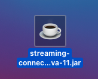
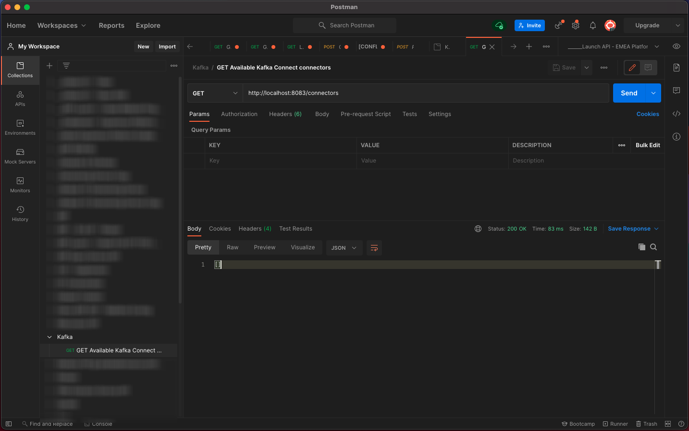

# 15.4 Kafka Connect とAdobe Experience Platform Sink Connector のインストールと設定

## 15.4.1 Adobe Experience Platform Sink Connector のダウンロード

に移動します。 [https://github.com/adobe/experience-platform-streaming-connect/releases](https://github.com/adobe/experience-platform-streaming-connect/releases) およびAdobe Experience Platform Sink Connector の最新の正式リリースをダウンロードします。


ダウンロードファイルを配置します。 **streaming-connect-sink-0.0.14-java-11.jar**&#x200B;をデスクトップに貼り付けます。



## 15.4.2 Kafka Connect の設定

デスクトップ上の、という名前のフォルダーに移動します。 **Kafka_AEP** フォルダーに移動します。 `kafka_2.13-3.1.0/config`.
そのフォルダーで、ファイルを開きます。 **connect-distributed.properties** 任意のテキストエディターを使用する。


テキストエディターで、34 行と 35 行に移動し、フィールドを設定します。 `key.converter.schemas.enable` および `value.converter.schemas.enable` から `false`

```json
key.converter.schemas.enable=false
value.converter.schemas.enable=false
```

このファイルに変更を保存します。


次に、フォルダーに戻ります。 `kafka_2.13-3.1.0` 新しいフォルダを手動で作成し、名前を付けます。 `connectors`.


フォルダーを右クリックし、 **新しいターミナル（フォルダー）**.


これが見えます コマンドを入力 `pwd` をクリックして、そのフォルダーのフルパスを取得します。 フルパスを選択し、クリップボードにコピーします。


テキストエディタに戻り、ファイルに戻ります。 **connect-distributed.properties** をクリックし、最後の行まで下にスクロールします（スクリーンショットの 86 行目）。 次で始まる行のコメントを解除する必要があります： `# plugin.path=` 次の名前のフォルダーにフルパスを貼り付ける必要があります。 `connectors`. 結果は次のようになります。

`plugin.path=/Users/woutervangeluwe/Desktop/Kafka_AEP/kafka_2.13-3.1.0/connectors`

変更をファイルに保存します **connect-distributed.properties** をクリックし、テキストエディタを閉じます。


次に、ダウンロードしたAdobe Experience Platform Sink Connector の最新の正式リリースを、という名前のフォルダーにコピーします。 `connectors`. 以前にダウンロードしたファイルの名前はです。 **streaming-connect-sink-0.0.14-java-11.jar**&#x200B;を使用する場合、単に `connectors` フォルダー。


次に、 **kafka_2.13-3.1.0** フォルダー。 そのフォルダーを右クリックし、 **新しいターミナル（フォルダー）**.

ターミナルウィンドウで、次のコマンドを貼り付けます。 `bin/connect-distributed.sh config/connect-distributed.properties` をクリックし、 **入力**. このコマンドは、Kafka Connect を起動し、Adobe Experience Platform Sink Connector のライブラリを読み込みます。


数秒後に、次のような画面が表示されます。


## 15.4.3 Postmanを使用したAdobe Experience Platform Sink Connector の作成

Postmanを使用して Kafka Connect を操作できるようになりました。 これをおこなうには、をダウンロードします。 [このPostman Collection](../../assets/postman/postman_kafka.zip) デスクトップ上のローカルコンピューターに解凍します。 次に、という名前のファイルが用意されます。 `Kafka_AEP.postman_collection.json`.


このファイルをPostmanにインポートする必要があります。 これをおこなうには、「Postman」を開き、 **インポート**、ファイルをドラッグ&amp;ドロップします `Kafka_AEP.postman_collection.json` ポップアップに移動し、 **インポート**.


このコレクションは、Postmanの左側のメニューに表示されます。 最初のリクエストをクリックし、 **GETが使用できる Kafka Connect コネクタ** をクリックして開きます。


これが見えます 青をクリック **送信** ボタンをクリックします。このボタンの後に空の応答が表示されます。 `[]`. 空の応答は、Kafka Connect コネクタが現在定義されていないことが原因です。



コネクタを作成するには、をクリックして、Kafka コレクションの 2 番目のリクエストを開きます。 **POSTAEP シンクコネクタの作成**. これが見えます 11 行目 ( **&quot;aep.endpoint&quot;:&quot;&quot;**&#x200B;の場合は、演習の最後に受け取った HTTP API Streaming エンドポイント URL を貼り付ける必要があります [15.3](./ex3.md). HTTP API ストリーミングエンドポイント URL は次のようになります。 `https://dcs.adobedc.net/collection/d282bbfc8a540321341576275a8d052e9dc4ea80625dd9a5fe5b02397cfd80dc`.


貼り付けた後のリクエストの本文は次のようになります。 青をクリック **送信** ボタンをクリックして、コネクタを作成します。 コネクタの作成に関する応答がすぐに返されます。


最初のリクエストをクリックし、 **GETが使用できる Kafka Connect コネクタ** もう一度開いて、青をクリックするには **送信** ボタンを再度クリックします。 これで、Kafka 接続コネクタが作成されました。


次に、Kafka コレクションの 3 番目のリクエストを開き、 **GETKafka 接続コネクタのステータスの確認**. 青をクリック **送信** ボタンをクリックすると、次のような応答が返され、コネクタが実行中であることを示します。


## 15.4.4 エクスペリエンスイベントの生成

新しい **ターミナル** ウィンドウを開くには、フォルダーを右クリックします **kafka_2.13-3.1.0** をクリックし、 **新しいターミナル（フォルダー）**.


以下のコマンドを入力します。

`bin/kafka-console-producer.sh --broker-list 127.0.0.1:9092 --topic aep`


これが見えます 新しい行の後に「Enter」ボタンを押すと、新しいメッセージがトピックに送信されます **aep**.


メッセージを送信して、Adobe Experience Platform Sink コネクタで消費され、Adobe Experience Platformにリアルタイムに取り込めるようになりました。

これをテストするために少しデモを行いましょう。

に移動します。 [https://builder.adobedemo.com/projects](https://builder.adobedemo.com/projects). Adobe IDでログインすると、次の内容が表示されます。 Web サイトプロジェクトをクリックして開きます。


の **スクリーン** ページ、クリック **実行**.


次に、デモ Web サイトが開いているのがわかります。 URL を選択して、クリップボードにコピーします。


新しい匿名ブラウザーウィンドウを開きます。


前の手順でコピーしたデモ Web サイトの URL を貼り付けます。 その後、Adobe IDを使用してログインするように求められます。


アカウントのタイプを選択し、ログインプロセスを完了します。


Web サイトが匿名ブラウザーウィンドウに読み込まれます。 デモ Web サイトの URL を読み込むには、新しい匿名ブラウザーウィンドウを使用する必要があります。


画面の左上隅にあるAdobeロゴアイコンをクリックして、プロファイルビューアを開きます。


プロファイルビューアパネルと、リアルタイム顧客プロファイルを **Experience CloudID** を、現在不明なこの顧客の主な識別子として使用する。


登録/ログインページに移動します。 クリック **アカウントの作成**.


詳細を入力し、 **登録** その後、前のページにリダイレクトされます。


プロファイルビューアパネルを開き、リアルタイム顧客プロファイルに移動します。 プロファイルビューアパネルに、新しく追加された E メールや電話番号など、すべての個人データが表示されます。


過去のアクティビティに基づいて、一部のエクスペリエンスイベントが表示される場合があります。


これを変更し、Kafka からAdobe Experience Platformに Callcenter エクスペリエンスイベントを送信しましょう。

以下のエクスペリエンスイベントペイロードのサンプルを利用して、テキストエディターにコピーします。

```json
{
  "header": {
    "datasetId": "61fe23fd242870194a6d779c",
    "imsOrgId": "--aepImsOrgID--",
    "source": {
      "name": "Launch"
    },
    "schemaRef": {
      "id": "https://ns.adobe.com/experienceplatform/schemas/b0190276c6e1e1e99cf56c99f4c07a6e517bf02091dcec90",
      "contentType": "application/vnd.adobe.xed-full+json;version=1"
    }
  },
  "body": {
    "xdmMeta": {
      "schemaRef": {
        "id": "https://ns.adobe.com/experienceplatform/schemas/b0190276c6e1e1e99cf56c99f4c07a6e517bf02091dcec90",
        "contentType": "application/vnd.adobe.xed-full+json;version=1"
      }
    },
    "xdmEntity": {
      "eventType": "callCenterInteractionKafka",
      "_id": "",
      "timestamp": "2022-02-23T09:54:12.232Z",
      "_experienceplatform": {
        "identification": {
          "core": {
            "phoneNumber": ""
          }
        },
        "interactionDetails": {
          "core": {
            "callCenterAgent": {
              "callID": "Support Contact - 3767767",
              "callTopic": "contract",
              "callFeeling": "negative"
            }
          }
        }
      }
    }
  }
}
```

これが見えます 次の 2 つのフィールドを手動で更新する必要があります。

- **_id**:ランダムな id( `--demoProfileLdap--1234`
- **timestamp**:タイムスタンプを現在の日時に更新
- **phoneNumber**:デモ Web サイトで作成したアカウントの phoneNumber を入力します。 これは、の下のプロファイルビューアパネルにあります。 **ID**.

また、次のフィールドを確認して更新する必要があります。
- **datasetId**:データセットデモシステム — コールセンター（グローバル v1.1）のイベントデータセットのデータセット ID をコピーする必要があります。
- **imsOrgID**:お使いの IMS Org ID は `--aepImsOrgId--`

>[!NOTE]
>
>フィールド **_id** データの取り込みごとに一意である必要があります。 複数のイベントを生成する場合は、必ずフィールドを更新してください **_id** を新しい一意の値に変更するたびに


その後、次のようになります。


次に、完全なエクスペリエンスイベントをクリップボードにコピーします。 JSON ペイロードの空白を削除する必要があります。そのためには、オンラインツールを使用します。 に移動します。 [http://jsonviewer.stack.hu/](http://jsonviewer.stack.hu/) そうするために


エディターにエクスペリエンスイベントを貼り付け、「 **空白を削除**.


次に、すべての出力テキストを選択し、クリップボードにコピーします。


ターミナルウィンドウに戻ります。


ターミナルウィンドウに空白を含まない新しいペイロードを貼り付け、「 **入力**.


次に、デモ Web サイトに戻り、ページを更新します。 これで、プロファイルの「 」にエクスペリエンスイベントが表示されます。 **その他のイベント**&#x200B;以下のように。


>[!NOTE]
>
>コールセンターの操作をプロファイルビューアパネルに表示する場合は、以下のラベルを追加して、 [https://builder.adobedemo.com/projects](https://builder.adobedemo.com/projects)（「 」タブに移動して） **プロファイルビューア**.


この練習は終わりました。

次のステップ： [概要とメリット](./summary.md)

[モジュール 15 に戻る](./aep-apache-kafka.md)

[すべてのモジュールに戻る](../../overview.md)
