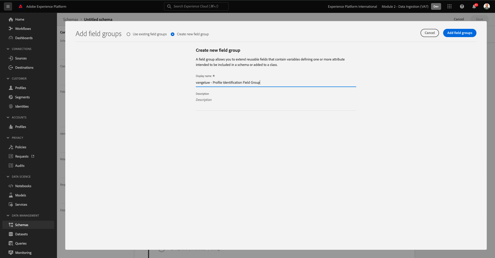
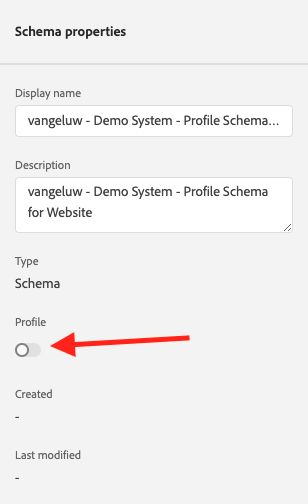
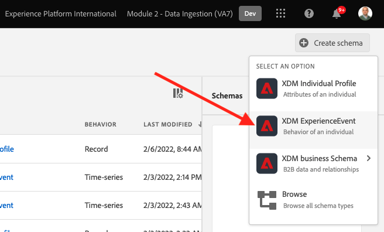
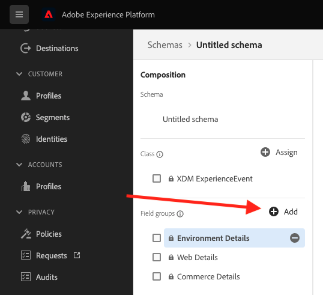
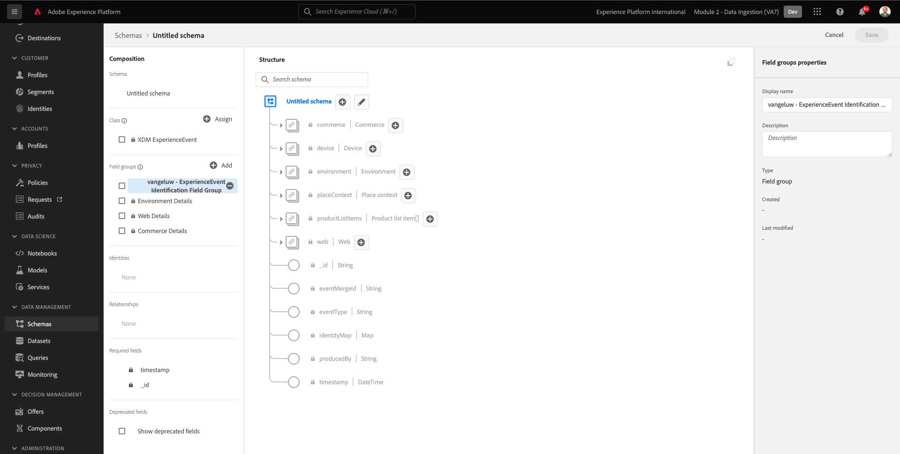
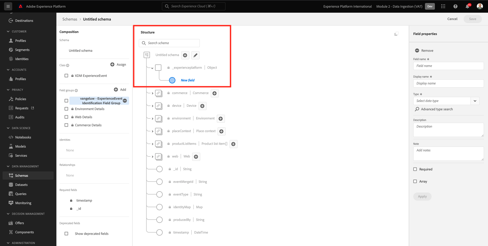
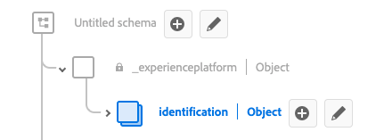

# 2.2 スキーマの設定と識別子の設定

この演習では、プロファイル情報と顧客の行動を分類するために必要な XDM スキーマを設定します。 すべての XDM スキーマで、すべての情報をリンクするプライマリ識別子を設定する必要もあります。

## Story

XDM スキーマの設定を開始し、プライマリID の設定を開始する前に、何をしようとしているかのビジネスコンテキストについて考える必要があります。

- データが必要です
- 顧客にデータをリンクする
- プログレッシブなリアルタイムの顧客プロファイルを構築する

取り込むデータには次の 2 種類があります。

- この顧客は誰ですか？
- この顧客の役割

しかし、問題は **この顧客は誰ですか？** 多くの答えを持つ非常にオープンな質問です この質問に回答したい場合は、名、姓、住所などの人口統計情報を検索します。 ただし、電子メールアドレスや携帯電話番号などの連絡先情報の場合も同様です。 また、言語、オプトイン/オプトアウト、および場合によってはプロファイル画像にリンクされた情報に対しても。 最後に、お客様が実際に知っておく必要があるのは、お客様の会社が使用する様々なシステムで、お客様を識別する方法です。

同じことが問題になる **この顧客の役割**。多くの回答を含む非常にオープンな質問です。 この質問に回答したいと思われる場合は、オンラインおよびオフラインのプロパティのいずれかと、顧客が持つインタラクションを探しています。 訪問されたページまたは製品はどれですか？ この顧客は買い物かごに製品を追加したか、または品目を購入したか。 Web サイトの閲覧に使用されたのは、どのデバイスとブラウザーですか？ このお客様はどのような情報を求めていますか？また、これを使用して、このお客様に快適なエクスペリエンスを設定し、提供するにはどうすればよいですか？ 最後に、お客様の会社が使用する様々なシステムで、この顧客を識別する方法について知っておく必要があります。

## 2.1.1 — この顧客の人物

回答の取得先 **この顧客は誰ですか？** ログイン/登録ページを使用して行われます。

スキーマの観点から見ると、これは **クラス**. 質問： **この顧客は誰ですか？** は、クラスで定義するものです **[!UICONTROL XDM 個人プロファイル]**.

そのため、XDM スキーマを作成して、 **この顧客は誰ですか？**（まず、クラスを参照する 1 つのスキーマを作成して定義する必要があります） **[!UICONTROL XDM 個人プロファイル]**.

その質問に対してどのような回答を提供できるかを指定するには、次の項目を定義する必要があります [!UICONTROL フィールドグループ]. [!UICONTROL フィールドグループ] はプロファイルクラスの拡張機能で、非常に具体的な設定を持ちます。 例えば、姓、名、性別、誕生日などの人口統計情報が、 [!UICONTROL フィールドグループ]: **[!UICONTROL 人口統計の詳細]**.

次に、会社がこの顧客を識別する方法を決定する必要があります。 会社の場合、既知の顧客の主な識別子は、電子メールアドレスなどの特定の顧客 ID にすることができます。 しかし、技術的には、携帯電話番号を使用するなど、会社で顧客を識別する他の方法があります。
このラボでは、E メールアドレスをプライマリ識別子とし、電話番号をセカンダリ識別子として定義します。

最後に、データが取り込まれたチャネルを区別することが重要です。 この場合、Web サイトの登録と、定義する必要があるスキーマについて、 **場所** 登録データが取り込まれました。 また、チャネルは、取り込まれるデータに影響を与える際にも重要な役割を果たします。 したがって、収集したデータのチャネル、プライマリ識別子、タイプの組み合わせごとに、スキーマのを定義することをお勧めします。

上記に基づき、Adobe Experience Platformでスキーマを設定する必要があります。

次の URL に移動して、Adobe Experience Platformにログインします。 [https://experience.adobe.com/platform](https://experience.adobe.com/platform).

ログイン後、Adobe Experience Platformのホームページに移動します。

続行する前に、 **サンドボックス**. 選択するサンドボックスの名前はです ``--module2sandbox--``. これを行うには、 **[!UICONTROL 実稼動版]** 画面の上の青い線で表示されます。 適切なサンドボックスを選択すると、画面が変更され、専用のサンドボックスに移動します。

Adobe Experience Platformで、 **[!UICONTROL スキーマ]** をクリックします。 使用可能な [!UICONTROL スキーマ].

新しいスキーマを作成する必要があります。 新しいスキーマを作成するには、「 」ボタンをクリックします。 **[!UICONTROL +スキーマを作成]** を選択し、 **[!UICONTROL XDM 個人プロファイル]**.

次の **[!UICONTROL +スキーマを作成]** ボタンをクリックすると、新しいスキーマが作成され、選択または作成するよう求められます **フィールドグループ**.

次に、質問に対する回答を定義する必要があります **この顧客は誰ですか？** はのようになります。
このラボの導入では、顧客を定義する次の属性が必要であることに注意しました。

- 名、姓、住所などの人口統計情報。
- 連絡先情報（自宅住所、電子メールアドレス、携帯電話番号など）
- 言語、オプトイン/オプトアウトおよび場合によってはプロファイル画像にリンクされたその他の情報。
- プライマリの顧客識別子

この情報をスキーマの一部にするには、次の情報を追加する必要があります [!UICONTROL フィールドグループ] をスキーマに追加します。

- 人口統計の詳細（人口統計情報）
- 個人の連絡先の詳細（連絡先情報）
- 環境設定の詳細（その他の情報）
- 会社のカスタムプロファイル識別フィールドグループ (プライマリとセカンダリの ID)

内 **[!UICONTROL フィールドグループを追加]** 画面で、 [!UICONTROL フィールドグループ] **[!UICONTROL 人口統計の詳細]**, **[!UICONTROL 個人の連絡先の詳細]** および **[!UICONTROL 環境設定の詳細]**.

次をクリック： **[!UICONTROL フィールドグループの追加]** ボタンをクリックして [!UICONTROL フィールドグループ] をスキーマに追加します。

これで、次の機能が利用できます。

次に、新しい [!UICONTROL フィールドグループ] 捕らえる **[!UICONTROL 識別子]** データ収集に使用されます。 前の練習で見たように、プライマリとセカンダリの識別子の概念があります。 プライマリ識別子は最も重要な識別子です。収集されたすべてのデータがこの識別子にリンクされるからです。

次に、独自のカスタムを作成します [!UICONTROL フィールドグループ] そのため、 [!UICONTROL XDM スキーマ] 自社の要件を満たす

次をクリック： **[!UICONTROL +追加]** ボタンをクリックして追加を開始 [!UICONTROL フィールドグループ].

既存の [!UICONTROL フィールドグループ]次に、独自の [!UICONTROL フィールドグループ]. これをおこなうには、「 **[!UICONTROL 新しいフィールドグループの作成]**.

次に、 **[!UICONTROL 表示名]** および **[!UICONTROL 説明]** 新しい [!UICONTROL フィールドグループ].

スキーマの名前として、次を使用します。
`--demoProfileLdap-- - Profile Identification Field Group`

例えば、ldap の場合は **[!UICONTROL バンジェルー]**&#x200B;には、スキーマの名前を指定します。

**[!UICONTROL vangeluw — プロファイル識別フィールドグループ]**

これにより、次のような情報が得られます。

次をクリック： **[!UICONTROL フィールドグループの追加]** 新しく作成された [!UICONTROL フィールドグループ] をスキーマに追加します。

これで、このスキーマ構造が適切になりました。

新規 [!UICONTROL フィールドグループ] が空の場合は、フィールドを追加する必要があります。 [!UICONTROL フィールドグループ].
内 [!UICONTROL フィールドグループ]-list ：カスタム [!UICONTROL フィールドグループ].

これで、新しいボタンがいくつか表示されます。

スキーマの最上位で、 **[!UICONTROL +フィールドを追加]** 」ボタンをクリックします。

次の **[!UICONTROL +フィールドを追加]** ボタンをクリックすると、新しい **[!UICONTROL object]** をスキーマに追加します。 このオブジェクトは、カスタムを表します **[!UICONTROL object]** を使用し、Adobe Experience Platformテナント ID に基づいて名前が付けられます。 Adobe Experience Platformテナント ID はです `--aepTenantId--`.

次に、そのテナントの下に新しいオブジェクトを追加します。 それには、「 」フィールドをクリックします。 **[!UICONTROL 新規フィールド]** tenant-object の下で

次のオブジェクト定義を使用します。

- フィールド名： **[!UICONTROL 識別]**
- 表示名：  **[!UICONTROL 識別]**
- タイプ： **[!UICONTROL オブジェクト]**

クリック **[!UICONTROL 適用]** 変更を保存します。

クリック後 **[!UICONTROL 適用]**、 **[!UICONTROL 識別]** オブジェクトをスキーマ内に含めます。

次に、  **[!UICONTROL 識別]** オブジェクト：

- ecid:
   - フィールド名： **[!UICONTROL ecid]**
   - 表示名：  **[!UICONTROL ecid]**
   - タイプ：**[!UICONTROL String]**

- emailId
   - フィールド名： **[!UICONTROL emailId]**
   - 表示名：  **[!UICONTROL emailId]**
   - タイプ：**[!UICONTROL String]**

- mobilenr
   - フィールド名： **[!UICONTROL mobilenr]**
   - 表示名：  **[!UICONTROL mobilenr]**
   - タイプ：**[!UICONTROL String]**

各フィールドはタイプとして定義されます **[!UICONTROL 文字列]** これらのフィールドを **[!UICONTROL ID]**. スキーマ **[!UICONTROL ウェブサイト登録スキーマ]**&#x200B;の場合、顧客は常に電子メールアドレスで識別され、つまり、フィールドを設定する必要があると想定します **[!UICONTROL emailId]** as a **[!UICONTROL プライマリ]** 識別子、およびその他のフィールドを **[!UICONTROL セカンダリ]** 識別子。

フィールドを追加するには、 **[!UICONTROL +]** ボタン **[!UICONTROL 識別]** オブジェクト。

これで、空のフィールドが作成されました。 上記の 3 つのフィールドを、指示に従って設定する必要があります。

各フィールドは、最初のフィールド設定の処理方法を示します。

次をクリック： **[!UICONTROL +]** ボタン **[!UICONTROL 識別]** オブジェクトを使用して新しいフィールドを作成し、次に示すようにフィールドに入力します。

- ecid

フィールドを保存するには、 **[!UICONTROL フィールドプロパティ]** ボタンが表示されるまで **[!UICONTROL 適用]**. 次をクリック： **[!UICONTROL 適用]** 」ボタンをクリックします。

次をクリック： **[!UICONTROL +]** ボタン **[!UICONTROL 識別]** オブジェクトを使用して新しいフィールドを作成し、次に示すようにフィールドに入力します。

- emailId

フィールドを保存するには、 **[!UICONTROL フィールドプロパティ]** ボタンが表示されるまで **[!UICONTROL 適用]**. 次をクリック： **[!UICONTROL 適用]** 」ボタンをクリックします。

次をクリック： **[!UICONTROL +]** ボタン **[!UICONTROL 識別]** オブジェクトを使用して新しいフィールドを作成し、次に示すようにフィールドに入力します。

- mobilenr

フィールドを保存するには、 **[!UICONTROL フィールドプロパティ]** ボタンが表示されるまで **[!UICONTROL 適用]**. 次をクリック： **[!UICONTROL 適用]** 」ボタンをクリックします。

3 つのフィールドがありますが、これらのフィールドは **[!UICONTROL ID]** — フィールドはまだです。

これらのフィールドを **[!UICONTROL ID]**-fields：次の手順に従います。

- フィールドを選択 **[!UICONTROL emailId]**.
- 右側の「 」フィールドプロパティで、が表示されるまで下にスクロールします。 **[!UICONTROL ID]**. チェックボックスをオンにします。 **[!UICONTROL ID]**.

   

- 次のチェックボックスをオンにします。 **[!UICONTROL プライマリID]**.

   

- 最後に、名前空間を選択します **[!UICONTROL 電子メール]** リストから **[!UICONTROL 名前空間]**. 名前空間は、Adobe Experience Platformの ID グラフで名前空間の ID を分類し、名前空間間の関係を定義するために使用されます。

   

- 最後に、「 **[!UICONTROL 適用]** 変更を保存します。

   

次に、のその他のフィールドを定義する必要があります。 **[!UICONTROL ecid]** および **[!UICONTROL mobilenr]** をセカンダリ識別子として設定します。

- フィールドを選択 **[!UICONTROL ecid]**.
- 右側の「 」フィールドプロパティで、が表示されるまで下にスクロールします。 **[!UICONTROL ID]**. チェックボックスをオンにします。 **[!UICONTROL ID]**.

   

- 次に、名前空間を選択します。 **[!UICONTROL ECID]** リストから **[!UICONTROL 名前空間]**. A [!UICONTROL 名前空間] は、Adobe Experience Platformの ID グラフで名前空間の ID を分類し、これらの名前空間間の関係を定義するために使用されます。

   

- クリック **[!UICONTROL 適用]** 変更を保存します。

   

- フィールドを選択 **[!UICONTROL mobilenr]**.
- 右側の「 」フィールドプロパティで、が表示されるまで下にスクロールします。 **[!UICONTROL ID]**. チェックボックスをオンにします。 **[!UICONTROL ID]**.

   

- 必ず名前空間を選択してください **[!UICONTROL 電話]** リストから **[!UICONTROL 名前空間]**. 名前空間は、Adobe Experience Platformの ID グラフで名前空間の ID を分類し、名前空間間の関係を定義するために使用されます。

   

- クリック **[!UICONTROL 適用]** 変更を保存します。

   

この **[!UICONTROL 識別]** オブジェクトが次のようになり、3 つの id-fields にも **[!UICONTROL 指紋]** アイコンが表示されます。

次に、スキーマに名前を付けます。 フィールドを選択 **名称未設定のスキーマ**.

スキーマの名前として、次を使用します。

`--demoProfileLdap-- - Demo System - Profile Schema for Website`

置換 **[!UICONTROL ldap]** 特定の ldap によって 例えば、ldap の場合は **[!UICONTROL バンジェルー]**&#x200B;には、スキーマの名前を指定します。

**[!UICONTROL vangeluw - Demo System - Web サイトのプロファイルスキーマ]**

これにより、次のような情報が得られます。

既存のスキーマと新しく作成されたスキーマを定義し、リンクしました [!UICONTROL フィールドグループ] とには、定義された識別子があります。

「**[!UICONTROL 保存]**」をクリックして変更を保存します。

最後に、 **[!UICONTROL プロファイル]**.
プロファイルのスキーマを有効にすると、このスキーマに対してAdobe Experience Platformに送信されるすべてのデータがリアルタイム顧客プロファイル環境の一部になり、クエリ、セグメント化、アクティブ化にリアルタイムで使用できます。

これをおこなうには、スキーマの名前を選択します。

スキーマの右側のタブに、 **[!UICONTROL プロファイル切り替え]**：現在非アクティブになっています。

をアクティブにする [!UICONTROL プロファイル]  — クリックして切り替えます。

次のメッセージが表示されます。

クリック **[!UICONTROL 有効にする]** をクリックして、このスキーマをプロファイルに対して有効にします。

これで、スキーマが [!UICONTROL リアルタイム顧客プロファイル].

最後に、「 **[!UICONTROL 保存]** スキーマを保存します。

### 2.1.2 — この顧客の行動

質問への回答の取得 **この顧客の役割** 例えば、会社では、製品ページでの製品表示がおこなわれます。

スキーマの観点から見ると、これは **[!UICONTROL クラス]**. 質問： **この顧客の役割** は、クラスで定義したものです **[!UICONTROL ExperienceEvent]**.

そのため、 [!UICONTROL XDM スキーマ] 答えを聞き取る **この顧客の役割**（まず、クラスを参照する 1 つのスキーマを作成して定義する必要があります） **[!UICONTROL ExperienceEvent]**.

その質問に対してどのような回答を提供できるかを指定するには、次の項目を定義する必要があります [!UICONTROL フィールドグループ]. [!UICONTROL フィールドグループ] は、 [!UICONTROL ExperienceEvent]-class で、非常に具体的な設定を持っています。 例えば、顧客が閲覧した製品や買い物かごに追加した製品の種類に関する情報が [!UICONTROL フィールドグループ] **コマースの詳細**.

次に、お客様がこの顧客の行動をどのように特定するかを決める必要があります。 Web サイト上でのインタラクションについて話しているので、お客様が顧客を把握している可能性もありますが、匿名の訪問者が Web サイト上でアクティブになっている可能性も同様です。 したがって、E メールアドレスのような識別子は使用できません。 この場合、おそらく貴社は [!UICONTROL Experience CloudID (ECID)] を主識別子として使用します。

最後に、データが取り込まれたチャネルを区別することが重要です。 この場合、Web サイトでのインタラクションと、定義する必要があるスキーマが、 **場所** インタラクションデータが取り込まれました。 また、チャネルは、取り込まれるデータに影響を与える際にも重要な役割を果たします。 したがって、収集したデータのチャネル、プライマリ識別子、タイプの組み合わせごとに、スキーマのを定義することをお勧めします。

上記に基づき、Adobe Experience Platformでスキーマを設定する必要があります。

ログイン後、Adobe Experience Platformのホームページに移動します。

続行する前に、 **[!UICONTROL サンドボックス]**. この [!UICONTROL サンドボックス] を選択し、次の名前を付けます。 ``--module2sandbox--``. これを行うには、 **[!UICONTROL 実稼動版]** 画面の上の青い線で表示されます。 適切なサンドボックスを選択すると、画面が変更され、専用のサンドボックスに移動します。

Adobe Experience Platformで、 **[!UICONTROL スキーマ]** をクリックします。

In [!UICONTROL スキーマ]の場合は、既存のすべてのスキーマが表示されます。

新しいスキーマを作成する必要があります。 新しいスキーマを作成するには、「 」ボタンをクリックします。 **[!UICONTROL +スキーマを作成]** を選択し、 **[!UICONTROL XDM ExperienceEvent]**.

次の **[!UICONTROL +スキーマを作成]** ボタンをクリックすると、新しいスキーマが作成され、選択または作成するよう求められます **フィールドグループ**.

次に、質問に対する回答を定義する必要があります **この顧客の役割** はのようになります。
このラボの導入では、顧客が何を実行するかを定義する次の属性が必要であることに注意しました。

- 訪問されたページまたは製品はどれですか？
- この顧客は買い物かごに製品を追加したか、または品目を購入したか。
- Web サイトの閲覧に使用されたのは、どのデバイスとブラウザーですか？
- このお客様はどのような情報を求めていますか？また、これを使用して、このお客様に快適なエクスペリエンスを設定し、提供するにはどうすればよいですか？
- プライマリの顧客識別子

この情報をスキーマの一部にするには、次の情報を追加する必要があります [!UICONTROL フィールドグループ] をスキーマに追加します。

- Web の詳細
- コマースの詳細
- 環境の詳細
- 会社のカスタムプロファイル ID [!UICONTROL フィールドグループ] (プライマリ及びセカンダリ識別子 )

内 **[!UICONTROL フィールドグループを追加]** 画面で、 [!UICONTROL フィールドグループ] **[!UICONTROL Web の詳細]**, **[!UICONTROL コマースの詳細]** および **[!UICONTROL 環境の詳細]**.

次をクリック： **[!UICONTROL フィールドグループの追加]** ボタンをクリックして、フィールドグループをスキーマに追加します。

その後、次の情報が表示されます。

次に、新しい [!UICONTROL フィールドグループ] 捕らえる **[!UICONTROL 識別子]** データ収集に使用されます。 前の練習で見たように、プライマリとセカンダリの識別子の概念があります。 プライマリ識別子は最も重要な識別子です。収集されたすべてのデータがこの識別子にリンクされるからです。

次に、独自のカスタムを作成します [!UICONTROL フィールドグループ] そのため、 [!UICONTROL XDM スキーマ] 自社の要件を満たす

A [!UICONTROL フィールドグループ] が [!UICONTROL クラス]つまり、以前に作成した [!UICONTROL フィールドグループ].

次をクリック： **[!UICONTROL +追加]** ボタンをクリックして追加を開始 [!UICONTROL フィールドグループ].

既存の [!UICONTROL フィールドグループ]次に、独自の [!UICONTROL フィールドグループ]. これをおこなうには、「 **[!UICONTROL 新しいフィールドグループの作成]**.

次に、 **[!UICONTROL 表示名]** および **[!UICONTROL 説明]** 新しいフィールドグループの

フィールドグループの名前として、次を使用します。

`--demoProfileLdap-- - ExperienceEvent Identification Field Group`

例えば、ldap の場合は **[!UICONTROL バンジェルー]**&#x200B;には、スキーマの名前を指定します。

**[!UICONTROL vangeluw - ExperienceEvent 識別フィールドグループ]**

これにより、次のような情報が得られます。

次をクリック： **[!UICONTROL フィールドグループを追加]** 新しく作成された [!UICONTROL フィールドグループ] をスキーマに追加します。

これで、 [!UICONTROL スキーマ] 構造体を配置します。

新規 [!UICONTROL フィールドグループ] が空の場合は、そのフィールドグループにフィールドを追加する必要があります。
内 [!UICONTROL フィールドグループ]-list ：カスタム [!UICONTROL フィールドグループ].

これで、新しいボタンがいくつか表示されます。

スキーマの最上位で、「スキーマ — 名前」の横の **[!UICONTROL +]** 」ボタンをクリックします。

次の **[!UICONTROL +]** ボタンをクリックすると、新しい **[!UICONTROL object]** をスキーマに追加します。 このオブジェクトは、カスタムを表します **[!UICONTROL object]** の [!UICONTROL スキーマ] とは、Adobe Experience Platformテナント ID に基づいて名前が付けられます。 Adobe Experience Platformテナント ID はです `--aepTenantId--`.

次に、そのテナントの下に新しいオブジェクトを追加します。 それには、「 」フィールドをクリックします。 **[!UICONTROL 新規フィールド]** tenant-object の下で

次のオブジェクト定義を使用します。

- フィールド名： **[!UICONTROL 識別]**
- 表示名：  **[!UICONTROL 識別]**
- タイプ： **[!UICONTROL オブジェクト]**

下にスクロールして、 **[!UICONTROL 適用]** 変更を保存します。

クリック後 **[!UICONTROL 適用]**、 **[!UICONTROL 識別]** オブジェクトをスキーマ内に含めます。

次に、「  **[!UICONTROL 識別]** オブジェクト。

次をクリック： **[!UICONTROL +]** ボタン **[!UICONTROL 識別]** オブジェクトを使用して新しいフィールドを作成します。

ECID フィールドはタイプとして定義されます **[!UICONTROL 文字列]** このフィールドを **[!UICONTROL ID]**. スキーマ **[!UICONTROL デモシステム — Web サイトのイベントスキーマ]**&#x200B;の場合、顧客は常に [!UICONTROL ECID]つまり、フィールドを設定する必要があります。 **[!UICONTROL ECID]** as a **プライマリ** 識別子

これで、空のフィールドが作成されました。 上記のフィールドを、示されたように設定する必要があります。

- ecid:

   - フィールド名： **[!UICONTROL ecid]**
   - 表示名：  **[!UICONTROL ecid]**
   - タイプ：**[!UICONTROL String]**

これが [!UICONTROL ecid]-field は、最初のフィールド設定の後に配置する必要があります。

下にスクロールして、 **[!UICONTROL 適用]**.

新しいフィールドが作成されましたが、このフィールドは **[!UICONTROL ID]** — フィールドをまだ設定していません。

これらのフィールドを **[!UICONTROL ID]**-fields：次の手順に従います。

- フィールドを選択 **[!UICONTROL ecid]**.
- 右側の「 」フィールドプロパティで、が表示されるまで下にスクロールします。 **[!UICONTROL ID]**. チェックボックスをオンにします。 **[!UICONTROL ID]**.

- 次のチェックボックスをオンにします。 **[!UICONTROL プライマリID]**.

- 最後に、名前空間を選択します **[!UICONTROL ECID]** リストから **[!UICONTROL 名前空間]**. A [!UICONTROL 名前空間] が [!UICONTROL ID グラフ] Adobe Experience Platformで、名前空間の識別子を分類し、これらの名前空間間の関係を定義します。

   

- 最後に、「 **[!UICONTROL 適用]** 変更を保存します。

   

この **[!UICONTROL 識別]** オブジェクトは次のようになります。ecid-field にも **指紋** アイコンが表示されます。

次に、スキーマに名前を付けます。 フィールドを選択 **名称未設定のスキーマ**.

スキーマの名前として、次を使用します。
`--demoProfileLdap-- - Demo System - Event Schema for Website`

例えば、ldap の場合は **[!UICONTROL バンジェルー]**&#x200B;には、スキーマの名前を指定します。

**[!UICONTROL vangeluw — デモシステム — ウェブサイトのイベントスキーマ]**

これにより、次のような情報が得られます。

「**[!UICONTROL 保存]**」をクリックして変更を保存します。

最終的にこのスキーマに対してデータを取り込む場合、一部のフィールドが必須となることに注意する必要があります。
例えば、フィールド **[!UICONTROL _id]** および **[!UICONTROL timestamp]** は必須フィールドです。

- _id には、特定のデータ取り込み用に一意の id を含める必要があります
- タイムスタンプは、このヒットのタイムスタンプをの形式で指定する必要があります **[!UICONTROL &quot;YYYY-MM-DDTHH:MM:SSZ&quot;]**&#x200B;例えば、次のように指定します。 **[!UICONTROL &quot;2019-04-08T07:20:000Z&quot;]**

スキーマを定義し、既存のスキーマと新しく作成されたスキーマをリンクしました [!UICONTROL フィールドグループ] とには、定義された識別子があります。

最後に、 **[!UICONTROL プロファイル]**.
スキーマを有効にする ( [!UICONTROL プロファイル]を使用する場合、このスキーマに対してAdobe Experience Platformに送信されるすべてのデータがリアルタイム顧客プロファイルの一部になることを確認します。これにより、すべてのデータをリアルタイムでクエリ、セグメント化、アクティブ化に使用できます。

これをおこなうには、スキーマの名前を選択します。

スキーマの右側のタブに、 **[!UICONTROL プロファイル] 切り替え**：現在非アクティブになっています。

をアクティブにする [!UICONTROL プロファイル]  — クリックして切り替えます。

次のメッセージが表示されます。

クリック **[!UICONTROL 有効にする]** をクリックして、このスキーマをプロファイルに対して有効にします。

これで、スキーマがリアルタイム顧客プロファイルの一部になるように設定されました。

最後に、「 **[!UICONTROL 保存]** スキーマを保存します。

これで、リアルタイム顧客プロファイルで使用できるようにアクティブ化されたスキーマの作成が完了しました。

次の演習では、データセットを見てみましょう。

次のステップ： [2.3 データセットの設定](./ex3.md)

[モジュール 2 に戻る](./data-ingestion.md)

[すべてのモジュールに戻る](../../overview.md)
