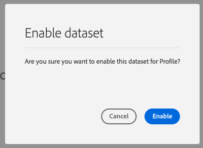

# 2.3 データセットの設定

この演習では、プロファイル情報と顧客の行動を取得して保存するために必要なデータセットを設定します。 こので作成するすべてのデータセットは、前の手順で作成したスキーマの 1 つを使用します。

## Story

質問に対する回答を定義した後 **この顧客は誰ですか？** および **この顧客の役割** 次のような場合、Adobe Experience Platformに送信されたデータを受信および検証するには、この情報を使用するバケットを作成する必要があります。

## 2.3.1 — データセットの作成

次に、2 つのデータセットを作成する必要があります。

- 1 個のデータセットを使用して、 **この顧客は誰ですか？**  — 質問。
- 1 個のデータセットを使用して、 **この顧客の役割**  — 質問。

次の URL に移動して、Adobe Experience Platformにログインします。 [https://experience.adobe.com/platform](https://experience.adobe.com/platform).

ログイン後、Adobe Experience Platformのホームページに移動します。

続行する前に、 **[!UICONTROL サンドボックス]**. 選択するサンドボックスの名前はです ``--module2sandbox--``. これを行うには、 **[!UICONTROL 実稼動版]** 画面の上の青い線で表示されます。 適切な [!UICONTROL サンドボックス]画面が変更され、専用の [!UICONTROL サンドボックス].

Adobe Experience Platformで、 **[!UICONTROL データセット]** をクリックします。  次の内容が表示されます。

まず、Web サイトの登録情報を取り込むデータセットを作成します。

新しいデータセットを作成する必要があります。 新しいデータセットを作成するには、「 」ボタンをクリックします **[!UICONTROL +データセットを作成]**.

次の **[!UICONTROL +データセットを作成]** ボタンをクリックすると、次の画面が表示されます。

前の手順で定義したスキーマからデータセットを定義する必要があります。 次をクリック： **[!UICONTROL スキーマからデータセットを作成]**  — オプション。

次の画面で、1 で作成したスキーマを選択する必要があります。 `--demoProfileLdap-- - Demo System - Profile Schema for Website`.

スキーマを選択したら、 **[!UICONTROL 次へ]** をクリックして続行します。

データセットに名前を付けましょう。

データセットの名前として、次を使用します。

`--demoProfileLdap-- - Demo System - Profile Dataset for Website`

例えば、ldap の場合は **[!UICONTROL バンジェルー]**&#x200B;には、スキーマの名前を指定します。

**[!UICONTROL vangeluw - Demo System - Web サイトのプロファイルデータセット]**

これにより、次のような情報が得られます。

クリック **[!UICONTROL 完了]** をクリックして、データセットの設定を完了します。

次の内容が表示されます。

に戻ります。 [!UICONTROL データセット] 概要。 作成したデータセットが概要にポップアップ表示されます。

次に、Web サイトでのインタラクションをキャプチャする 2 つ目のデータセットを設定します。

新しいデータセットを作成する必要があります。 新しいデータセットを作成するには、「 」ボタンをクリックします **[!UICONTROL +データセットを作成]**.

次の **[!UICONTROL +データセットを作成]** ボタンをクリックすると、次の画面が表示されます。

前の手順で定義したスキーマからデータセットを定義する必要があります。 次をクリック： **[!UICONTROL スキーマからデータセットを作成]**  — オプション。

次の画面で、2.2 で作成したスキーマを選択する必要があります。 `--demoProfileLdap-- - Demo System - Event Schema for Website`.

スキーマを選択したら、 **[!UICONTROL 次へ]** をクリックして続行します。

データセットに名前を付けましょう。

データセットの名前として、次のものを使用します。

`--demoProfileLdap-- - Demo System - Event Dataset for Website`

例えば、ldap の場合は **[!UICONTROL バンジェルー]**&#x200B;には、スキーマの名前を指定します。

**[!UICONTROL vangeluw — デモシステム — Web サイトのイベントデータセット]**

これにより、次のような情報が得られます。

クリック **[!UICONTROL 完了]** をクリックして、データセットの設定を完了します。

次の内容が表示されます。

に戻ります。 [!UICONTROL データセット] 概要画面。

次に、データセットをAdobe Experience Platformのリアルタイム顧客プロファイルに含める必要があります。

データセットを開く `--demoProfileLdap--`  — デモシステム — Web サイトのプロファイルデータセットをクリックします。

を [!UICONTROL プロファイル] 画面の右側にある切り替えアイコン。

次をクリック： [!UICONTROL プロファイル] このデータセットを有効にする切り替え [!UICONTROL プロファイル].

次をクリック： **[!UICONTROL 有効にする]**.

データセットが有効になりました [!UICONTROL プロファイル].

データセットの概要に戻り、データセットを開きます。 `--demoProfileLdap-- - Demo System - Event Dataset` をクリックします。

を [!UICONTROL プロファイル] 画面の右側にある切り替えアイコン。

次をクリック： [!UICONTROL プロファイル] 有効に切り替え [!UICONTROL プロファイル].

クリック **[!UICONTROL 有効にする]**.

データセットが有効になりました [!UICONTROL プロファイル].

次のステップ： [2.4 オフラインソースからのデータ取り込み](./ex4.md)

[モジュール 2 に戻る](./data-ingestion.md)

[すべてのモジュールに戻る](../../overview.md)
