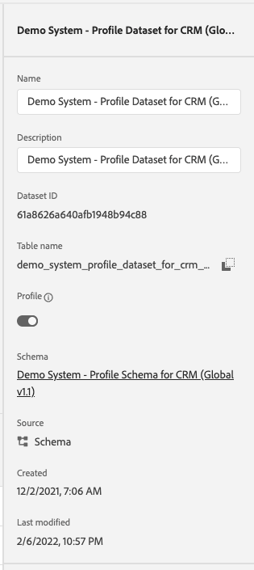
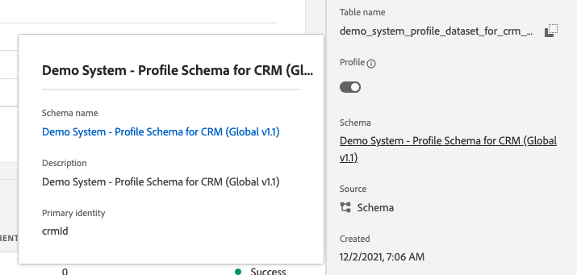
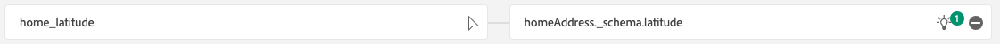
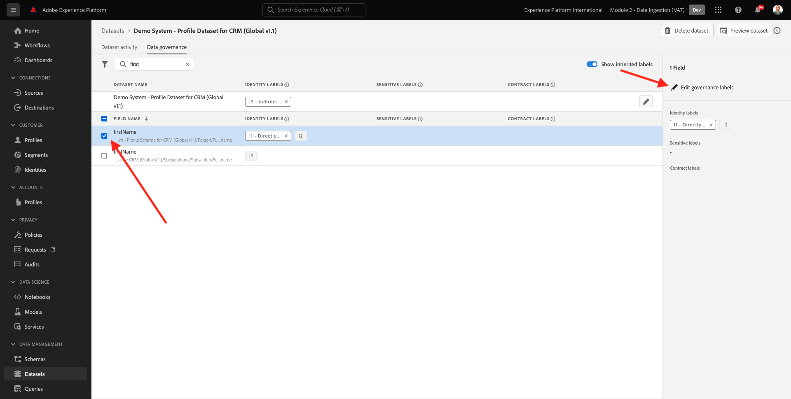

# 2.4 オフラインソースからのデータ取り込み

この演習では、Platform の CRM データなどの外部データをオンボーディングすることを目的としています。

## 学習内容

- テストデータの生成方法を説明します
- CSV の取り込み方法を説明します
- ワークフローを通じたデータ取り込みで Web UI を使用する方法を説明します
- Experience Platform

## リソース

- Mockaroo UI: [https://www.mockaroo.com/](https://www.mockaroo.com/)
- Experience PlatformUI: [https://experience.adobe.com/platform/](https://experience.adobe.com/platform/)

## タスク

- デモ日付を含む CSV ファイルを作成します。 使用可能なワークフローを使用して、Adobe Experience Platformで CSV ファイルを取り込みます。
- Adobe Experience Platformのデータガバナンスオプションの理解

## 2.4.1 データジェネレーターツールを使用した CRM データセットの作成

そのためには、1,000 行の CRM データが必要です。

次に移動して Mockaroo テンプレートを開きます。 [https://www.mockaroo.com/12674210](https://www.mockaroo.com/12674210).

テンプレートには、次のフィールドが表示されます。

- ID
- first_name
- last_name
- 電子メール
- gender
- birthDate
- home_latitude
- home_longitude
- country_code
- 都市
- 国

これらのフィールドはすべて、Platform と互換性のあるデータを生成するように定義されています。

CSV ファイルを生成するには、 **[!UICONTROL データをダウンロード]** ボタンをクリックします。

Microsoft Excel で CSV ファイルを開き、内容を視覚化します。

CSV ファイルの準備が整ったら、XDM に対するマッピングを続行できます。

### 2.4.2 Adobe Experience Platformでの CRM オンボーディングデータセットの確認

開く [Adobe Experience Platform](https://experience.adobe.com/platform) そして、 **[!UICONTROL データセット]**.

続行する前に、 **[!UICONTROL サンドボックス]**. 選択するサンドボックスの名前はです ``--module2sandbox--``. これを行うには、 **[!UICONTROL 実稼動版]** 画面の上の青い線で表示されます。 適切な [!UICONTROL サンドボックス]画面が変更され、専用の [!UICONTROL サンドボックス].

Adobe Experience Platformで、 **[!UICONTROL データセット]** をクリックします。

このイネーブルメントでは、共有データセットを使用します。 共有データセットは既に作成されており、と呼ばれています。 **[!UICONTROL デモシステム — CRM 用のプロファイルデータセット (Global v1.1)]**.

データセットを開く **[!UICONTROL デモシステム — CRM 用のプロファイルデータセット (Global v1.1)]**.

概要画面には、3 つの主な情報が表示されます。

まず、 [!UICONTROL データセットアクティビティ] ダッシュボードには、データセット内の CRM レコードの合計数と、取り込んだバッチとそのステータスが表示されます

次に、ページを下にスクロールして、データのバッチが取り込まれたタイミング、転送されたレコード数、およびバッチが正常に転送されたかどうかを確認できます。 この **[!UICONTROL バッチ ID]** は特定のバッチジョブの識別子で、 **[!UICONTROL バッチ ID]** は、特定のバッチが正常にオンボードされなかった理由のトラブルシューティングに使用できるので、重要です。

最後に、 [!UICONTROL データセット情報] タブには、 [!UICONTROL データセット ID] （トラブルシューティングの観点からも重要）、データセットの名前、およびデータセットがプロファイルに対して有効になっていたかどうか。

ここで最も重要な設定は、データセットとスキーマの間のリンクです。 スキーマは、取り込むデータとそのデータの表示方法を定義します。

この場合、 **[!UICONTROL デモシステム — CRM 用のプロファイルスキーマ（グローバル v1.1）]**: **[!UICONTROL プロファイル]** とは、フィールドグループとも呼ばれる拡張機能を実装しています。

スキーマ名をクリックすると、 [!UICONTROL スキーマ] 概要とは、このスキーマに対してアクティブ化されたすべてのフィールドを確認できる場合です。

すべてのスキーマには、カスタムのプライマリ記述子を定義する必要があります。 CRM データセットの場合、スキーマはフィールドを定義しています **[!UICONTROL crmId]** はプライマリ識別子である必要があります。 スキーマを作成し、 [!UICONTROL リアルタイム顧客プロファイル]カスタム [!UICONTROL フィールドグループ] はプライマリ記述子を参照します。

上記のスクリーンショットでは、記述子が `--aepTenantId--.identification.core.crmId`: [!UICONTROL プライマリ識別子]、 [!UICONTROL 名前空間] / **[!UICONTROL デモシステム — CRMID]**.

すべてのスキーマ、その他、 [!UICONTROL リアルタイム顧客プロファイル] 一人にするべきだ [!UICONTROL プライマリ識別子]. この [!UICONTROL プライマリ識別子] は、そのデータセットに含まれる顧客の、ブランドごとの識別子ユーザーです。 CRM データセットの場合は、電子メールアドレスまたは CRM ID で、コールセンターデータセットの場合は、顧客の携帯電話番号です。

ベストプラクティスは、各データセットに対して個別の特定のスキーマを作成し、ブランドが使用する現在のソリューションの動作に合わせて、各データセットの記述子を設定することです。

### 2.4.3 ワークフローを使用した XDM スキーマへの CSV ファイルのマッピング

この目的は、Platform で CRM データをオンボーディングすることです。 Platform で取り込まれるすべてのデータは、特定の XDM スキーマに対してマッピングする必要があります。 現在の CSV データセットは、片側に 1000 行のデータセット、もう一方の側に 1000 行のデータセットがリンクされています。 その CSV ファイルをそのデータセットに読み込むには、マッピングをおこなう必要があります。 このマッピングの演習を容易にするために、 **[!UICONTROL ワークフロー]** Adobe Experience Platformで利用できます。

この [!UICONTROL ワークフロー] ここで使用するのは、 [!UICONTROL ワークフロー] 名前付き **[!UICONTROL CSV を XDM スキーマにマッピング]** 内 [!UICONTROL データ取り込み] メニュー

次をクリック： **[!UICONTROL CSV を XDM スキーマにマッピング]** 」ボタンをクリックします。 クリック **[!UICONTROL 起動]** をクリックしてプロセスを開始します。

次の画面で、ファイルを取り込むデータセットを選択する必要があります。 既存のデータセットを選択するか、新しいデータセットを作成するかを選択できます。 この演習では、既存のものを再利用します。選択してください **[!UICONTROL デモシステム — CRM 用のプロファイルデータセット (Global v1.1)]** 以下に示すように、その他の設定はデフォルトのままにします。

クリック **[!UICONTROL 次へ]** 次の手順に進みます。

CSV ファイルをドラッグ&amp;ドロップするか、 **[!UICONTROL 参照]** お使いのコンピューター上でデスクトップに移動し、CSV ファイルを選択します。

CSV ファイルを選択すると、すぐにアップロードされ、数秒以内にファイルのプレビューが表示されます。

クリック **[!UICONTROL 次へ]** 次の手順に進みます。 ファイルが完全に処理されるまで、数秒かかる場合があります。

次に、CSV 列ヘッダーを、 **[!UICONTROL デモシステム — CRM 用プロファイルデータセット]**.

Adobe Experience Platformは、リンクを試みて、既にいくつかの提案を行っています [!UICONTROL ソース属性] と [!UICONTROL ターゲットスキーマフィールド].

の [!UICONTROL スキーママッピング]、Adobe Experience Platformは既にフィールドをリンクしようとしました。 しかし、マッピングの提案がすべて正しいとは限りません。 次の操作が必要です。 **ターゲットフィールドを承認** 1 つずつ。

#### birthDate

「ソーススキーマ」フィールド **birthDate** ターゲットフィールドにリンクする必要があります **person.birthDate**.

#### 都市

「ソーススキーマ」フィールド **市区町村** ターゲットフィールドにリンクする必要があります **homeAddress.city**.

#### 国

「ソーススキーマ」フィールド **国** ターゲットフィールドにリンクする必要があります **homeAddress.country**.

#### country_code

「ソーススキーマ」フィールド **country_code** ターゲットフィールドにリンクする必要があります **homeAddress.countryCode**.

#### 電子メール

「ソーススキーマ」フィールド **電子メール** ターゲットフィールドにリンクする必要があります **personalEmail.address**.

#### crmid

「ソーススキーマ」フィールド** crmid**は、ターゲットフィールドにリンクされている必要があります **`--aepTenantId--`.identification.core.crmId**.

#### first_name

「ソーススキーマ」フィールド **first_name** ターゲットフィールドにリンクする必要があります **person.name.firstName**.

#### 性別

「ソーススキーマ」フィールド **性別** ターゲットフィールドにリンクする必要があります **person.gender**.

#### home_latitude

「ソーススキーマ」フィールド **home_latitude** ターゲットフィールドにリンクする必要があります **homeAddress._schema.latitude**.

#### home_longitude

「ソーススキーマ」フィールド **home_longitude** ターゲットフィールドにリンクする必要があります **homeAddress._schema.longitude**.

#### ID

「ソーススキーマ」フィールド **id** ターゲットフィールドにリンクする必要があります **_id**.

#### last_name

「ソーススキーマ」フィールド **last_name** ターゲットフィールドにリンクする必要があります **person.name.lastName**.

これで、次のようになります。

次をクリック： **[!UICONTROL 完了]** ボタンをクリックして、ワークフローを終了します。

クリック後 **[!UICONTROL 完了]**&#x200B;その後、 **データフロー** 概要を参照し、数分後に画面を更新して、ワークフローが正常に完了したかどうかを確認できます。 クリック **ターゲットデータセット名**.

次に、取り込みが処理されたデータセットが表示されます。

データセットに、 [!UICONTROL バッチ ID] 現在取り込まれているレコード数は 1,000 件で、ステータスは **[!UICONTROL 成功]**.

をクリックします。 **[!UICONTROL データセットをプレビュー]** — ボタンを使用して、読み込まれたデータが正しいことを確認する、データセットの小さなサンプルをすばやく表示します。

データが読み込まれたら、データセットに対して適切なデータガバナンスアプローチを定義できます。

### 2.5.4 データセットへのデータガバナンスの追加

顧客データを取り込んだら、このデータセットが使用および書き出しの制御に適して管理されていることを確認する必要があります。 をクリックします。 **[!UICONTROL データガバナンス]** 」タブに移動して、次の 3 種類の制限を設定できることを確認します。契約上、ID 上、機密データについて説明します。

様々なラベルの詳細と、今後どのように適用されるかについては、このリンクのポリシーフレームワークを参照してください。 [https://www.adobe.io/apis/experienceplatform/home/dule/duleservices.html](https://www.adobe.io/apis/experienceplatform/home/dule/duleservices.html)

データセット全体の ID データを制限しましょう。 データセット名の上にマウスポインターを置き、鉛筆アイコンをクリックして設定を編集します。

に移動します。 **[!UICONTROL ID データ]** そして、 **[!UICONTROL I2]** オプションがオンの場合 — このデータセット内のすべての情報が、少なくとも個人を間接的に特定できるものであると想定します。

クリック **[!UICONTROL 変更を保存]** そして見て下さい **[!UICONTROL I2]** データセット内のすべてのデータフィールドに対してが設定されるようになりました。

これらのフラグを個々のデータフィールド ( **[!UICONTROL firstName]** フィールドは、 **[!UICONTROL I1]** 直接識別可能な情報のレベル。

フィールドを選択 **[!UICONTROL firstName]** チェックボックスをオンにし、 **[!UICONTROL ガバナンスラベルを編集]** をクリックします。

に移動します。 **[!UICONTROL ID データ]** そして、 **[!UICONTROL I2]** オプションは既にオンになっています（データセットから継承）。 フィールド firstName もフィールド固有の設定を持ち、 **[!UICONTROL I1 — 直接識別可能なデータ]**.

これで、Adobe Experience Platformで CRM データを正常に取り込み、分類することができました。

次のステップ： [2.5 データランディングゾーン](./ex5.md)

[モジュール 2 に戻る](./data-ingestion.md)

[すべてのモジュールに戻る](../../overview.md)
