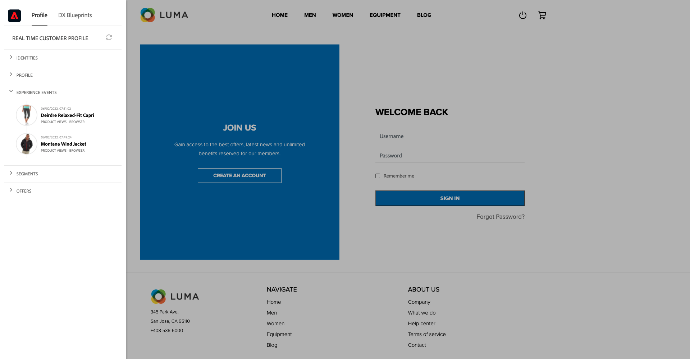

# 3.1 不明から Web サイト上の既知まで

## コンテキスト

未知から既知へのジャーニーは、最近のブランドの中で最も重要なトピックの 1 つで、獲得から定着までのカスタマージャーニーです。

Adobe Experience Platformはこの旅で大きな役割を果たしています。 プラットフォームはコミュニケーションの脳であり、「記録の体験システム」です。

プラットフォームとは、「顧客」という単語が、既知の顧客だけではなく、幅広い環境を指します。 Web サイト上の不明な訪問者は、Platform の観点からの顧客でもあるので、不明な訪問者としての行動もすべて Platform に送信されます。 このアプローチにより、訪問者が最終的に既知の顧客になったとき、ブランドはその時点以前の出来事も視覚化できます。 これは、アトリビューションとエクスペリエンスの最適化の観点から役立ちます。

## カスタマージャーニーフロー

に移動します。 [https://builder.adobedemo.com/projects](https://builder.adobedemo.com/projects). Adobe IDでログインすると、次の内容が表示されます。 Web サイトプロジェクトをクリックして開きます。

の **スクリーン** ページ、クリック **実行**.

次に、デモ Web サイトが開いているのがわかります。 URL を選択して、クリップボードにコピーします。

新しい匿名ブラウザーウィンドウを開きます。

前の手順でコピーしたデモ Web サイトの URL を貼り付けます。 その後、Adobe IDを使用してログインするように求められます。

アカウントのタイプを選択し、ログインプロセスを完了します。

Web サイトが匿名ブラウザーウィンドウに読み込まれます。 デモ Web サイトの URL を読み込むには、新しい匿名ブラウザーウィンドウを使用する必要があります。

画面の左上隅にあるAdobeロゴアイコンをクリックして、プロファイルビューアを開きます。

プロファイルビューアパネルと、リアルタイム顧客プロファイルを **Experience CloudID** を、現在不明なこの顧客の主な識別子として使用する。

また、顧客の行動に基づいて収集されたすべてのエクスペリエンスイベントを表示することもできます。 リストは現在空ですが、まもなく変更されます。

次に移動： **メン** 製品カテゴリ。 次に、製品をクリックします。 **Montana Wind Jacket**.

製品の詳細ページが表示されます。 タイプのエクスペリエンスイベント **製品表示** は、モジュール 1 で確認した Web SDK 実装を使用して、Adobe Experience Platformに送信されるようになりました。

プロバイルビューアパネルを開き、 **エクスペリエンスイベント**.

に戻ります。 **女性** カテゴリページで別の製品をクリックします。 別のエクスペリエンスイベントがAdobe Experience Platformに送信されました。

プロファイルビューアパネルを開きます。 これで、次のタイプの 2 つのエクスペリエンスイベントが表示されます **製品表示**. この動作は匿名ですが、クリックごとに追跡し、Adobe Experience Platformに保存することができます。 匿名顧客が認識されたら、すべての匿名行動を知名プロファイルに自動的に結合できます。

登録/ログインページに移動します。 クリック **アカウントの作成**.

詳細を入力し、 **登録** その後、前のページにリダイレクトされます。

プロファイルビューアパネルを開き、リアルタイム顧客プロファイルに移動します。 プロファイルビューアパネルに、新しく追加された E メールや電話番号など、すべての個人データが表示されます。

プロファイルビューアパネルで、エクスペリエンスイベントに移動します。 前に表示した 2 つの製品がプロファイルビューアパネルに表示されます。 これらのイベントは両方とも、「既知」のプロファイルにも接続されました。

これで、データをAdobe Experience Platformに取り込み、そのデータを ECID や電子メールアドレスなどの識別子にリンクしました。 この目的は、今後の作業のビジネスコンテキストを理解することです。 次の演習では、データの取り込みを可能にするために必要なすべての設定を開始します。

### モバイルアプリをナビゲートする

既知の顧客になったら、モバイルアプリの使用を開始します。 iPhoneでモバイルアプリを開き、アプリにログインします。

アプリを今までインストールしていない場合、またはアプリのインストール方法を覚えていない場合は、こちらを参照してください。 [0.5 モバイルアプリを使用する](../module0/ex5.md)

指示に従ってアプリをインストールすると、Luma ブランドが読み込まれたアプリのランディングページが表示されます。 画面の左上にあるアカウントアイコンをクリックします。

ログイン画面で、デスクトップ Web サイトで使用した電子メールアドレスを使用してログインします。 「**ログイン**」をクリックします。

アプリのホーム画面に移動し、クリックして製品を開きます。

製品の詳細ページが表示されます。

アプリケーションのホーム画面に移動し、画面の左にスワイプして、プロファイルビューアパネルを表示します。 その後、先ほど表示した製品が **エクスペリエンスイベント** セクションに追加し、以前の web サイトセッションからのすべての製品表示を含めます。

次に、デスクトップコンピューターに戻り、ホームページを更新します。その後、製品も表示されます。

これで、データをAdobe Experience Platformに取り込み、そのデータを ECID や電子メールアドレスなどの識別子にリンクしました。 この練習の目的は、今後の作業のビジネスコンテキストを理解することでした。 これで、リアルタイムのクロスデバイス対応顧客プロファイルを効果的に構築できました。 次の演習では、Adobe Experience Platformでプロファイルを視覚化します。

次のステップ： [3.2 自身のリアルタイム顧客プロファイルの視覚化 — UI](./ex2.md)

[モジュール 3 に戻る](./real-time-customer-profile.md)

[すべてのモジュールに戻る](../../overview.md)
