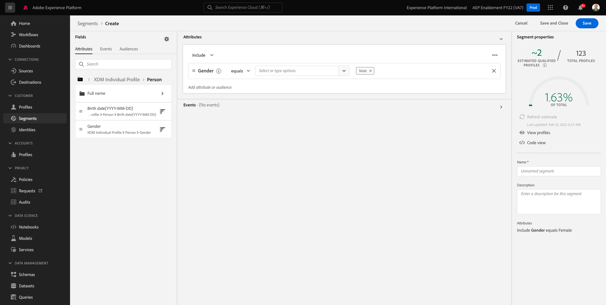

# 3.4 セグメントの作成 — UI

この演習では、Adobe Experience Platformのセグメントビルダーを使用してセグメントを作成します。

## Story

に移動します。 [Adobe Experience Platform](https://experience.adobe.com/platform). ログイン後、Adobe Experience Platformのホームページに移動します。


続行する前に、 **サンドボックス**. 選択するサンドボックスの名前はです ``--aepSandboxId--``. これを行うには、 **[!UICONTROL 実稼動版]** 画面の上の青い線で表示されます。 適切な [!UICONTROL サンドボックス]画面が変更され、専用の [!UICONTROL サンドボックス].


左側のメニューで、に移動します。 **セグメント**. このページでは、既存のすべてのセグメントの概要を確認できます。 をクリックします。 **+セグメントを作成** ボタンをクリックして、新しいセグメントの作成を開始します。


新しいセグメントビルダーに移動すると、 **属性** メニューオプションと **XDM 個人プロファイル** 参照。


XDM はエクスペリエンスビジネスを強化する言語なので、XDM もセグメントビルダーの基盤です。 Platform で取り込まれるすべてのデータは XDM に対してマッピングする必要があり、そのため、データの取得元に関係なく、すべてのデータは同じデータモデルの一部になります。 これにより、セグメントを作成する際に大きなメリットが得られます。この 1 つのセグメントビルダー UI から、同じワークフロー内の任意の接触チャネルからのデータを組み合わせることができます。 セグメントビルダーで作成したセグメントは、Adobe Target、Adobe Campaign、Adobe Audience Managerなどのソリューションに送信してアクティベーションできます。

セグメントを作成し、 **男性** 顧客。

gender 属性に到達するには、XDM について理解し、理解する必要があります。

「性別」は「属性」の下にある「個人」の属性です。 そこに行くには、まず **XDM 個人プロファイル**. これが見えます 次の **XDM 個人プロファイル** ウィンドウ：選択 **人物**.


これが見えます In **人物**&#x200B;を使用する場合、 **性別** 属性。 「性別」属性をセグメントビルダーにドラッグします。


事前入力されたオプションから特定の性別を選択できるようになりました。 この場合は、次を選択します。 **男性**.


選択後 **男性**&#x200B;に値を入力すると、 **推定を更新** 」ボタンをクリックします。 これは、ビジネスユーザーにとって非常に役立ち、結果のセグメントサイズに対する特定の属性の影響を確認できます。


その後、次のような推定値が表示されます。



次に、セグメントを少し絞り込む必要があります。 製品を閲覧したすべての男性の顧客のセグメントを作成する必要があります **Proteus Fitness Jackshirt (Orange)**.

このセグメントを構築するには、エクスペリエンスイベントを追加する必要があります。 すべてのエクスペリエンスイベントは、 **イベント** アイコン **フィールド** メニューバー


次に、最上位レベルが表示されます。 **XDM ExperienceEvents** ノード。 クリック **XDM ExperienceEvent**.


に移動します。 **製品リスト項目**.


選択 **名前** をクリックし、 **名前** オブジェクトをセグメントビルダーキャンバス上から **イベント** 」セクションに入力します。


次の内容が表示されます。


比較パラメーターは次のようにする必要があります。 **次と等しい** 入力フィールドに、 **モンタナ風上着**.


セグメントビルダーに要素を追加するたびに、 **推定を更新** 」ボタンを使用して、セグメント内の母集団の新しい推定を取得します。

これまで、UI を使用してセグメントを作成しただけですが、セグメントを作成するためのコードオプションも用意されています。

セグメントを作成する際に、実際にはプロファイルクエリ言語 (PQL) クエリを作成しています。 PQL コードを視覚化するには、 **コードビュー** セグメントビルダーの右上隅にあるスイッチャー。


これで、完全な PQL 文が表示されます。

```sql
person.gender in ["male"] and CHAIN(xEvent, timestamp, [C0: WHAT(productListItems.exists(name.equals("MONTANA WIND JACKET", false)))])
```

また、このセグメントに含まれる顧客プロファイルのサンプルをプレビューするには、 **プロファイルの表示**.


最後に、セグメントに名前を付けて保存します。

命名規則として、次を使用します。

- `--demoProfileLdap-- - Male customers with interest in Montana Wind Jacket`


次に、 **保存して閉じる** 」ボタンをクリックしてセグメントを保存します。その後、セグメントの概要ページに戻ります。


次の演習に進み、API を使用してセグメントを作成できるようになりました。

次のステップ： [3.5 セグメントの作成 — API](./ex5.md)

[モジュール 3 に戻る](./real-time-customer-profile.md)

[すべてのモジュールに戻る](../../overview.md)
