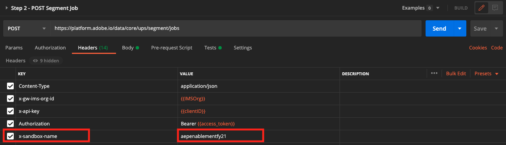

# 3.5 セグメントの作成 — API

この演習では、PostmanとAdobe I/Oを使用し、Adobe Experience Platformの API を使用してセグメントを作成し、そのセグメントの結果をデータセットとして保存します。

## Story

リアルタイム顧客プロファイルでは、すべてのプロファイルデータが、イベントデータと既存のセグメントメンバーシップと共に表示されます。 表示されるデータは、Adobe・アプリケーションや外部ソリューションなど、どこからでも取得できます。 これは、過去最高のエクスペリエンスシステムであるAdobe Experience Platformで最も強力なビューです。

## 演習 3.5.1 - Platform API を使用してセグメントを作成する

Postmanに移動します。

次のコレクションを探します。 **Adobe Experience Platform有効化 (_E)**. このコレクションには、フォルダーが表示されます **2. セグメント**. この演習では、これらのリクエストを使用します。


次に、API を使用してセグメントを作成するために必要なすべての手順に従います。 簡単なセグメントを作成します。&quot;**ldap**  — 女性のお客さん全員»。

### 手順 1 — セグメント定義の作成

次の名前のリクエストをクリックします。 **手順 1 — プロファイル：セグメント定義の作成**.


次に進みます。 **本文** 」セクションに表示されます。


内 **本文** このリクエストには、次の情報が含まれます。


このリクエストに使用する言語は、プロファイルクエリ言語と呼ばれます。または、 **PQL**.

PQL に関する詳細およびドキュメントを確認できます [ここ](https://experienceleague.adobe.com/docs/experience-platform/segmentation/pql/overview.html?lang=ja).


注意：変数を更新してください **名前** 以下のリクエストで、 **ldap** を **ldap**.

```json
{
    "name" : "ldap - API - All Female Customer",
    "expression" : {"type":"PQL", "format":"pql/json", "value":"{\"nodeType\":\"fnApply\",\"fnName\":\"in\",\"params\":[{\"nodeType\":\"fieldLookup\",\"fieldName\":\"gender\",\"object\":{\"nodeType\":\"fieldLookup\",\"fieldName\":\"person\",\"object\":{\"nodeType\":\"literal\",\"literalType\":\"XDMObject\",\"value\":\"profile\"}}},{\"literalType\":\"List\",\"nodeType\":\"literal\",\"value\":[\"female\"]}]}"},
    "createdBy": "ldap",
    "schema" : { "name" : "_xdm.context.profile"},
    "ttlInDays" : 90
}
```

特定の **ldap**&#x200B;の場合、本文は次のようになります。

```json
{
    "name" : "vangeluw - API - All Female Customer",
    "expression" : {"type":"PQL", "format":"pql/json", "value":"{\"nodeType\":\"fnApply\",\"fnName\":\"in\",\"params\":[{\"nodeType\":\"fieldLookup\",\"fieldName\":\"gender\",\"object\":{\"nodeType\":\"fieldLookup\",\"fieldName\":\"person\",\"object\":{\"nodeType\":\"literal\",\"literalType\":\"XDMObject\",\"value\":\"profile\"}}},{\"literalType\":\"List\",\"nodeType\":\"literal\",\"value\":[\"female\"]}]}"},
    "createdBy": "vangeluw",
    "schema" : { "name" : "_xdm.context.profile"},
    "ttlInDays" : 90
}
```

また、 **ヘッダー**  — リクエストのフィールド。 に移動します。 **ヘッダー**. 次の内容が表示されます。


| キー | 値 |
| -------------- | ------------------ |
| x-sandbox-name | `--aepSandboxId--` |

>[!NOTE]
>
>使用しているAdobe Experience Platformサンドボックスの名前を指定する必要があります。 x-sandbox-name は次のようになっている必要があります。 `--aepSandboxId--`.

次に、青色をクリックします **送信** ボタンをクリックしてセグメントを作成し、その結果を表示します。


この手順の後、Platform UI でセグメント定義を表示できます。 これを確認するには、Adobe Experience Platformにログインし、 **セグメント**.


### 手順 2 — セグメントジョブのPOST

前の練習では、 _ストリーミング_ セグメント。 ストリーミングセグメントは、リアルタイムで継続的に資格を評価します。 ここで何をしているかは、 _バッチ_ セグメント。 バッチセグメントでは、資格に関してセグメントがどのように表示されるかをプレビューできますが、 _セグメントが実際に実行されたとは限りません_. 現在、 _このセグメントに適合するユーザーがいません_. 顧客を適格とするには、バッチセグメントを実行する必要があります。これは、ここでおこなう操作です。

次に、セグメントジョブをPOSTします。

Postmanに移動します。


Postmanコレクションで、 **手順 2 -POSTセグメントジョブ** をクリックして開きます。


また、 **ヘッダー**  — リクエストのフィールド。 に移動します。 **ヘッダー**. 次の内容が表示されます。



| キー | 値 |
| -------------- | ------------------ |
| x-sandbox-name | `--aepSandboxId--` |

>[!NOTE]
>
>使用しているAdobe Experience Platformサンドボックスの名前を指定する必要があります。 x-sandbox-name は次のようになっている必要があります。 `--aepSandboxId--`.

青をクリック **送信** 」ボタンをクリックします。

同様の結果が表示されます。


このセグメントジョブは現在実行中です。この処理には時間がかかる場合があります。 手順 3 で、このジョブのステータスを確認できます。


### 手順 3 -GETセグメントジョブのステータス

Postmanに移動します。


Postmanコレクションで、 **手順 3 -GETセグメントジョブのステータス**.


また、 **ヘッダー**  — リクエストのフィールド。 に移動します。 **ヘッダー**. 次の内容が表示されます。


| キー | 値 |
| -------------- | ------------------ |
| x-sandbox-name | `--aepSandboxId--` |

>[!NOTE]
>
>使用しているAdobe Experience Platformサンドボックスの名前を指定する必要があります。 x-sandbox-name は次のようになっている必要があります。 `--aepSandboxId--`.

青をクリック **送信** 」ボタンをクリックします。

同様の結果が表示されます。


この例では、 **ステータス** の **待機中**.

青色をクリックして、このリクエストを繰り返します。 **送信** ボタンを数分ごとに押してから **ステータス** が **成功**.


ステータスが **成功**&#x200B;に設定されている場合、セグメントジョブは実行され、顧客はセグメントの条件を満たしています。

おめでとうございます。セグメント化の演習は正常に完了しました。 次に、企業全体でリアルタイム顧客プロファイルをアクティブ化する方法を見てみましょう。

次のステップ： [3.6 コールセンターでのリアルタイム顧客プロファイルの実際の表示](./ex6.md)

[モジュール 3 に戻る](./real-time-customer-profile.md)

[すべてのモジュールに戻る](../../overview.md)
