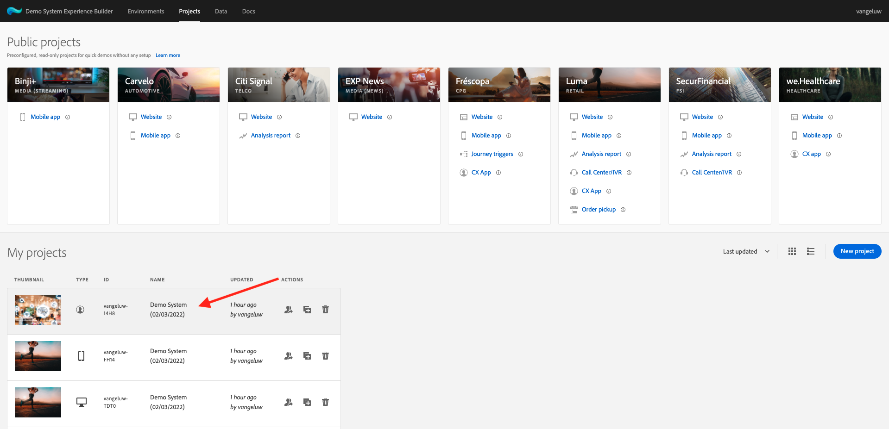

# 3.6 コールセンターでリアルタイム顧客プロファイルの動作を確認する

この演習では、カスタマージャーニーを通じて実際の顧客と同じ行動を取ることが目標です。

この Web サイトでは、Adobe Experience Platformを実装しました。 すべてのアクションはエクスペリエンスイベントと見なされ、リアルタイムでAdobe Experience Platformに送信され、リアルタイム顧客プロファイルを水増しします。

前の演習では、サイトを閲覧している匿名の顧客として開始し、いくつかの手順を実行した後、既知の顧客になりました。

同じ顧客が最終的に電話を取り、コールセンターに電話をかけると、他のチャネルの情報をすぐに利用でき、コールセンターのエクスペリエンスを関連性の高いパーソナライズできることが重要になります。

## 3.6.1 CX アプリケーションの使用

デモ・システムの一環として、コール・センター環境のシミュレーションに使用できる CX アプリのテンプレートを作成しました。 このような CX アプリケーションプロジェクトを作成するには、次の手順に従います。

に移動します。 [https://builder.adobedemo.com/projects](https://builder.adobedemo.com/projects). クリック **新規プロジェクト**.

次に、CX App プロジェクトが表示されます。 プロジェクトをクリックして開きます。

CX App プロジェクトで、に移動します。 **統合**. モジュール 0 で作成されたAdobe Experience Platform Data Collection プロパティを選択します。 を持つプロパティを選択する必要があります **（有効化）** 名前に。 次に、「**実行**」をクリックします。

これが見えます

プロファイルビューアパネルで、ID と名前空間の次の組み合わせを確認できます。

| ID | 名前空間 |
|:-------------:| :---------------:|
| Experience Cloud ID (ECID) | 12507560687324495704459439363261812234 |
| 電子メール ID | woutervangeluwe+06022022-01@gmail.com |
| モバイル番号 ID | +32473622044+06022022-01 |

顧客がコールセンターに電話する際には、電話番号を使用して顧客を識別できます。 この練習では、電話番号を使用して、CX アプリで顧客のプロファイルを取得します。

選択 **電話番号** ドロップダウンで、web サイトで使用した電話番号を入力します。 ヒット **入力**.

これで、理想的にはコールセンターに表示される情報が表示され、コールセンターの従業員が顧客と話す際にすぐにすべての関連情報を利用できるようになります。

次のステップ： [概要とメリット](./summary.md)

[モジュール 3 に戻る](./real-time-customer-profile.md)

[すべてのモジュールに戻る](../../overview.md)
