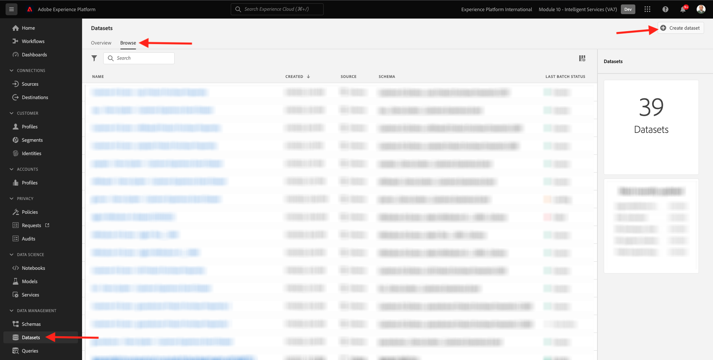
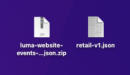

# 5.1 顧客 AI — データ準備（取り込み）

インテリジェントサービスがマーケティングイベントデータからインサイトを検出するには、データを意味的にエンリッチメントし、標準構造で維持する必要があります。 Intelligent Services は、Adobeの Experience Data Model(XDM) スキーマを活用して、これを実現します。
特に、インテリジェントサービスで使用するすべてのデータセットは、 **消費者エクスペリエンスイベント** XDM スキーマ。

## 5.1.1 スキーマの作成

この演習では、 **消費者エクスペリエンスイベントの Mixin**（で必要） **顧客 AI** インテリジェントサービス。

次の URL に移動して、Adobe Experience Platformにログインします。 [https://experience.adobe.com/platform](https://experience.adobe.com/platform).

ログイン後、Adobe Experience Platformのホームページに移動します。

続行する前に、 **サンドボックス**. 選択するサンドボックスの名前はです ``--module10sandbox--``. これを行うには、 **[!UICONTROL 実稼動版]** 画面の上の青い線で表示されます。 適切なサンドボックスを選択すると、画面が変更され、専用のサンドボックスに移動します。

左側のメニューから、 **スキーマ** そして、 **参照**. クリック **スキーマを作成**.

ポップアップで、 **XDM ExperienceEvent**.

これが見えます

以下を検索して選択します。 **Mixin** このスキーマに追加するには：

- 消費者エクスペリエンスイベント

   

- エンドユーザー ID の詳細

   

クリック **フィールドグループの追加**.

これが見えます Mixin を選択 **エンドユーザー ID の詳細**.

フィールドに移動します。 **endUserIDs._experience.emailid.id**.

フィールドの右側のメニュー **endUserIDs._experience.emailid.id**&#x200B;をクリックし、下にスクロールして **ID**、 **プライマリID** をクリックし、 **ID 名前空間** / **電子メール**.

フィールドに移動します。 **endUserIDs._experience.mcid.id**. チェックボックスをオンにします。 **ID** をクリックし、 **ID 名前空間** / **ECID**. 「**適用**」をクリックします。

今すぐスキーマに名前を付けます。

スキーマの名前として、次を使用します。

- `--demoProfileLdap-- - Demo System - Customer Experience Event`

例えば、ldap の場合は **バンジェルー**&#x200B;には、スキーマの名前を指定します。

- **vangeluw — デモシステム — 顧客体験イベント**

それはあなたにこんなものを与えるはずです。 次をクリック： **+追加** ボタンをクリックして新規追加 **Mixin**.

スキーマの名前を選択します。 次に、のスキーマを有効にする必要があります。 **プロファイル**&#x200B;をクリックし、 **プロファイル** 切り替え

これが見えます クリック **有効にする**.

これを使用します。 クリック **保存** スキーマを保存します。

## 5.1.2 データセットの作成

左側のメニューから、 **データセット** そして、 **参照**. クリック **データセットを作成**.

「**スキーマからのデータセットの作成**」をクリックします。

次の画面で、前の演習で作成したデータセット（という名前）を選択します。 **[!UICONTROL ldap — デモシステム — 顧客体験イベント]**. 「**次へ**」をクリックします。

データセットの名前として、 `--demoProfileLdap-- - Demo System - Customer Experience Event Dataset`. 「**完了**」をクリックします。

データセットが作成されました。 を有効にします。 **プロファイル** 切り替え

クリック **有効にする**.

これで、次のようになります。

これで、消費者エクスペリエンスイベントデータの取り込みを開始し、顧客 AI サービスの使用を開始する準備が整いました。

## 5.1.3 エクスペリエンスイベントのテストデータのダウンロード

一度 **スキーマ** および **データセット** これで、エクスペリエンスイベントデータを取り込む準備が整いました。 顧客 AI は **少なくとも 2 四半期**&#x200B;外部で準備されたデータを取り込む必要があります。

エクスペリエンスイベント用に準備されたデータは、 [消費者エクスペリエンスイベント XDM Mixin](https://github.com/adobe/xdm/blob/797cf4930d5a80799a095256302675b1362c9a15/docs/reference/context/experienceevent-consumer.schema.md).

サンプルデータを含むファイルを次の場所からダウンロードしてください： [https://dashboard.adobedemo.com/data](https://dashboard.adobedemo.com/data). 次をクリック： **ダウンロード** 」ボタンをクリックします。

これで、という名前のファイルがダウンロードされました。 **retail-v1-dec2020-xl.json.zip**. ファイルをコンピュータのデスクトップに配置し、解凍すると、という名前のファイルが表示されます。 **retail-v1.json**. このファイルは、次の演習で必要になります。

## 5.1.4 エクスペリエンスイベントのテストデータの取り込み

Adobe Experience Platformで、に移動します。 **データセット** を開き、という名前のデータセットを開きます。 **[!UICONTROL ldap — デモシステム — 顧客体験イベントデータセット]**.

データセットで、 **ファイルを選択** をクリックしてデータを追加します。

ポップアップで、ファイルを選択します。 **retail-v1.json** をクリックし、 **開く**.

その後、インポートされるデータが表示され、新しいバッチが **読み込み中** 状態。 ファイルがアップロードされるまで、このページから移動しないでください。

ファイルがアップロードされると、バッチのステータスが次のように変化します。 **読み込み中** から **処理中**.

データの取り込みと処理には、10 ～ 20 分かかる場合があります。

データの取り込みが成功すると、バッチのステータスは **成功**.

次のステップ： [5.2 顧客 AI — 新しいインスタンスの作成（設定）](./ex2.md)

[モジュール 5 に戻る](./intelligent-services.md)

[すべてのモジュールに戻る](./../../overview.md)
