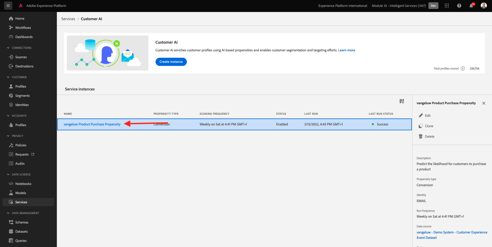
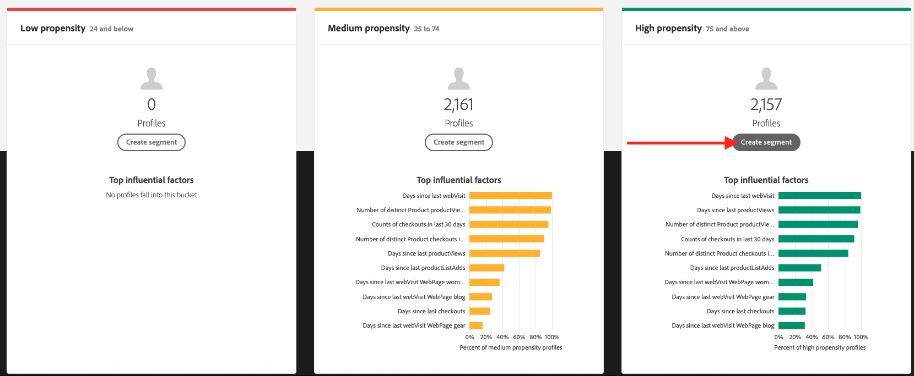

# 5.3 顧客 AI — スコアリングダッシュボードとセグメント化（予測と行動）

顧客 AI インスタンスがモデルの実行を完了すると、評価され、次の 30 日間で購入を実行した顧客を予測する傾向スコアを視覚化できます。

>[!NOTE]
>
>ステータスが **成功** を使用すると、サービスのインサイトをプレビューできます。

## 5.3.1 傾向予測

次に、顧客 AI インスタンスモデルで生成される予測される傾向を確認します。 インスタンス名をクリックして、ダッシュボードを表示します。

顧客 AI ダッシュボードには、スコア、母集団の分布および評価するモデルの影響要因に関する概要が表示されます。

影響を与える要因の上にマウスポインターを置くと、データ配分の詳細な分類が表示されます。

## 5.3.2 業務上の措置

### 5.3.2.1 顧客のセグメント化

顧客 AI ダッシュボードを使用すると、シングルクリックでセグメントを定義できます。 をクリックします。 **セグメントを作成** 」ボタンをクリックします。

セグメント定義が自動的に作成されます。

次の命名規則に従って、セグメントに名前を付けます。 `--demoProfileLdap-- - Customer AI High Propensity`. 「**保存**」をクリックします。

これで、このセグメントを、例えば、リアルタイム CDP、Journey Orchestration、Adobe Targetを使用したターゲティングに使用できます。

### 5.3.2.2 プロファイルの概要

顧客 AI 傾向スコアはリアルタイム顧客プロファイルの一部になるので、個々の顧客のスコアを表示できます。

Adobe Experience Platformで、に移動します。 **プロファイル** を選択し、 **参照**.

任意の識別子（例： ）を使用してプロファイルを検索します。 **電子メールhbirkenshawa@businessweek.com**：取り込んだ JSON ファイルに含まれる 次をクリック： **プロファイル ID** をクリックして、プロファイルを開きます。

次の内容が表示されます。

に移動します。 **属性**：顧客 AI モデルからの出力を含みます。

下にスクロールして、顧客 AI モデルで計算された傾向スコアを表示します。

次のステップ： [概要とメリット](./summary.md)

[モジュール 5 に戻る](./intelligent-services.md)

[すべてのモジュールに戻る](./../../overview.md)
