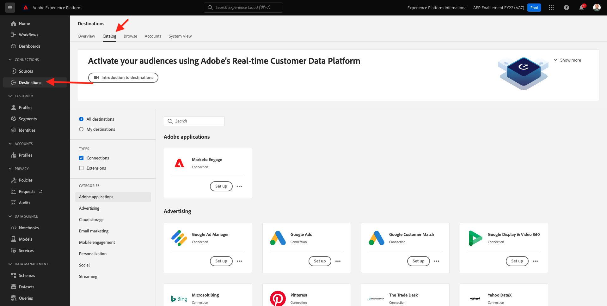

# 6.2 Google DV360 などの広告の宛先の設定

>[!IMPORTANT]
>
>以下のコンテンツは FYI として意図されています — あなたが実行します **NOT** DV360 の新しい宛先を設定する必要があります。 宛先は既に作成されています。次の演習で使用できます。

に移動します。 [Adobe Experience Platform](https://experience.adobe.com/platform). ログイン後、Adobe Experience Platformのホームページに移動します。

続行する前に、 **サンドボックス**. 選択するサンドボックスの名前はです ``--aepSandboxId--``. これを行うには、 **[!UICONTROL 実稼動版]** 画面の上の青い線で表示されます。 適切な [!UICONTROL サンドボックス]画面が変更され、専用の [!UICONTROL サンドボックス].

左側のメニューで、に移動します。 **宛先**&#x200B;を選択し、 **カタログ**. 次に、 **宛先カタログ**.

In **宛先**&#x200B;をクリックし、 **Google Display &amp; Video 360** 次に、 **+設定**.

これが見えます クリック **宛先に接続**.

次の画面で、Google DV360 の宛先を設定できます。

フィールドに値を入力します **名前** および **説明**.

フィールド **アカウント ID** が **広告主 ID** DV360 アカウントの 次の場所で確認できます。

この **アカウントタイプ** は、次のように設定する必要があります。 **広告主を招待**.

これです 「**次へ**」をクリックします。

>[!NOTE]
>
>GoogleがGoogle DV360 にデータを送信するには、Adobe Experience Platformが許可リストAdobeを必要とします。 このデータフローを有効にするには、Googleのアカウントマネージャーにお問い合わせください。

宛先を作成すると、次の内容が表示されます。 オプションで、データガバナンスポリシーを選択できます。 次に、「 **保存して終了**.

次に、使用可能な宛先のリストが表示されます。
次の演習では、前の演習で作成したセグメントをGoogle DV360 の宛先に接続します。

次のステップ： [6.3 措置をとる：セグメントを DV360 に送信します。](./ex3.md)

[モジュール 6 に戻る](./real-time-cdp-build-a-segment-take-action.md)

[すべてのモジュールに戻る](../../overview.md)
