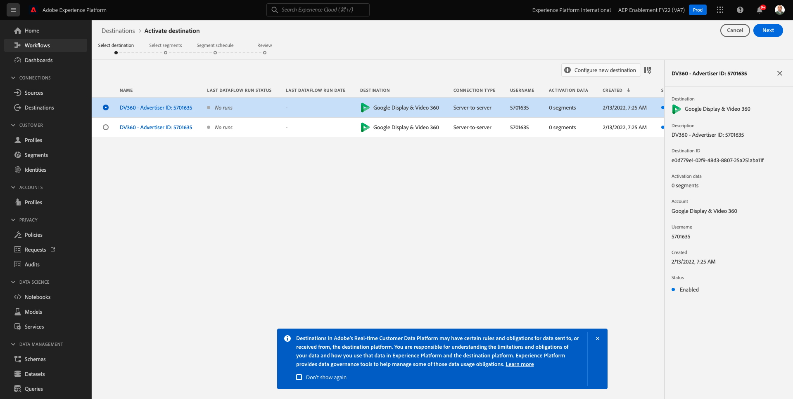

# 6.3 措置をとる：セグメントを DV360 に送信します。

に移動します。 [Adobe Experience Platform](https://experience.adobe.com/platform). ログイン後、Adobe Experience Platformのホームページに移動します。

続行する前に、 **サンドボックス**. 選択するサンドボックスの名前はです ``--aepSandboxId--``. これを行うには、 **[!UICONTROL 実稼動版]** 画面の上の青い線で表示されます。 適切な [!UICONTROL サンドボックス]画面が変更され、専用の [!UICONTROL サンドボックス].

左側のメニューで、に移動します。 **宛先**&#x200B;を選択し、 **カタログ**. 次に、 **宛先カタログ**.

In **宛先**、 **セグメントのアクティブ化** の **Google Display &amp; Video 360** カード。

宛先を選択し、 **次へ**.

使用可能なセグメントのリストで、前の演習で作成したセグメントを選択します。 「**次へ**」をクリックします。

の **セグメントスケジュール** ページ、クリック **次へ**.

最後に、 **レビュー** ページ、クリック **完了**.

これで、セグメントがGoogle DV360 にリンクされました。 顧客がこのセグメントを認定されるたびに、シグナルがGoogle DV360 に送信され、その顧客がGoogle DV360 側のオーディエンスに含まれます。

次のステップ： [6.4 措置をとる：セグメントを S3 の宛先に送信する](./ex4.md)

[モジュール 6 に戻る](./real-time-cdp-build-a-segment-take-action.md)

[すべてのモジュールに戻る](../../overview.md)
