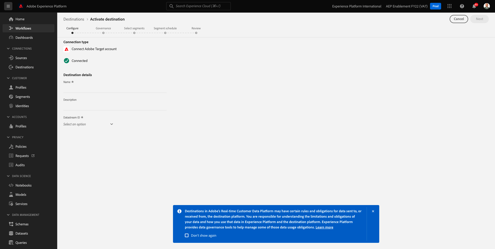

# 6.5 措置をとる：セグメントをAdobe Targetに送信

に移動します。 [Adobe Experience Platform](https://experience.adobe.com/platform). ログイン後、Adobe Experience Platformのホームページに移動します。


続行する前に、 **サンドボックス**. 選択するサンドボックスの名前はです ``--aepSandboxId--``. これを行うには、 **[!UICONTROL 実稼動版]** 画面の上の青い線で表示されます。 適切な [!UICONTROL サンドボックス]画面が変更され、専用の [!UICONTROL サンドボックス].


## 6.5.1 データストリームの検証

Real-Time CDPのAdobe Targetの宛先は、データをAdobeエッジネットワークに取り込むために使用されるデータストリームに接続されます。 Adobe Targetの宛先を設定する場合は、まず、データストリームがAdobe Targetに対して既に有効になっているかどうかを確認する必要があります。 データストリームはで設定されました。 [演習 0.2 データストリームの作成](./../module0/ex2.md) という名前の `--demoProfileLdap-- - Demo System Datastream`.

に移動します。 [https://experience.adobe.com/#/data-collection/](https://experience.adobe.com/#/data-collection/)を選択し、「 **データストリーム** または **データストリーム（ベータ版）**.


画面の右上隅で、サンドボックス名を選択します。この名前は、 `--aepSandboxId--`.


データストリームで、という名前のデータストリームを検索します。 `--demoProfileLdap-- - Demo System Datastream`. データストリームをクリックして開きます。


次に、「 **...** 次の **Adobe Experience Platform** 次に、 **編集**.


両方のチェックボックスをオンにします。 **エッジセグメント化** および **パーソナライズ機能の宛先**. 「**保存**」をクリックします。


次に、「 **+サービスを追加**.


サービスを選択 **Adobe Target**. 「**保存**」をクリックします。


これで、データストリームがAdobe Target用に設定されました。


## 6.5.2 Adobe Targetの宛先の設定

Adobe Targetは、Real-Time CDPからの宛先として利用できます。 Adobe Target統合を設定するには、に移動します。 **宛先**、 **カタログ**.


クリック **パーソナライズ** 内 **カテゴリ** メニュー 次に、 **Adobe Target** 宛先カード。 クリック **セグメントのアクティブ化** ( または **設定** （環境に応じて異なります）。


環境によっては、 **+新しい宛先を設定** をクリックして、宛先の作成を開始します。


これが見えます



内 **新しい宛先の設定** 画面では、次の 2 つを設定する必要があります。

- 名前：名前を使用 `--demoProfileLdap-- - Adobe Target (Web)`は次のようになります。 **vangeluw -Adobe Target(Web)**.
- データストリーム ID:で設定したデータストリームを選択する必要があります。 [演習 0.2 データストリームの作成](./../module0/ex2.md). データストリームの名前は次のようにする必要があります。 `--demoProfileLdap-- - Demo System Datastream`.

「**次へ**」をクリックします。


次の画面では、オプションでガバナンスポリシーを選択できます。 選択する必要はありません。この場合、選択する必要はありません。そのため、「 **作成**.


これで宛先が作成され、リストに表示されます。 宛先を選択し、 **次へ** をクリックして、宛先へのセグメントの送信を開始します。


使用可能なセグメントのリストで、で作成したセグメントを選択します。 [演習 6.1 セグメントの作成](./ex1.md)（という名前） `--demoProfileLdap-- - Interest in PROTEUS FITNESS JACKSHIRT`. 次に、「**次へ**」をクリックします。


次のページで、 **次へ**.


「**完了**」をクリックします。


これで、セグメントがAdobe Targetに対してアクティブ化されました。


>[!IMPORTANT]
>
>Real-Time CDPでAdobe Targetの宛先を作成したばかりの場合、宛先が有効になるまで最大 1 時間かかる場合があります。 これは、バックエンド設定の設定による 1 回限りの待機時間です。 最初の 1 時間の待機時間とバックエンドの設定が完了すると、Adobe Targetの宛先に送信される新しく追加されたエッジセグメントを、リアルタイムでのターゲティングに使用できるようになります。

## 6.5.3 Adobe Targetのフォームベースのアクティビティの設定

Real-Time CDPセグメントをAdobe Targetに送信するように設定したら、Adobe Targetでエクスペリエンスのターゲット設定アクティビティを設定できます。 この演習では、フォームベースのアクティビティを設定します。

Adobe Experience Cloudのホームページで、 [https://experiencecloud.adobe.com/](https://experiencecloud.adobe.com/). クリック **ターゲット** をクリックして開きます。


の **Adobe Target** ホームページには、既存のすべてのアクティビティが表示されます。


クリック **+アクティビティを作成** をクリックして、新しいアクティビティを作成します。


選択 **エクスペリエンスのターゲット設定**.


選択 **フォーム** を選択し、 **プロパティの制限がありません**. 「**次へ**」をクリックします。


これで、フォームベースのアクティビティコンポーザーになります。


フィールド **場所 1**&#x200B;を選択します。 **target-global-mbox**.


デフォルトのオーディエンスは現在 **すべての訪問者**. をクリックします。 **3 ドット** 次の **すべての訪問者** をクリックし、 **オーディエンスを変更**.


これで、使用可能なオーディエンスのリストが表示され、以前に作成してAdobe Targetに送信したAdobe Experience Platformセグメントがこのリストに含まれます。 以前にAdobe Experience Platformで作成したセグメントを選択します。 クリック **オーディエンスの割り当て**.


Adobe Experience Platformセグメントは、このエクスペリエンスのターゲット設定アクティビティの一部になりました。


次に、Web サイトのホームページでヒーロー画像を変更します。 をクリックして、の横にあるドロップダウンリストを開きます。 **デフォルトコンテンツ** をクリックし、 **HTMLオファーを作成**.


次のコードを貼り付けます。 次に、「**次へ**」をクリックします。

```javascript
<script>document.querySelector("#home > div > div > div > div > div.banner_img.d-none.d-lg-block > img").src="https://parsefiles.back4app.com/hgJBdVOS2eff03JCn6qXXOxT5jJFzialLAHJixD9/ff92fdc3885972c0090ad5419e0ef4d4_Luma - Product - Proteus - Hero Banner.png"; document.querySelector(".banner_text > *").remove()</script>
```


選択したオーディエンスの新しい画像で新しいエクスペリエンスが表示されます。


左上隅のアクティビティのタイトルをクリックして、名前を変更します。


名前には、次を使用してください。

- `--demoProfileLdap-- - RTCDP - XT (Form)`


「**次へ**」をクリックします。


の **目標と設定**  — ページ、移動 **目標指標**.


プライマリ目標を **エンゲージメント** - **サイト滞在時間**.


「**保存して閉じる**」をクリックします。


これで、 **アクティビティの概要** ページ。 アクティビティをアクティブ化する必要があります。


フィールドをクリックします。 **非アクティブ** を選択し、 **有効化**.


その後、アクティビティがライブになったことを視覚的に確認します。


これで、アクティビティがライブになり、デモ Web サイトでテストできます。

>[!IMPORTANT]
>
>Real-Time CDPでAdobe Targetの宛先を作成したばかりの場合、宛先が有効になるまで最大 1 時間かかる場合があります。 これは、バックエンド設定の設定による 1 回限りの待機時間です。 最初の 1 時間の待機時間とバックエンドの設定が完了すると、Adobe Targetの宛先に送信される新しく追加されたエッジセグメントを、リアルタイムでのターゲティングに使用できるようになります。

次にデモ Web サイトに戻り、PROTEUS FITNESS JACKSHIRT の製品ページにアクセスすると、すぐに作成したセグメントの対象になり、Adobe Targetアクティビティがリアルタイムでホームページに表示されます。


次のステップ： [6.6 外部オーディエンス](./ex6.md)

[モジュール 6 に戻る](./real-time-cdp-build-a-segment-take-action.md)

[すべてのモジュールに戻る](../../overview.md)
