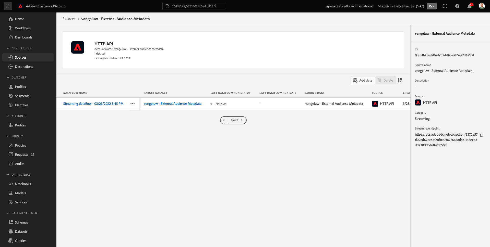
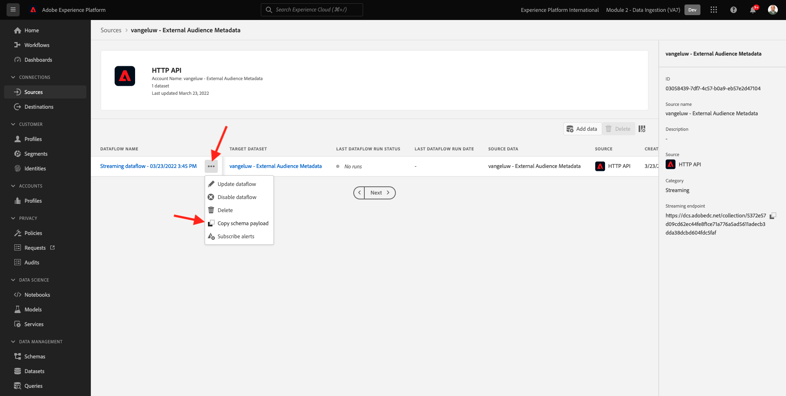
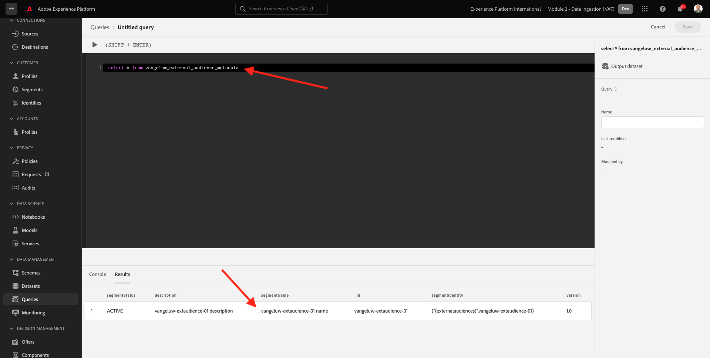
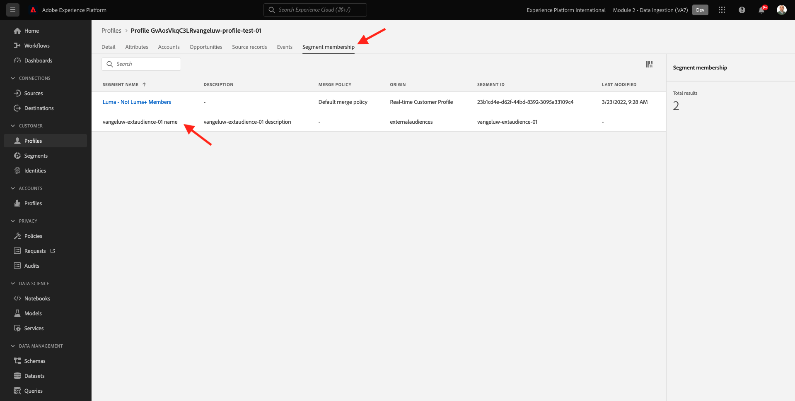

# 6.6 外部オーディエンス

多くの場合、他のアプリケーションの既存のセグメントを使用して、Adobe Experience Platformで顧客プロファイルをエンリッチメントする必要があります。
これらの外部オーディエンスは、データサイエンスモデルに基づいて定義されているか、外部データプラットフォームを使用して定義されている場合があります。

Adobe Experience Platformの外部オーディエンス機能を使用すると、Adobe Experience Platformで対応するセグメント定義を詳細に再定義する必要なく、外部オーディエンスの取り込みとアクティブ化に集中できます。

全体的なプロセスは、主に次の 3 つの手順で分かれます。

- 外部オーディエンスメタデータを読み込みます。この手順は、オーディエンス名などの外部オーディエンスメタデータをAdobe Experience Platformに取り込むためのものです。
- 外部オーディエンスメンバーシップを顧客プロファイルに割り当てます。この手順は、顧客プロファイルに外部セグメントメンバーシップ属性を強化するためのものです。
- Adobe Experience Platformでセグメントを作成します。この手順は、外部オーディエンスのメンバーシップに基づいて実用的なセグメントを作成するためのものです。

## 6.6.1 メタデータ

に移動します。 [Adobe Experience Platform](https://experience.adobe.com/platform). ログイン後、Adobe Experience Platformのホームページに移動します。


>[!IMPORTANT]
>
>この演習で使用するサンドボックスは、 ``--module2sandbox--``!

続行する前に、 **サンドボックス**. 選択するサンドボックスの名前はです ``--module2sandbox--``. これを行うには、 **[!UICONTROL 実稼動版]** 画面の上の青い線で表示されます。 適切な [!UICONTROL サンドボックス]画面が変更され、専用の [!UICONTROL サンドボックス].


セグメントデータはプロファイルをセグメントの一部にする条件を定義しますが、セグメントメタデータはセグメントに関する情報です（セグメントの名前、説明、ステータスなど）。 外部オーディエンスのメタデータはAdobe Experience Platformに保存されるので、ID 名前空間を使用してAdobe Experience Platformでメタデータを取り込む必要があります。

## 6.6.1.1 外部オーディエンス用の ID 名前空間

で使用する ID 名前空間が既に作成されています **外部オーディエンス**.
作成済みの ID を表示するには、に移動します。 **ID**&#x200B;を検索し、 **外部**. 「外部オーディエンス」項目をクリックします。

注意：

- ID 記号 **externalaudiences** は、次の手順で外部オーディエンス id を参照するために使用されます。
- この **人以外の識別子** タイプは、この id 名前空間に使用されます。この名前空間は、顧客プロファイルではなくセグメントを識別するためのものです。


## 6.6.1.2 外部オーディエンスのメタデータスキーマの作成

外部オーディエンスのメタデータは、 **セグメント定義スキーマ**. 詳しくは、 [XDM GitHub リポジトリ](https://github.com/adobe/xdm/blob/master/docs/reference/classes/segmentdefinition.schema.md).

左のメニューで、「スキーマ」に移動します。 クリック **+スキーマを作成** 次に、 **参照**.


クラスを割り当てるには、を検索します。 **セグメント定義**. を選択します。 **セグメント定義** クラスとクリック **クラスを割り当て**.


これが見えます クリック **キャンセル**.


これが見えます フィールドを選択 **_id**. 右側のメニューで、下にスクロールして、 **ID** そして **プライマリID** チェックボックス を選択します。 **外部オーディエンス** id 名前空間。 「**適用**」をクリックします。


次に、スキーマ名を選択します。 **名称未設定のスキーマ**. 名前をに変更します。 `--demoProfileLdap-- - External Audiences Metadata`.


を有効にします。 **プロファイル** 切り替えて確定します。 最後に、「 **保存**.


## 6.6.1.3 外部オーディエンスメタデータデータセットの作成

In **スキーマ**&#x200B;に移動します。 **参照**. を検索して、 `--demoProfileLdap-- - External Audiences Metadata` 前の手順で作成したスキーマ。 次に、「 **スキーマからデータセットを作成**.


フィールド **名前**&#x200B;を入力して、 `--demoProfileLdap-- - External Audience Metadata`. クリック **データセットを作成**.


これが見えます 忘れずに **プロファイル** 切り替え


## 6.6.1.4 HTTP API ソース接続の作成

次に、メタデータをデータセットに取り込むために使用する HTTP API ソースコネクタを設定する必要があります。

に移動します。 **ソース**. 検索フィールドに、 **HTTP**. 「**データを追加**」をクリックします。


以下の情報を入力します。

- **アカウントタイプ**:選択 **新しいアカウント**
- **アカウント名**:入力 `--demoProfileLdap-- - External Audience Metadata`
- チェックボックスをオンにします。 **XDM 互換ボックス**

次に、「 **ソースに接続**.


これが見えます 「**次へ**」をクリックします。


選択 **既存のデータセット** ドロップダウンメニューで、データセットを検索して選択します。 `--demoProfileLdap-- - External Audience Metadata`.

を確認します。 **データフローの詳細** 次に、 **次へ**.


これが見えます

この **マッピング** XDM 準拠のペイロードを HTTP API ソースコネクタに取り込むので、マッピングは不要なので、ウィザードの手順は空です。 「**次へ**」をクリックします。


内 **レビュー** 手順（オプション）接続とマッピングの詳細を確認できます。 「**完了**」をクリックします。


これが見えます



## 6.6.1.5 外部オーディエンスのメタデータの取り込み

「ソースコネクタの概要」タブで、 **...** 次に、 **スキーマペイロードをコピー**.



コンピューター上でテキストエディターアプリケーションを開き、コピーしたペイロードを貼り付けます。次のようになります。 次に、 **xdmEntity** オブジェクトを選択します。


オブジェクト **xdmEntity** は、次のコードに置き換える必要があります。 以下のコードをコピーし、 **xdmEntity** オブジェクトを選択します。

```
"xdmEntity": {
    "_id": "--demoProfileLdap---extaudience-01",
    "description": "--demoProfileLdap---extaudience-01 description",
    "segmentIdentity": {
      "_id": "--demoProfileLdap---extaudience-01",
      "namespace": {
        "code": "externalaudiences"
      }
    },
    "segmentName": "--demoProfileLdap---extaudience-01 name",
    "segmentStatus": "ACTIVE",
    "version": "1.0"
  }
```

次のように表示されます。


次に、新しい **ターミナル** ウィンドウ テキストエディタ内のすべてのテキストをコピーし、ターミナルウィンドウに貼り付けます。


次へ、ヒット **入力**.

次に、ターミナルウィンドウにデータ取り込みの確認が表示されます。


HTTP API ソースコネクタ画面を更新します。データが処理されていることがわかります。


## 6.6.1.6 外部オーディエンスのメタデータ取り込みの検証

処理が完了したら、クエリサービスを使用して、データセット内のデータが使用可能かどうかを確認できます。

右のメニューで、に移動します。 **データセット** をクリックし、 `--demoProfileLdap-- - External Audience Metadata` 以前に作成したデータセット。


右側のメニューで、「クエリ」に移動して、 **クエリを作成**.


次のコードを入力して、「 **SHIFT + ENTER キー**:

```
select * from --demoProfileLdap--_external_audience_metadata
```

クエリ結果には、取り込んだ外部オーディエンスのメタデータが表示されます。



## 6.6.2 セグメントメンバーシップ

外部オーディエンスのメタデータを使用できるので、特定の顧客プロファイルのセグメントメンバーシップを取り込むことができるようになりました。

次に、セグメントメンバーシップスキーマに対してエンリッチメントしたプロファイルデータセットを準備する必要があります。 詳しくは、 [XDM GitHub リポジトリ](https://github.com/adobe/xdm/blob/master/docs/reference/datatypes/segmentmembership.schema.md).

## 6.6.2.1 外部オーディエンスメンバーシップスキーマの作成

右のメニューで、に移動します。 **スキーマ**. クリック **スキーマを作成** 次に、 **XDM 個人プロファイル**.


内 **フィールドグループを追加** ポップアップ、検索 **プロファイルコア**. を選択します。 **プロファイル Core v2** フィールドグループを使用します。


次に、 **フィールドグループを追加** ポップアップ、検索 **セグメントのメンバーシップ**. を選択します。 **セグメントメンバーシップの詳細** フィールドグループを使用します。 次に、「 **フィールドグループを追加**.


これが見えます フィールドに移動します。 `--aepTenantId--.identification.core`. 次をクリック： **crmId** フィールドに入力します。 右側のメニューで、下にスクロールして、 **ID** そして **プライマリID** チェックボックス。 の **ID 名前空間** 選択 **デモシステム — CRMID**.

「**適用**」をクリックします。


次に、スキーマ名を選択します。 **名称未設定のスキーマ**. 表示名フィールドに、「 `--demoProfileLdap-- - External Audiences Membership`.


次に、 **プロファイル** 切り替えて確定します。 「**保存**」をクリックします。


## 6.6.2.2 外部オーディエンスメンバーシップデータセットの作成

In **スキーマ**&#x200B;に移動します。 **参照**. を検索して、 `--demoProfileLdap-- - External Audiences Membership` 前の手順で作成したスキーマ。 次に、「 **スキーマからデータセットを作成**.


フィールド **名前**&#x200B;を入力して、 `--demoProfileLdap-- - External Audiences Membership`. クリック **データセットを作成**.


これが見えます 忘れずに **プロファイル** 切り替え


## 6.6.2.3 HTTP API ソース接続の作成


次に、メタデータをデータセットに取り込むために使用する HTTP API ソースコネクタを設定する必要があります。

に移動します。 **ソース**. 検索フィールドに、 **HTTP**. 「**データを追加**」をクリックします。


以下の情報を入力します。

- **アカウントタイプ**:選択 **新しいアカウント**
- **アカウント名**:入力 `--demoProfileLdap-- - External Audience Membership`
- チェックボックスをオンにします。 **XDM 互換ボックス**

次に、「 **ソースに接続**.


これが見えます 「**次へ**」をクリックします。


選択 **既存のデータセット** ドロップダウンメニューで、データセットを検索して選択します。 `--demoProfileLdap-- - External Audiences Membership`.

を確認します。 **データフローの詳細** 次に、 **次へ**.


これが見えます

この **マッピング** XDM 準拠のペイロードを HTTP API ソースコネクタに取り込むので、マッピングは不要なので、ウィザードの手順は空です。 「**次へ**」をクリックします。


内 **レビュー** 手順（オプション）接続とマッピングの詳細を確認できます。 「**完了**」をクリックします。


これが見えます


## 6.6.2.4 外部オーディエンスメンバーシップデータの取り込み

「ソースコネクタの概要」タブで、 **...** 次に、 **スキーマペイロードをコピー**.


コンピューター上でテキストエディターアプリケーションを開き、コピーしたペイロードを貼り付けます。次のようになります。 次に、 **xdmEntity** オブジェクトを選択します。


オブジェクト **xdmEntity** は、次のコードに置き換える必要があります。 以下のコードをコピーし、 **xdmEntity** オブジェクトを選択します。

```
  "xdmEntity": {
    "_id": "--demoProfileLdap---profile-test-01",
    "_experienceplatform": {
      "identification": {
        "core": {
          "crmId": "--demoProfileLdap---profile-test-01"
        }
      }
    },
    "personID": "--demoProfileLdap---profile-test-01",
    "segmentMembership": {
      "externalaudiences": {
        "--demoProfileLdap---extaudience-01": {
          "status": "realized",
          "lastQualificationTime": "2022-03-05T00:00:00Z"
        }
      }
    }
  }
```

次のように表示されます。


次に、新しい **ターミナル** ウィンドウ テキストエディタ内のすべてのテキストをコピーし、ターミナルウィンドウに貼り付けます。


次へ、ヒット **入力**.

次に、ターミナルウィンドウにデータ取り込みの確認が表示されます。


HTTP API ソースコネクタ画面を更新します。数分後に、データが処理されていることがわかります。


## 6.6.2.5 外部オーディエンスメンバーシップの取り込みの検証

処理が完了したら、クエリサービスを使用して、データセット内のデータが使用可能かどうかを確認できます。

右のメニューで、に移動します。 **データセット** をクリックし、 `--demoProfileLdap-- - External Audiences Membership ` 以前に作成したデータセット。


右側のメニューで、「クエリ」に移動して、 **クエリを作成**.


次のコードを入力して、「 **SHIFT + ENTER キー**:

```
select * from --demoProfileLdap--_external_audiences_membership
```

クエリ結果には、取り込んだ外部オーディエンスのメタデータが表示されます。


## 6.6.3 セグメントの作成

これで、外部オーディエンスに対するアクションを実行する準備が整いました。
Adobe Experience Platformでは、セグメントを作成し、各オーディエンスを生成して、それらのオーディエンスを宛先と共有することで、アクションを実現します。
次に、先ほど作成した外部オーディエンスを使用してセグメントを作成します。

左側のメニューで、に移動します。 **セグメント** をクリックし、 **セグメントを作成**.


に移動します。 **オーディエンス**. これが見えます クリック **外部オーディエンス**.


前に作成した外部オーディエンスを選択し、 `--demoProfileLdap---extaudience-01`. オーディエンスをキャンバスにドラッグ&amp;ドロップします。


セグメントに名前を付け、 `--demoProfileLdap-- - extaudience-01`. 「**保存して閉じる**」をクリックします。


これが見えます また、セグメントメンバーシップを取り込んだプロファイルが、 **サンプルプロファイル**.


これで、セグメントの準備が整い、宛先に送信してアクティベートできます。

## 6.6.4 顧客プロファイルの視覚化

また、顧客プロファイルでセグメント認定を視覚化できるようになりました。 に移動します。 **プロファイル**、id 名前空間を使用 **デモシステム — CRMID** ID を指定します。 `--demoProfileLdap---profile-test-01`（演習 6.6.2.4 の一部として使用した）を選択し、「 **表示**. 次に、 **プロファイル ID** をクリックして、プロファイルを開きます。


に移動します。 **セグメントのメンバーシップ**&#x200B;外部オーディエンスが表示されます。



次のステップ： [6.7 宛先 SDK](./ex7.md)

[モジュール 6 に戻る](./real-time-cdp-build-a-segment-take-action.md)

[すべてのモジュールに戻る](../../overview.md)
