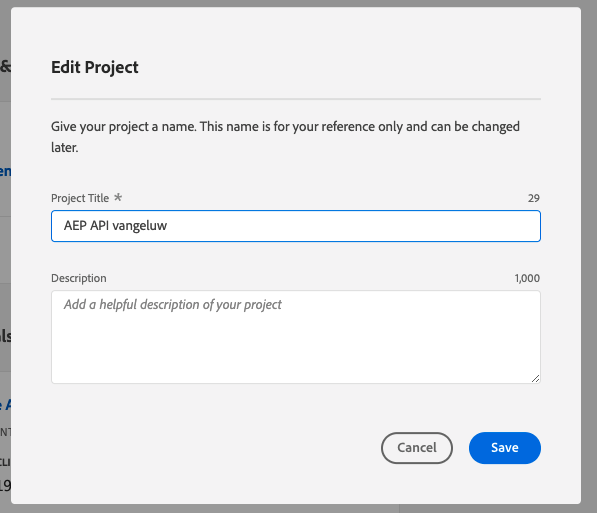
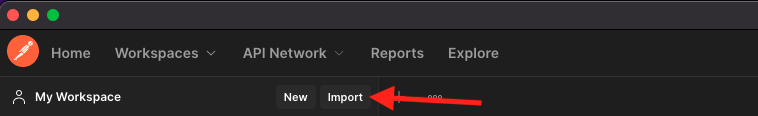
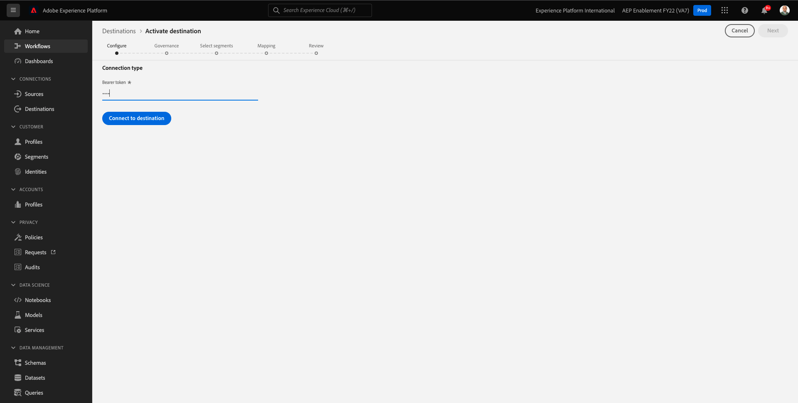
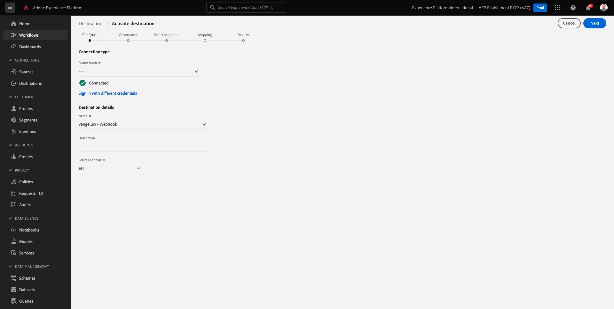
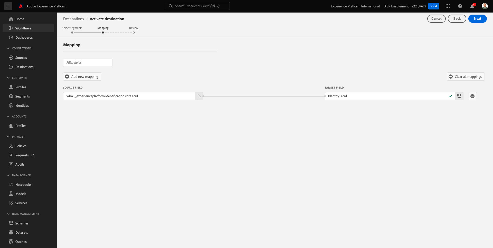
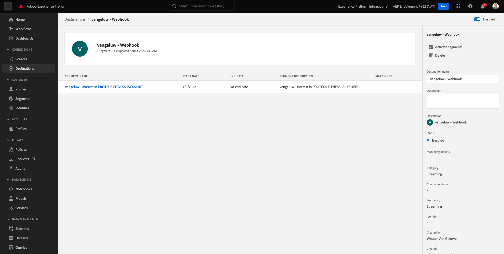

# 6.7 宛先 SDK

## 6.7.1Adobe I/Oプロジェクトの設定

>[!IMPORTANT]
>
>2021 年 12 月以降にAdobe I/Oプロジェクトを作成した場合は、そのプロジェクトを再利用し、この演習をスキップして、すぐに演習 6.7.2 に進むことができます。
>
>2021 年 12 月より前にAdobe I/Oプロジェクトを作成した場合は、新しいプロジェクトを作成して、Destinations Authoring API との互換性を確保してください。

この演習では、Adobe I/Oを完全に集中的に使用して、Platform の API に対するクエリをおこないます。 次の手順に従って、Adobe I/Oを設定してください。

に移動します。 [https://developer.adobe.com/console/home](https://developer.adobe.com/console/home)


画面の右上隅で正しいAdobe Experience Platformインスタンスを選択していることを確認します。 インスタンスは `--envName--`.


「**新規プロジェクトを作成**」をクリックします。

 または


選択 **+プロジェクトに追加** を選択し、 **API**.


次の内容が表示されます。


次をクリック： **Adobe Experience Platform** アイコン


クリック **Experience PlatformAPI**.


「**次へ**」をクリックします。


セキュリティキーペアを生成するAdobe I/Oか、既存のペアをアップロードするかを選択できるようになりました。

選択 **オプション 1 — キーペアを生成する**.


クリック **キーペアを生成**.


スピナーが約 30 秒間表示されます。


これが表示され、生成された鍵のペアが zip ファイルとしてダウンロードされます。 **config.zip**.

ファイルを解凍します。 **config.zip** デスクトップには、2 つのファイルが含まれています。


- **certificate_pub.crt** は公開鍵証明書です。 セキュリティの観点から言えば、これは、オンラインアプリケーションとの統合をセットアップするために自由に使用される証明書です。
- **private.key** は秘密鍵です。 これは誰とも共有してはいけません 秘密鍵は、API 実装に対する認証に使用するもので、秘密鍵と見なされます。 秘密鍵を他のユーザーと共有すると、ユーザーは実装にアクセスし、API を悪用して悪意のあるデータを Platform に取り込み、Platform に設定されたすべてのデータを抽出することができます。


必ず **config.zip** ファイルを安全な場所に保存してください。次の手順で使用し、今後Adobe I/OおよびAdobe Experience Platform API にアクセスする際に必要になります。

「**次へ**」をクリックします。


次に、 **製品プロファイル** を設定します。

必要な製品プロファイルを選択します。

**FYI**:Adobe Experience Platformインスタンスでは、製品プロファイルの名前が異なります。 適切なアクセス権を持つ製品プロファイルを 1 つ以上選択する必要があります。このプロファイルはAdobe Admin Consoleで設定されています。


クリック **設定済み API を保存**.


スピナーが数秒間表示されます。


次に、統合が表示されます。


次をクリック： **Postman用のダウンロード** ボタンを押し、 **サービスアカウント (JWT)** Postman環境をダウンロードするには（環境がダウンロードされるまで待ちます。これには数秒かかる場合があります）。


下にスクロールして、 **サービスアカウント (JWT)**( Adobe Experience Platformとの統合の設定に使用されるすべての統合の詳細を検索できる場所 )


IO プロジェクトには現在、汎用名が付けられています。 統合にわかりやすい名前を付ける必要があります。 クリック **プロジェクト 1** （または類似の名前）を示すように


クリック **プロジェクトを編集**.


統合の「名前」と「説明」を入力します。 命名規則として、 `AEP API --demoProfileLdap--`. ldap を ldap に置き換えます。
例えば、ldap が vangeluw の場合、統合の名前と説明は AEP API vangeluw になります。

入力 `AEP API --demoProfileLdap--` を **プロジェクトタイトル**. 「**保存**」をクリックします。



これで、Adobe I/Oの統合が完了しました。


## 6.7.2Adobe I/Oに対するPostman認証

に移動します。 [https://www.getpostman.com/](https://www.getpostman.com/).

クリック **はじめに**.


次に、 Postmanをダウンロードしてインストールします。


Postmanのインストール後、アプリケーションを起動します。

Postmanには、次の 2 つの概念があります。環境とコレクション。

- 環境には、多かれ少なかれ一貫性のあるすべての環境変数が含まれます。 環境では、アドビの Platform 環境の IMSOrg や、秘密鍵などのセキュリティ資格情報が表示されます。 環境ファイルは、前の練習でのAdobe I/O設定時にダウンロードしたファイルで、次のような名前になります。 **service.postman_environment.json**.

- コレクションには、使用できる多数の API リクエストが含まれています。 2 つのコレクションを使用します
   - 1AdobeI/0 に対する認証用のコレクション
   - 1 このモジュールの演習用コレクション
   - Real-Time CDPモジュールの演習用の 1 つのコレクション（宛先のオーサリング用）

ファイルをダウンロードしてください [postman.zip](../../assets/postman/postman_profile.zip) をローカルデスクトップに追加します。

この **postman.zip** ファイルには、次のファイルが含まれます。

- `_Adobe I-O - Token.postman_collection.json`
- `_Adobe Experience Platform Enablement.postman_collection.json`
- `Destination_Authoring_API.json`

を解凍します。 **postman.zip** これら 3 つのファイルをファイルに保存し、デスクトップ上のフォルダーに、Adobe I/OからダウンロードしたPostman環境と共に保存します。次の 4 つのファイルをそのフォルダーに格納する必要があります。


Postmanに戻ります。 「**Import**」をクリックします。



クリック **ファイルをアップロード**.


デスクトップ上の、ダウンロードした 4 つのファイルを抽出したフォルダーに移動します。 これら 4 つのファイルを同時に選択し、 **開く**.


クリック後 **開く**&#x200B;をクリックすると、Postmanに、読み込もうとしている環境とコレクションの概要が表示されます。 「**Import**」をクリックします。


これで、API を使用してAdobe Experience Platformとの対話を開始するためにPostmanで必要なすべてが揃いました。

まず、適切に認証されていることを確認します。 認証するには、アクセストークンをリクエストする必要があります。

リクエストを実行する前に、適切な環境が選択されていることを確認してください。 右上隅にある Environment-dropdown リストを確認することで、現在選択されている環境を確認できます。

選択した環境には、次のような名前を付ける必要があります。


次をクリック： **目** アイコンをクリックし、 **編集** をクリックして、環境ファイルの秘密鍵を更新します。


これが見えます フィールドを除くすべてのフィールドは、事前入力されます **PRIVATE_KEY**.


秘密鍵は、Adobe I/Oプロジェクトの作成時に生成されています。 このファイルは、という名前の zip ファイルとしてダウンロードされました。 **config.zip**. その zip ファイルをデスクトップに展開します。


フォルダーを開く **config** をクリックし、ファイルを開きます。 **private.key** を選択します。


次に、これに似たものが表示されます。すべてのテキストをクリップボードにコピーします。


Postmanに戻り、変数の横のフィールドに秘密鍵を貼り付けます **PRIVATE_KEY**（両方の列） **初期値** および **現在の値**. 「**保存**」をクリックします。


これで、Postman環境とコレクションが設定され、機能します。 PostmanからAdobe I/Oへの認証が可能になりました。

これをおこなうには、通信の暗号化と復号化を処理する外部ライブラリを読み込む必要があります。 このライブラリを読み込むには、という名前でリクエストを実行する必要があります。 **初期化：RS256 用の暗号ライブラリの読み込み**. このリクエストを **_Adobe I/O — トークンコレクション** 画面の中央に表示されます。


青をクリック **送信** 」ボタンをクリックします。 数秒後、応答が **本文** Postmanのセクション：


現在は暗号ライブラリが読み込まれているので、Adobe I/Oを認証できます。

内 **\_Adobe I/O — トークンコレクション**、名前を持つリクエストを選択します **IMS:JWT 生成+認証**. この場合も、画面の中央にリクエストの詳細が表示されます。


青をクリック **送信** 」ボタンをクリックします。 数秒後、応答が **本文** Postmanのセクション：


設定が成功した場合は、次の情報を含む同様の応答が表示されます。

| キー | 値 |
|:-------------:| :---------------:| 
| token_type | **無記名者** |
| access_token | **eyJ4NXUiJpbXNfbmEx...QT7mqZkumN1tdsPEioOEl4087Dg** |
| expires_in | **86399973** |

Adobe I/Oから **無記名者**-token。特定の値（この非常に長い access_token）と有効期限ウィンドウを含みます。

受け取ったトークンは、24 時間有効になりました。 つまり、24 時間後にPostmanを使用してAdobe I/Oを認証する場合、このリクエストを再度実行して新しいトークンを生成する必要があります。

## 6.7.3 エンドポイントと形式の定義

この演習では、セグメントが認定される際に認定イベントをそのエンドポイントにストリーミングできるように、を設定するエンドポイントが必要です。 この練習では、 [https://webhook.site/](https://webhook.site/). に移動します。 [https://webhook.site/](https://webhook.site/)では、このようなものが表示されます。 クリック **クリップボードにコピー** url をコピーします。 この URL は、次の演習で指定する必要があります。 この例の URL は、 `https://webhook.site/e0eb530c-15b4-4a29-8b50-e40877d5490a`.


形式については、セグメントの選定や不認定を、顧客 ID などのメタデータと共にストリーミングする標準テンプレートを使用します。 テンプレートは、特定のエンドポイントの期待に応えるようにカスタマイズできますが、この演習では、標準テンプレートを再利用します。これにより、このようなペイロードがエンドポイントにストリーミングされます。

```json
{
  "profiles": [
    {
      "identities": [
        {
          "type": "ecid",
          "id": "64626768309422151580190219823409897678"
        }
      ],
      "AdobeExperiencePlatformSegments": {
        "add": [
          "f58c723c-f1e5-40dd-8c79-7bb4ab47f041"
        ],
        "remove": []
      }
    }
  ]
}
```

## 6.7.4 サーバーとテンプレートの設定の作成

Adobe Experience Platformで独自の宛先を作成する最初の手順は、サーバーとテンプレートの設定を作成することです。

それには、に移動します。 **宛先オーサリング API**、 **宛先サーバーとテンプレート** をクリックし、リクエストを開きます。 **POST — 宛先サーバー設定の作成**. これが見えます の下 **ヘッダー**&#x200B;の場合は、手動でキーの値を更新する必要があります **x-sandbox-name** を設定し、 `--aepSandboxId--`. 値を選択 **{{SANDBOX_NAME}}**.


次で置き換えます。 `--aepSandboxId--`.


次へ、に移動します。 **本文**. プレースホルダーを選択 **{{body}}**.


次に、プレースホルダーを置き換える必要があります **{{body}}** を次のコードに置き換えます。

```json
{
    "name": "Custom HTTP Destination",
    "destinationServerType": "URL_BASED",
    "urlBasedDestination": {
        "url": {
            "templatingStrategy": "PEBBLE_V1",
            "value": "yourURL"
        }
    },
    "httpTemplate": {
        "httpMethod": "POST",
        "requestBody": {
            "templatingStrategy": "PEBBLE_V1",
            "value": "{\n    \"profiles\": [\n    \n        {\n            \"identities\": [\n            \n            \n                \n                {\n                    \"type\": \"{{ namespace }}\",\n                    \"id\": \"{{ identity.id }}\"\n                },\n                ,\n            \n            ],\n            \"AdobeExperiencePlatformSegments\": {\n                \"add\": [\n                \n                    \"{{ segment.key }}\",\n                \n                ],\n                \"remove\": [\n                {#- Alternative syntax for filtering segments by status: -#}\n                \n                    \"{{ segment.key }}\",\n                \n                ]\n            }\n        },\n    \n    ]\n}"
        },
        "contentType": "application/json"
    }
}
```

上記のコードを貼り付けた後、手動でフィールドを更新する必要があります **urlBasedDestination.url.value**&#x200B;をクリックし、前の手順で作成した Webhook の url( `https://webhook.site/e0eb530c-15b4-4a29-8b50-e40877d5490a` この例では、


フィールドの更新後 **urlBasedDestination.url.value**&#x200B;の場合は、次のようになります。 「**送信**」をクリックします。


クリック後 **送信**&#x200B;サーバーテンプレートが作成され、応答の一部として、という名前のフィールドが表示されます。 **instanceId**. 次の手順で必要になるので、書き留めておきます。 この例では、 **instanceId** が
`eb0f436f-dcf5-4993-a82d-0fcc09a6b36c`.


## 6.7.5 宛先設定の作成

Postman、 **宛先オーサリング API**&#x200B;に移動します。 **宛先の設定** をクリックし、リクエストを開きます。 **POST — 宛先設定の作成**. これが見えます の下 **ヘッダー**&#x200B;の場合は、手動でキーの値を更新する必要があります **x-sandbox-name** を設定し、 `--aepSandboxId--`. 値を選択 **{{SANDBOX_NAME}}**.


次で置き換えます。 `--aepSandboxId--`.


次へ、に移動します。 **本文**. プレースホルダーを選択 **{{body}}**.


次に、プレースホルダーを置き換える必要があります **{{body}}** を次のコードに置き換えます。

```json
{
    "name": "--demoProfileLdap-- - Webhook",
    "description": "Exports segment qualifications and identities to a custom webhook via Destination SDK.",
    "status": "TEST",
    "customerAuthenticationConfigurations": [
        {
            "authType": "BEARER"
        }
    ],
    "customerDataFields": [
        {
            "name": "endpointsInstance",
            "type": "string",
            "title": "Select Endpoint",
            "description": "We could manage several instances across the globe for REST endpoints that our customers are provisioned for. Select your endpoint in the dropdown list.",
            "isRequired": true,
            "enum": [
                "US",
                "EU",
                "APAC",
                "NZ"
            ]
        }
    ],
    "uiAttributes": {
        "documentationLink": "https://experienceleague.adobe.com/docs/experience-platform/destinations/home.html?lang=en",
        "category": "streaming",
        "connectionType": "Server-to-server",
        "frequency": "Streaming"
    },
    "identityNamespaces": {
        "ecid": {
            "acceptsAttributes": true,
            "acceptsCustomNamespaces": false
        }
    },
    "segmentMappingConfig": {
        "mapExperiencePlatformSegmentName": true,
        "mapExperiencePlatformSegmentId": true,
        "mapUserInput": false
    },
    "aggregation": {
        "aggregationType": "BEST_EFFORT",
        "bestEffortAggregation": {
            "maxUsersPerRequest": "1000",
            "splitUserById": false
        }
    },
    "schemaConfig": {
        "profileRequired": false,
        "segmentRequired": true,
        "identityRequired": true
    },
    "destinationDelivery": [
        {
            "authenticationRule": "NONE",
            "destinationServerId": "yourTemplateInstanceID"
        }
    ]
}
```


上記のコードを貼り付けた後、手動でフィールドを更新する必要があります **destinationDelivery. destinationServerId**&#x200B;を設定し、 **instanceId** 前の手順で作成した宛先サーバーテンプレート ( `eb0f436f-dcf5-4993-a82d-0fcc09a6b36c` この例では、 次に、「 」をクリックします。 **送信**.


その後、この応答が表示されます。


これで、宛先がAdobe Experience Platformに作成されました。 そこに行って確認しましょう。

に移動します。 [Adobe Experience Platform](https://experience.adobe.com/platform). ログイン後、Adobe Experience Platformのホームページに移動します。


続行する前に、 **サンドボックス**. 選択するサンドボックスの名前はです ``--aepSandboxId--``. これを行うには、 **[!UICONTROL 実稼動版]** 画面の上の青い線で表示されます。 適切な [!UICONTROL サンドボックス]画面が変更され、専用の [!UICONTROL サンドボックス].


左側のメニューで、に移動します。 **宛先**&#x200B;をクリックし、 **カタログ** 下にスクロールしてカテゴリに移動します。 **ストリーミング**. 今すぐ宛先が表示されます。


## 6.7.6 セグメントを宛先にリンクする

In **宛先** > **カタログ**&#x200B;をクリックし、 **設定** をクリックして、新しい宛先へのセグメントの追加を開始します。


ダミーの bearer トークン（例： ）を入力します。 **1234**. クリック **宛先に接続**.



これが見えます 宛先の名前として、 `--demoProfileLdap-- - Webhook`. 選択したエンドポイントを選択します（この例では）。 **EU**. 「**次へ**」をクリックします。



オプションで、データガバナンスポリシーを選択できます。 「**次へ**」をクリックします。


前に作成したセグメントを選択します。このセグメントの名前はです。 `--demoProfileLdap-- - Interest in PROTEUS FITNESS JACKSHIRT`. 「**次へ**」をクリックします。


これが見えます 必ず **ソースフィールド** `--aepTenantId--.identification.core.ecid` フィールドに `Identity: ecid`. 「**次へ**」をクリックします。



「**完了**」をクリックします。


これで宛先が有効になり、新しいセグメント認定がカスタム Webhook にストリーミングされます。



## 6.7.7 セグメントのアクティベーションのテスト

に移動します。 [https://builder.adobedemo.com/projects](https://builder.adobedemo.com/projects). Adobe IDでログインすると、次の内容が表示されます。 Web サイトプロジェクトをクリックして開きます。


これで、以下のフローに従って Web サイトにアクセスできます。 クリック **統合**.


の **統合** このページでは、演習 0.1 で作成したデータ収集プロパティを選択する必要があります。


次に、デモ Web サイトが開いているのがわかります。 URL を選択して、クリップボードにコピーします。


新しい匿名ブラウザーウィンドウを開きます。


前の手順でコピーしたデモ Web サイトの URL を貼り付けます。 その後、Adobe IDを使用してログインするように求められます。


アカウントのタイプを選択し、ログインプロセスを完了します。


Web サイトが匿名ブラウザーウィンドウに読み込まれます。 デモ Web サイトの URL を読み込むには、新しい匿名ブラウザーウィンドウを使用する必要があります。


次の **Luma** homepage, go to **メン**&#x200B;をクリックし、製品をクリックします。 **PROTEUS FITNESS JACKSHIRT**.


次の製品ページにアクセスしました： **PROTEUS FITNESS JACKSHIRT**：つまり、この演習で前に作成したセグメントの対象になります。


プロファイルビューアを開き、に移動します。 **セグメント**&#x200B;に設定すると、該当するセグメントが表示されます。


次に、で開いているウェブフックに戻ります。 [https://webhook.site/](https://webhook.site/)を開き、Adobe Experience Platformから派生し、セグメントの選定イベントを含む新しい受信リクエストを表示します。


次のステップ： [概要とメリット](./summary.md)

[モジュール 6 に戻る](./real-time-cdp-build-a-segment-take-action.md)

[すべてのモジュールに戻る](../../overview.md)
