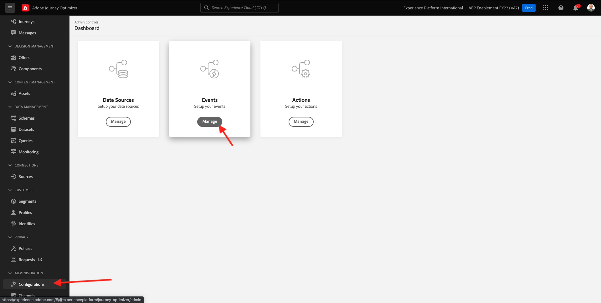
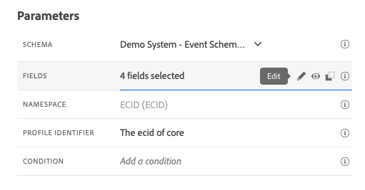
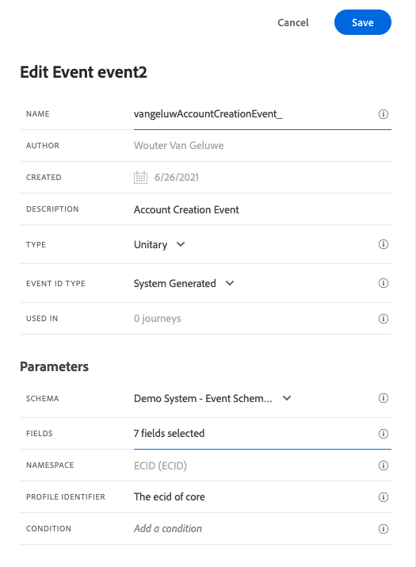

# 7.1 イベントの作成

に移動してAdobe Journey Optimizerにログインします。 [Adobe Experience Cloud](https://experience.adobe.com). クリック **Journey Optimizer**.

リダイレクト先： **ホーム**  Journey Optimizerで表示 まず、正しいサンドボックスを使用していることを確認します。 使用するサンドボックスは、と呼ばれます。 `--aepSandboxId--`. サンドボックス間を切り替えるには、 **実稼動 (VA7)** リストからサンドボックスを選択します。 この例では、サンドボックスの名前はです。 **AEP 有効化 FY22**. その後、 **ホーム** サンドボックスの表示 `--aepSandboxId--`.

左側のメニューで、下にスクロールして、 **設定**. 次に、 **管理** 下のボタン **イベント**.

その後、使用可能なすべてのイベントの概要が表示されます。 クリック **イベントを作成** をクリックして、独自のイベントの作成を開始します。

新しい空のイベントウィンドウがポップアップ表示されます。

まず、イベントに次のような名前を付けます。 `--demoProfileLdap--AccountCreationEvent`.

次に、次のような説明を追加します `Account Creation Event`.

次に、 **タイプ** が **単一**、および **イベント ID タイプ** 選択、選択 **生成されたシステム**.

次に、「スキーマ」を選択します。 この演習では、スキーマが準備されました。 スキーマを使用してください `Demo System - Event Schema for Website (Global v1.1) v.1`.

スキーマを選択すると、 **ペイロード** 」セクションに入力します。 これで、 **ペイロード** セクションに 3 つのアイコンのポップアップが表示されます。 をクリックします。 **編集** アイコン

表示される **フィールド** ウィンドウポップアップ。E メールをパーソナライズするために必要なフィールドの一部を選択する必要があります。  後で、既にAdobe Experience Platformにあるデータを使用して、他のプロファイル属性を選択します。

オブジェクト内 `--aepTenantId--.demoEnvironment`フィールドを必ず選択してください。 **brandLogo** および **brandName**.

オブジェクト内 `--aepTenantId--.identification.core`フィールドを必ず選択してください。 **電子メール**.

クリック **Ok** 変更を保存します。

次のように表示されます。

クリック **保存** もう一度変更を保存します。

これで、イベントが設定され、保存されました。

イベントを再度クリックして、 **イベントを編集** 画面を再度表示します。 次の項目にカーソルを合わせます。 **ペイロード** フィールドに再度挿入し、3 つのアイコンを再度表示します。 をクリックします。 **ペイロードを表示** アイコン

これで、期待されるペイロードの例が表示されます。

イベントには一意のオーケストレーション eventID があり、見つかるまでペイロード内を下にスクロールすると見つかります `_experience.campaign.orchestration.eventID`.

イベント ID は、演習 7.2 で作成するジャーニーをトリガーするためにAdobe Experience Platformに送信する必要があるものです。この eventID は、演習 7.3 で必要になるので、覚えておいてください。
`"eventID": "227402c540eb8f8855c6b2333adf6d54d7153d9d7d56fa475a6866081c574736"`

クリック **Ok**&#x200B;をクリックし、その後に「 **キャンセル**.

これで、この練習が完了しました。

次のステップ： [7.2Journey Optimizer:ジャーニーと E メールメッセージを作成する](./ex2.md)

[モジュール 7 に戻る](./journey-orchestration-create-account.md)

[すべてのモジュールに戻る](../../overview.md)
