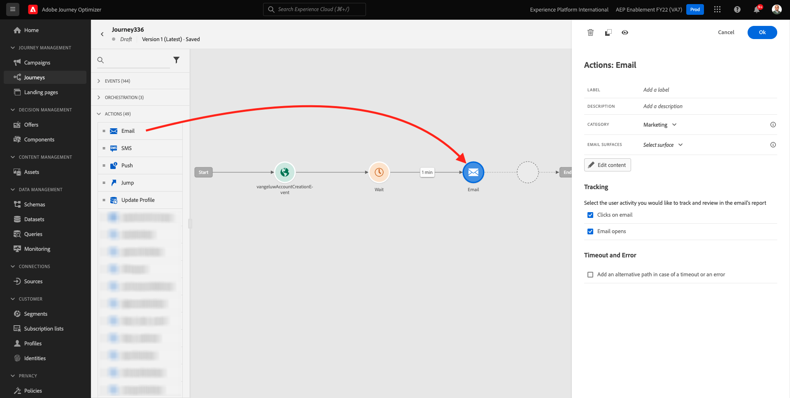
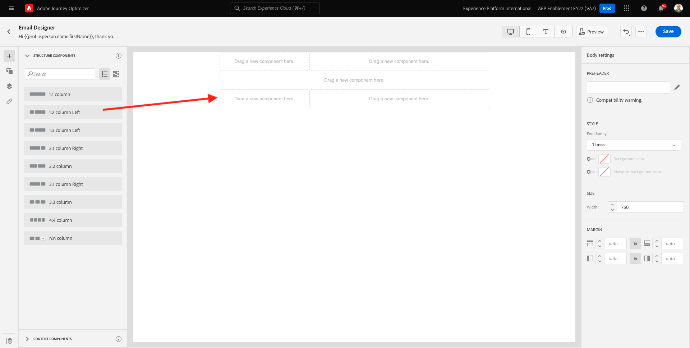
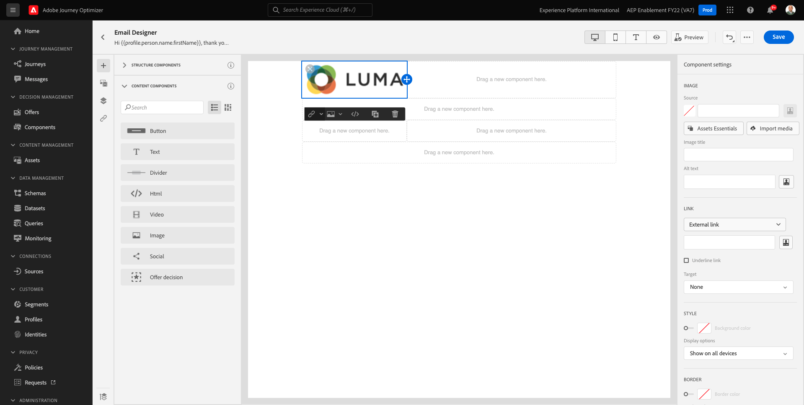
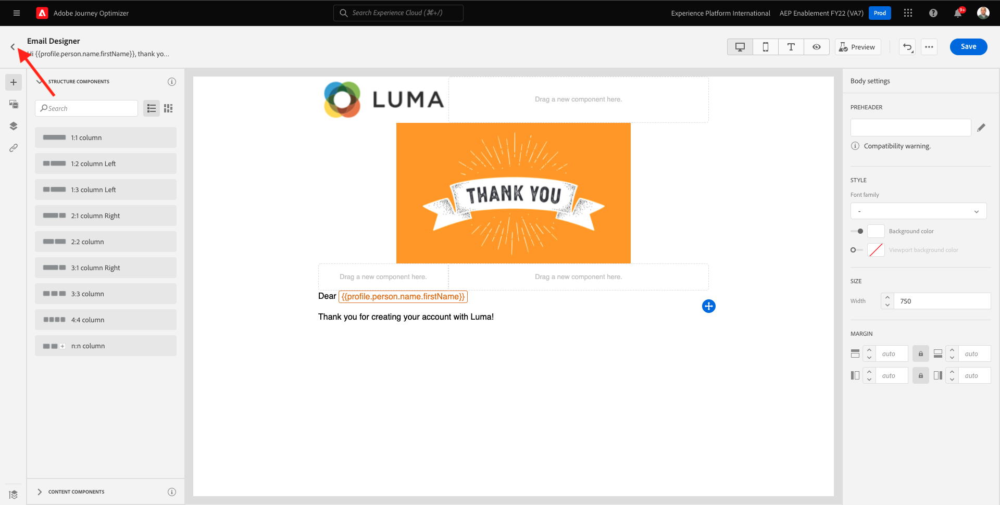

# 7.2 ジャーニーと電子メールメッセージの作成

この演習では、デモ Web サイトでアカウントを作成したときにトリガーする必要があるジャーニーとメッセージを設定します。

に移動してAdobe Journey Optimizerにログインします。 [Adobe Experience Cloud](https://experience.adobe.com). クリック **Journey Optimizer**.

リダイレクト先： **ホーム**  Journey Optimizerで表示 まず、正しいサンドボックスを使用していることを確認します。 使用するサンドボックスは、と呼ばれます。 `--aepSandboxId--`. サンドボックス間を切り替えるには、 **実稼動 (VA7)** リストからサンドボックスを選択します。 この例では、サンドボックスの名前はです。 **AEP 有効化 FY22**. その後、 **ホーム** サンドボックスの表示 `--aepSandboxId--`.

## 7.2.1 ジャーニーの作成

左のメニューで、「**ジャーニー**」をクリックします。次に、「 **作成ジャーニー** をクリックして、新しいジャーニーを作成します。

すると、空のジャーニー画面が表示されます。

前の練習では、新しい **イベント**. このように名前を付けました `ldapAccountCreationEvent` および置き換え済み `ldap` ldap を使用します。 これは、イベントの作成の結果です。

次に、このイベントをこのイベントの開始として使用する必要があります。ジャーニー これをおこなうには、画面の左側に移動して、イベントのリストでイベントを検索します。

イベントを選択し、イベントキャンバスにドラッグ&amp;ドロップします。ジャーニー ジャーニーは次のようになります。

ジャーニーの 2 番目の手順として、短いを追加する必要があります **待機** 手順 画面の左側に移動して、 **Orchestration** を参照してください。 プロファイル属性を使用しているので、それらがリアルタイム顧客プロファイルに入力されていることを確認する必要があります。

ジャーニーは次のようになりました。 画面の右側で、待機時間を設定する必要があります。 1 分に設定します。 これにより、イベントが発生した後にプロファイル属性が使用可能になるまでの時間が十分に確保されます。

クリック **Ok** 変更を保存します。

ジャーニーの 3 番目の手順として、 **電子メール** アクション。 画面の左側に移動して、 **アクション**&#x200B;を選択し、 **電子メール** アクションを実行し、ジャーニーの 2 番目のノードにドラッグ&amp;ドロップします。 これが見えます

を **カテゴリ** から **マーケティング** をクリックし、電子メールを送信できる電子メールサーフェスを選択します。 この場合、選択する E メールサーフェスは次のようになります。 **電子メール**. 次のチェックボックスをオンにします。 **メールのクリック数** および **メール開封数** 両方とも有効です。

次の手順では、メッセージを作成します。 それには、「 **コンテンツを編集**.

## 7.2.2 メッセージの作成

メッセージを作成するには、 **コンテンツを編集**.

これが見えます

次をクリック： **件名** テキストフィールド。

テキスト領域で、 **こんにちは**

件名はまだ行われていません。 次に、フィールドのパーソナライゼーショントークンを取り込む必要があります **名** それは以下の下に保存されています `profile.person.name.firstName`. 左側のメニューで、下にスクロールして、 **人物** 要素を選択し、矢印をクリックすると、次のレベルに移動します。

次に、 **氏名** 要素を選択し、矢印をクリックすると、次のレベルに移動します。

最後に、 **名** フィールドに入力し、 **+** その横にサインが表示されます。 パーソナライゼーショントークンがテキストフィールドに表示されます。

次に、テキストを追加します。 **新規登録ありがとうございました。**。「**保存**」をクリックします。

その後、戻ってきます。 クリック **メールデザイナー** 電子メールのコンテンツを作成します。

次の画面で、E メールのコンテンツを提供する 3 つの異なる方法が求められます。

- **ゼロからデザイン**:空白のキャンバスから開始し、WYSIWYG エディターを使用して、構造およびコンテンツコンポーネントをドラッグ&amp;ドロップし、電子メールのコンテンツを視覚的に作成します。
- **独自のコーディング**:HTML
- **インポートHTML**:既存のHTMLテンプレートをインポートします。編集できます。

クリック **ゼロからデザイン**.

左側のメニューには、E メールの構造（行と列）を定義するために使用できる構造コンポーネントが表示されます。

ドラッグ&amp;ドロップ **1:2 列左** メニューからキャンバスに移動します。 これは、ロゴ画像のプレースホルダーになります。

ドラッグ&amp;ドロップ **1:1 列** 前のコンポーネントの下に これがバナーブロックになります。

ドラッグ&amp;ドロップ **1:2 列左** 前のコンポーネントの下に これは、左側に画像が、右側にテキストが表示された実際のコンテンツです。

次に、 **1:1 列** 前のコンポーネントの下に これは電子メールのフッターになります。 キャンバスは次のようになります。

次に、コンテンツコンポーネントを使用して、これらのブロック内にコンテンツを追加します。 をクリックします。 **コンテンツコンポーネント** メニュー項目

ドラッグ&amp;ドロップ **画像** 最初の行の最初のセルのコンポーネント。 「**参照**」をクリックします。

これが見えます フォルダーに移動します。 **enablement-assets** をクリックし、ファイルを選択します。 **luma-logo.png**. 「**選択**」をクリックします。

ここに戻ります：

に移動します。 **コンテンツコンポーネント** をクリックし、 **画像** 最初の行の最初のセルのコンポーネント。 「**参照**」をクリックします。

内 **Assets** ポップアップで、 **enablement-assets** フォルダー。 このフォルダーには、クリエイティブチームが以前に準備およびアップロードしたすべてのアセットが含まれます。 選択 **module23-thankyou-new.png** をクリックし、 **選択**.

その後、次の情報が表示されます。

画像を選択し、右側のメニューで、「 **サイズ** width スライダーコンポーネント。 スライダを使用して幅を f.i に変更します。 **60%**.

次へ、に移動します。 **コンテンツコンポーネント** をクリックし、 **テキスト** 4 行目の構造コンポーネント内のコンポーネント。

デフォルトのテキストを選択 **ここにテキストを入力してください。** 他のテキストエディターと同様に 書き込み **親愛なる** 代わりに、 テキストモードの場合は、テキストツールバーが表示されます。

ツールバーで、 **パーソナライゼーションを追加** アイコン

次に、 **名** 次の場所に保存されるパーソナライゼーショントークン `profile.person.name.firstName`. メニューで、 **人物** 要素、ドリルダウン **氏名** 要素を選択し、 **+** アイコンをクリックして、式エディターに「名」フィールドを追加します。

「**保存**」をクリックします。

パーソナライゼーションフィールドがテキストにどのように追加されたかがわかります。

同じテキストフィールドで、 **入力** 2 行追加して書く **Luma でアカウントを作成していただき、ありがとうございます。**.

E メールの準備ができたことを確認するための最後のチェックは、「 **コンテンツをシミュレート** 」ボタンをクリックします。

まず、プレビューに使用するプロファイルを指定します。 を選択します。 **電子メール** 名前空間の横のアイコンをクリックして **ID 名前空間を入力** フィールドに入力します。

ID 名前空間のリストで、 **電子メール** 名前空間。

内 **ID 値** 「 」フィールドに、リアルタイム顧客プロファイルに既に保存されている以前のデモプロファイルの電子メールアドレスを入力します。 例： **woutervangeluwe+06022022-01@gmail.com** をクリックし、 **テストプロファイルを検索** ボタン

プロファイルがテーブルに表示されたら、 **プレビュー** タブをクリックして、プレビュー画面にアクセスします。

プレビューの準備が整ったら、パーソナライゼーションが件名行に正しいこと、本文テキスト、購読解除リンクがハイパーリンクとしてハイライト表示されていることを検証します。

クリック **閉じる** プレビューを閉じます。

クリック **保存** メッセージを保存します。

次をクリックして、メッセージダッシュボードに戻ります。 **矢印** 左上隅の件名行テキストの横に表示されます。

登録メールの作成が完了しました。 左上隅の矢印をクリックして、ジャーニーに戻ります。

「**OK**」をクリックします。

## 7.2.3 ジャーニーの公開

ジャーニーに名前を付ける必要があります。 これをおこなうには、 **プロパティ** アイコンを使用して、画面の右上に表示されます。

ここにジャーニーの名前を入力できます。 以下を使用してください： `--demoProfileLdap-- - Account Creation Journey`. 「**OK**」をクリックして変更を保存します。

これで、「 **公開**.

クリック **公開** 再び

次に、ジャーニーが公開されたことを示す緑色の確認バーが表示されます。

これで、この練習が完了しました。

次のステップ： [7.3 データ収集プロパティを更新し、ジャーニーをテストする](./ex3.md)

[モジュール 7 に戻る](./journey-orchestration-create-account.md)

[すべてのモジュールに戻る](../../overview.md)
