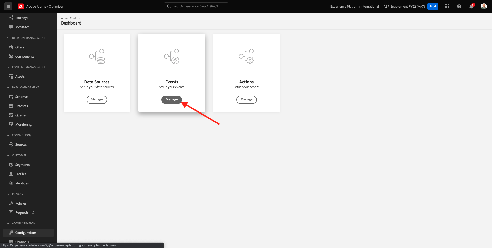
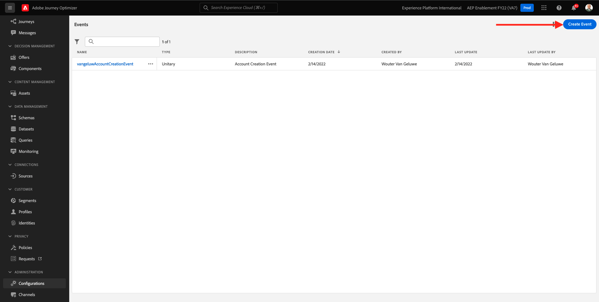
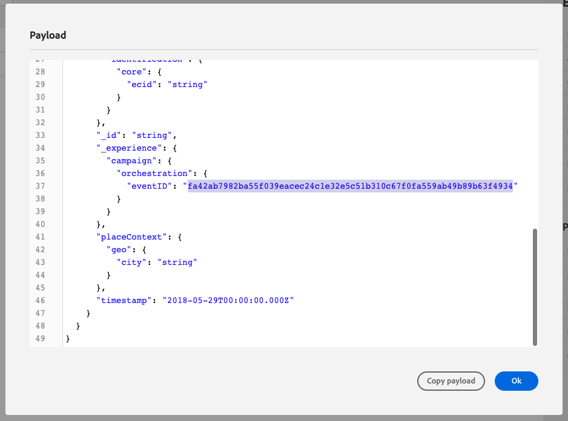

# 8.1 イベントの定義

に移動してAdobe Journey Optimizerにログインします。 [Adobe Experience Cloud](https://experience.adobe.com). クリック **Journey Optimizer**.

リダイレクト先： **ホーム**  Journey Optimizerで表示 まず、正しいサンドボックスを使用していることを確認します。 使用するサンドボックスは、と呼ばれます。 `--aepSandboxId--`. サンドボックス間を切り替えるには、 **実稼動 (VA7)** リストからサンドボックスを選択します。 この例では、サンドボックスの名前はです。 **AEP 有効化 FY22**. その後、 **ホーム** サンドボックスの表示 `--aepSandboxId--`.

左側のメニューで、下にスクロールして、 **設定**. 次に、 **管理** 下のボタン **イベント**.

その後、使用可能なすべてのイベントの概要が表示されます。 クリック **イベントを作成** をクリックして、独自のイベントの作成を開始します。

新しい空のイベントウィンドウがポップアップ表示されます。

イベントの名前として、 `--demoProfileLdap--GeofenceEntry`. この例では、イベント名は `vangeluwGeofenceEntry`.

説明を次に設定します。 `Geofence Entry Event`.

次に、 **タイプ** が **単一**、および **イベント ID タイプ** 選択、選択 **生成されたシステム**

次に、スキーマを選択する必要があります。 ここに示すスキーマはすべて、Adobe Experience Platformスキーマです。

一部のスキーマが表示されているわけではありません。 Adobe Experience Platformでは、さらに多くのスキーマを使用できます。
このリストに表示するには、スキーマに、非常に具体的なフィールドグループがリンクされている必要があります。 ここに表示する必要があるフィールドグループは、と呼ばれます。 `Orchestration eventID`.

これらのスキーマがAdobe Experience Platformでどのように定義されているかを簡単に説明します。

左側のメニューで、に移動します。 **スキーマ** をクリックし、これを新しいブラウザータブで開きます。 In **スキーマ**&#x200B;に移動します。 **参照** をクリックして、使用可能なスキーマのリストを表示します。
スキーマを開く `Demo System - Event Schema for Website (Global v1.1)`.

スキーマを開くと、フィールドグループが表示されます `Orchestration eventID` はスキーマの一部です。
このフィールドグループには 2 つのフィールドのみがあります。 `_experience.campaign.orchestration.eventID` および `originJourneyID`.

このフィールドグループとこの特定の eventID フィールドをスキーマに含めると、そのスキーマはAdobe Journey Optimizerで使用できるようになります。

Adobe Journey Optimizerのイベント設定に戻ります。

この使用例では、ジオフェンスイベントをリッスンして、顧客が特定の場所にいるかどうかを把握したいので、次に、スキーマを選択します `Demo System - Event Schema for Website (Global v1.1)` をイベントのスキーマとして使用します。

Adobe Journey Optimizerが必須フィールドを自動的に選択しますが、Adobe Journey Optimizerで使用可能にするフィールドは編集できます。

次をクリック： **鉛筆** アイコンをクリックしてフィールドを編集します。

次に、フィールドを選択できるスキーマ階層を含むポップアップウィンドウが表示されます。

ECID やオーケストレーション eventID などのフィールドは必須で、事前に選択されています。

ただし、マーケターは、ジャーニーにコンテキストを提供するすべてのデータポイントに柔軟にアクセスできる必要があります。 次に、（「場所」コンテキストノード内にある）最小限の次のフィールドも必ず選択してください。

- 市区町村

完了したら、「 **OK**.

また、Adobe Journey Optimizerは、顧客を識別するために ID も必要です。 Adobe Journey OptimizerはAdobe Experience Platformにリンクされているので、プライマリのスキーマ識別子は、自動的にスキーマの識別子として使用されます。
プライマリID は、Adobe Experience Platformの完全な ID グラフも自動的に考慮し、使用可能なすべての ID、デバイスおよびチャネルのすべての動作を同じプロファイルにリンクします。これにより、Adobe Journey Optimizerは、状況に応じ、関連性が高く、一貫性があります。

クリック **保存** をクリックしてカスタムイベントを保存します。

これで、使用可能なイベントのリストにイベントが含まれるようになります。

最後に、 `Orchestration eventID` を設定します。

イベントのリストでイベントを再度クリックして開きます。
イベントで、 **ペイロードを表示** 隣のアイコン **フィールド**.

クリック **ペイロードを表示** アイコンは、このイベントのサンプル XDM ペイロードを開きます。

内で下にスクロールします。 **ペイロード** 線が見えるまで `eventID`.

以下を書き留めます。 `eventID` 設定をテストするには、最後の段階で必要になるので、

この例では、 `eventID` が `fa42ab7982ba55f039eacec24c1e32e5c51b310c67f0fa559ab49b89b63f4934`.

これで、作成中のジャーニーをトリガーにするイベントを定義しました。 ジャーニーがトリガーされると、「市区町村」などのジオフェンスフィールドや、選択したその他（国、緯度、経度など）がジャーニーで使用できるようになります。

ユースケースの説明で説明したように、天気に応じたコンテキストプロモーションを提供する必要があります。 気象情報を取得するには、その場所の気象情報を提供する外部データソースを定義する必要があります。 次を使用します。 **OpenWeather** その情報を提供するサービス（2 の一部）。

次のステップ： [8.2 外部データソースの定義](./ex2.md)

[モジュール 8 に戻る](journey-orchestration-external-weather-api-sms.md)

[すべてのモジュールに戻る](../../overview.md)
