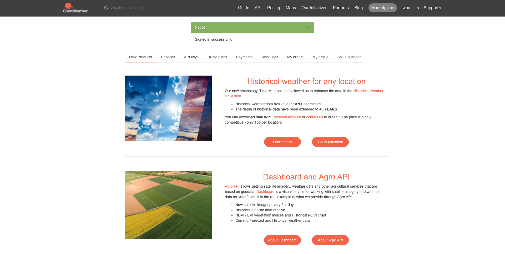
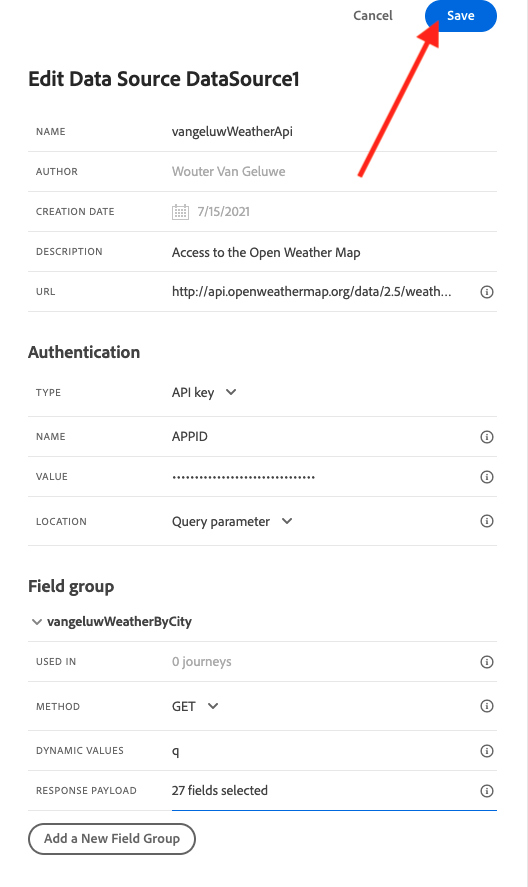

# 8.2 外部データソースの定義

この演習では、Adobe Journey Optimizerを使用してカスタム外部データソースを作成します。

に移動してAdobe Journey Optimizerにログインします。 [Adobe Experience Cloud](https://experience.adobe.com). クリック **Journey Optimizer**.


リダイレクト先： **ホーム**  Journey Optimizerで表示 まず、正しいサンドボックスを使用していることを確認します。 使用するサンドボックスは、と呼ばれます。 `--aepSandboxId--`. サンドボックス間を切り替えるには、 **実稼動 (VA7)** リストからサンドボックスを選択します。 この例では、サンドボックスの名前はです。 **AEP 有効化 FY22**. その後、 **ホーム** サンドボックスの表示 `--aepSandboxId--`.


左側のメニューで、下にスクロールして、 **設定**. 次に、 **管理** 下のボタン **データソース**.


次に、 **データソース** リスト。
クリック **データソースを作成** をクリックして、データソースの追加を開始します。


空のデータソースのポップアップが表示されます。


この設定を開始する前に、 **天気図を開く** サービス。 アカウントを作成して API キーを取得するには、以下の手順に従います。

に移動します。 [https://openweathermap.org/](https://openweathermap.org/). ホームページで、 **ログイン**.


クリック **アカウントの作成**.


詳細を入力します。


クリック **アカウントを作成**.


アカウントページにリダイレクトされます。



メニューで、 **API キー** を使用して API キーを取得する場合は、カスタム外部データソースを設定する必要があります。


An **API キー** 次のようになります。 `b2c4c36b6bb59c3458d6686b05311dc3`.

次の **API ドキュメント** の **現在の天気** [ここ](https://openweathermap.org/current).

このユースケースでは、顧客がいる市区町村に基づいて、オープンウェザーマップとの接続を実装します。


に戻る **Adobe Journey Optimizer**&#x200B;を空の **外部データソース** ポップアップ。


データソースの名前として、 `--demoProfileLdap--WeatherApi`. この例では、データソースの名前はです。 `vangeluwWeatherApi `.

説明を次に設定します。 `Access to the Open Weather Map`.

Open Weather Map API の URL は次のとおりです。 **http://api.openweathermap.org/data/2.5/weather?units=metric**


次に、使用する認証を選択する必要があります。

次の変数を使用します。

| フィールド | 値 |
|:-----------------------:| :-----------------------|
| タイプ | **API キー** |
| 名前 | **APPID** |
| 値 | **API キー** |
| ロケーション | **クエリパラメータ** |


最後に、 **FieldGroup**&#x200B;は、基本的に Weather API に送信されるリクエストです。 ここでは、都市の名前を使用して、その都市の現在の天気をリクエストします。


天気 API ドキュメントに従って、パラメーターを送信する必要があります `q=City`.


期待される API リクエストに一致させるには、次のように FieldGroup を設定します。

>[!IMPORTANT]
>
>フィールドグループ名は一意である必要があります。この命名規則を使用してください。 `--demoProfileLdap--WeatherByCity` したがって、この場合、名前は `vangeluwWeatherByCity`


応答ペイロードには、Weather API から送信される応答の例を貼り付ける必要があります。

期待される API JSON 応答は、 API ドキュメントページで確認できます [ここ](https://openweathermap.org/current).


または、次の場所から JSON 応答をコピーできます。

```json
{"coord": { "lon": 139,"lat": 35},
  "weather": [
    {
      "id": 800,
      "main": "Clear",
      "description": "clear sky",
      "icon": "01n"
    }
  ],
  "base": "stations",
  "main": {
    "temp": 281.52,
    "feels_like": 278.99,
    "temp_min": 280.15,
    "temp_max": 283.71,
    "pressure": 1016,
    "humidity": 93
  },
  "wind": {
    "speed": 0.47,
    "deg": 107.538
  },
  "clouds": {
    "all": 2
  },
  "dt": 1560350192,
  "sys": {
    "type": 3,
    "id": 2019346,
    "message": 0.0065,
    "country": "JP",
    "sunrise": 1560281377,
    "sunset": 1560333478
  },
  "timezone": 32400,
  "id": 1851632,
  "name": "Shuzenji",
  "cod": 200
}
```

上記の JSON 応答をクリップボードにコピーし、カスタムデータソース設定画面に移動します。

次をクリック： **ペイロードを編集** アイコン


上記の JSON 応答を貼り付ける必要があるポップアップが表示されます。


JSON 応答を貼り付けます。この後、次の情報が表示されます。 「**保存**」をクリックします。


これで、カスタムデータソースの設定が完了しました。 上にスクロールし、 **保存**.



データソースが正常に作成され、が **データソース** リスト。


次のステップ： [8.3 カスタムアクションの定義](./ex3.md)

[モジュール 8 に戻る](journey-orchestration-external-weather-api-sms.md)

[すべてのモジュールに戻る](../../overview.md)
