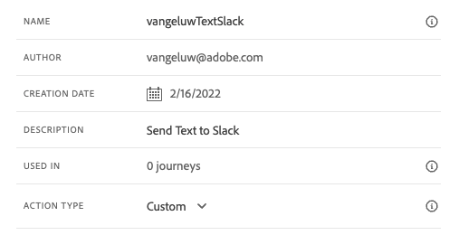

# 8.3 カスタムアクションの定義

この演習では、Adobe Journey Optimizerを組み合わせて使用し、2 つのカスタムアクションを作成します。

に移動してAdobe Journey Optimizerにログインします。 [Adobe Experience Cloud](https://experience.adobe.com). クリック **Journey Optimizer**.


リダイレクト先： **ホーム**  Journey Optimizerで表示 まず、正しいサンドボックスを使用していることを確認します。 使用するサンドボックスは、と呼ばれます。 `--aepSandboxId--`. サンドボックス間を切り替えるには、 **実稼動 (VA7)** リストからサンドボックスを選択します。 この例では、サンドボックスの名前はです。 **AEP 有効化 FY22**. その後、 **ホーム** サンドボックスの表示 `--aepSandboxId--`.


左側のメニューで、下にスクロールして、 **設定**. 次に、 **管理** 下のボタン **アクション**.


次に、 **アクション** リスト。


テキストをSlackチャネルに送信する 1 つのアクションを定義します。

## 8.3.1 アクション：テキストをSlackチャネルに送信

これで、既存のメッセージチャネルを使用して、SlackチャネルにSlackを送信します。 Slackは使いやすい API を備えており、Adobe Journey Optimizerを使用して API をトリガー化する予定です。


クリック **アクションを作成** をクリックして、新しいアクションの追加を開始します。


空のアクションポップアップが表示されます。


アクションの名前として、次を使用します。 `--demoProfileLdap--TextSlack`. この例では、「アクション名」は `vangeluwTextSlack`.

説明を次に設定します。 `Send Text to Slack`.



の **URL 設定**、次を使用します。

- URL: `https://2mnbfjyrre.execute-api.us-west-2.amazonaws.com/prod`
- メソッド： **POST**

>[!NOTE]
>
>上記の URL は、AWS Lambda 関数を参照します。この関数は、前述のように、リクエストをSlackチャネルに転送します。 これは、Adobeが所有するSlackチャネルへのアクセスを保護するためにおこなわれます。 独自のSlackチャネルがある場合、 [https://api.slack.com/](https://api.slack.com/)次に、そのSlackアプリで受信 Webhook を作成し、上記の URL を受信 Webhook URL に置き換える必要があります。

ヘッダーフィールドを変更する必要はありません。


**認証** は、次のように設定する必要があります。 **認証なし**.


の **アクションパラメーター**&#x200B;の場合は、Slackに送信するフィールドを定義する必要があります。 論理的には、Adobe Journey OptimizerとAdobe Experience Platformをパーソナライゼーションの頭脳にしたいので、Slackに送信するテキストはAdobe Journey Optimizerで定義し、実行のためにSlackに送信する必要があります。

この場合、 **アクションパラメーター**、 **ペイロードを編集** アイコン


空のポップアップウィンドウが表示されます。


以下のテキストをコピーし、空のポップアップウィンドウに貼り付けます。

```json
{
 "text": {
  "toBeMapped": true,
  "dataType": "string",
  "label": "textToSlack"
 }
}
```

FYI:以下のフィールドを指定すると、これらのフィールドはお客様のジャーニーからアクセスできるようになり、ジャーニーから動的に入力できるようになります。

**&quot;toBeMapped&quot;:真**

**&quot;dataType&quot;:&quot;string&quot;,**

**&quot;label&quot;:&quot;textToSlack&quot;**

次の内容が表示されます。


「**保存**」をクリックします。


上にスクロールし、 **保存** カスタムアクションを保存するために、もう 1 回。


カスタムアクションが **アクション** リスト。


イベント、外部データソース、アクションを定義済み。 次に、すべてを 1 つのジャーニーに統合します。

次のステップ： [8.4 ジャーニーとメッセージの作成](./ex4.md)

[モジュール 8 に戻る](journey-orchestration-external-weather-api-sms.md)

[すべてのモジュールに戻る](../../overview.md)
