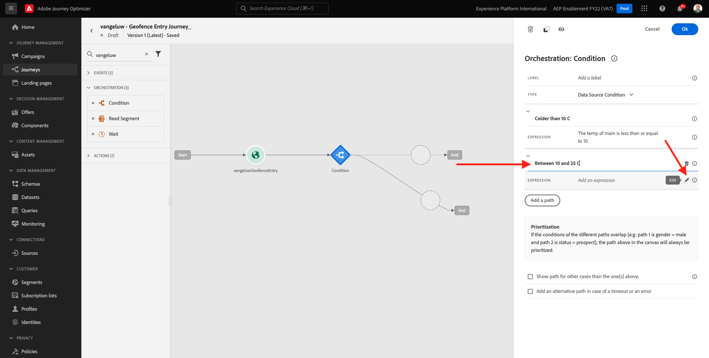
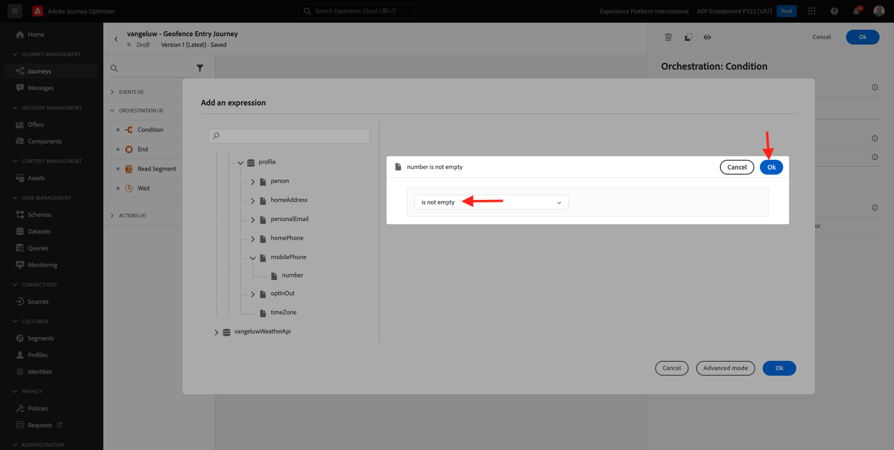
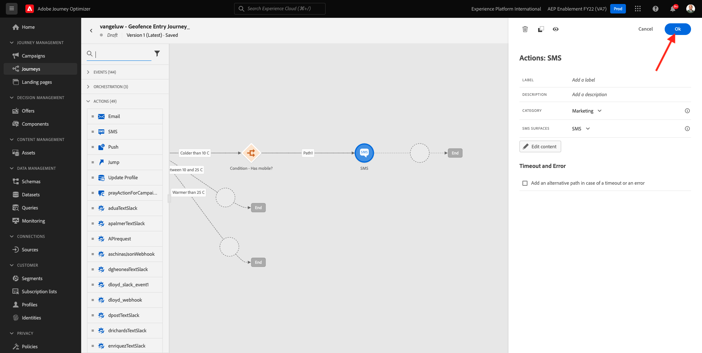
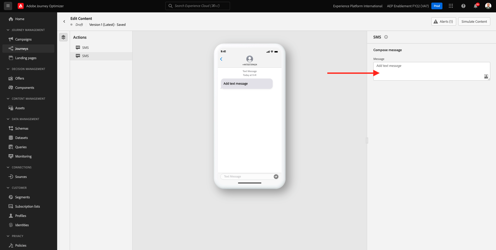

# 8.4 ジャーニーとメッセージの作成

この演習では、Adobe Journey Optimizerを使用して、ジャーニーと複数のテキストメッセージを作成します。

この使用例では、顧客の所在地の気象状況に基づいて異なる SMS メッセージを送信することを目的としています。 次の 3 つのシナリオが定義されました。

- 摂氏 10°以上低い
- 摂氏 10°～25°
- 摂氏 25°以上

この 3 つの条件に対して、Adobe Journey Optimizerで 3 つの SMS メッセージを定義する必要があります。

## 8.4.1 ジャーニーの作成

に移動してAdobe Journey Optimizerにログインします。 [Adobe Experience Cloud](https://experience.adobe.com). クリック **Journey Optimizer**.


リダイレクト先： **ホーム**  Journey Optimizerで表示 まず、正しいサンドボックスを使用していることを確認します。 使用するサンドボックスは、と呼ばれます。 `--aepSandboxId--`. サンドボックス間を切り替えるには、 **実稼動 (VA7)** リストからサンドボックスを選択します。 この例では、サンドボックスの名前はです。 **AEP 有効化 FY22**. その後、 **ホーム** サンドボックスの表示 `--aepSandboxId--`.


左側のメニューで、に移動します。 **ジャーニー** をクリックし、 **作成ジャーニー** をクリックして、ジャーニーの作成を開始します。


ジャーニーに名前を付ける必要があります。

ジャーニーの名前として、次を使用します。 `--demoProfileLdap-- - Geofence Entry Journey`. この例では、ジャーニー名はです。 `vangeluw - Geofence Entry Journey`. 現時点では、他の値を設定する必要はありません。 「**OK**」をクリックします。


画面の左側で、を見てください。 **イベント**. このリストには、以前に作成したイベントが表示されます。 選択し、ジャーニーキャンバスにドラッグ&amp;ドロップします。 ジャーニーは次のようになります。 「**OK**」をクリックします。


次に、 **Orchestration**. これで、使用可能な **Orchestration** 機能 選択 **条件**&#x200B;をクリックし、「ジャーニー」キャンバスにドラッグ&amp;ドロップします。


次に、3 つの条件を定義する必要があります。

- 摂氏 10°度より寒い
- 摂氏 10°～25°です
- 摂氏 25°度より暖かい

最初の条件を定義します。

### 条件 1:摂氏 10°以上低い

をクリックします。 **条件**.  クリック **パス 1** パスの名前を **10 C より低い**. をクリックします。 **編集** Path1 の式のアイコン。


すると、空の **簡易エディタ** 画面 クエリがもう少し高度になるので、 **詳細設定モード**. クリック **詳細設定モード**.


次に、 **詳細エディタ** コードを入力できます。


以下のコードを選択し、 **詳細エディタ**.

`#{--demoProfileLdap--WeatherApi.--demoProfileLdap--WeatherByCity.main.temp} <= 10`

これが見えます


この条件の一部として温度を取得するには、顧客が現在いる市区町村を指定する必要があります。
この **市区町村** 動的パラメーターにリンクする必要があります `q`前述の Open Weather API ドキュメントで見たように。

フィールドをクリック **動的値：q** スクリーンショットで示したように。


次に、使用可能なデータソースの 1 つで、顧客の現在の市区町村を含むフィールドを検索する必要があります。


次の場所に移動すると、このフィールドを見つけることができます。 `--demoProfileLdap--GeofenceEntry.placeContext.geo.city`.

そのフィールドをクリックすると、パラメーターの動的な値として追加されます `q`. このフィールドには、モバイルアプリに実装した位置情報サービスなどが入力されます。 この例では、デモ Web サイトの admin console でこれをシミュレートします。 「**OK**」をクリックします。


### 条件 2:摂氏 10°～25°

最初の条件を追加すると、次の画面が表示されます。 クリック **パスを追加**.


ダブルクリック **パス 1** パス名を次のように編集します。 **10 ～ 25 C の間**. 次をクリック： **編集** このパスの式のアイコン。



すると、空の **簡易エディタ** 画面 クエリがもう少し高度になるので、 **詳細設定モード**. クリック **詳細設定モード**.


次に、 **詳細エディタ** コードを入力できます。


以下のコードを選択し、 **詳細エディタ**.

`#{--demoProfileLdap--WeatherApi.--demoProfileLdap--WeatherByCity.main.temp} > 10 and #{--demoProfileLdap--WeatherApi.--demoProfileLdap--WeatherByCity.main.temp} <= 25`

これが見えます


この条件の一部として温度を取得するには、顧客が現在いる市区町村を指定する必要があります。
この **市区町村** 動的パラメーターにリンクする必要があります **q**&#x200B;前述の Open Weather API ドキュメントで見たように。

フィールドをクリック **動的値：q** スクリーンショットで示したように。


次に、使用可能なデータソースの 1 つで、顧客の現在の市区町村を含むフィールドを検索する必要があります。


次の場所に移動すると、このフィールドを見つけることができます。 `--demoProfileLdap--GeofenceEntry.placeContext.geo.city`. そのフィールドをクリックすると、パラメーターの動的な値として追加されます **q**. このフィールドには、モバイルアプリに実装した位置情報サービスなどが入力されます。 この例では、デモ Web サイトの admin console でこれをシミュレートします。 「**OK**」をクリックします。


次に、3 番目の条件を追加します。

### 条件 3:摂氏 25°以上

2 番目の条件を追加すると、次の画面が表示されます。 クリック **パスを追加**.


パス 1 をダブルクリックして名前を次に変更します。 **25 C より暖かい**.
次に、 **編集** このパスの式のアイコン。


すると、空の **簡易エディタ** 画面 クエリがもう少し高度になるので、 **詳細設定モード**. クリック **詳細設定モード**.


次に、 **詳細エディタ** コードを入力できます。


以下のコードを選択し、 **詳細エディタ**.

`#{--demoProfileLdap--WeatherApi.--demoProfileLdap--WeatherByCity.main.temp} > 25`

これが見えます


この条件の一部として温度を取得するには、顧客が現在いる市区町村を指定する必要があります。
この **市区町村** 動的パラメーターにリンクする必要があります **q**&#x200B;前述の Open Weather API ドキュメントで見たように。

フィールドをクリック **動的値：q** スクリーンショットで示したように。


次に、使用可能なデータソースの 1 つで、顧客の現在の市区町村を含むフィールドを検索する必要があります。


次の場所に移動すると、このフィールドを見つけることができます。 ```--demoProfileLdap--GeofenceEntry.placeContext.geo.city```. そのフィールドをクリックすると、パラメーターの動的な値として追加されます **q**. このフィールドには、モバイルアプリに実装した位置情報サービスなどが入力されます。 この例では、デモ Web サイトの admin console でこれをシミュレートします。 「**OK**」をクリックします。


これで、3 つのパスが設定されました。 「**OK**」をクリックします。


これは学習目的のジャーニーなので、マーケターがメッセージを配信する必要のある様々なオプションを紹介するために、いくつかのアクションを設定します。

## 8.4.2 パスに対するメッセージの送信：摂氏 10°以上低い

温度コンテキストごとに、お客様にテキストメッセージを送信しようとします。 お客様の携帯電話番号がある場合にのみ、テキストメッセージを送信できます。その場合は、まず確認が必要です。

次に焦点を当てましょう **10 C より低い**.


次を見てみましょう **条件** 要素をドラッグし、以下のスクリーンショットに示すようにドラッグします。 この顧客の携帯電話番号が使用可能かどうかを確認します。


これは一例なので、顧客がモバイル番号を利用できるオプションのみを設定します。 ラベルを **携帯電話は？**.

をクリックします。 **編集** アイコン **パス 1** パス。


左側に表示されているデータソースで、に移動します。 **ExperiencePlatform.ProfileFieldGroup.profile.mobilePhone.number**. Adobe Experience Platformのリアルタイム顧客プロファイルから携帯電話番号を直接読み取るようになりました。


フィールドを選択 **数値**&#x200B;をクリックし、条件キャンバスにドラッグ&amp;ドロップします。

演算子を選択 **が空ではない**. 「**OK**」をクリックします。



これが見えます クリック **OK** 再び


ジャーニーは次のようになります。 クリック **アクション** スクリーンショットで示したように。


アクションを選択 **SMS**&#x200B;をクリックし、追加した条件の後にドラッグ&amp;ドロップします。


を **カテゴリ** から **マーケティング** をクリックし、SMS を送信できる SMS 表面を選択します。 この場合、選択する E メールサーフェスは次のようになります。 **SMS**.


次の手順では、メッセージを作成します。 それには、「 **コンテンツを編集**.


これで、SMS のテキストを設定できるメッセージダッシュボードが表示されます。 次をクリック： **メッセージを作成** 領域を使用して、メッセージを作成します。


次のテキストを入力します。 `Brrrr... {{profile.person.name.firstName}}, it's freezing. 20% discount on jackets today!`. 「**保存**」をクリックします。


これが見えます 左上隅の矢印をクリックして、ジャーニーに戻ります。


その後、戻ってきます。 「**OK**」をクリックします。



左側のメニューで、に戻ります。 **アクション**、「アクション」を選択します。 `--demoProfileLdap--TextSlack`をクリックし、その後にドラッグ&amp;ドロップします。 **メッセージ** アクション。


に移動します。 **アクションパラメーター** をクリックし、 **編集** パラメーターのアイコン `TEXTTOSLACK`.


ポップアップウィンドウで、 **詳細設定モード**.


以下のコードを選択し、コピーして、 **詳細モードエディター**. 「**OK**」をクリックします。

`"Brrrr..." + #{ExperiencePlatform.ProfileFieldGroup.profile.person.name.firstName} + " It's freezing. 20% discount on Jackets today!"`


完了したアクションが表示されます。 「**OK**」をクリックします。


ジャーニーのこのパスの準備が整いました。

## 8.4.3 パスに対するメッセージの送信：摂氏 10°～25°

温度コンテキストごとに、お客様にテキストメッセージを送信しようとします。 お客様の携帯電話番号がある場合にのみ、テキストメッセージを送信できます。その場合は、まず確認が必要です。

次に焦点を当てましょう **10 ～ 25 C の間** パス。


次を見てみましょう **条件** 要素をドラッグし、以下のスクリーンショットに示すようにドラッグします。 この顧客の携帯電話番号が使用可能かどうかを確認します。


これは一例なので、顧客がモバイル番号を利用できるオプションのみを設定します。 ラベルを **携帯電話は？**.

をクリックします。 **編集** アイコン **パス 1** パス。


左側に表示されているデータソースで、に移動します。 **ExperiencePlatform.ProfileFieldGroup.profile.mobilePhone.number**. Adobe Experience Platformのリアルタイム顧客プロファイルから携帯電話番号を直接読み取るようになりました。


フィールドを選択 **数値**&#x200B;をクリックし、条件キャンバスにドラッグ&amp;ドロップします。

演算子を選択 **が空ではない**. 「**OK**」をクリックします。


これが見えます 「**OK**」をクリックします。


ジャーニーは次のようになります。 クリック **アクション** スクリーンショットで示したように。


アクションを選択 **SMS**&#x200B;をクリックし、追加した条件の後にドラッグ&amp;ドロップします。


を **カテゴリ** から **マーケティング** をクリックし、SMS を送信できる SMS 表面を選択します。 この場合、選択する E メールサーフェスは次のようになります。 **SMS**.


次の手順では、メッセージを作成します。 それには、「 **コンテンツを編集**.


これで、SMS のテキストを設定できるメッセージダッシュボードが表示されます。 次をクリック： **メッセージを作成** 領域を使用して、メッセージを作成します。



次のテキストを入力します。 `What a nice weather for the time of year, {{profile.person.name.firstName}} - 20% discount on Sweaters today!`. 「**保存**」をクリックします。


これが見えます 左上隅の矢印をクリックして、ジャーニーに戻ります。


これで、完了したアクションが表示されます。 「**OK**」をクリックします。


左側のメニューで、に戻ります。 **アクション**、「アクション」を選択します。 `--demoProfileLdap--TextSlack`をクリックし、その後にドラッグ&amp;ドロップします。 **メッセージ** アクション。


に移動します。 **アクションパラメーター** をクリックし、 **編集** パラメーターのアイコン `TEXTTOSLACK`.


ポップアップウィンドウで、 **詳細設定モード**.


以下のコードを選択し、コピーして、 **詳細モードエディター**. 「**OK**」をクリックします。

`"What nice weather for the time of year, " + #{ExperiencePlatform.ProfileFieldGroup.profile.person.name.firstName} + " 20% discount on Sweaters today!"`


完了したアクションが表示されます。 「**OK**」をクリックします。


ジャーニーのこのパスの準備が整いました。

## 8.4.4 パスのメッセージの送信：摂氏 25°以上

温度コンテキストごとに、お客様にテキストメッセージを送信しようとします。 お客様の携帯電話番号がある場合にのみ、テキストメッセージを送信できます。その場合は、まず確認が必要です。

次に焦点を当てましょう **25 C より暖かい** パス。


次を見てみましょう **条件** 要素をドラッグし、以下のスクリーンショットに示すようにドラッグします。 この顧客の携帯電話番号が使用可能かどうかを確認します。


これは一例なので、顧客がモバイル番号を利用できるオプションのみを設定します。 ラベルを **携帯電話は？**.

をクリックします。 **編集** アイコン **パス 1** パス。


左側に表示されているデータソースで、に移動します。 **ExperiencePlatform.ProfileFieldGroup.profile.mobilePhone.number**. Adobe Experience Platformのリアルタイム顧客プロファイルから携帯電話番号を直接読み取るようになりました。


フィールドを選択 **数値**&#x200B;をクリックし、条件キャンバスにドラッグ&amp;ドロップします。

演算子を選択 **が空ではない**. 「**OK**」をクリックします。


これが見えます 「**OK**」をクリックします。


ジャーニーは次のようになります。 クリック **アクション** スクリーンショットで示したように。


アクションを選択 **SMS**&#x200B;をクリックし、追加した条件の後にドラッグ&amp;ドロップします。


を **カテゴリ** から **マーケティング** をクリックし、SMS を送信できる SMS 表面を選択します。 この場合、選択する E メールサーフェスは次のようになります。 **SMS**.


次の手順では、メッセージを作成します。 それには、「 **コンテンツを編集**.


これで、SMS のテキストを設定できるメッセージダッシュボードが表示されます。 次をクリック： **メッセージを作成** 領域を使用して、メッセージを作成します。


次のテキストを入力します。 `So warm, {{profile.person.name.firstName}}! 20% discount on swimwear today!`. 「**保存**」をクリックします。


これが見えます 左上隅の矢印をクリックして、ジャーニーに戻ります。


これで、完了したアクションが表示されます。 「**OK**」をクリックします。


左側のメニューで、に戻ります。 **アクション**、「アクション」を選択します。 `--demoProfileLdap--TextSlack`をクリックし、その後にドラッグ&amp;ドロップします。 **メッセージ** アクション。


に移動します。 **アクションパラメーター** をクリックし、 **編集** パラメーターのアイコン `TEXTTOSLACK`.


ポップアップウィンドウで、 **詳細設定モード**.


以下のコードを選択し、コピーして、 **詳細モードエディター**. 「**OK**」をクリックします。

`"So warm, " + #{ExperiencePlatform.ProfileFieldGroup.profile.person.name.firstName} + "! 20% discount on swimwear today!"`


完了したアクションが表示されます。 「**OK**」をクリックします。


ジャーニーのこのパスの準備が整いました。

## 8.4.5 ジャーニーの公開

これで、ジャーニーの設定が完了しました。 「**公開**」をクリックします。


クリック **公開** 再び


ジャーニーが公開されました。


次のステップ： [8.5 ジャーニーのトリガー](./ex5.md)

[モジュール 8 に戻る](journey-orchestration-external-weather-api-sms.md)

[すべてのモジュールに戻る](../../overview.md)
