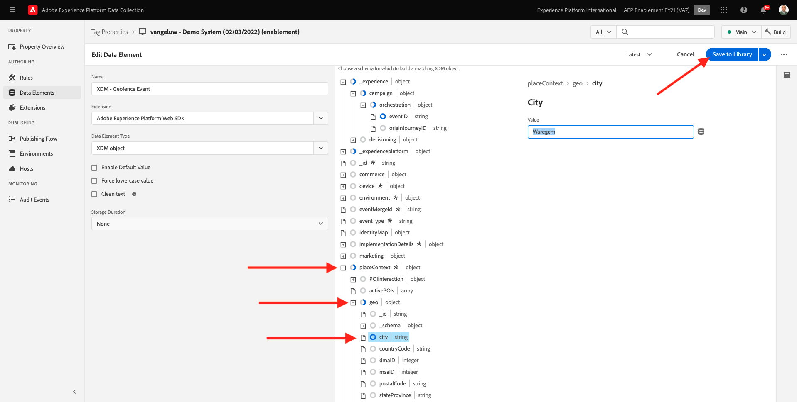

# 8.5 ジャーニーのトリガー

この演習では、このモジュールで設定したジャーニーをテストし、トリガーします。

## 8.5.1 ジオフェンスイベント設定の更新

に移動します。 [Adobe Experience Platform Data Collection](https://experience.adobe.com/launch/) を選択し、 **タグ**.

これは、以前に表示したAdobe Experience Platformデータ収集プロパティページです。

モジュール 0 では、Demo System によって次の 2 つのクライアントプロパティが作成されました。1 つは web サイト用、もう 1 つはモバイルアプリ用です。 次を検索して検索 `--demoProfileLdap--` 内 **[!UICONTROL 検索]** ボックス クリックして **Web** プロパティ。

これが見えます

左側のメニューで、に移動します。 **ルール** ルールを検索します。 **ジオフェンスイベント**. ルールをクリックします。 **ジオフェンスイベント** をクリックして開きます。

このルールの詳細が表示されます。 クリックしてアクションを開きます。 **AEP に「geofence event」を送信 —トリガーJO**.

次に、このアクションがトリガーされると、XDM データ構造を定義するために特定のデータ要素が使用されることがわかります。 そのデータ要素を更新し、 **イベント ID** に設定されたイベントの [演習 8.1](./ex1.md).

次に、データ要素を更新する必要があります **XDM — ジオフェンスイベント**. これをおこなうには、に移動します。 **データ要素**. を検索 **XDM — ジオフェンスイベント** をクリックして、そのデータ要素を開きます。

次の内容が表示されます。

フィールドに移動します。 `_experience.campaign.orchestration.eventID`. 現在の値を削除し、そこに eventID を貼り付けます。

イベント ID は、Adobe Journey Optimizerの **設定/イベント** イベント ID は、イベントのサンプルペイロードに次のように表示されます。 `"eventID": "fa42ab7982ba55f039eacec24c1e32e5c51b310c67f0fa559ab49b89b63f4934"`.

次に、このデータ要素で市区町村を定義する必要があります。 に移動します。 **placeContext / geo > city** 選択した都市を入力します。 次に、「 **保存** または **ライブラリに保存**.

最後に、変更を公開する必要があります。 に移動します。 **公開フロー** をクリックします。

クリック **変更されたリソースをすべて追加** 次に、 **開発用に保存およびビルド**.

## 8.5.2 ジャーニーのトリガー

に移動します。 [https://builder.adobedemo.com/projects](https://builder.adobedemo.com/projects). Adobe IDでログインすると、次の内容が表示されます。 Web サイトプロジェクトをクリックして開きます。

の **スクリーン** ページ、クリック **実行**.

次に、デモ Web サイトが開いているのがわかります。 URL を選択して、クリップボードにコピーします。

新しい匿名ブラウザーウィンドウを開きます。

前の手順でコピーしたデモ Web サイトの URL を貼り付けます。 その後、Adobe IDを使用してログインするように求められます。

アカウントのタイプを選択し、ログインプロセスを完了します。

Web サイトが匿名ブラウザーウィンドウに読み込まれます。 デモ Web サイトの URL を読み込むには、新しい匿名ブラウザーウィンドウを使用する必要があります。

画面の左上隅にあるAdobeロゴアイコンをクリックして、プロファイルビューアを開きます。

プロファイルビューアパネルと、リアルタイム顧客プロファイルを **Experience CloudID** を、現在不明なこの顧客の主な識別子として使用する。

登録/ログインページに移動します。 クリック **アカウントの作成**.

詳細を入力し、 **登録** その後、前のページにリダイレクトされます。

プロファイルビューアパネルを開き、リアルタイム顧客プロファイルに移動します。 プロファイルビューアパネルに、新しく追加された E メールや電話番号など、すべての個人データが表示されます。

プロファイルビューアパネルで、 **ユーティリティ**. 入力 `geofenceevent` をクリックし、 **送信**.

数秒後に、Adobe Journey Optimizerから SMS が届きます。

次のステップ： [概要とメリット](./summary.md)

[モジュール 8 に戻る](journey-orchestration-external-weather-api-sms.md)

[すべてのモジュールに戻る](../../overview.md)
